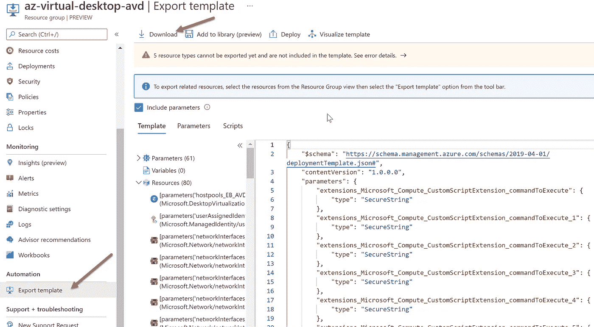
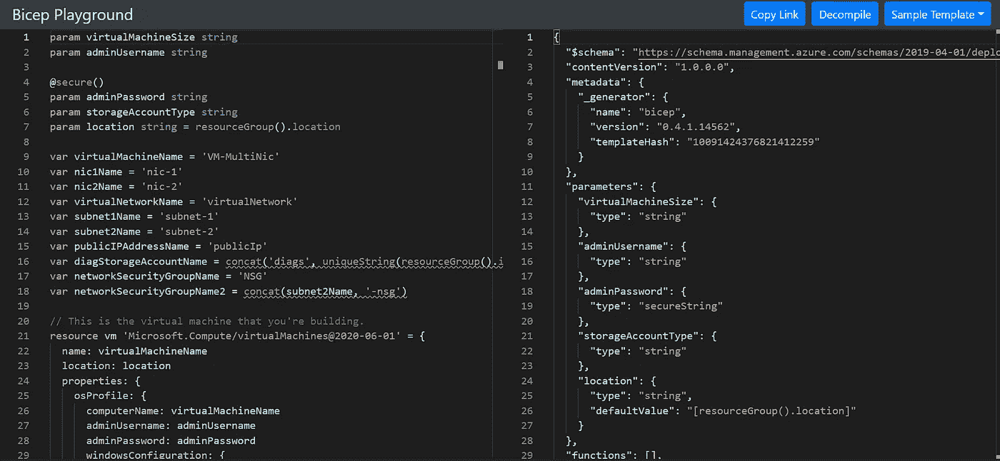

# 💪Azure Bicep:如何从 ARM 模板迁移到 Bicep 模板？

> 原文：<https://medium.com/codex/azure-bicep-how-to-migrate-from-arm-templates-to-bicep-a9639ac316d8?source=collection_archive---------3----------------------->

过渡到 Azure Bicep 模板的最佳实践和优势

本文将分享从 ARM 模板迁移到 Bicep 模板的好处以及执行迁移的最佳实践。

在之前的[文章](/codex/azure-bicep-playground-transitioning-from-arm-templates-into-bicep-5c10c864c863)中，我们分享了如何轻松[将手臂模板转换成二头肌模板](/codex/azure-bicep-playground-transitioning-from-arm-templates-into-bicep-5c10c864c863)。

有时，在将 ARM 模板反编译成 Bicep 模板后，我们需要验证输出文件，因为在反编译过程中我们可能会出现一些错误或警告。

Bicep 的目标之一是改善基础设施作为 Azure 部署代码的创作体验，并消除在代码中使用 JSON 定义的复杂性。

你会发现 Bicep 简化了语法，去掉了处理 JSON 的痛苦。Bicep 的另一个好处是模块化。你会发现在 Bicep 中使用模块比在 ARM 模板中更容易。

# 从 ARM 模板迁移到 Bicep

根据 Azure 环境的不同，将 ARM 模板迁移到 Bicep 模板可能会有点困难。

微软推荐从 ARM 模板迁移到 Bicep 模板的 5 个阶段:

*   第一阶段。*转换*
*   第二阶段。*迁移*
*   第三阶段。*重构*
*   第四阶段。*测试*
*   第五阶段。*展开*

# 第一阶段。皈依者

在这个阶段，目标是从你的 Azure 资源中获得一个 JSON 表示。假设您在 Azure 中有一个现有的环境。在这种情况下，您可以使用 [Azure Portal](https://docs.microsoft.com/en-us/azure/azure-resource-manager/templates/export-template-portal#use-resource-explorer) 、 [Azure CLI](https://docs.microsoft.com/en-us/azure/azure-resource-manager/templates/export-template-cli) 、 [Azure Powershell](https://docs.microsoft.com/en-us/azure/azure-resource-manager/templates/export-template-powershell) 或 [REST API](https://docs.microsoft.com/en-us/rest/api/resources/resourcegroups/exporttemplate) 来导出 ARM-JSON 模板，从而导出您环境中的资源定义。

我们有两个导出 ARM 模板的选项:

*   您可以从资源组或特定资源中导出它。您将拍摄资源组当前状态的快照。当您需要捕获环境中资源的最新更改或更新时，或者在初始部署后创建资源时，请使用此选项。
*   您可以从部署历史记录中保存 ARM 模板。这样，您可以获得用于部署的 ARM 模板的精确副本。当初始部署后不需要包含对资源的最新更改或更新时，请使用此选项。

要使用 Azure 门户导出模板，请转到要导出的资源组或特定资源。然后选择“导出模板”选项，下载 ARM 模板。

下图显示了如何使用 Azure 门户导出 ARM 模板。

Azure 二头肌-导出手臂模板

一旦从您的环境中获得了 JSON 表示，我们就可以进入第 2 阶段:迁移。

# 第二阶段。移动

这个阶段的主要目标是创建我们的工作二头肌模板的初稿。虽然建议从头开始创建一个干净的 Bicep 模板，但是您也可以将 ARM 模板中包含的每个资源反编译成一个 Bicep 资源定义。

要将你的手臂模板反编译成二头肌模板，你可以利用[二头肌命令行界面](https://docs.microsoft.com/en-us/azure/azure-resource-manager/bicep/decompile?tabs=azure-cli)或[二头肌操场](https://bicepdemo.z22.web.core.windows.net/)。

二头肌操场是一个在线工具，你可以利用反编译你的手臂模板。但是，我建议使用 Bicep CLI。我们在下面的文章中详细讨论二头肌游乐场:[https://medium . com/azure-Bicep-Playground-transitioning-from-arm-templates-into-Bicep-5c 10 c 864 c 863](/codex/azure-bicep-playground-transitioning-from-arm-templates-into-bicep-5c10c864c863)

下图显示了二头肌操场:

蔚蓝二头肌游乐场

在这个阶段，如果在反编译过程中出现任何警告，您还应该确定是否有任何资源丢失，或者为现有资源创建一个新的定义。

*重要:不能保证从手臂模板到二头肌模板的映射。

一旦你有了二头肌模板的草稿，是时候改进你的二头肌代码了。

# 第三阶段。重构

在这个阶段，我们将重点打磨你的二头肌模板。这个阶段包括修改资源 API 版本，修改参数、变量和符号名。

例如，如果您使用数据库密码或虚拟机用户名密码之类的秘密，请确保使用“ [*@secure()*](https://blog.azinsider.net/azure-bicep-secure-secrets-in-parameters-secure-decorator-ce6317cc0c23) ”装饰器。您可以在这里 查看更多关于保护您的参数 [*的信息。*](https://blog.azinsider.net/azure-bicep-secure-secrets-in-parameters-secure-decorator-ce6317cc0c23)

根据你的 Azure 环境的复杂程度，你可以把它分成不同的更小的 Bicep 模板，并利用 Bicep 的[模块化](https://docs.microsoft.com/en-us/azure/azure-resource-manager/bicep/modules)特性。

一旦你有了一个完美的工作二头肌模板，就该在实际部署之前进行一些测试了。

# 第四阶段。试验

您可以利用同样适用于 ARM 模板的假设操作来验证您的二头肌模板。这将简化测试过程，并且您可以检查对您的 Azure 环境的影响。

在进行部署之前，假设分析将向您展示环境中的变化的预览。它会将您在 Azure 中环境的当前状态与您在 Bicep 模板中定义的期望状态进行比较。

下图显示了在部署中使用假设分析的示例。

Azure Bicep —部署预览

一旦您验证了您的二头肌模板，我们将进入最后阶段:部署。

# 第五阶段。部署

二头肌模板的配置过程非常简单。虽然您可以执行手动部署，但还有其他选项可以使用 GitHub Actions、Azure DevOps 等工具来自动化部署过程。

在部署之前，准备一个回滚计划，以便从任何潜在的失败部署中恢复。

如果您更喜欢执行手动部署，您可以使用相同的 what-if 和 flag -c 选项，并确认在一切顺利的情况下执行部署。

# 下一步。

检查 Microsoft Lean 模块以迁移 Azure 资源。

 [## 迁移 Azure 资源和 JSON ARM 模板以使用 Bicep - Learn

### 将您的 Azure 资源导出并转换为 Bicep 文件，并将您的 JSON ARM 模板迁移到 Bicep。重构您的…

docs.microsoft.com](https://docs.microsoft.com/en-us/learn/modules/migrate-azure-resources-bicep/) 

查看二头肌游乐场:

👉【https://aka.ms/bicepdemo 号

[*在此加入****azin sider****邮箱列表。*](http://eepurl.com/gKmLdf)

*-戴夫·r*