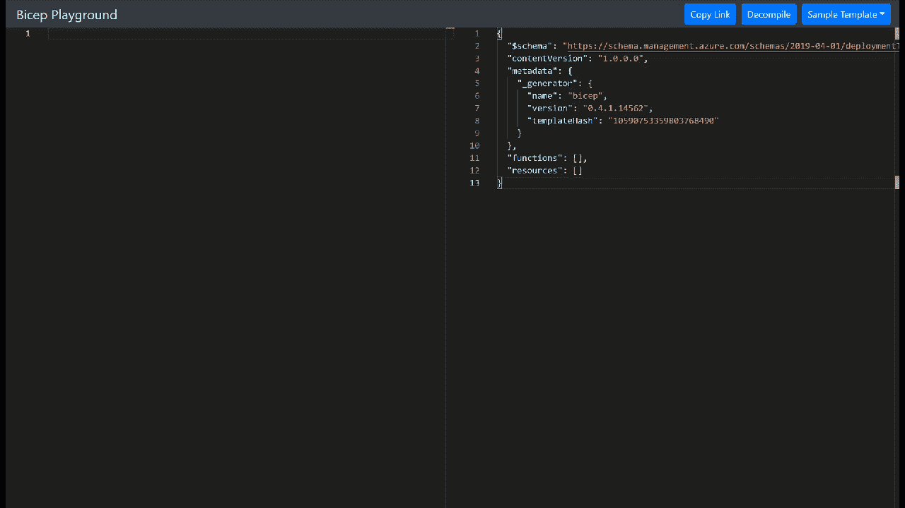

# 💪Azure 二头肌游乐场:从手臂模板过渡到二头肌

> 原文：<https://medium.com/codex/azure-bicep-playground-transitioning-from-arm-templates-into-bicep-5c10c864c863?source=collection_archive---------2----------------------->

了解移植过程，并发现在将 ARM 模板移植到 Bicep 模板时可能有用的工具

Bicep 是一种新的用于声明式部署 Azure 资源的 DSL 语言，如果你目前是 ARM 模板，它值得一看。在之前的[文章中，](https://blog.azinsider.net/why-is-azure-bicep-your-next-choice-for-infrastructure-as-code-f10a2b924ca7)我们讨论了 Bicep 对于 Azure 的基础设施即代码的重要性，以及它将如何影响您在 Azure 中的环境。

# 从手臂模板转移到二头肌，容易吗？

与同等的 ARM 模板 JSON 相比，Bicep 提供了更简单的语法[，是的，从 ARM 模板过渡到 Bicep 是可能的。](https://github.com/Azure/bicep/blob/main/docs/arm2bicep.md)

在我个人看来，对于小型环境，从 ARM 模板过渡到 Bicep 模板很容易，您可以利用 Bicep CLI 命令将 ARM 模板转换为 Bicep 代码，命令如下:

```
bicep decompile "path/to/file.json"
```

另一种选择是将 AZ CLI 与 Bicep 配合使用，并执行相同的任务:

```
az bicep decompile --file azuredeploy.json
```

最后，我们可以选择使用 Azure CLI 或 Azure PowerShell 导出资源组。下面的命令显示了如何导出资源组和创建 Bicep 模板:

```
az group export --name "your_resource_group_name" > main.json
bicep decompile main.json
```

虽然这适用于小型环境，但不能保证从 JSON 到 Bicep 模板的转换，并且在 Bicep 模板中可能会出现一些警告或错误。

如果您不确定是否是时候从 ARM-JSON 模板过渡到 Bicep 模板，并希望节省一些验证过程的时间，您可以使用 Azure Bicep Playground。

# 使用二头肌操场

肱二头肌操场是一个工具，可以帮助你将手臂模板在线反编译成肱二头肌模板！

您可以访问以下网址，开始使用 Azure Bicep Playground:

👉【https://aka.ms/bicepdemo 

在二头肌训练场上，您会看到两个面板:左侧是二头肌模板，右侧是手臂模板，如下所示:


蔚蓝二头肌游乐场

请注意，我们在右上角有几个附加选项，可以将链接复制到我们正在处理的当前模板。我们还可以反编译我们的 ARM 模板或者可视化一些现有的例子。

# 使用二头肌操场反编译

你可以把你的手臂模板反编译成二头肌模板。要转换你的模板，你只需要选择“反编译”选项，上传你的 ARM 模板，你就会得到 Bicep 文件。


使用二头肌操场反编译

另一个选择是将你的二头肌模板转换成手臂模板。

## 从二头肌到手臂模板。

您可以直接将您的二头肌模板粘贴到二头肌操场，您将在右侧窗格中看到手臂模板，如下所示:



蔚蓝二头肌游乐场

在上面的例子中，我们使用 Bicep 模板在 App 中用 MySQL 创建 WordPress。注意，二头肌操场为你运行反编译功能。

推荐大家看看 GitHub 资源库的最新更新:[https://github.com/Azure/bicep](https://github.com/Azure/bicep)

让我知道你的二头肌模板是什么样子的，以及反编译时遇到的挑战。

[](https://www.buymeacoffee.com/drbmc)

👉 [*在此加入****azin sider****邮箱列表。*](http://eepurl.com/gKmLdf)

*-戴夫·R*