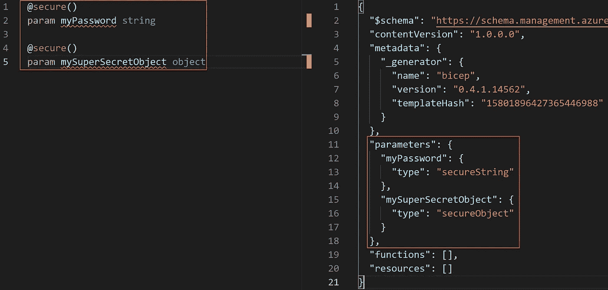
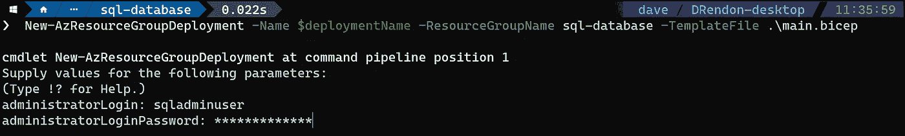
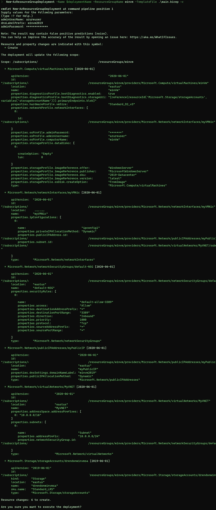
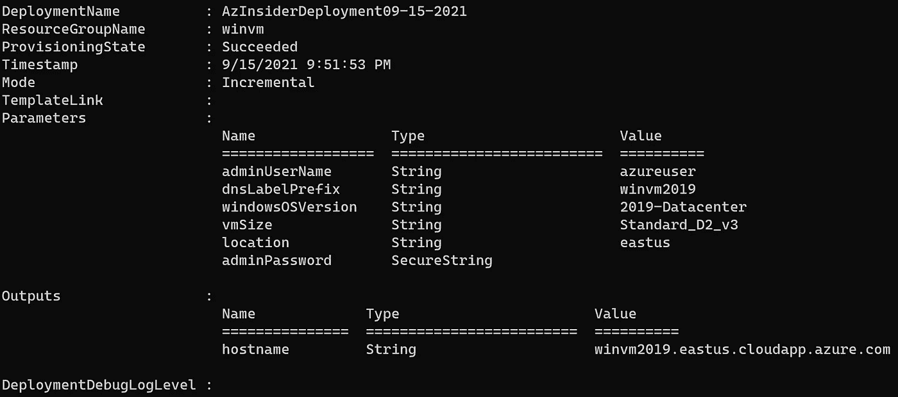

# Azure Bicep:参数中的安全秘密— @secure() decorator

> 原文：<https://medium.com/codex/azure-bicep-secure-secrets-in-parameters-secure-decorator-ce6317cc0c23?source=collection_archive---------1----------------------->

*确保保护二头肌代码中参数引用的秘密*

本文将介绍 Bicep 中参数的使用，以及我们如何使用 *@secure()* 装饰器来保护它们。

如果您正在阅读这篇文章，我敢打赌您曾经遇到过这样的情况:您需要部署一个虚拟机、一个数据库或一个需要您传递密码之类的秘密的资源。

这些秘密可以作为 Bicep 模板中的参数传递，最好使用特定的类型来保护这些值。默认情况下，参数不受保护，那么在 Bicep 中我们有什么选项可以传递秘密值呢？

# 使用参数中的秘密

ARM 模板提供了两种数据类型来传递参数中的秘密值:“secureString”和“secureObject”。这些数据类型在 Bicep 中不可用，但是您可以利用一个*[*@ secure*](http://twitter.com/secure)*()decorator*。*

*Bicep 中的 Decorators 提供了一种将约束和元数据附加到参数上的方法。这些装饰器在参数声明之上定义，并使用“*@表达式*”。这个表达式基本上是一个函数调用。*

*下面的代码展示了一个如何使用 decorators 声明的例子:*

```
*@expression
param myParam string*
```

*在上面的代码中，我们在下一行定义了装饰器和参数字符串类型。我们可以使用 decorators 来保护 Bicep 中的参数。*

# *Bicep 中的安全参数*

*如前所述，数据类型' *secureString* '和' *secureObject* '在 Bicep 中不可用；因此，我们将利用如下所示的 *@secure()* 装饰器:*

```
*@secure()
param myPassword string@secure()
param mySuperSecretObject object*
```

*该定义将转换为众所周知的'*安全字符串*和'*安全对象*'，如下所示:*

**

*蓝色二头肌——安全参数*

*您还有其他选择来利用 *@secure()* 装饰器:*

```
*[@secure](http://twitter.com/secure)()
param adminPassword string*
```

```
*[@secure](http://twitter.com/secure)()
param adminPassword string = ''*
```

```
*[@secure](http://twitter.com/secure)()
param adminPassword string = newGuid()*
```

*建议不要在 Bicep 模板中硬编码安全参数的默认值，除非它是空的，或者使用包含调用 *newGuid()* 的表达式，如上面的代码所示。*

*现在让我们回顾一下下面的例子，我们将在其中部署一个 SQL 数据库。下面的例子将帮助您更好地理解 *@secure()* 装饰器是如何工作的。*

# *举例。部署 SQL 数据库*

*下面的 Bicep 模板创建了一个 SQL 数据库，并使用了 *@secure()* 装饰器。*

```
*param serverName string = uniqueString('sql', resourceGroup().id)
param sqlDBName string = 'AzInsiderDb'
param location string = resourceGroup().location
param administratorLogin string[**@secure**](http://twitter.com/secure)**()
param administratorLoginPassword string**resource server 'Microsoft.Sql/servers@2019-06-01-preview' = {
  name: serverName
  location: location
  properties: {
    administratorLogin: administratorLogin
    administratorLoginPassword: administratorLoginPassword
  }
}resource sqlDB 'Microsoft.Sql/servers/databases@2020-08-01-preview' = {
  name: '${server.name}/${sqlDBName}'
  location: location
  sku: {
    name: 'Standard'
    tier: 'Standard'
  }
}*
```

*在上面的代码中，我们为服务器名、SQL 数据库名、位置和管理员登录定义了几个参数。然后我们使用 *@secure()* 装饰器作为管理员密码。*

*接下来，我们将 Bicep 模板部署到之前使用下面的命令创建的资源组中:*

```
*New-AzResourceGroupDeployment -Name $deploymentName -ResourceGroupName sql-database -TemplateFile .\main.bicep*
```

*在部署期间，我们将提供管理员登录名和密码，如下图所示:*

**

*Azure Bicep —部署 SQL 数据库*

*类似于 ARM 模板，秘密的实际值永远不会暴露。建议对您的密码和机密使用这种类型的参数。*

*作为安全参数传递的敏感数据在资源部署后无法读取，也不会被记录。*

*下图显示了 SQL 数据库部署的输出:*

**

*Azure Bicep — SQL 数据库部署输出*

*另一个常见的用例是虚拟机的部署。在下面的例子中，我们将使用 Bicep 和 *@secure()* 装饰器部署一个基于 Windows 的虚拟机。*

# *举例。使用@secure() decorator 部署基于 Windows 的虚拟机*

*在下面的代码中，我们将使用一些参数:*

```
*param adminUserName string
param dnsLabelPrefix string
param windowsOSVersion string = '2019-Datacenter'
param vmSize string = 'Standard_D2_v3'
param location string = resourceGroup().location*
```

*然后，我们将为虚拟机的密码定义参数:*

```
*[@secure](http://twitter.com/secure)()
param adminPassword string*
```

*请注意，我们没有对密码进行硬编码。下一步是定义一些与网络组件、虚拟机名称和存储帐户相关的变量。*

```
*var storageAccountName = 'drendonwinvmsa'
var nicName = 'myVMNic'
var addressPrefix = '10.0.0.0/16'
var subnetName = 'Subnet'
var subnetPrefix = '10.0.0.0/24'
var publicIPAddressName = 'myPublicIP'
var vmName = 'winVm'
var virtualNetworkName = 'MyVNET'
var subnetRef = '${vn.id}/subnets/${subnetName}'
var networkSecurityGroupName = 'default-NSG'*
```

*然后，我们将定义部署基于 Windows 的虚拟机所需的资源:*

```
*resource stg 'Microsoft.Storage/storageAccounts@2019-06-01' = {
  name: storageAccountName
  location: location
  sku: {
    name: 'Standard_LRS'
  }
  kind: 'Storage'
}resource pip 'Microsoft.Network/publicIPAddresses@2020-06-01' = {
  name: publicIPAddressName
  location: location
  properties: {
    publicIPAllocationMethod: 'Dynamic'
    dnsSettings: {
      domainNameLabel: dnsLabelPrefix
    }
  }
}resource sg 'Microsoft.Network/networkSecurityGroups@2020-06-01' = {
  name: networkSecurityGroupName
  location: location
  properties: {
    securityRules: [
      {
        name: 'default-allow-3389'
        'properties': {
          priority: 1000
          access: 'Allow'
          direction: 'Inbound'
          destinationPortRange: '3389'
          protocol: 'Tcp'
          sourcePortRange: '*'
          sourceAddressPrefix: '*'
          destinationAddressPrefix: '*'
        }
      }
    ]
  }
}resource vn 'Microsoft.Network/virtualNetworks@2020-06-01' = {
  name: virtualNetworkName
  location: location
  properties: {
    addressSpace: {
      addressPrefixes: [
        addressPrefix
      ]
    }
    subnets: [
      {
        name: subnetName
        properties: {
          addressPrefix: subnetPrefix
          networkSecurityGroup: {
            id: sg.id
          }
        }
      }
    ]
  }
}resource nInter 'Microsoft.Network/networkInterfaces@2020-06-01' = {
  name: nicName
  location: locationproperties: {
    ipConfigurations: [
      {
        name: 'ipconfig1'
        properties: {
          privateIPAllocationMethod: 'Dynamic'
          publicIPAddress: {
            id: pip.id
          }
          subnet: {
            id: subnetRef
          }
        }
      }
    ]
  }
}resource VM 'Microsoft.Compute/virtualMachines@2020-06-01' = {
  name: vmName
  location: location
  properties: {
    hardwareProfile: {
      vmSize: vmSize
    }
    osProfile: {
      computerName: vmName
      adminUsername: adminUserName
      adminPassword: adminPassword
    }
    storageProfile: {
      imageReference: {
        publisher: 'MicrosoftWindowsServer'
        offer: 'WindowsServer'
        sku: windowsOSVersion
        version: 'latest'
      }
      osDisk: {
        createOption: 'FromImage'
      }
      dataDisks: [
        {
          diskSizeGB: 1023
          lun: 0
          createOption: 'Empty'
        }
      ]
    }
    networkProfile: {
      networkInterfaces: [
        {
          id: nInter.id
        }
      ]
    }
    diagnosticsProfile: {
      bootDiagnostics: {
        enabled: true
        storageUri: stg.properties.primaryEndpoints.blob
      }
    }
  }
}*
```

*最后，我们将包括一个显示虚拟机主机名的输出:*

```
*output hostname string = pip.properties.dnsSettings.fqdn*
```

*在我们执行实际部署之前，我们可以使用带有以下命令的标志-C 来预览部署:*

```
*New-AzResourceGroupDeployment -Name $deploymentName -ResourceGroupName winvm -TemplateFile .\main.bicep -c*
```

*下图显示了部署预览:*

**

*Azure Bicep —部署预览*

*一旦二头肌模板看起来不错，我们就可以确认部署。下图显示了此部署的输出:*

**

*Azure 部署输出*

*以下是完整的二头肌模板:*

```
*param adminUserName string
param dnsLabelPrefix string
param windowsOSVersion string = '2019-Datacenter'
param vmSize string = 'Standard_D2_v3'
param location string = resourceGroup().location[@secure](http://twitter.com/secure)()
param adminPassword stringvar storageAccountName = 'drendonwinvmsa'
var nicName = 'myVMNic'
var addressPrefix = '10.0.0.0/16'
var subnetName = 'Subnet'
var subnetPrefix = '10.0.0.0/24'
var publicIPAddressName = 'myPublicIP'
var vmName = 'winVm'
var virtualNetworkName = 'MyVNET'
var subnetRef = '${vn.id}/subnets/${subnetName}'
var networkSecurityGroupName = 'default-NSG'resource stg 'Microsoft.Storage/storageAccounts@2019-06-01' = {
  name: storageAccountName
  location: location
  sku: {
    name: 'Standard_LRS'
  }
  kind: 'Storage'
}resource pip 'Microsoft.Network/publicIPAddresses@2020-06-01' = {
  name: publicIPAddressName
  location: location
  properties: {
    publicIPAllocationMethod: 'Dynamic'
    dnsSettings: {
      domainNameLabel: dnsLabelPrefix
    }
  }
}resource sg 'Microsoft.Network/networkSecurityGroups@2020-06-01' = {
  name: networkSecurityGroupName
  location: location
  properties: {
    securityRules: [
      {
        name: 'default-allow-3389'
        'properties': {
          priority: 1000
          access: 'Allow'
          direction: 'Inbound'
          destinationPortRange: '3389'
          protocol: 'Tcp'
          sourcePortRange: '*'
          sourceAddressPrefix: '*'
          destinationAddressPrefix: '*'
        }
      }
    ]
  }
}resource vn 'Microsoft.Network/virtualNetworks@2020-06-01' = {
  name: virtualNetworkName
  location: location
  properties: {
    addressSpace: {
      addressPrefixes: [
        addressPrefix
      ]
    }
    subnets: [
      {
        name: subnetName
        properties: {
          addressPrefix: subnetPrefix
          networkSecurityGroup: {
            id: sg.id
          }
        }
      }
    ]
  }
}resource nInter 'Microsoft.Network/networkInterfaces@2020-06-01' = {
  name: nicName
  location: locationproperties: {
    ipConfigurations: [
      {
        name: 'ipconfig1'
        properties: {
          privateIPAllocationMethod: 'Dynamic'
          publicIPAddress: {
            id: pip.id
          }
          subnet: {
            id: subnetRef
          }
        }
      }
    ]
  }
}resource VM 'Microsoft.Compute/virtualMachines@2020-06-01' = {
  name: vmName
  location: location
  properties: {
    hardwareProfile: {
      vmSize: vmSize
    }
    osProfile: {
      computerName: vmName
      adminUsername: adminUserName
      adminPassword: adminPassword
    }
    storageProfile: {
      imageReference: {
        publisher: 'MicrosoftWindowsServer'
        offer: 'WindowsServer'
        sku: windowsOSVersion
        version: 'latest'
      }
      osDisk: {
        createOption: 'FromImage'
      }
      dataDisks: [
        {
          diskSizeGB: 1023
          lun: 0
          createOption: 'Empty'
        }
      ]
    }
    networkProfile: {
      networkInterfaces: [
        {
          id: nInter.id
        }
      ]
    }
    diagnosticsProfile: {
      bootDiagnostics: {
        enabled: true
        storageUri: stg.properties.primaryEndpoints.blob
      }
    }
  }
}output hostname string = pip.properties.dnsSettings.fqdn*
```

*希望通过这些例子，您可以更好地理解如何利用 Bicep 功能来保护参数中的敏感数据。*

*[*在此加入****azin sider****邮箱列表。*](http://eepurl.com/gKmLdf)*

**-戴夫·r**