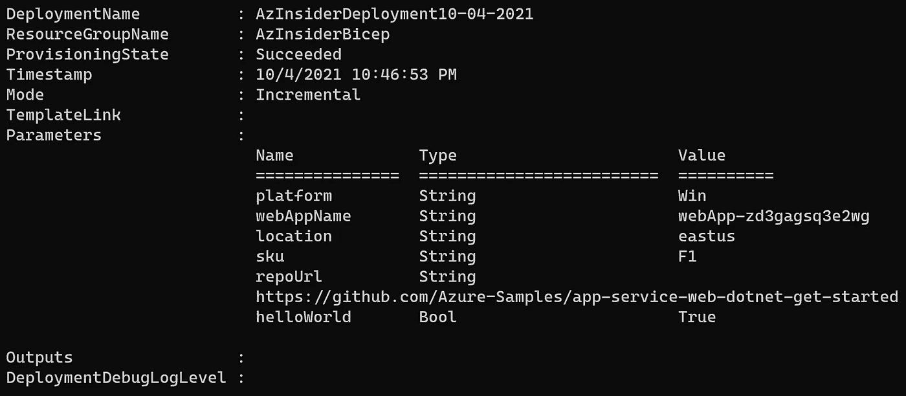
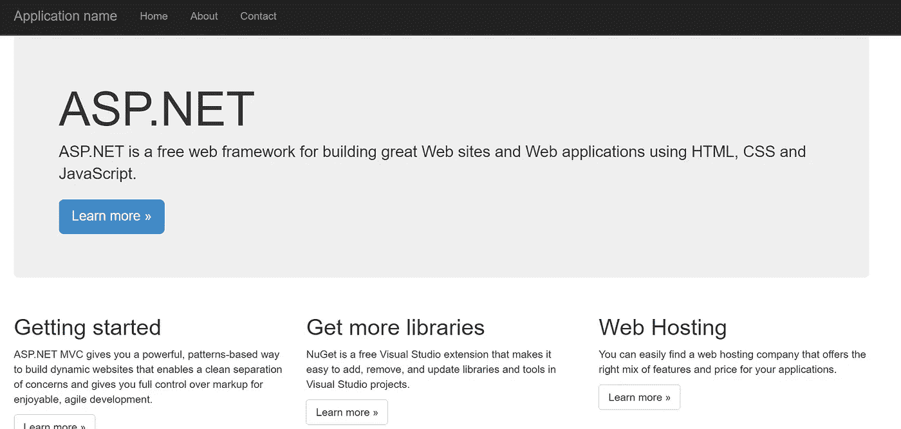

# 💪Azure Bicep:为 web 应用程序使用条件部署

> 原文：<https://medium.com/codex/azure-bicep-using-conditional-deployments-for-web-applications-658120fa320c?source=collection_archive---------3----------------------->

了解如何利用 *Bicep 的条件部署，根据部署期间传递的参数来供应*Linux 或 Windows web 应用。


Bicep 语言中的条件部署

本文的目的是向您展示如何在 Bicep 中利用'*条件部署*。

设想一个场景，您可以部署两种平台类型:基于 Windows 的平台和基于 Linux 的平台。根据我们选择的平台，我们可以在部署期间提供基于 Windows 或基于 Linux 的 web 应用程序。

这意味着我们可以在部署时传递定义平台类型的参数值。

在下面的 Bicep 文件中，我们将利用条件部署，根据部署期间传递的参数来提供基于 Linux 或基于 Windows 的 web 应用程序。

让我们分析一下我们的二头肌文件的结构。

# 1.Bicep 文件-参数

我们将定义以下参数:

*   平台
*   webAppName
*   位置
*   库存单位
*   报告
*   helloWorld

下面的代码显示了参数的定义:

```
[@allowed](http://twitter.com/allowed)([
  'Win'
  'Linux'
])
[@description](http://twitter.com/description)('Select the OS type to deploy.')
param platform string@minLength(2)
@description('Web app name.')
param webAppName string = 'webApp-${uniqueString(resourceGroup().id)}'@description('Location for all resources.')
param location string = resourceGroup().location@description('The SKU of App Service Plan.')
param sku string = 'F1'@description('Optional Git Repo URL')
param repoUrl string = ' '@description('true = deploy a sample Hello World app.')
param helloWorld bool
```

现在让我们看看将要用到的变量。

# 2.Bicep 文件-变量

我们将定义以下变量:

*   语言
*   linuxOffer
*   窗户关闭器
*   appServicePlanPortalName
*   gitre 参考
*   gitRepoUrl
*   configReferenceWindows
*   configReferenceLinux

以下部分强调了变量的定义:

```
var language = '.net'
var configReferenceLinux = {
  node: {
    appSettings: [
      {
        name: 'WEBSITE_NODE_DEFAULT_VERSION'
        value: '12.15.0'
      }
    ]
  }
}
var linuxOffer = 'linux'
var windowsOffer = 'windows'
var appServicePlanPortalName_var = 'AppServicePlan-${webAppName}'
var gitRepoReference = {
  '.net': '[https://github.com/Azure-Samples/app-service-web-dotnet-get-started'](https://github.com/Azure-Samples/app-service-web-dotnet-get-started')
  node: '[https://github.com/Azure-Samples/nodejs-docs-hello-world'](https://github.com/Azure-Samples/nodejs-docs-hello-world')
  php: '[https://github.com/Azure-Samples/php-docs-hello-world'](https://github.com/Azure-Samples/php-docs-hello-world')
  html: '[https://github.com/Azure-Samples/html-docs-hello-world'](https://github.com/Azure-Samples/html-docs-hello-world')
}
var gitRepoUrl = (bool(helloWorld) ? gitRepoReference[toLower(language)] : repoUrl)
var configReferenceWindows = {
  '.net': {
    comments: '.Net app. No additional configuration needed.'
  }
  html: {
    comments: 'HTML app. No additional configuration needed.'
  }
  php: {
    phpVersion: '7.4'
  }
  node: {
    appSettings: [
      {
        name: 'WEBSITE_NODE_DEFAULT_VERSION'
        value: '12.15.0'
      }
    ]
  }
}
```

最后，我们将定义资源。

# 3.Bicep 文件—资源

我们将包括以下资源:

*   应用服务计划
*   应用服务
*   源代码控制

以下代码显示了资源的定义:应用服务计划、应用服务和源代码控制:

```
resource appServicePlanPortalName 'Microsoft.Web/serverfarms@2020-06-01' = {
  name: appServicePlanPortalName_var
  location: location
  sku: {
    name: sku
  }
  **kind: ((platform == 'Linux') ? linuxOffer : windowsOffer)**
}resource webAppName_resource 'Microsoft.Web/sites@2020-06-01' = {
  name: webAppName
  location: location
  properties: {
    serverFarmId: appServicePlanPortalName.id
    **siteConfig: ((platform == 'Linux') ? configReferenceLinux : configReferenceWindows)**
  }
}resource webAppName_web 'Microsoft.Web/sites/sourcecontrols@2020-06-01' = **if (contains(gitRepoUrl, 'http'))** {
  parent: webAppName_resource
  name: 'web'
  properties: {
    repoUrl: gitRepoUrl
    branch: 'master'
    isManualIntegration: true
  }
}
```

注意我们使用了[条件表达式？:](https://docs.microsoft.com/en-us/azure/azure-resource-manager/bicep/operators-logical#conditional-expression--?WT.mc_id=AZ-MVP-5000671)操作符，以确保该函数仅针对资源部署时的条件进行评估。

下面的代码显示了完整的二头肌文件。

```
[@allowed](http://twitter.com/allowed)([
  'Win'
  'Linux'
])
[@description](http://twitter.com/description)('Select the OS type to deploy.')
param platform string[@minLength](http://twitter.com/minLength)(2)
[@description](http://twitter.com/description)('Web app name.')
param webAppName string = 'webApp-${uniqueString(resourceGroup().id)}'[@description](http://twitter.com/description)('Location for all resources.')
param location string = resourceGroup().location[@description](http://twitter.com/description)('The SKU of App Service Plan.')
param sku string = 'F1'[@description](http://twitter.com/description)('Optional Git Repo URL')
param repoUrl string = ' '[@description](http://twitter.com/description)('true = deploy a sample Hello World app.')
param helloWorld boolvar language = '.net'
var configReferenceLinux = {
  node: {
    appSettings: [
      {
        name: 'WEBSITE_NODE_DEFAULT_VERSION'
        value: '12.15.0'
      }
    ]
  }
}
var linuxOffer = 'linux'
var windowsOffer = 'windows'
var appServicePlanPortalName_var = 'AppServicePlan-${webAppName}'
var gitRepoReference = {
  '.net': '[https://github.com/Azure-Samples/app-service-web-dotnet-get-started'](https://github.com/Azure-Samples/app-service-web-dotnet-get-started')
  node: '[https://github.com/Azure-Samples/nodejs-docs-hello-world'](https://github.com/Azure-Samples/nodejs-docs-hello-world')
  php: '[https://github.com/Azure-Samples/php-docs-hello-world'](https://github.com/Azure-Samples/php-docs-hello-world')
  html: '[https://github.com/Azure-Samples/html-docs-hello-world'](https://github.com/Azure-Samples/html-docs-hello-world')
}
var gitRepoUrl = (bool(helloWorld) ? gitRepoReference[toLower(language)] : repoUrl)
var configReferenceWindows = {
  '.net': {
    comments: '.Net app. No additional configuration needed.'
  }
  html: {
    comments: 'HTML app. No additional configuration needed.'
  }
  php: {
    phpVersion: '7.4'
  }
  node: {
    appSettings: [
      {
        name: 'WEBSITE_NODE_DEFAULT_VERSION'
        value: '12.15.0'
      }
    ]
  }
}resource appServicePlanPortalName 'Microsoft.Web/serverfarms@2020-06-01' = {
  name: appServicePlanPortalName_var
  location: location
  sku: {
    name: sku
  }
  kind: ((platform == 'Linux') ? linuxOffer : windowsOffer)
}resource webAppName_resource 'Microsoft.Web/sites@2020-06-01' = {
  name: webAppName
  location: location
  properties: {
    serverFarmId: appServicePlanPortalName.id
    siteConfig: ((platform == 'Linux') ? configReferenceLinux : configReferenceWindows)
  }
}resource webAppName_web 'Microsoft.Web/sites/sourcecontrols@2020-06-01' = if (contains(gitRepoUrl, 'http')) {
  parent: webAppName_resource
  name: 'web'
  properties: {
    repoUrl: gitRepoUrl
    branch: 'master'
    isManualIntegration: true
  }
}
```

现在，我们将定义一个包含实际值的参数文件，在这个文件中，我们将定义首选平台，Windows 或 Linux。根据参数值，将提供一组不同的资源。

# 4.参数文件

下面的代码显示了参数文件的定义。

```
{
    "$schema": "[https://schema.management.azure.com/schemas/2019-04-01/deploymentParameters.json#](https://schema.management.azure.com/schemas/2019-04-01/deploymentParameters.json#)",
    "contentVersion": "1.0.0.0",
    "parameters": {
        "platform": {
            "value": "Win"
        },
        "repoUrl": {
            "value": "[https://github.com/Azure-Samples/app-service-web-dotnet-get-started](https://github.com/Azure-Samples/app-service-web-dotnet-get-started)"
        },
        "helloWorld": {
            "value": true
        }
    }
}
```

请注意，我们选择了 Windows 环境，并传递了“repoURL”和 bool 来计算 true。这将提供一个基于 Windows 的应用服务计划，一个应用服务，它将包括一个来自特定存储库的模板。

# 5.部署 Bicep 文件。

为了部署我们的 Bicep 文件，我们将使用下面的命令:

```
$date = Get-Date -Format "MM-dd-yyyy"
$deploymentName = "AzInsiderDeployment"+"$date"$deploymentName = "AzInsiderDeployment"+"$date"New-AzResourceGroupDeployment -Name $deploymentName -ResourceGroupName AzInsiderBicep -TemplateFile .\conditional-deployment.bicep -TemplateParameterFile .\azuredeploy.parameters.json
```

下图显示了此部署的输出。



Azure Bicep 条件部署输出

您可以参考应用程序服务的 URL 并验证应用程序是否正在运行:



Azure Bicep 应用服务部署

# 后续步骤

我建议您查看如何通过使用条件和循环来构建灵活的二头肌模板:

[](https://docs.microsoft.com/en-us/learn/modules/build-flexible-bicep-templates-conditions-loops/?WT.mc_id=AZ-MVP-5000671) [## 使用条件和循环构建灵活的二头肌模板-学习

### 仅当存在特定约束时，才部署资源。使用循环来部署具有相似…

docs.microsoft.com](https://docs.microsoft.com/en-us/learn/modules/build-flexible-bicep-templates-conditions-loops/?WT.mc_id=AZ-MVP-5000671) 

[*在此加入****azin sider****邮箱列表。*](http://eepurl.com/gKmLdf)

*-戴夫·r·*