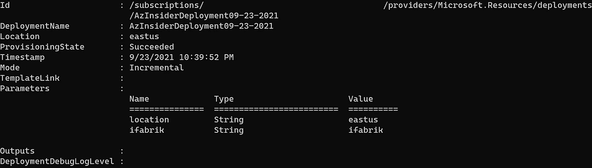

# 💪Azure Bicep:使用模块

> 原文：<https://medium.com/codex/azure-bicep-working-with-modules-2942ec9a43d3?source=collection_archive---------1----------------------->

使用 Bicep 模块部署更复杂和更大的解决方案。

当我们在 Azure 中处理更复杂或更广泛的环境时，建议将我们的解决方案分成不同的模板。

在 ARM 模板中，我们能够使用链接或嵌套模板将我们的解决方案分解成许多相关的模板。然后，我们通过主模板部署解决方案，我们可以引用链接或嵌套的模板。

这在 Azure Bicep 中仍然是有效的方法吗？

简短的回答是肯定的，也有一些利弊。

Azure Bicep 拥抱模块化的概念。

# 二头肌中的模块

在 Bicep 中，模块被定义为一起部署的一个或多个资源的集合。模块只公开参数和输出，隐藏内部资源定义的细节。

要部署复杂的解决方案，您可以将您的 Bicep 模板分成许多更小的 Bicep 模板，然后通过主模板将它们部署在一起。每个模板都可以作为一个模块来使用。

## 在 Bicep 中使用模块。

想象一个运行在应用服务和应用服务计划之上的应用。您的环境可以包括一个或多个 web 服务，您将使用应用服务计划托管它们。

您可以按如下方式分解解决方案，而不是创建一个包含所有资源的 Bicep 模板:

*   应用服务的二头肌模板，
*   用于定义应用服务计划的 Bicep 模板，
*   一个二头肌模板，叫做“*主*模板。它将使用其他模板作为模块。

让我们从应用服务定义开始。下面的代码显示了应用服务的 Bicep 模板:

```
param appServicePrefix string
param location string = 'eastus'
param appServicePlanId stringresource appService 'Microsoft.Web/sites@2021-01-15' = {
  name: '${appServicePrefix}site'
  location: location
  properties:{
    siteConfig:{
      linuxFxVersion: 'DOTNETCORE|3.0'
    }
    serverFarmId: appServicePlanId
  }
}
// Set an output which can be accessed by the module consumer
output siteURL string = appService.properties.hostNames[0]
```

在上面的代码中，我们定义了三个参数:应用服务前缀、位置，最后一个参数指定应用服务计划 Id。

然后我们定义一个资源，应用服务。最后，我们将站点 URL 作为输出，以便模块消费者可以访问它。

定义模块没有特定的语法。它看起来就像另一个二头肌模板。

现在，让我们回顾一下应用服务计划的 Bicep 模板，如下所示:

```
param appPlanPrefix string
param sku string = 'F1'
param location string = 'eastus'resource appServicePlan 'Microsoft.Web/serverfarms@2021-01-15' = {
  //interpolate param
  name: '${appPlanPrefix}AppPlan'
  //pass on location param
  location: location
  kind: 'linux'
  sku: {
    //pass on sku param
    name: sku
  }
  properties:{
    reserved: true
  }

}
// Set an output which can be accessed by the module consumer
output appServicePlanId string = appServicePlan.id
```

在上面的代码中，我们定义了三个参数:一个参数用于 App Plan 前缀，另一个用于 SKU，第三个参数用于指定资源的位置。

然后，我们定义应用服务计划，并包含应用服务计划 Id 的输出。

现在我们来回顾一下主要的二头肌模板。在此模板中，我们将把其他二头肌模板作为模块使用:

```
//parameters
param location string = 'eastus'
param ifabrik string = 'ifabrik'//define target 
targetScope = 'subscription'//define new resoruce group
resource ifabrikRg 'Microsoft.Resources/resourceGroups@2021-04-01' = {
  name: '${ifabrik}Rg'
  location: location
}//consume appServicePlan as module
module appServicePlan 'appServicePlan.bicep' = {
  name:'appServicePlan'
  scope: ifabrikRg
  params: {
    appPlanPrefix: ifabrik
  }
}//consume appService as module
module appService 'appService.bicep' = {
  name: 'appService'
  scope: ifabrikRg
  params: {
    appServicePlanId: appServicePlan.outputs.appServicePlanId
    appServicePrefix: ifabrik
  }
}
```

在上述代码中，我们将应用服务计划和应用服务模板作为模块使用。要使用一个模块，我们使用 module 关键字。

消耗模块时需要' ***名称*** '属性。此字段用作为模块生成的嵌套部署资源的名称。

我们还定义了两个参数:一个是位置参数，一个是字符串参数。

最后，我们定义目标并将其范围限定到订阅级别，并包括新资源组的定义。

# 部署二头肌模板。

要部署此环境，我们将使用下面的 PowerShell cmdlet，并以订阅级别为目标:

```
$date = Get-Date -Format "MM-dd-yyyy"
$deploymentName = "AzInsiderDeployment"+"$date"
New-AzDeployment -Name $deploymentName -TemplateFile .\main.bicep -Location eastus
```

下图显示了此部署的输出



Azure Bicep —部署输出

如您所见，我们只部署了' main.bicep '文件，不需要引用额外的 bicep 模板。

该模块将参数和输出作为契约暴露给其他 Bicep 文件。

希望这能让你更好地理解 Bicep 中的模块化，以及如何在 Azure 中为你的环境定义和使用模块。

# 下一步。

[](https://docs.microsoft.com/en-us/azure/azure-resource-manager/bicep/modules?WT.mc_id=AZ-MVP-5000671) [## Bicep 模块- Azure 资源管理器

### Bicep 使您能够将复杂的解决方案分解成模块。Bicep 模块只是一个被部署的 Bicep 文件…

docs.microsoft.com](https://docs.microsoft.com/en-us/azure/azure-resource-manager/bicep/modules?WT.mc_id=AZ-MVP-5000671) [](https://blog.azinsider.net/why-is-azure-bicep-your-next-choice-for-infrastructure-as-code-f10a2b924ca7) [## 💪为什么 Azure Bicep 是您的下一个代码基础设施选择？

### 作为云工程师，您应该了解 Azure Bicep 对您的环境的影响。

blog.azinsider.net](https://blog.azinsider.net/why-is-azure-bicep-your-next-choice-for-infrastructure-as-code-f10a2b924ca7) [](/codex/azure-bicep-playground-transitioning-from-arm-templates-into-bicep-5c10c864c863) [## Azure 二头肌游乐场:从手臂模板过渡到二头肌

### 了解移植过程，并发现在将 ARM 模板移植到 Bicep 模板时可能有用的工具

medium.com](/codex/azure-bicep-playground-transitioning-from-arm-templates-into-bicep-5c10c864c863) 

让我知道你对二头肌模块的想法和反馈，快乐编码！

[*在此加入****azin sider****邮箱列表。*](http://eepurl.com/gKmLdf)

*-戴夫·r·*