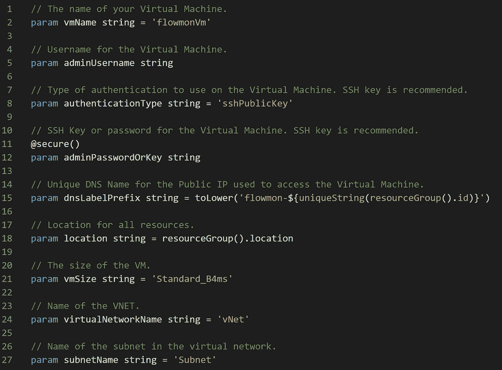

# 💪Azure Bicep:使用参数-最佳实践

> 原文：<https://medium.com/codex/azure-bicep-working-with-parameters-best-practices-92454074e380?source=collection_archive---------2----------------------->

何时以及如何在 Azure Bicep 模板中使用参数。

在 Azure Bicep 中，新的领域特定语言(DSL)用于声明性部署 **Azure** 资源，我们像在 ARM 模板中一样定义参数。我们应该考虑语法上的一些差异。



天蓝色二头肌—参数

# Azure 二头肌参数

参数是我们在 Bicep 模板中定义的输入值。这些值可以在部署操作期间内联传递，也可以从参数文件中引用。

## 在 Azure Bicep 中声明参数

您需要为 Bicep 模板中的每个参数提供一个名称和类型。下面的代码显示了如何声明参数:

```
param demoString string
param demoInt int
param demoBool bool
param demoObject object
param demoArray array
```

参数不能与变量、模块或资源同名。不要过度使用参数。当我们需要传递因不同部署而异的值时，经常会用到参数。

例如，创建存储账户时，需要提供 SKU 和类型；你可以利用参数。

如果您需要定义虚拟网络和子网，您可以利用虚拟网络和子网定义的参数对象。

尽可能多地为参数提供描述。你的团队和同事会很感激的。

资源管理器在开始部署操作之前解析参数值。现在让我们快速看一下支持的数据类型。

## Azure Bicep 参数数据类型

Azure Bicep 支持以下参数数据类型:

*   排列
*   弯曲件
*   （同 Internationalorganizations）国际组织
*   目标
*   secureObject 和 secureString —由 *@secure()* decorator 指示
*   线

如果您想知道 decorator 是什么，Bicep 中的 decorator 可以用来为参数指定约束和元数据。

以下是 Bicep 中可用的装饰者列表:

*   允许
*   安全的
*   最小长度和最大长度
*   最小值和最大值
*   描述
*   元数据

## 什么时候应该使用装饰者？

这里有一个例子，如果你想部署一个虚拟机，你可以使用一个带有 *@secure()* decorator 的参数来传递用户名的密码。部署历史记录中不记录也不存储密码。

下面的[文章](https://blog.azinsider.net/azure-bicep-secure-secrets-in-parameters-secure-decorator-ce6317cc0c23)解释了如何使用*@ secure()*decorator:[https://blog . azin sider . net/azure-bicep-secure-secrets-in-parameters-secure-decorator-ce 6317 cc 0 c 23](https://blog.azinsider.net/azure-bicep-secure-secrets-in-parameters-secure-decorator-ce6317cc0c23)

下面的代码展示了一些参数和 *@secure()* 装饰器的例子:

```
// Username for the Virtual Machine.
**param adminUsername string**// Type of authentication to use on the Virtual Machine. SSH key is recommended.
**param authenticationType string = 'sshPublicKey'**// SSH Key or password for the Virtual Machine. SSH key is recommended.
[**@secure**](http://twitter.com/secure)**()
param adminPasswordOrKey string**
```

在上面的代码中，我们用 *@secure()* 装饰器为密码或密钥定义了字符串类型参数和第三个参数。

尝试添加注释，以提供关于参数的更多上下文或信息。

下面是另一个例子，它展示了' *minLength 和 maxLength*decorator 的用法:

```
@minLength(3) 
@maxLength(11) 
param storagePrefix string
```

您可以为每个参数添加一个或多个装饰器。你可以在你的二头肌模板的任何地方定义参数；它们将被编译到 ARM 模板的参数部分。

下面是另一个最佳实践:为了最大限度地减少部署期间的潜在错误，请记住为控制命名的参数(如存储帐户)指定最小和最大字符长度。

与 ARM 模板类似，您可以使用数组、对象、字符串、int 和 bool 值:

```
param myArr array = [
  'one'
  'two'
  'three'
]
param myObj object = {
  name: 'Mike'
  age: 32
}
param myString string = 'string'
param myInt int = 100
```

您也可以使用参数作为形状因子来创建另一个参数:

```
param storageNamePrefix string = ''
param storageAccountName string = '${storageNamePrefix}storage'
```

在上面的代码中，我们插入了“ *storageNamePrefix* ”来创建存储帐户名称。

## 函数呢？

您还可以利用函数来创建参数值，就像在 ARM 模板中一样。下面的代码显示了如何定义资源的位置。

```
// Location for all resources.
param location string = resourceGroup().location
```

在 Bicep 中，可以使用多行参数。我没用过那么多，但是你可以自己试试:

```
param myParam string = '''
This is the first line
this is the second line
third line'''
```

上述代码将产生以下 JSON:

```
"parameters": {
    "myParam": {
      "type": "string",
      "defaultValue": "This is the first line**\n**this is the second line**\n**third line"
    }
  },
```

正如您已经注意到的，在 Bicep 中使用参数非常灵活和简单。

现在我们已经回顾了一些关于参数的基础知识，是时候进入部署操作了。

在本文的开头，我提到了传递参数的两个选项:*内联*和使用一个*参数文件*。

# 内嵌参数

使用这种方法，您可以在部署时定义参数。当部署期间未提供值时，将使用默认值。

下面的代码显示了创建虚拟机的几个参数的示例。

```
// The name of your Virtual Machine.
param vmName string = 'flowmonVm'// Username for the Virtual Machine.
param adminUsername string// Type of authentication to use on the Virtual Machine. SSH key is recommended.
param authenticationType string = 'sshPublicKey'// SSH Key or password for the Virtual Machine. SSH key is recommended.
[@secure](http://twitter.com/secure)()
param adminPasswordOrKey string// Unique DNS Name for the Public IP used to access the Virtual Machine.
param dnsLabelPrefix string = toLower('flowmon-${uniqueString(resourceGroup().id)}')// Location for all resources.
**param location string = resourceGroup().location**// The size of the VM.
param vmSize string = 'Standard_B4ms'// Name of the VNET.
param virtualNetworkName string = 'vNet'// Name of the subnet in the virtual network.
param subnetName string = 'Subnet'// Name of the Network Security Group.
param networkSecurityGroupName string = 'SecGroupNet'
```

要引用参数的值，需要使用参数名。在下面的代码中，我们传递了参数“location”:

```
resource nic 'Microsoft.Network/networkInterfaces@2020-06-01' = {
  name: networkInterfaceName
  **location: location**
  properties: {
    ipConfigurations: [
```

可以在部署操作期间传递参数，如下面的代码所示:

```
New-AzResourceGroupDeployment `
  -Name BicepTemplateDeployment `
  -ResourceGroupName az-insider`
  -TemplateFile ./main.bicep `
  -storageAccountName azinsiderstgacc
```

现在让我们看看传递参数的第二个选项:使用参数文件。

# 使用参数文件部署 Bicep 文件

您可以创建一个包含参数值的参数文件，而不是传递参数的内联值。这个参数文件是一个带有实际参数值的 JSON 文件。

像 ARM 模板一样，您可以拥有 Bicep 模板' *main.bicep* '和一个名为' *main.parameters.json* '的参数文件。

下面的代码显示了一个参数文件的示例:

```
{
  "$schema": "[https://schema.management.azure.com/schemas/2019-04-01/deploymentParameters.json#](https://schema.management.azure.com/schemas/2019-04-01/deploymentParameters.json#)",
  "contentVersion": "1.0.0.0",
  "parameters": {
    "<first-parameter-name>": {
      "value": "<first-value>"
    },
    "<second-parameter-name>": {
      "value": "<second-value>"
    }
  }
}
```

请注意，参数文件中的参数类型必须使用与 Bicep 文件相同的类型。

然后，您可以使用 Azure PowerShell 或 Azure CLI 部署 Bicep 模板。下面的代码展示了如何使用 Azure PowerShell 部署带有参数文件的 Bicep 模板:

```
New-AzResourceGroupDeployment -Name BicepDeployment -ResourceGroupName MyResourceGroup `
  -TemplateFile C:\MyTemplates\storage.bicep `
  -TemplateParameterFile C:\MyTemplates\storage.parameters.json
```

在上面的代码中，我们使用- *模板文件*和- *模板参数文件*来引用 Bicep 模板和参数文件。

最后，值得一提的是，Bicep 允许您为部署使用本地参数文件和内联参数。也可以引用外部文件；但是，如果使用这种方法，将无法使用本地文件或传递内联值。

我希望这能让你更好地理解 Azure Bicep 中的参数是如何工作的。

[*在此加入****azin sider****邮箱列表。*](http://eepurl.com/gKmLdf)

*-戴夫·r·*