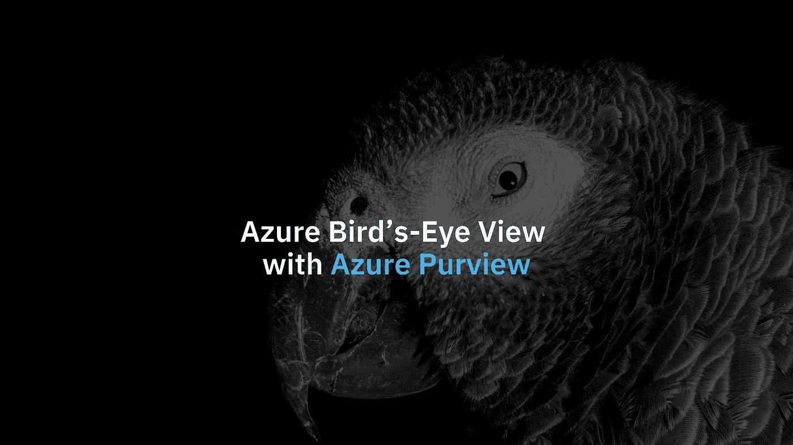

# 蔚蓝色的鸟瞰图，视野蔚蓝

> 原文：<https://medium.com/codex/azure-birds-eye-view-with-azure-purview-118a46c3ea76?source=collection_archive---------8----------------------->

## 了解如何自动发现和映射 Azure 数据源中的数据。我的亲身经历。

## 什么是 Azure 权限？

一段时间以来，微软一直在进行代号为“Babylon”的内部项目，旨在重组…