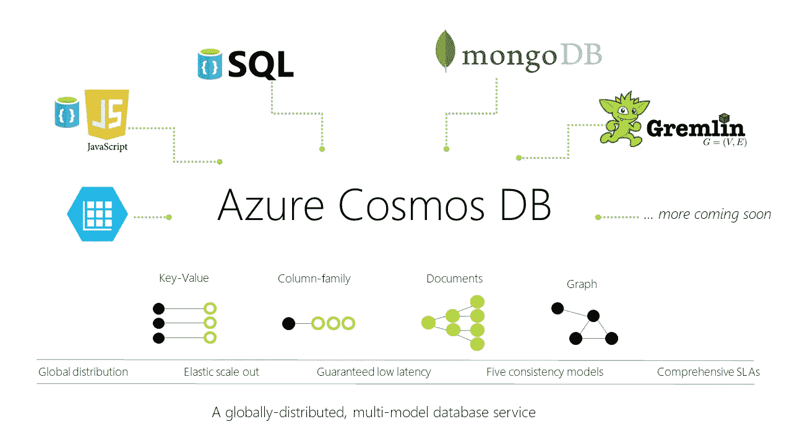
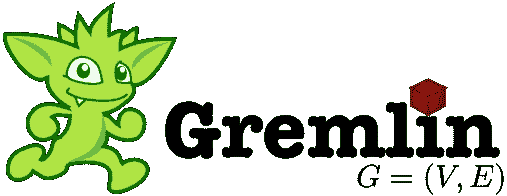

# Azure Cosmos DB API 服务

> 原文：<https://medium.com/codex/azure-cosmos-db-api-services-dc14a4cafd2c?source=collection_archive---------10----------------------->

Azure Cosmos DB 是一个由 Azure 提供的多模型完全托管的 NoSQL 数据库。该服务提供了多个数据库 API，这些 API 是根据需要存储的数据类型来选择的。提供的四种 API 服务是核心 SQL API、Gremlin API、MongoDB API、Cassandra API 和 Azure Table API。

重要的是要注意，一旦用特定的 API 启动了一个实例，以后就不能再更改了。如果没有指定 API，核心 SQL API 是用于实例的默认 API，这是因为核心 SQL API 足以满足大多数用例的需求。在决定使用什么 API 时，需要考虑一些因素，包括当前正在使用的现有数据库，不愿意重写整个数据访问层，以及需要使用 Azure Cosmos DB 的关键特性。

Azure Cosmos DB 提供了一系列独特的功能，如全球分发、弹性存储扩展、低延迟、运行事务性和分析性工作负载的能力，以及使用完全托管的平台，这可能是用户希望利用的附加优势。让我们来看看每个 API

**核心 SQL API —** 如前所述，这是 Azure Cosmos DB 的默认产品，可以满足大多数场景。API 以文档格式存储数据，它提供了使用 SQL 查询数据的能力。需要注意的是，这种语言不是 SQL，但非常像 SQL。

对于试图从 Oracle、Dynamo DB 和 HBase 等其他数据库迁移的用户来说，这也是一个不错的选择。

**MongoDB API —** 这个 API 允许您像使用 MongoDB 实例一样使用 Cosmos DB，甚至扩展了 Mongo DB 驱动程序、工具和 SDK 的使用。Mongo DB 填补了键值存储和 RDBMS 系统之间的空白，允许更高级的查询功能。

利用 Mongo DB API 提供了一些关键优势，比如即时可伸缩性、自动和透明的分片、五个 9 的可用性以及无服务器部署。

Mongo DB API 是通过一个有线协议实现的，该协议能够与上面提到的工具和 SDK 兼容。使用的有线协议是基于套接字的请求-响应协议，允许客户端通过常规的 TCP-IP 套接字与数据库通信。

Mongo DB API 可以通过三种方式部署:

*   *调配的吞吐量—* 此设置最适合用户工作负载一致的情况。
*   *自动缩放* —通过此设置，可设定吞吐量上限，并自动缩放以满足您的需求。这与调配正好相反，因为它非常适合缺乏一致性的工作负载。
*   *无服务器—* 在此设置中，您只需为实际使用的吞吐量付费。

**Gremlin API —** 这允许用户进行图形查询，并将数据存储为边和顶点。这主要用于数据不容易被关系数据库建模的情况。Gremlin API 本质上使我们能够利用图形数据库的力量。

Gremlin API 基于 Apache Tinker-Pop 图形计算框架。Apache Tinker-Pop 是一个图形抽象层，它与许多不同的图形数据库和图形处理器一起工作，这些图形处理器由一个图形 API 和一个进程 API 组成。

对于读写操作，API 使用 Cosmos DB 分区策略。

**Cassandra API —** Cassandra 是 Apache 的一个分布式数据库，旨在管理大量结构化数据。它提供了无单点故障的高可用性。这个 API 旨在将数据存储在一个列结构中。就像 Mongo DB API 一样，Cassandra API 也使用有线协议来访问特定于 Cassandra DB 的工具和 SDK。

Cassandra 旨在处理跨多个节点的大数据工作负载。它提供了一个跨节点的对等分布式系统，数据分布在集群中的所有节点上。群集中节点的属性如下:

*   集群中的所有节点都扮演相同的角色，每个节点都是独立的，同时又与其他节点互连。
*   无论数据实际位于群集中的什么位置，群集中的每个节点都可以接受读写请求。
*   当一个节点发生故障时，可以从网络中的其他节点接收读或写请求。

Cassandra 中的复制模型使用集群中的一个或多个节点作为给定数据的副本。如果检测到一些节点用过期的值响应，Cassandra 会将最新的值返回给客户端。在返回最近的值后，Cassandra 在后台执行读取修复来更新过时的值。

我希望上面的细节提供了更多关于可用于 Azure Cosmos DB 的各种 API 客户端的上下文。