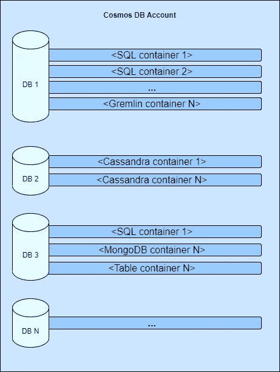
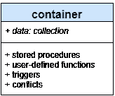
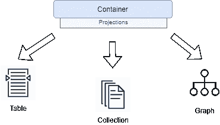

# Azure Cosmos DB。引言。

> 原文：<https://medium.com/codex/azure-cosmos-db-introduction-998d246053b7?source=collection_archive---------2----------------------->

## [法典](http://medium.com/codex)

在本文中，我们将了解什么是 Cosmos DB，回顾创建新数据库时容量计算的一般概念、功能和要点。

如果您已经熟悉概念和体系结构，请随意阅读本系列的其他文章:

*   [**天蓝色宇宙 DB。引言。**](/me/stats/post/998d246053b7?source=main_stats_page)
*   [**天蓝色宇宙 DB。分区。**](/me/stats/post/bc851a404476?source=main_stats_page)
*   [**天蓝色宇宙 DB。分区。动手分析。**](/codex/azure-cosmos-db-partitioning-hands-on-analysis-3eb8dff2b83f)
*   [**天蓝色宇宙 DB。原木的力量。**](/me/stats/post/64b619170d63?source=main_stats_page)
*   [**天蓝色宇宙 DB。日志。当心代价**](/me/stats/post/4894f872f256)

# 三大支柱:账户、数据库、容器

cosmos DB(CDB)——一个文档存储库，它是以前相对流行的 Azure 文档数据库的演化。微软产品团队通过提供“您选择的 API 端点”、“无限扩展”、“无限数据库大小”和“最低配置”，成功地将 Cosmos DB 与竞争对手区分开来。尽管正如我在本系列的另一篇文章[中所写的那样，如果没有对潜在的、有时没有很好记录的机制的深刻理解，要获得可维持的、成本有效的增长并不是一件容易的事情。](https://agrocks.medium.com/azure-cosmos-db-partitioning-bc851a404476)

在我们仔细查看 CDB 的卖点之前，让我们先来看看它的核心结构:

Cosmos DB 主要概念(帐户、数据库、容器)

每个 CDB 的基础是代表一组配置的账户。将它视为一把伞，您可以在其中执行管理任务，以及其他任务:

*   全局数据复制
*   一致性水平
*   备份策略
*   私有端点
*   防火墙规则

一个帐户可以创建任意多的数据库，尽管每个订阅只能提供 25 个帐户。

下一层—数据库，它是一个相当轻便的逻辑“盒子”，封装了数据访问和容量分配。主要特点:

*   逻辑上分离的容器
*   数据库的高级用户访问场景
*   提供将在同一个数据库中的容器之间共享的吞吐量

CDB 架构最有趣的部分是**容器—** 一个与模式无关的容器，包含实体、存储过程、用户定义函数(UDF)和触发器**。**

Cosmos DB 容器

你可以在网上找到人们称它为“收藏”，但它不仅仅是收藏中的一组物品。**C*容器*更准确地描述了该结构所服务的功能。容器是系统中必不可少且功能最丰富的部分。**

让我们回顾一下容器设计的主要特征。

# API 端点和资源模型

如前所述，Cosmos DB 承诺非常有趣的功能，使其区别于竞争对手，允许使用您选择的 API 连接和存储数据，同时在同一保护伞下共享基础架构管理。

目前，CDB 为您的容器支持以下 API 端点:

*   [SQL API](https://github.com/Azure/azure-cosmos-dotnet-v3) —文档数据库的继承者
*   MongoDB——流行的 NoSQL 数据库的精简版本
*   [Cassandra](https://docs.microsoft.com/en-us/azure/cosmos-db/cassandra-introduction)—Apache Cassandra 是另一个具有高吞吐量和可伸缩性的 NoSQL 数据库
*   [Gremlin](https://docs.microsoft.com/en-us/azure/cosmos-db/graph-introduction) —专为社交、地理空间、推荐应用而设计的全面管理的图形数据库
*   [表格 API](https://docs.microsoft.com/en-us/azure/cosmos-db/table-introduction) —具有高级功能的表格存储

基于用于容器创建的 API 类型，Cosmos DB 将提供底层容器并将其投影到表、集合或数据结构中。

尽管声明了对所有端点的支持，但是在跳到平台上之前，您应该仔细检查用例，以避免将来出现意外。MongoDB、Cassandra 或 Gremlin APIs 的可用函数都有限制。真正的一等公民是 SQL API，它有一个维护和积极发展的 Github repo。

# 调配的吞吐量。共享与专用。

为了度量数据库操作，微软引入了标准化的度量请求单元(简称 RUs)。ru 封装了 CPU、内存和 IOPS 的底层消耗，允许对维持性能所需的容量进行确定性评估。所有数据库操作——写、点读、查询或存储过程的执行——都由 RUs 测量。

在 Cosmos DB 中，您可以在两个级别上提供吞吐量(RUs ):

*   数据库ˌ资料库
*   容器

当**按容器**配置时，它将为其跨越一个专用容量([物理分区](https://agrocks.medium.com/azure-cosmos-db-partitioning-bc851a404476))。在这种容量分配模式中，数据库中的其他容器不会竞争相同的资源，因此您应该能够充分利用已配置的 ru 的潜力。

为每个容器提供专用吞吐量听起来非常可靠，但这需要成本。即使您没有任何数据，每个容器也有 400 个 ru 的最小吞吐量。除此之外，在容器的生命周期内最高配置的 ru 和存储大小可能会增加最小吞吐量值。三条规则适用于该值:

*   从 400 RUs 开始
*   [以 GB 为单位的当前存储] * 10 RUs
*   集装箱/ 100 上供应的最高装运单位

来自[微软文档](https://docs.microsoft.com/en-us/azure/cosmos-db/concepts-limits#minimum-throughput-on-container)的示例:

> 假设您有一个配置了 400 RU/s、15 GB 存储和 10 个容器的数据库。最小 RU/s 为`MAX(400, 15 * 10 RU/s per GB, 400 / 100, 400 + 0 )` = 400 RU/s。如果数据库中有 30 个集装箱，则最小 RU/s 为`400 + MAX(30 - 25, 0) * 100 RU/s` = 900 RU/s。
> 
> 注意:如果您的帐户符合我们的[“高存储/低吞吐量”计划](https://docs.microsoft.com/en-us/azure/cosmos-db/set-throughput#high-storage-low-throughput-program)，则每 GB 存储的最低吞吐量 10 RU/s 可以降低。

**每个数据库的配置**不会为任何特定的容器分配专用的物理分区，而是在数据库中的所有容器之间共享。

从长远来看，共享可以节省成本，这对于结构良好的小型数据库有明显的好处。虽然这种设计的最大缺点是一个“贪婪”的容器，它可以最大化吞吐量消耗，并让所有其他容器等待资源释放。

吞吐量耗尽的明确指标是 CDB 指标上不断增加的 *429 节流错误*。

请记住，您是否提供每个容器或数据库的吞吐量并不重要，您的决策成功与否取决于您的应用程序的 RUs 消耗。

# 估计容量和所需吞吐量

微软构建并发布了一个有用的工具，它应该是估计所需吞吐量和相关成本的起点: [Azure Cosmos DB 容量计算器](https://cosmos.azure.com/capacitycalculator/)。

这是一个很好的开始工具，尽管为了避免意外，在估计数据库所需的吞吐量/容量时，请记住检查以下列表:

*   文档的大小——项目越大，消耗的资源就越多。

***推荐:*** *不要在 Cosmos DB 中存储垃圾，用更便宜的存储代替。*

*   索引—默认情况下，您插入的文档将自动由所有属性进行索引，这对于写入来说效率很低，但可以提高查询性能。

***建议*** *:不要使用缺省值，将索引调整为只匹配最频繁的查询。*

*   点读取与查询。

***建议* :** *与查询相比，点读取的 RU 消耗明显较低，围绕这一点构建您的数据消耗逻辑。*

*   查询模式和 LINQ。

***推荐:****LINQ 以其灵活性给表带来了一个非最优的查询生成。乘以宇宙 DB 规模，会让你付出很大代价。*

*   数据库中的数据量。

***推荐:*** *请检查* [*右分区键选择*](https://agrocks.medium.com/azure-cosmos-db-partitioning-bc851a404476) *的重要性，以支持您的 DB 的可维护性增长。*

***推荐:*** *第一个重要里程碑目标是 50GB。如果您将大小保持在这个标记以下，您就不必过于担心性能，否则请记住分区拆分和每个物理分区的最大请求单元，这是根据[调配的吞吐量]/[分区数量]计算的。*

# 如何创建第一个数据库和容器？

有很多关于如何创建帐户、数据库和容器的好例子。除其他外:

*   【Azure 门户】[快速入门:从 Azure 门户](https://docs.microsoft.com/en-us/azure/cosmos-db/create-cosmosdb-resources-portal)创建 Azure Cosmos 帐户、数据库、容器和项目
*   [.Net SDK v4] [快速入门:使用。NET V4 SDK 来管理 Azure Cosmos DB SQL API 帐户资源](https://docs.microsoft.com/en-us/azure/cosmos-db/create-sql-api-dotnet-v4)
*   【Node.js】[快速入门:使用 node . js 连接并查询 Azure Cosmos DB SQL API 帐户的数据](https://docs.microsoft.com/en-us/azure/cosmos-db/create-sql-api-nodejs)

希望你喜欢这篇介绍，并准备好继续[探索 Cosmos DB](https://agrocks.medium.com/azure-cosmos-db-partitioning-bc851a404476) 。