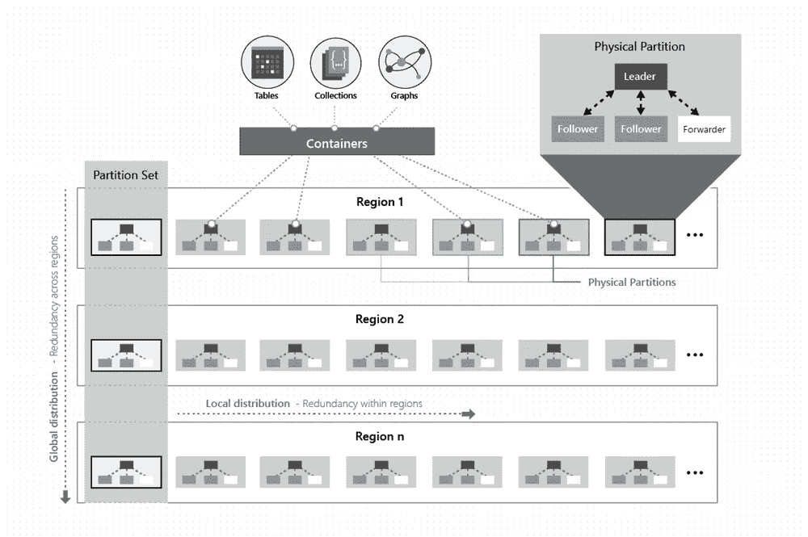
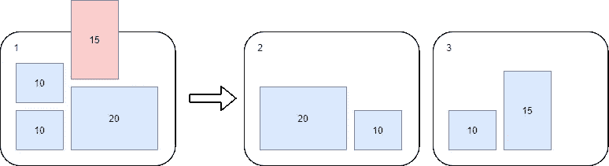
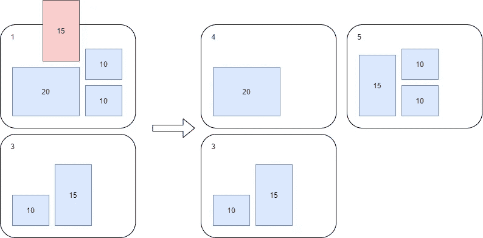
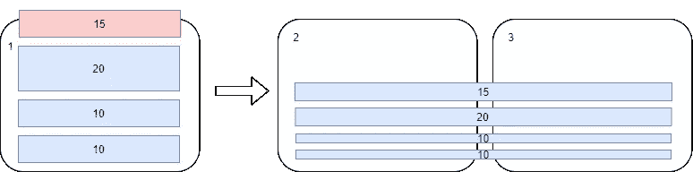
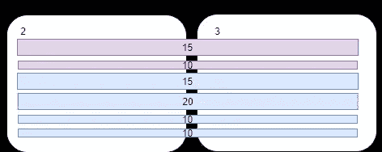

# Azure Cosmos DB。分区。

> 原文：<https://medium.com/codex/azure-cosmos-db-partitioning-bc851a404476?source=collection_archive---------1----------------------->

## [法典](http://medium.com/codex)

[https://azure . Microsoft . com/en-us/pricing/details/cosmos-db/](https://azure.microsoft.com/en-us/pricing/details/cosmos-db/)

本文是该系列的一部分。查看其他关于 Cosmos DB 的更多详细信息:

*   [**天蓝色宇宙 DB。引言。**](/me/stats/post/998d246053b7?source=main_stats_page)
*   [**天蓝色宇宙 DB。分区。**](/me/stats/post/bc851a404476?source=main_stats_page)
*   [**天蓝色宇宙 DB。分区。动手分析。**](/codex/azure-cosmos-db-partitioning-hands-on-analysis-3eb8dff2b83f)
*   [**天蓝色宇宙 DB。原木的力量。**](/me/stats/post/64b619170d63?source=main_stats_page)
*   [**天蓝色宇宙 DB。日志。当心成本**](/me/stats/post/4894f872f256)

# 什么是分区键，为什么它很重要？

Cosmos DB 被设计为基于*物理分区(PP)* 之间的数据分布进行水平扩展。可以把它想象成可独立部署的自给自足的节点，由一个中央网关进行同步和协调。

该架构的第二个重要部分是*逻辑分区(LP)*——这是一组具有相同特征*(分区键)*的文档，它们应该完全存储在同一个物理分区中。

来自官方文档[https://docs . Microsoft . com/en-us/azure/cosmos-db/global-dist-under-the-hood](https://docs.microsoft.com/en-us/azure/cosmos-db/global-dist-under-the-hood)

物理分区有两个主要限制:

*   最大吞吐量:10k RUs
*   最大数据大小(所有 LP 的总和):50GB

逻辑分区有一个大小限制，即 20GB。

*注意:*自从 Cosmos DB 的初始版本发布以来，大小限制已经增加，如果它们会进一步增加，我不会感到惊讶。

# 如何为我的容器选择正确的分区键？

*考虑正确的分区键时，分析应用数据“消耗”模式*至关重要。它是平衡的和线性的吗？季节性？与白天的活动有关还是受特定地区的驱使？等等..

根据微软关于可维护数据增长的建议，您应该选择最细粒度的分区键(比如文档的 **Id** 或复合字段)。[主要原因](https://docs.microsoft.com/en-us/azure/cosmos-db/partitioning-overview)是:

> 在所有逻辑分区中平均分配请求单元(RU)消耗和数据存储。这确保了在您的物理分区之间均匀的 RU 消耗和存储分布。

在极少数情况下，*较大的分区可能会起作用，*尽管同时这种解决方案应该实现数据归档以从一开始就保持数据库大小(参见下面解释原因的示例)。如果没有适当的数据治理和清理，您应该准备好接受仅仅为了保持相同的性能而增加的运营成本。

最重要的是，您应该准备好解决“热”分区、PP 数据不对称、意外的“分裂”以及数据库不可预测的性能。

另一方面，粒度分区策略会导致安如开销，这是由多个物理分区(PP)之间的查询扇出造成的。

值得一提的是，更大数量的分区将产生更高的开销，因为在查询系统中不使用分区键，就不知道 PP 的“地址”在哪里寻找它，并且将加速对所有 PP 的请求以扫描索引，并且在最坏的情况下遍历每个文档。但是，通过仔细的索引，与数据开始增长超过 50、100、150GB 时出现的问题相比，这可以忽略不计。

一些人建议在设计分区策略时以高“基数”为目标。来自[维基](https://en.wikipedia.org/wiki/Cardinality):

> **集合的基数**是集合“元素数量”的度量。例如，集合 A={2，4，6}包含 3 个元素，因此 A 的基数为 3

重要的是要注意这里的**高基数**应该是容器中分区键的**数量的目标度量，而不是每个分区键的文档数量。**

# 为什么大分区在大多数情况下是一个糟糕的选择？

…即使文档中说“选择最适合您的”

Cosmos DB 设计为水平扩展，每个 PP 的供应吞吐量限制为*【每个容器(或 DB)的供应总量】/【PP 数量】*。

一旦由于超过 50GB 大小而发生 PP 拆分，现有 PP 以及两个新创建的 PP 的最大吞吐量将低于拆分前的水平。

想象以下场景:

*   您已经创建了配置了 10k RUs 和***CustomerId****作为*分区键的容器(这将需要一个底层物理分区#1)。*每个 PP 的最大吞吐量为 10k/1 = 10k ru。*
*   应用程序在不断增长，三个大客户(C1[10GB]、C2[20GB]和 C3[10GB])的发票被加载到系统中。*D*C1、C2 和 C3 的 ata 可以以每秒 *10k 的请求单位*进行操作。
*   当 C4 客户将[15GB]的发票加载到系统中时，Cosmos DB 违反了 50GB 的分区大小限制，必须将 PP#1 分成两个新创建的分区 PP#2 (30GB)和 PP#3 (25GB)。每个 PP 的最大吞吐量是 10k/2 = 5k RUs。
*   C1、C2、C3 和 C4-数据可通过高达 5k 的 ru 进行操作

*   系统中又增加了两个客户 C5[10GB] C6[15GB]，这两个客户都以 PP2 结束，这导致了另一个拆分-> PP4 (20GB)和 PP5 (35GB)。*现在每个 PP 的最大吞吐量是 10k/3 = 3.333k RUs。*
*   C1-6 数据可以用 3.3k RUs 操作

# 为什么每个容器具有高基数的分区键是增长和可维护性的最佳选择？

..尽管有些人可能会说你会为你的查询支付更多的费用。

当评估高基数分区键时，我们必须接受它伴随着执行[跨分区查询](https://docs.microsoft.com/en-us/azure/cosmos-db/how-to-query-container)的成本。简而言之，如果您的查询没有通过分区键过滤，Cosmos DB 就不知道去哪里获取数据。因此，它必须将请求扇出到所有物理分区，并根据每个 PP 的索引对其进行验证，以找到您正在寻找的数据。

你可能还记得你在应用程序中运行的所有**非索引查询**，没错，执行会花费**更多的成本。**

如果有人有疑问，来自官方文件的令人安心的声明:

> 因为 Azure Cosmos DB 能够并行化跨分区查询，所以当系统添加物理分区时，查询延迟通常会很好地扩展。然而，随着物理分区总数的增加，RU 费用将显著增加。

为什么更好？为了理解粒度分区键的好处，我们必须回到上一节中的例子，但要稍加修改。我们将使用 ***InvoiceId*** 作为一个分区键，它给出了大量小尺寸的逻辑分区..

*   您已经创建了一个容器，其中提供了 10k RUs 和作为分区键的***invoice id****(这将需要一个底层物理分区#1)。每个 PP 的最大吞吐量是 10k/1 = 10k RUs。*
*   应用程序在不断增长，三个大客户(C1[10GB]、C2[20GB]和 C3[10GB])的发票被加载到系统中。*D*C1、C2 和 C3 的 ata 可以以高达每秒 *10k 请求单位的速度运行*。
*   当 C4 客户将[15GB]的发票加载到系统中时，Cosmos DB 违反了 50GB 的分区大小限制，必须将 PP#1 分成两个新创建的分区 PP#2 (~27.5GB)和 PP#3 (~27.5GB)。每个 PP 的最大吞吐量是 10k/2 = 5k RUs。
*   **C1、C2、C3 和 C4——由于数据平均分布(50%在第 2 页，50%在第 3 页),因此查询 C1 的数据可以同时使用第 1 页的 5k ru 和第 2 页的 5k ru。**

*   尽管现有 PPs 有足够的空间(90/100 GB)来容纳数据，但系统中又增加了两个客户 C5[10GB] C6[15GB]。*每个 PP 的最大吞吐量现在是 10k/2 = 5k RUs。*
*   C1–6 个数据最多可操作 5k 个 RUs

这个例子强调了通过在物理分区之间平均分配逻辑分区，我们可以实现可持续的增长。以这种方式分布数据的最简单的方法之一是使用小而高基数的逻辑分区。

# 结论

在 Cosmos DB 中没有一个放之四海而皆准的解决方案，每个应用程序都必须根据自己的需求和配置来定制分区键设计。但是如果你在设计过程的早期努力做分析，Cosmos DB 会是一个有效的工具。

请记住，物理“节点”之间的逻辑分区分布以及索引和跨分区查询都会对应用程序性能产生影响。