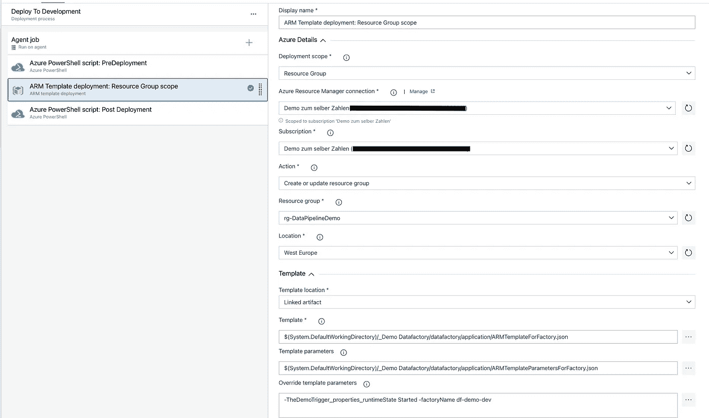

# Azure 数据工厂的持续部署

> 原文：<https://medium.com/codex/azure-data-factory-continuous-deployment-bd622e8086b3?source=collection_archive---------8----------------------->

约书亚·索蒂诺在 [Unsplash](https://unsplash.com/s/photos/digital-factory?utm_source=unsplash&utm_medium=referral&utm_content=creditCopyText) 上拍摄的照片

当将低代码平台 Azure Data Factory 用于 ETL 和其他数据工程目的时，持续集成您的进度仍然是一个好主意，尤其是在团队中工作时。此外，持续部署数据工厂的新版本，而不直接在生产系统中工作对于快速发展的企业来说是一个好的实践。怎么会？让我们深入研究一下。

# TL；博士；医生

使用 NPM 从数据工厂的协作分支和 bicep 文件创建 ARM 模板。自动构建基础设施，并使用构建管道将最新版本的协作分支部署到各种版本的 ADF。使用发布管道发布协作分支。

# 一般 CI/ CD

## 连续累计

CI 是将变更持续整合到您产品的当前主版本中的过程，它是一个应用程序、一个网页或一个数据库。这带来了一些影响，首先，断言产品以预期的方式运行是至关重要的，其次，如果这是一个团队项目，每个人都需要尽可能经常地为产品做出贡献。这本身就有两个问题，首先团队成员需要公开他们的工作，其次一些成员负责变更的集成。
使用 git 和特性分支工作流或 git-flow 工作流可以很容易地解决变更的集成和多个任务的并行开发。使用拉请求和一个维护者或一组维护者，可以在主版本中保证一定的质量水平。为了解决产品的质量问题，每个开发人员都应该断言他的代码是经过测试的。因此应该使用测试驱动设计(TDD)。

## 持续部署

当不断地将新特性集成到产品中时，下一个级别是在集成和构建之后立即部署这个最新版本(如果需要构建的话)。也许持续地只部署到测试或 UAT 环境是个好主意，这样可以让用户免受变化太快带来的不便。

为什么在 Azure 数据工厂中使用 CI/ CD，原因类似于为什么在数据库项目中使用 CI/ CD。当团队在数据驱动业务的数据工程部分工作时，使用 CI/ CD 有助于为业务提供新的见解，同时确保做出正确决策所需的质量水平。开发人员不应该在生产环境中工作，但是偶尔集成小的变化比集成大的新版本更容易。当一天多次集成新版本时，从开发环境中引入最新的变更可能是一项单调乏味的任务。下面是如何自动完成这项任务的过程。

# 然后为 CI/ CD 和先决条件生成通用工作流

在开始使用 Azure Data Factory 中的 CI 和 CD 之前，您需要设置一些东西。

1.  Azure 账户——很明显，如果你没有一个拥有 Azure 账户和订阅来创建 Azure 资源的微软账户，去[www.azure.com](http://www.azure.com/)注册。新账户 30 天免费 100 美元(无广告)。
2.  一个 Azure DevOps 组织，它通过一个用于数据工厂开发环境的 git 存储库链接到前面提到的 Azure 订阅。
3.  没有必要，但我建议您使用 Azure CLI (az)、git 和 Visual Studio 代码建立一个本地工作环境——后者或多或少是必要的，但您可以使用任何编辑器

# 代码应该如何流动

1.  在开发数据工厂中创建一个主协作分支。
2.  作为开发人员，创建一个新的特性分支来进行您想要的更改。
3.  为您的功能分支创建一个到主分支的拉请求。
4.  当 PR 被接受并合并到主分支中时，应该触发数据工厂的 ARM 模板的新构建，并且应该将主分支的当前状态部署到您使用的各种数据工厂环境中。
5.  主分支中定义的数据工厂的当前状态应该发布到开发数据工厂。
6.  获得批准后，新版本也应该部署到下一阶段，无论是 UAT 还是生产。在下面的例子中，它将被立即发布到生产环境中。

## 建立基础设施

首先，我们需要创建必要的基础设施、数据工厂环境和代码存储库。

## 首先是代码库

第一步是创建一个至少有一个存储库的新 Azure DevOps 项目。这需要使用不同于 bicep 的 IaC 解决方案或手动完成。对于开发环境，建议您的数据工厂只使用一个存储库。这是因为主开发分支的最新版本将被部署到所有其他环境中。另外，你需要一些并行处理能力来运行管道。确保至少处于并行处理的空闲层，或者准备好处理资源即服务或您的自托管构建环境。

## 使用 bicep 设置开发数据工厂

从使用 bicep 作为 IaC 工具创建 Azure 数据工厂开始。Bicep 可以用来定义数据工厂的各个部分，但是在第一个演示中，只有工厂本身和 git 集成是在 bicep 文件中定义的

更多信息请参考微软[。数据工厂](https://docs.microsoft.com/en-us/azure/templates/Microsoft.DataFactory/factories?tabs=bicep)

## 构建 ARM 模板所需的文件

由于 node.js 和 npm 用于为数据工厂创建 ARM 模板，因此需要一个 package.json 文件来告诉 npm 要做什么。它引入了对 ADFUtilities NPM 包的依赖，并定义了创建 ARM 模板的构建脚本。
这里也可以添加一个验证脚本，在构建之前首先验证模板。

NPM 包配置文件

接下来，需要一个 publish_config.json 文件来定义所创建的数据工厂的 publish_branch。

最后但同样重要的是，需要一个 ARM 模板定义文件。这个定义文件可以用来配置关于数据工厂的各种东西，在这个例子中，是一个最小版本，只包含工厂名称作为参数。

# Azure 数据工厂的 CI 部分

持续集成是每个团队成员尽可能频繁地提交到主分支的实践。有时它被称为每日提交到 main。我们的目标是让每个人和每个工作环境尽可能保持最新。

如前所述，特性分支流与拉请求结合使用，以使每个开发人员尽可能频繁地提交数据工厂的主版本。当这些 PRs 合并时，数据工厂的新版本应该对工厂的所有版本都可用，比如开发、测试、UAT 和生产，或者您需要的许多不同的环境。

这是通过 Azure DevOps 管道完成的，准确地说是构建管道。

首先创建一个空的构建管道，然后添加最后包含的脚本来创建、构建和部署 Azure 数据工厂。让我们一步一步来

1.  在完成构建 ARM 模板的步骤之前，它定义了为主分支中的每个提交启动构建管道，如果您愿意，您可以切换到任何其他发布分支。此外，它将最新的 ubuntu 映像用于构建过程，将两个变量用于工作目录和要使用的订阅
2.  管道从构建阶段的步骤开始
3.  在步骤 1 和 2 中，安装了 node.js 和 npm
4.  步骤 3 使用 ADFUtilities NPM 包验证工件
5.  步骤 4 使用 ADFUtilities npm 包创建要部署的 arm 模板
6.  步骤 5 和 6 使用 bicep 来创建基于 ARM 模板和 bicep 文件的数据工厂
7.  在开发阶段的工件文件夹中创建工件之后，这些工件被部署到开发数据工厂。
8.  最后但同样重要的是，主分支的最新版本也被部署到生产 ADF。请注意，要部署到的工厂名称是通过 stage 中的变量定义的，该变量引用 arm_templates_parameters.json 中给出的参数。

# Azure 数据工厂的 CD 部分

现在，由于我们在所有的数据工厂环境中都有相同的主版本，我们希望或者不希望一旦新版本可用，就将所有内容发布到每个工厂。因此，使用了释放管道。发布管道完成发布部分，这可以通过点击 Azure Data Factory 开发前端的发布按钮来手动触发。为了消除手动发布新版本到测试环境的必要性，发布管道也用于发布到开发数据工厂。
首先，新构建的数据工厂版本作为工件下载，然后发布到测试/开发环境。在测试/开发阶段获得批准后。该版本将被推送到 UAT，然后进行生产，或者如本演示所示，直接投入生产。
如果你愿意，你可以把你的新版本立刻发布到 Dev、UAT 和 Prod 上，这取决于你如何在发布管道中设置触发器。

下载工件，部署到开发，最后但并非最不重要的是在批准后投入生产

这里显示发布管道由三个步骤组成

1.  下载神器
2.  将当前主分支发布到开发数据工厂
3.  将当前主分支发布到生产数据工厂

正在进行的任务

# 下载神器

第一步超级简单。这里只需要指定先前创建的工件。此外，可以在这里指定连续部署触发器或调度。

下载神器

# 部署到开发和生产

开发和生产环境的部署都由任务组成。两个 Azure Powershell 任务和一个 ARM 模板部署任务

首先运行预先部署的 PowerShell 脚本，同时从工件中传递数据工厂名称、资源组名称和要使用的模板的参数。

预部署配置设置

接下来，运行 arm 模板部署，确保覆盖必要的参数。

实际部署的配置

最后但同样重要的是，运行部署后脚本，同样需要给出数据工厂名称、资源组和模板的参数。立正！附加参数 preDeployment 必须设置为$false。

部署后脚本的配置

# 包裹

在本文中，展示了如何以 DevOps 风格为数据工厂建立开发和部署流程，实现持续集成和持续部署。在这个例子中使用了微软推荐的方法，也有其他方法，例如使用 terraform。给定的模板和示例可以很容易地扩展以用于您的特定应用程序。请注意，您必须在管道中指定几个参数。发布管道中的参数是在 Azure DevOps 的前端指定的，在我看来这并不理想，因为将一切都作为代码的范式已经被打破了。
喜欢文章，就留个掌声。如果你想了解更多关于 Azure 数据工厂、持续集成和数据工程的知识，请发表评论、提出问题或订阅。

如果这篇文章对您有帮助，请考虑:

# 来源

https://en.wikipedia.org/wiki/Continuous_integration

[https://docs . Microsoft . com/en-us/azure/data-factory/continuous-integration-deployment-improvements](https://docs.microsoft.com/en-us/azure/data-factory/continuous-integration-deployment-improvements)

 [## 微软。数据工厂/工厂-二头肌和手臂模板参考

### 工厂资源类型可以部署到:资源组。要了解资源组部署，请参阅 Bicep…

docs.microsoft.com](https://docs.microsoft.com/en-us/azure/templates/microsoft.datafactory/factories?tabs=bicep) 

# 完整的管道