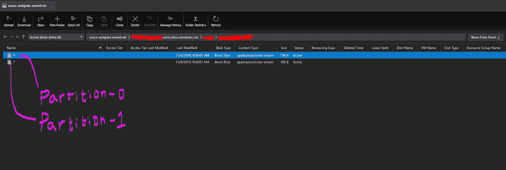

# Azure 函数 Eventhub 触发器:检查点

> 原文：<https://medium.com/codex/azure-function-eventhub-trigger-checkpoint-12d5c2e48778?source=collection_archive---------3----------------------->

## [法典](http://medium.com/codex)

在这篇文章中，我将谈论 Azure 函数 EventHub trigger，它实际上是引擎盖下的检查点，最后，你可以如何轻松地从头开始阅读它。所以，让我们开始吧…

**Azure function:** It 是一个无服务器解决方案，支持多种类型的输入和/或输出绑定。其中一个输入绑定是 EventHub 触发器。使用这个输入绑定，用户可以用更少的代码从 EventHub 中读取事件/消息。

**检查点:**检查点有什么大惊小怪的。为什么它很重要？嗯，检查点理论上是一种机制，每个消费者通过它存储最后读取的事件位置。一旦存储了检查点，当函数下次触发时，它将实际从最后存储的检查点读取。而且，如果您搞砸了这个检查点文件，事情可能会变得非常糟糕。

现在，您可以想象每个消费者可能都有自己存储检查点的方式——甚至可以选择存储在 SQL 数据库中。但是，azure function EventHub 触发器扩展实际上将存储帐户中的检查点(即应用程序设置 AzureWebJobsStorage 的值)作为名为“ *azure-webjobs-eventhub”的容器下每个分区的 blob 文件。*

请参考下面的示例截图，其中有 2 个 blobs，每个分区一个。是的，你没看错——如果 Eventhub 有 10 个分区，那么就有 10 个 blob 文件。

检查点 blob 文件

所以，我们来说重点。如何移除检查点并从头开始读取事件。答案很简单:

1.  停止 Azure 函数 app，等待租赁状态为空
2.  转到存储帐户下的 *azure-webjobs-eventhub* 容器
3.  导航至您感兴趣的 <eventhub namespace="">/</eventhub>
4.  选择所有斑点并删除
5.  最后…启动功能

干得好的..您现在已经学会了如何删除检查点以从头开始读取…

请记住，删除这个检查点 blob 文件意味着您将再次读取相同的消息，并可能复制下游系统。在生产环境中练习时，请格外小心。

暂时就这样了。请随时发表您的评论/问题:)