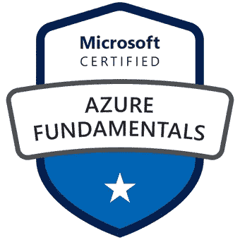
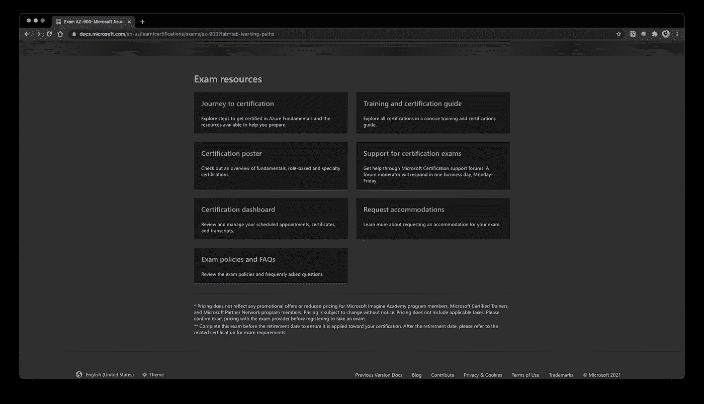
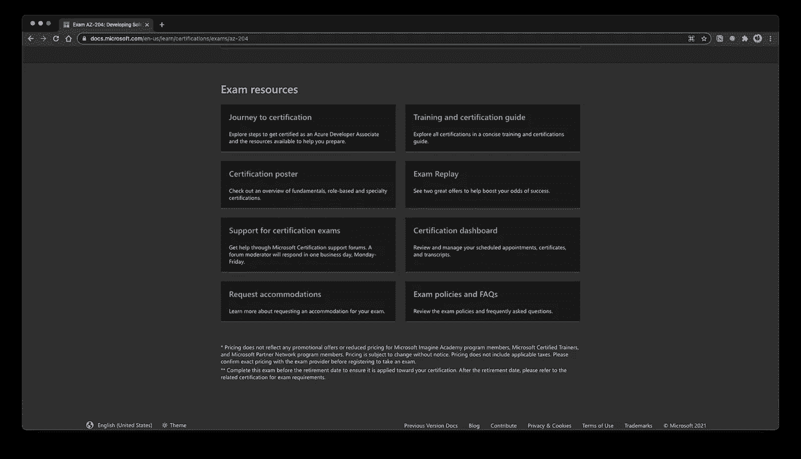
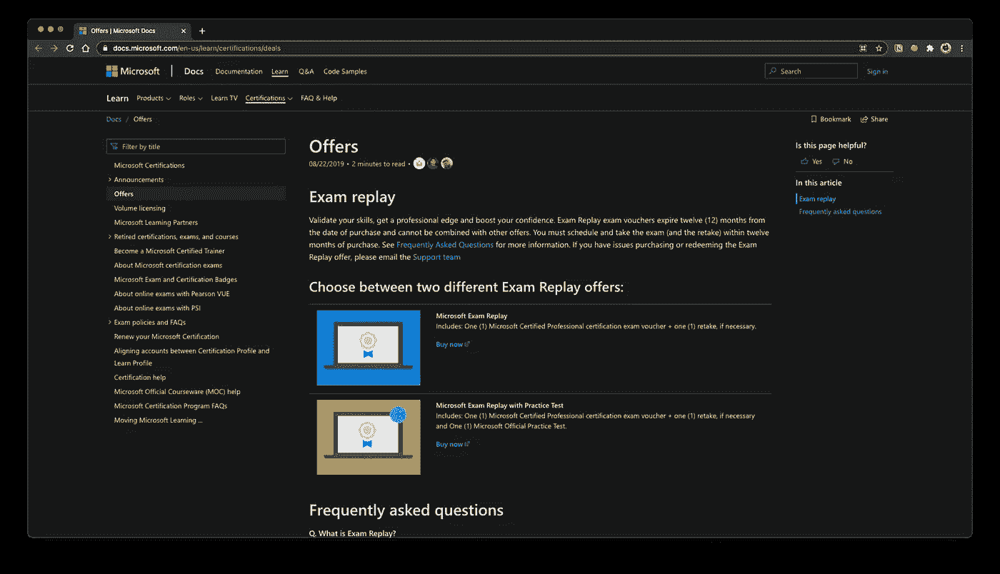
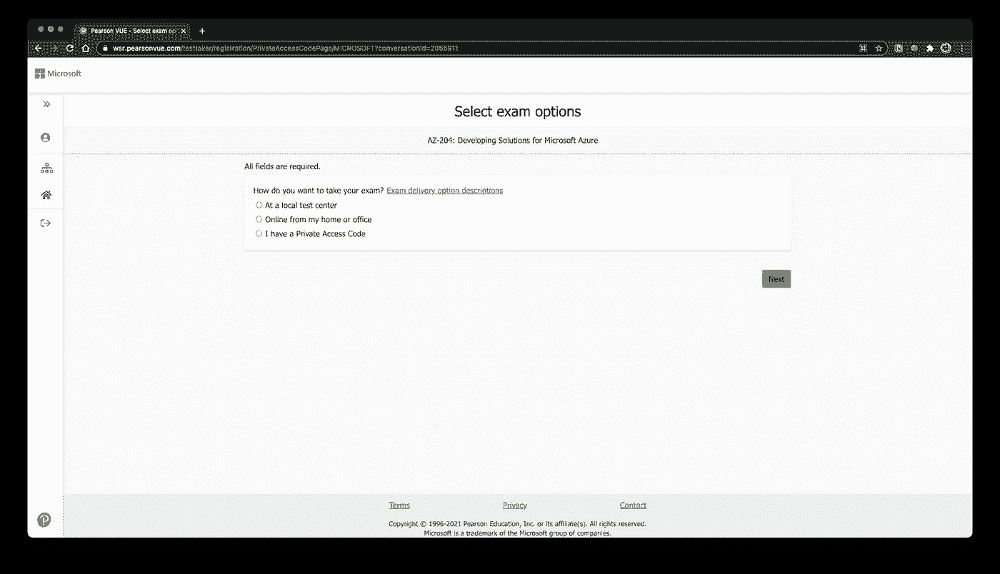
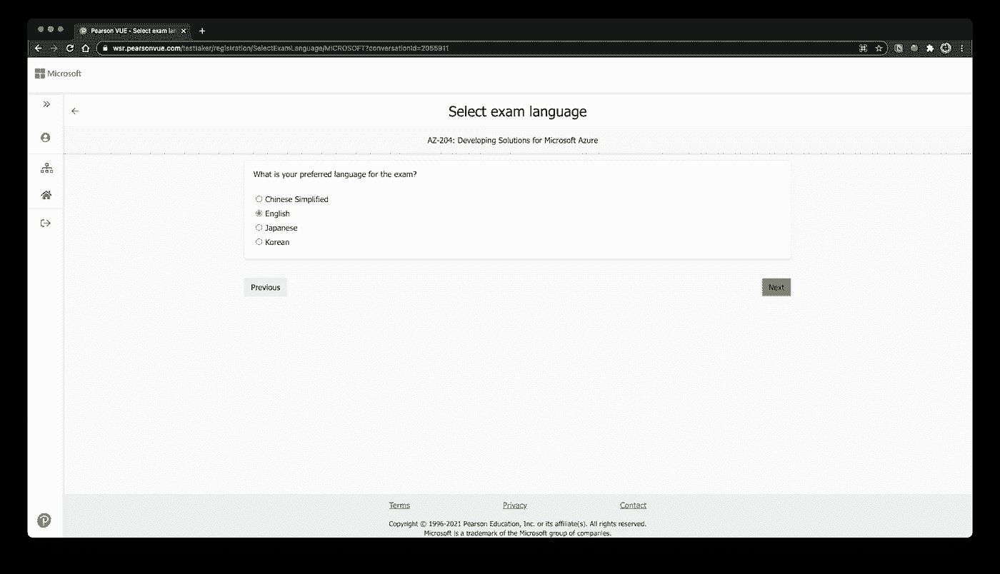
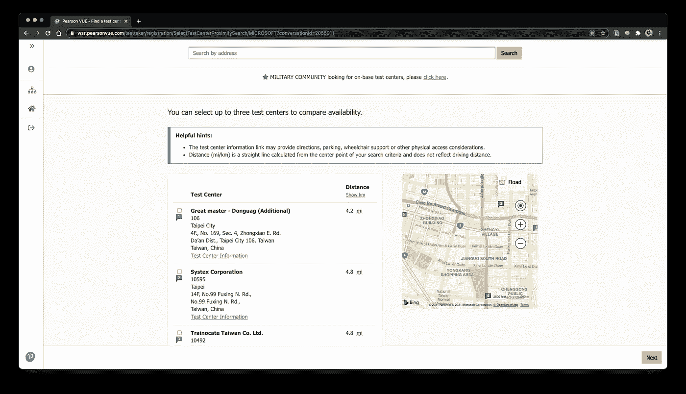
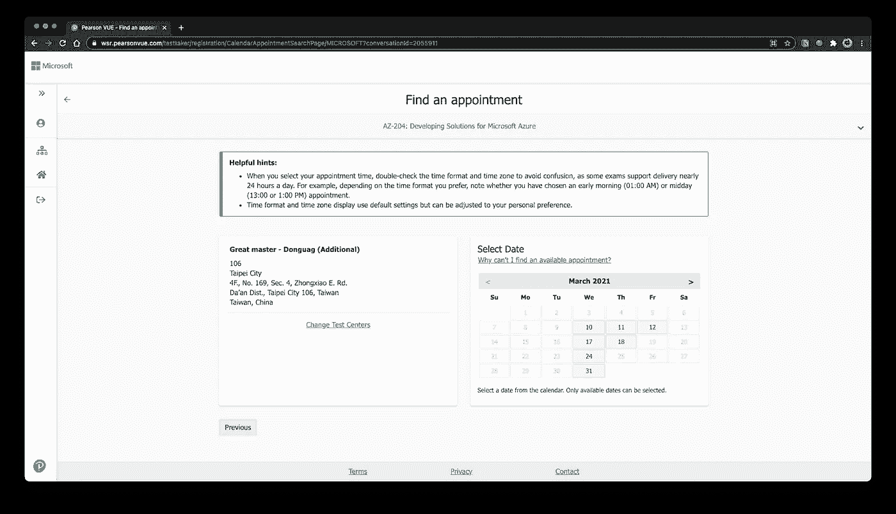

# Azure 基础知识(AZ-900)证书

> 原文：<https://medium.com/codex/azure-fundamentals-az-900-certificate-9f2f4fa57d42?source=collection_archive---------15----------------------->

## [法典](http://medium.com/codex)

## 关于 AZ-900 你应该知道的一切。



Azure 基础知识徽章

```
**Table of Contents*** About Virtual Training
    * What is virtual training?
    * Should I go for it?
* Preparation
    * Must-have
    * Optional
* Registration
* About the exam
    * In general
    * The types of the questions
    * Frequent questions in the exam
* Q&A
    * What’s the minimum score to pass the exam?
    * Does the certificate useful?
    * What if I’m just a beginner in Azure?
    * Next step?
```

# 关于虚拟训练

## 什么是虚拟训练？

虚拟培训是学习 Azure 的在线课程，对于 AZ-900，虚拟培训需要 2 天，每天 3 小时。

## 我应该去吗？

我会说这取决于你的经历，如果:

*   你有其他云服务提供商(如 AWS，GCP)的相关经验，或者你已经在使用 Azure。
*   ***你有时间去跑一跑微软推荐的*** [***学习路径***](https://docs.microsoft.com/en-us/learn/certifications/exams/az-900) 。

否则，就把钱存起来。该课程主要讲述学习路径中的内容，除了有时演讲者会 ***突出一些关键词*** 。

# 准备

在 [Azure 基础考试](https://docs.microsoft.com/en-us/learn/certifications/exams/az-900)页面上有大量的资源，让我们大致了解一下:

## 必备的

*   衡量技能:了解每个部分在你的分数中是如何发生的很好，特别是如果你喜欢尝试，花更多时间学习如何设置 ***存储帐户*** 会很好。
*   学习路径:你可以在学习路径中找到几乎 80%的问题答案。
*   在线资源:Azure 现在很受欢迎，你可以找到很多关于考试的问题。做一些，然后你就不会紧张，当你去真正的。

## 可选择的

*   考试资源:让你知道通过考试后的下一步是什么，比如 AZ-204 (Azure Developer Associate)。

> 注:部分考试提供**考试回放**，即如果考试不及格，可以免费重考一次。(但对于 **AZ-900 没有考试回放**)



AZ-900 考试资源



AZ-204 考试资源



考试回放(右)

*   连接:问一些朋友关于考试的事情，特别是你知道 ***微软 MVP*** 的话，他们有很多学习资料。

# 登记

通常，你可以使用皮尔逊 VUE 做注册。如果您是第一次使用它，您需要填写您的个人信息，然后将开始进行考试注册。

> 注意:下面的截图是为了演示如何选择台湾的**当地考点**，但大多数国家都是一样的流程。

*   选择考试选项(本地考试中心或如果您喜欢在家)



*   选择考试语言(推荐英语)



*   选择您想要的本地考试中心



*   选择日期



> 注意:如果你喜欢在家考试，你必须遵守规定，比如你不能有任何东西在你身边，并且有一个人一直看着你，去[这里](https://docs.microsoft.com/en-us/learn/certifications/online-exams)查看细节。

# 关于考试

## 通常

大多数问题都是情景问题，例如:

```
Recommend a solution to ensure that some of the servers are available if a single Azure data center goes offline for an extended period. What should you include in the recommendation?
```

或者:

```
An Azure administrator plans to run a PowerShell script that creates Azure resources. You need to recommend which computer configuration to use to run the script.Solution: Run the script from a computer that runs Linux and has the Azure CLI tools installed.Does this meet the goal?
```

如果你阅读了学习路径中的所有模块，这是很好的，有很多例子可以让你练习，比如“如果情况 A，B 和 C 哪个更好？”

## 问题的类型

*   对-错项目
*   多项选择问题
*   多项选择问题
*   比赛

## **考试常见问题**

*   什么是区域、可用性区域和可用性集。
*   比较使用 CLI、门户和云 shell 的最佳时机。
*   SaaS、PaaS 和 IaaS 之间的区别(记住要知道每个服务属于哪种服务。)
*   自由计划、开发计划和企业计划之间的区别。

# 问与答(Question and Answer)

## **通过考试的最低分数是多少？**

700/1000.

## 问:证书有用吗？

对我来说(注:我在台湾)，我会说认证给我带来了什么:

*   LinkedIn 查看者和邀请，还有， ***更多的招聘者提供面试机会*** 。
*   系统地学习 Azure*。*
*   *学习路径中的案例研究让你知道在现实世界中应该做什么。*

*还有最重要的， ***增加学习的动力*** 。我想说微软在这方面做得很好，在你清除模块的过程中，你还会获得 ***exp*** ，你做得越多，它显示的 exp 越高，就像你在升级一样。*

## ***问:如果我只是 Azure 的初学者呢？***

***就这么做**。AZ-900 更像是 Azure 的基础证书，问题大多集中在 Azure 的基础知识上，所以请记住，当你在做学习路径 时， ***可以在服务上玩一玩，这样就没事了，不用担心。****

## ***问:下一步？***

*微软设计的官方路径是[Azure Developer Associate](https://docs.microsoft.com/en-us/learn/certifications/azure-developer/)，需要通过[为微软 Azure 开发解决方案](https://docs.microsoft.com/en-us/learn/certifications/exams/az-204)，我也在学习当中。*

*到目前为止，对于这项研究，AZ-204 的学习路径更像是:*

*   *基于 AZ-900 中提到的服务的实现的详细说明。*
*   *关注每个服务之间的联系。*

*一旦我清理了 AZ-204 的所有学习路径，我会在 Medium 上分享更多细节。👊*