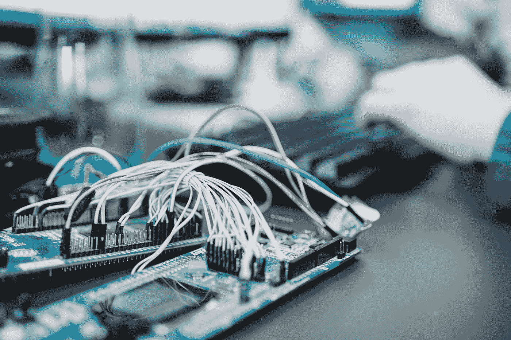

# Azure 物联网基础知识

> 原文：<https://medium.com/codex/azure-iot-fundamentals-9308eb48e8d2?source=collection_archive---------17----------------------->

云计算最好的特性之一就是物联网。物联网是 it 的缩写，物联网可以定义为“一个由相互关联的计算设备、机械和数字机器、物体、动物或人组成的系统，具有唯一标识符(uid)和通过网络传输数据的能力，无需人与人或人与计算机的交互。”根据网站上的说法…