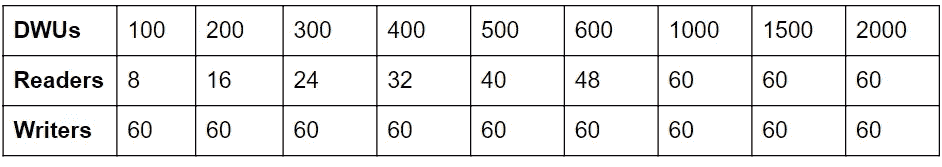
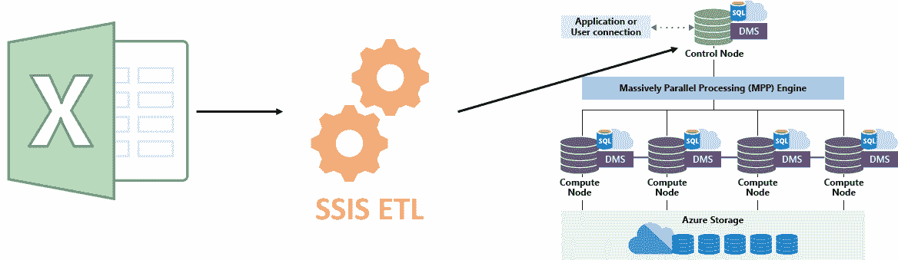
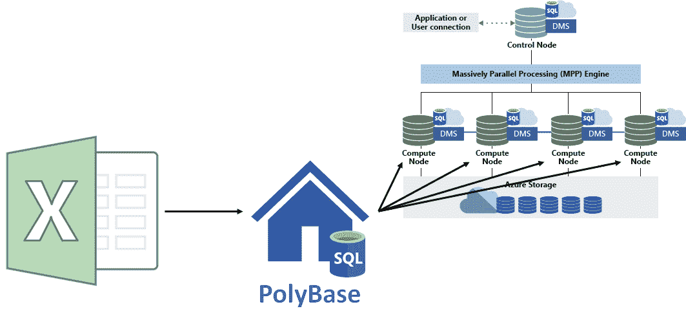

# Azure Synapse 分析—数据迁移

> 原文：<https://medium.com/codex/azure-synapse-analytics-data-migration-f5258e592722?source=collection_archive---------7----------------------->


雅利安·辛格在 [Unsplash](https://unsplash.com?utm_source=medium&utm_medium=referral) 上的照片

*本文由 Betacom 分析和创新团队撰写。Betacom 是一家总部位于意大利和德国的公司，在 IT 领域使用创新技术、数字解决方案和尖端编程方法开展业务。你可以在我们的* [*网站*](https://betacom.eu/) *了解更多。*

# 介绍

在本文中，我们将讨论如何将数据迁移到 Azure Synapse Analytics。我们假设您已经熟悉 Azure Synapse 分析服务。如果没有，请参考我们之前的文章:[Azure Synapse Analytics 简介](/betacom/introduction-to-azure-synapse-analytics-78a1ca9ec8b0)和[Azure Synapse Analytics 中的专用 SQL 池](/betacom/dedicated-sql-pools-in-azure-synapse-analytics-1daa66608b3b)。

# 概观

Azure Synapse Analytics 使用线程并行读取数据(DW 读取器)并将其发送到编写器线程(DW 编写器)。

您应该意识到的第一件事是，您的 dwu 对您并行加载数据的速度有直接影响。下表总结了 dwu、DW 读取器和 DW 写入器之间的关系:



让我们看看你应该遵循的一些最佳实践。

*   优化插入批次大小。理想的大小应该是 100 万行，因为它可以很好地压缩和处理列存储段(即列存储索引归档单元)。
*   避免使用有序数据，因为它们会减慢处理速度。事实上，按分布键排序的数据可能会引入热点，从而降低加载操作的速度。
*   通过“CREATE TABLE #temp_table”命令使用临时堆表。
*   使用“创建表格为”。它的日志记录最少，允许完全并行操作，并允许更改分布、表类型和分区。

# 加载方法

两种主要的加载方法是单客户端和并行读取器。

**单客户端**加载方法使用 SSIS(SQL Server Integration Services)、Azure Data Factory 和 BCP (Bulk Copy Program)等工具。请注意，并行增加容量会导致控制节点出现瓶颈。这意味着您不应该将它用于大型数据。



来源:[专用 SQL 池(以前的 SQL DW)架构— Azure Synapse Analytics](https://docs.microsoft.com/en-us/azure/synapse-analytics/sql-data-warehouse/massively-parallel-processing-mpp-architecture)

**并行读取器**加载方法使用 PolyBase 从外部源(Azure Blob 存储或 Azure 数据湖存储)读取数据，并加载到 Azure SQL DW 中。PolyBase 跳过控制节点，直接加载到计算节点。它可以从 UTF-8 分隔的文本文件和流行的 Hadoop 文件格式(如 RC 文件、ORC 和 Parquet)加载数据。



来源:[专用 SQL 池(原 SQL DW)架构——Azure Synapse Analytics](https://docs.microsoft.com/en-us/azure/synapse-analytics/sql-data-warehouse/massively-parallel-processing-mpp-architecture)

# PolyBase 演示

在本节中，我们将讨论如何使用 PolyBase 将维度表从内部 SQL Server Management Studio 加载到 Azure Synapse 专用 SQL 池。

使用 PolyBase 迁移数据的步骤如下:

1.  将表格从 SSMS 导出到平面文件中；
2.  创建一个 blob 存储帐户；
3.  将平面文件加载到 blob 存储中；
4.  设置聚合碱；
5.  监控并确认迁移成功；
6.  确认 60 个分配进入最终表。

下面我们来详细看看。

**将表格导出到平面文件**(参见 SQL Server 导入和导出向导中的[步骤)](https://docs.microsoft.com/en-gb/sql/integration-services/import-export-data/steps-in-the-sql-server-import-and-export-wizard?view=sql-server-ver15)

1.  登录到 SQL Server Management Studio。
2.  右击数据库，进入*任务*，选择*导出数据*。这将打开 *SQL Server 导入和导出向导*。
3.  选择“SQL Server Native Client”作为数据源，并检查服务器名称和数据库是否正确。
4.  点击下一个的*，选择“平面文件目的地”作为目的地，并选择文件名。请确保根据您的数据选中或取消选中“第一个数据行中的列名”。*
5.  点击下一个的*，选择您需要的选项。如果您需要在将数据导出到平面文件时过滤数据，您可能需要“编写查询”选项。*
6.  点击下一个的*并选择您想要导出的表格。将其他设置保留为默认设置。*
7.  点击下一个的*并选择“立即运行”(如果您只需要立即导出表格)。否则，您可以创建一个 SSIS 过程来计划导出。这将不会在本教程中涉及。点击下一个*的*，然后点击*完成。**

**创建 blob 存储帐户** 所有步骤都可以在[创建存储帐户— Azure 存储](https://docs.microsoft.com/en-gb/azure/storage/common/storage-account-create?tabs=azure-portal)中找到。它们可以总结如下:

1.  登录[蔚蓝门户](https://portal.azure.com/)；
2.  在 Azure portal 菜单上，选择*所有服务*，然后在资源列表中选择*存储帐户*；
3.  选择*添加*；
4.  根据您的需要填写创建表单，并选择*创建*。

**将平面文件加载到 blob 存储中** 有两种方法:直接加载到一个新的容器中，或者从存储资源管理器中加载，这是 Azure 的一个免费工具，你可以在这里找到。通过存储资源管理器加载平面文件的教程可从[这里](https://docs.microsoft.com/en-us/azure/machine-learning/team-data-science-process/move-data-to-azure-blob-using-azure-storage-explorer)获得。

**设置聚合库** 转到专用 SQL 池，按照下面的步骤操作。为了方便起见，所有步骤在[和](https://gist.githubusercontent.com/efontana10/715be1330618d1254d68483bb562c4e5/raw/724016ae394d884681dc250b713d1f1edb3a3cb9/Setting_PolyBase.sql)处都可用。

1.  通过执行`CREATE MASTER KEY; GO`创建主密钥。在下一步中，需要主密钥来加密凭据机密。
2.  创建数据库范围的凭据。通过插入任何字符串作为“IDENTITY”(它不用于 Azure 存储的身份验证)和您的 Azure 存储帐户密钥作为“SECRET”来填充查询。
    `CREATE DATABASE SCOPED CREDENTIAL BlobStorageCredential
    WITH
    IDENTITY = '',
    SECRET = '' ;
    GO`
3.  创建外部数据源。在“位置”字符串中插入“wabs://CONTAINER_NAME @ STORAGE _ ACCONT _ NAME . blob . core . windows . net ”,其中 CONTAINER _ NAME 和 STORAGE _ account _ NAME 分别是您的容器和存储帐户名称。还要注意，PolyBase 使用 Hadoop APIs 来访问数据。
    `CREATE EXTERNAL DATA SOURCE AzureBlobStorage
    WITH (
    TYPE = HADOOP,
    LOCATION = '',
    CREDENTIAL = BlobStorageCredential
    );`
4.  创建外部文件格式。执行以下查询，其中`FIELD_TERMINATOR`标记分隔文本文件中每个字段(列)的结尾，`STRING_DELIMITER`指定文本分隔文件中字符串类型数据的字段终止符，`DATE_FORMAT`指定可能出现在分隔文本文件中的所有日期和时间数据的自定义格式，`USE_TYPE_DEFAULT`存储缺失值作为数据类型的默认值。
    `CREATE EXTERNAL FILE FORMAT CSVFileFormat
    WITH (
    FORMAT_TYPE = DELIMITEDTEXT,
    FORMAT_OPTIONS
    ( FIELD_TERMINATOR = ','
    , STRING_DELIMITER = ''
    , DATE_FORMAT = 'yyyy-MM-dd HH:mm:ss'
    , USE_TYPE_DEFAULT = FALSE )
    );
    GO`
5.  创建外部表。下面是以下查询中每个字段的含义:
    `LOCATION`是数据湖存储根文件夹下的文件夹，
    `DATA_SOURCE`指定使用哪个数据源对象，
    `FILE_FORMAT`指定使用哪个文件格式对象，
    `REJECT_TYPE`指定如何处理被拒绝的行(`VALUE`或占总数的百分比)，
    `REJECT_VALUE`根据拒绝类型设置拒绝值。
    现在插入您的位置和表格的列，并执行查询:
    `CREATE SCHEMA [stage]; GO;
    CREATE EXTERNAL TABLE [stage].tableName (
    [columnName] [columnType] (NOT) NULL
    ...
    )
    WITH
    ( LOCATION = ''
    , DATA_SOURCE = AzureBlobStorage
    , FILE_FORMAT = CSVFileFormat
    , REJECT_TYPE = VALUE
    , REJECT_VALUE = 0
    )
    GO`
6.  从外部表加载。CTAS (CREATE TABLE AS)创建一个新表，并用 select 语句的结果填充它。新表与 select 语句的结果具有相同的列和数据类型。如果从外部表中选择所有列，则新表是外部表中列和数据类型的副本。执行以下查询，将“tableName”替换为您的表的名称，将“hashColumn”替换为用于 has 分布的列。
    `CREATE SCHEMA [prod];
    GO;
    CREATE TABLE [prod].[tableName]
    WITH ( DISTRIBUTION = HASH([hashColumn]) )
    AS SELECT * FROM [stage].[tableName]
    OPTION ( LABEL = 'Load [prod].[tableName]' );`
7.  默认情况下，表被定义为聚集列存储索引。
    加载完成后，一些数据行可能不会被压缩到 columnstore 中。为了在装载后优化查询性能和列存储压缩，需要重新构建表，以强制列存储索引压缩所有行:`ALTER INDEX ALL ON [prod].[tableName] REBUILD;`
8.  验证行数:`SELECT COUNT(1) FROM [prod].[tableName];`

**监控并确认迁移成功** 在上一个步骤中从外部表加载时，您可以执行以下查询来监控迁移。

```
SELECT * 
  FROM sys.dm_pdw_exec_requests r 
  JOIN sys.dm_pdw_dms_workers w on r.request_id = w.request_id
WHERE r.[label] = 'Load [prod].[tableName]'
ORDER BY w.start_time desc;
```

在查询结果中，您会发现一个显示“作家”的`type`列，因为该查询指的是加载操作。也正好有 60 行，对应于 60 个写入器。

**确认 60 个分布进入最终表** 我们可以验证数据是否被加载到 60 个分布:`DBCC PDW_SHOWSPACEUSED('prod.tableName')`。事实上，该查询正好返回 60 行，并告诉我们在每个分布中分配了多少行。

# 结论

现在，您应该能够将表从本地 SSMS 迁移到 Azure Synapse Analytics 中的专用 SQL 池。我们建议遵循 Microsoft 网站上提供的其他教程。

感谢您的阅读🙏并订阅 [Betacom 出版物](https://medium.com/betacom)💡