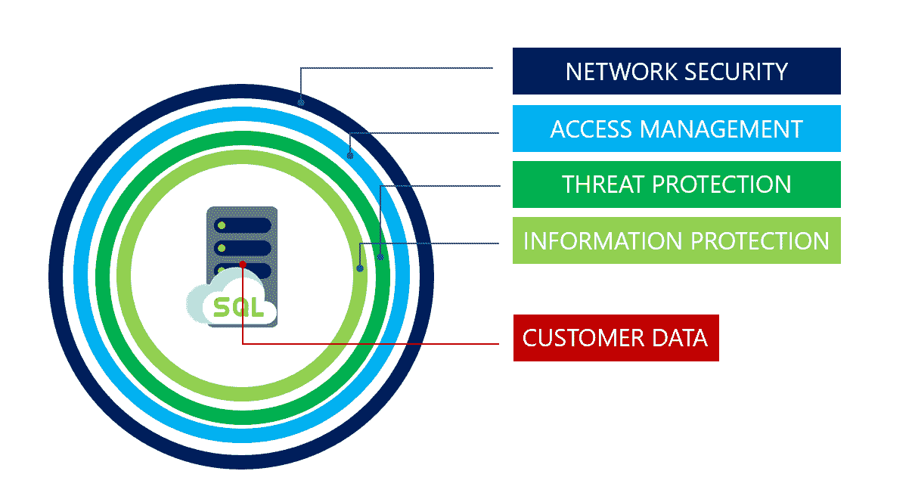
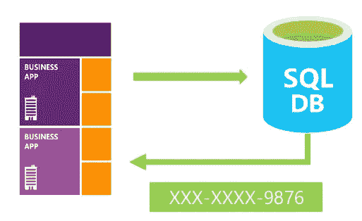

# Azure Synapse 分析—安全功能

> 原文：<https://medium.com/codex/azure-synapse-analytics-security-capabilities-3cc3f9eccece?source=collection_archive---------0----------------------->

照片由[弗兰克](https://unsplash.com/@franckinjapan?utm_source=medium&utm_medium=referral)在 [Unsplash](https://unsplash.com?utm_source=medium&utm_medium=referral) 上拍摄

*本文由 Betacom 分析和创新团队撰写。Betacom 是一家总部位于意大利和德国的公司，在 IT 领域使用创新技术、数字解决方案和尖端编程方法开展业务。你可以在我们的* [*网站*](https://betacom.eu/) *了解更多。*

# 介绍

开发企业数据仓库解决方案需要仔细的安全检查，以防止和解决可能出现的威胁。Azure Synapse Analytics 提供全面的安全模型来保护多个层上的数据。在本文中，我们将探索 Azure Synapse 提供的安全特性。

# 安全性概述

Azure Synapse 分析安全系统建立在四级安全检查的基础上，如下图所示。

来源:[安全概述— Azure SQL 数据库& Azure SQL 托管实例](https://docs.microsoft.com/en-gb/azure/azure-sql/database/security-overview)

我们来详细看看每一级负责什么。

**网络安全**级别使用 SQL 防火墙和虚拟网络规则验证只有有效的地址才能访问数据仓库。第一种基于每个请求的源 IP 地址授予访问权限，而第二种则允许数据库只接受从虚拟网络内选定子网发送的通信。

**访问管理**级管理认证过程，即证明用户身份的过程。Azure Synapse Analytics 支持两种类型的身份验证:

*   SQL 认证，即使用用户名和密码的连接；
*   Azure Active Directory 身份验证，使用 Azure Active Directory 中的身份。这种方法允许管理员集中管理所有数据库用户的身份和权限。这带来了几个好处，例如最小化密码存储和集中式密码轮换策略。

术语**授权**指的是在数据库中分配给用户的权限，它决定了允许(不允许)用户做什么。通过向数据库角色添加用户帐户来控制权限。然后，管理员可以为每个角色分配数据库级权限，并授予每个用户特定的对象级权限。Azure Synapse Analytics 还支持行级安全性，这使客户能够根据执行查询的用户的特征来控制对数据库表中行的访问。

最后，**威胁防护**级别寻找可疑模式。启用后，高级威胁防护会分析日志，以检测异常行为和潜在的有害访问和/或利用数据库的企图。当检测到可疑活动时，会创建警报，并且可以从 [Azure 安全中心](https://azure.microsoft.com/services/security-center/)查看所有详细信息，在那里您还可以找到进一步调查的建议以及减轻威胁的措施。可以为每台服务器启用高级威胁防护，但需要额外付费。

你可以在[这个链接](https://docs.microsoft.com/en-gb/azure/azure-sql/database/security-best-practice)找到所有微软的建议和最佳实践。

# 数据保护和加密

回想一下，在 Azure Synapse Analytics 中，数据可以是静止的，也可以是运动的。事实上，正如我们在以前的文章中讨论的那样(Azure Synapse Analytics | Betacom 中的专用 SQL 池)，数据移动服务在节点之间移动数据，以允许并行执行查询。根据当前状态，数据由传输层安全加密(针对动态数据)或透明数据加密(针对静态数据)进行加密。

**传输层安全性** (TLS)允许 Azure Synapse Analytics 通过在移动中加密客户数据来保护客户数据。这确保了所有数据在客户端和服务器之间“传输”时都被加密。

最佳做法是，在应用程序使用的连接字符串中，您应该指定一个加密的连接，并且不要信任服务器证书。这将迫使您的应用程序验证服务器证书，从而防止应用程序受到中间人类型的攻击。

请注意，某些非 Microsoft 驱动程序可能在默认情况下不使用 TLS，或者依赖于旧版本的 TLS (<1.2)才能运行。在这种情况下，服务器仍然允许您连接到数据库。但是，Microsoft 建议评估允许此类驱动程序和应用程序连接到 SQL 数据库的安全风险，尤其是在存储敏感数据的情况下。

**透明数据加密** (TDE)可以手动启用，通过加密静态数据来帮助保护 Azure Synapse Analytics 免受恶意离线活动的威胁。它对数据库、相关备份和静态事务日志文件执行实时加密和解密，而无需对应用程序进行更改。

TDE 使用称为数据库加密密钥(DEK)的对称密钥对整个数据库的存储进行加密。数据库启动时，加密的 DEK 被解密，然后用于 SQL Server 数据库引擎进程中数据库文件的解密和重新加密。DEK 由 TDE 保护器保护，该保护器是服务管理的证书(服务管理的 TDE)或者存储在 Azure Key Vault 中的非对称密钥(客户管理的 TDE)。TDE 保护程序是在服务器级别设置的，由与该服务器关联的所有数据库继承。

Azure Synapse Analytic 保护您的数据的另一种方式是**动态数据屏蔽** (DMM)。它通过对非特权用户屏蔽敏感数据来限制敏感数据的暴露。DMM 自动发现潜在的敏感数据，并提供可行的建议来屏蔽这些字段，对应用层的影响最小。它的工作原理是对指定数据库字段的查询结果集中的敏感数据进行模糊处理，而数据库中的数据不变。请注意，它在数据库级别上起作用，因此对应用程序没有影响。

来源:[安全概述— Azure SQL 数据库& Azure SQL 托管实例](https://docs.microsoft.com/en-gb/azure/azure-sql/database/security-overview)

屏蔽功能是一组控制不同场景的数据公开的方法。下面列出了不同种类的屏蔽。

*   默认屏蔽是根据指定字段的数据类型的完全屏蔽。
*   信用卡屏蔽暴露了该列的最后四位数字，例如 0000–0000–0000–1234 变成了 XXXX-XXXX-XXXX-1234。
*   电子邮件掩码显示第一个字符，并用 XXX.com 替换域名，例如 fake-email@betacom。它变成了 fXXXXXXXXX@XXXX.com。
*   随机数掩码用随机值替换所有内容。
*   自定义文本屏蔽公开第一个和最后一个字符，并在中间添加自定义填充字符串。

# 结论

在本文中，我们讨论了 Azure Synapse Analytics 如何保护您的数据。更多细节请参考微软官方[文档](https://docs.microsoft.com/en-gb/azure/azure-sql/database/security-overview)。

请订阅 [Betacom 出版物](https://medium.com/betacom)👏如果你有任何问题，请留言。