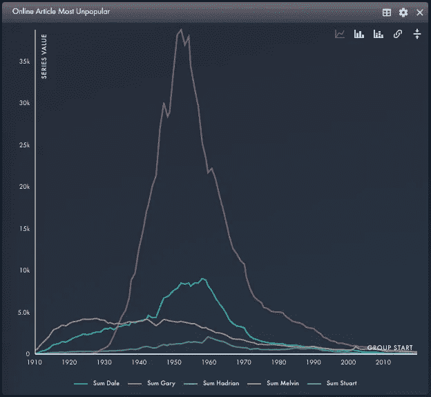
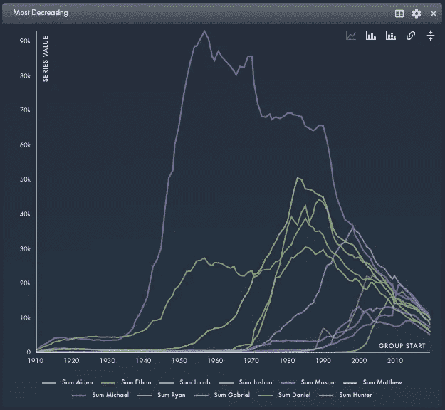
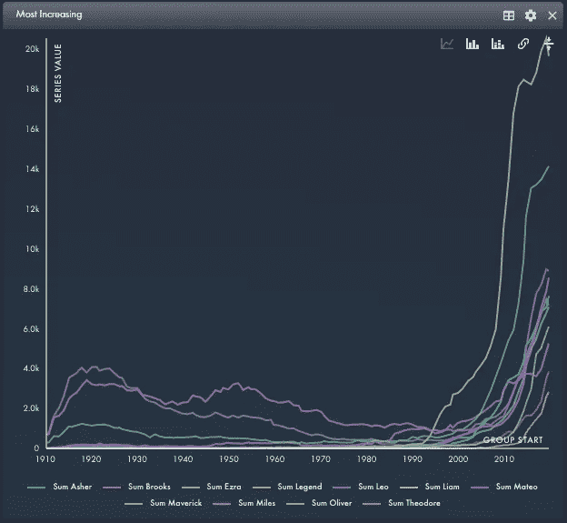
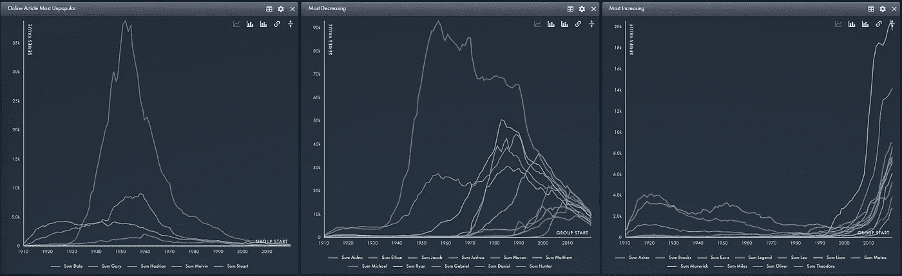

# 婴儿名字分析

> 原文：<https://medium.com/codex/baby-name-analysis-d611f0697802?source=collection_archive---------14----------------------->

如果你搜索关于婴儿名字流行的文章，就不会缺少关于这个主题的文章。但是你看过真实的数据吗？

例如，2021 年的大多数文章声称*加里、戴尔、哈德良、梅尔文和斯图尔特*是最不受欢迎的男孩名。这是真的吗？

于是，我把 6+M 的行放在雪花里，自己看了看。从下面的图表可以看出，那些名字确实不受欢迎。



2021 年最冷门的宝宝名字

不开玩笑！他们也已经不受欢迎很多年了。这篇 2021 年的文章可能是 20 年前写的，仍然是真实的。

当我想到这个问题时，我更感兴趣的是找到人气下降最快的名字。



截至 2021 年，减少最多的婴儿名字



截至 2021 年，越来越多的婴儿名字

**最减**:艾登、伊森、雅各布、约书亚、亨特、瑞恩、马修
最增:亚舍、以斯拉、利奥、利亚姆、马华力、传奇、迈尔斯、奥利弗

马修并不令人惊讶——它在 1957 年达到顶峰，自 20 世纪 70 年代以来一直在下降。

另一方面，艾登在 90 年代之前几乎是闻所未闻的，并且在 11 年前才达到顶峰！现在，它是下降最快的国家之一。那么*艾登*怎么了？

我还觉得有趣的是，西奥多和狮子座曾在 20 世纪 20 年代达到顶峰，之后稳步下降，现在又开始快速攀升。

写这篇文章的时候(2022 年)，电影《特立独行》刚刚上映。有趣的是, *Maverick* 这个名字已经开始流行，并且是增长最快的婴儿名字之一。

> 即使是像婴儿名字这样无聊的数据集，也可能包含有趣的见解(如果你知道如何去观察的话)

这篇博文的整个观点是，如果你知道如何寻找，即使是像婴儿名字这样无聊的数据集也可以包含一些有趣的见解。

接下来，我将带您浏览一些概念和代码，将来您可以将它们应用到自己的数据中。

# 技术细节

## 决定绝对还是相对

关于这个数据集，你会注意到一件事，那就是每年的婴儿总数波动很大。这可能会让人们觉得所有的婴儿名字都越来越不受欢迎，因为每个人生的孩子都越来越少了。所以我不得不问自己——我真的想知道哪些婴儿的名字用得更少了吗？还是我对*相对于其他*的衰落感兴趣？

我决定只关心婴儿名字受欢迎程度的相对下降，所以我在我的数据集中添加了一列，这是给定年份所有婴儿的总数，然后除以总数。这表示婴儿名字占当年婴儿的比例。

```
WITH AGG_YEAR AS (
  SELECT YEAR, SUM(BABYNAMECOUNT) AS BABYCOUNT_YEAR
  FROM {{ main_table }}
  GROUP BY YEAR
  HAVING SUM(BABYNAMECOUNT) > 0 
),
AGG_BABYNAME AS (
  SELECT A.YEAR, A.BABYNAME, SUM(BABYNAMECOUNT) AS NAME_COUNT
  FROM {{ main_table }}
  GROUP BY A.YEAR, A.BABYNAME
)
SELECT AGG_BABYNAME.YEAR
       AGG_BABYNAME.BABYNAME,
       AGG_BABYNAME.NAME_COUNT,
       AGG_BABYNAME.NAME_COUNT/AGG_YEAR.BABYCOUNT_YEAR AS NAME_PCT
FROM AGG_BABYNAME
INNER JOIN AGG_YEAR
ON AGG_YEAR.YEAR = AGG_BABYNAME.YEAR;
```

## 日晷

婴儿名字数为零的年份呢？通常，数据库不会存储丢失或为零的东西。因此，为了表示每个婴儿名字的年份，即使它是零，我也必须应用一个叫做 datespine 的函数。

概念是这样的:
-生成一个唯一婴儿名字的列表
-生成一个唯一年份的列表
-笛卡尔连接上面 2 个列表，得到每个组合
-从笛卡尔连接的左外连接，到你的实际数据

在雪花中，我利用了生成器功能:

```
WITH GLOBAL_SPINE AS (
 SELECT
  ROW_NUMBER() OVER (ORDER BY NULL) as INTERVAL_ID,
  DATEADD('year', (INTERVAL_ID - 1), '1910-01-01T00:00'::timestamp_ntz) as SPINE_START,
  DATEADD('year', INTERVAL_ID, '1910-01-01T00:00'::timestamp_ntz) as SPINE_END
 FROM TABLE (GENERATOR(ROWCOUNT => 111))
),
GROUPS AS (
 SELECT BABYNAME, MIN(YEAR) AS LOCAL_START, MAX(YEAR) AS LOCAL_END
 FROM {{ prior_table }}
 GROUP BY BABYNAME
),
GROUP_SPINE AS (
 SELECT BABYNAME, SPINE_START AS GROUP_START, SPINE_END AS GROUP_END
 FROM GROUPS G
 CROSS JOIN LATERAL 
   (SELECT SPINE_START, SPINE_END 
    FROM GLOBAL_SPINE S
    )
)
SELECT G.BABYNAME AS GROUP_BY_BABYNAME,
GROUP_START,
GROUP_END,
T.*
FROM GROUP_SPINE G
LEFT JOIN {{ prior_table }} T
ON YEAR >= G.GROUP_START
AND YEAR < G.GROUP_END
AND G.BABYNAME = T.BABYNAME
```

## 单位呢？

一旦我这样做了，我就在处理百分比。你的分析是不是没问题？我只想比较不同时间的百分比，所以我认为这对于这个用例是可以的。但是，如果你想再次处理真实的单位呢？处理这种情况的一种方法是将百分比乘以一个固定的指数(如 2000 年的婴儿总数)。这代表你的“2000 年婴儿”数据我决定不这样做，但想提一下，因为这是我考虑的事情。

## 定义增加/减少

有许多方法来定义增加/减少。一种方法是:
-计算前 5 年的移动平均值
-延迟移动平均值以得到 10 年前的移动平均值
-计算当前平均值和 10 年前平均值之间的百分比差异

另一种选择是计算前 10 年的斜率。SQL 可能会变得复杂，但是因为我使用的是 [Rasgo](http://app.rasgoml.com) ，SQL 是为我编写的，所以我选择了这个方法(顺便说一下，它是免费的)。

```
WITH  CTE_RANK AS (
  SELECT *, ROW_NUMBER() OVER(PARTITION BY GROUP_BY_BABYNAME 
  ORDER BY GROUP_START ASC) AS RANK_GROUP_START
  FROM {{ prior_table }}
),
CTE_WINDOW AS (
  SELECT A.GROUP_BY_BABYNAME, A.RANK_GROUP_START,
   ARRAY_AGG(ARRAY_CONSTRUCT(B.BABYCOUNT, B.RANK_GROUP_START)) ARRAY_AGG_OBJ
  FROM CTE_RANK A
  JOIN CTE_RANK B
  ON A.GROUP_BY_BABYNAME=B.GROUP_BY_BABYNAME
  AND A.RANK_GROUP_START BETWEEN B.RANK_GROUP_START 
  AND B.RANK_GROUP_START+10
  GROUP BY A.GROUP_BY_BABYNAME, A.RANK_GROUP_START
),
CTE_SLOPE AS (
  SELECT GROUP_BY_BABYNAME, RANK_GROUP_START, 
   regr_slope(X.VALUE[0], X.VALUE[1]) AS BABYCOUNT_SLOPE_10
  FROM CTE_WINDOW, table(flatten(ARRAY_AGG_OBJ)) X
  GROUP BY GROUP_BY_BABYNAME, RANK_GROUP_START
),
CTE_RESULT AS (
  SELECT A.GROUP_BY_BABYNAME, A.GROUP_START, B.BABYCOUNT_SLOPE_10
  FROM CTE_RANK A
  INNER JOIN CTE_SLOPE B
  ON A.GROUP_BY_BABYNAME = B.GROUP_BY_BABYNAME
  AND A.RANK_GROUP_START = B.RANK_GROUP_START
)
SELECT A.*, B.BABYCOUNT_SLOPE_10
FROM {{ prior_table }} A
LEFT OUTER JOIN CTE_RESULT B
ON A.GROUP_BY_BABYNAME = B.GROUP_BY_BABYNAME
AND A.GROUP_START = B.GROUP_START
```

## 移除异常值

在处理百分比、斜率等时，可能会出现极端的罕见名称。例如，一个名字可能每年有 3 个，现在有 30 个，增长了 10 倍。我可能不太在乎这些，因为它们太稀有了。

处理这种情况的一种方法是对您的分析应用一个过滤器，只考虑在前一年中出现至少 250 次的婴儿名字。

处理这个问题的另一种方法是使用经验贝叶斯来调整婴儿的百分比。我不认为它适用于这种情况，但我想提一下，因为有时这是一种有效的方法。我计划将来某个时候写一篇关于这种方法的博客。对于这个分析，我只是应用了一个简单的过滤器来去掉那些超级罕见的名字。

通过将上面的步骤串联起来，我能够很快得到一个增加和减少最多的名字列表。我只是简单地将这个列表与原始数据连接起来，这样我就可以绘制它们随时间变化的计数。



最终图表

我希望这对你有用！如果你有任何问题、意见或新想法，可以在 Slack 上联系我。我在 [DataTalks.club](https://datatalks.club/) 或者 [RasgoUserGroup](https://rasgousergroup.slack.com/) 都是最活跃的。