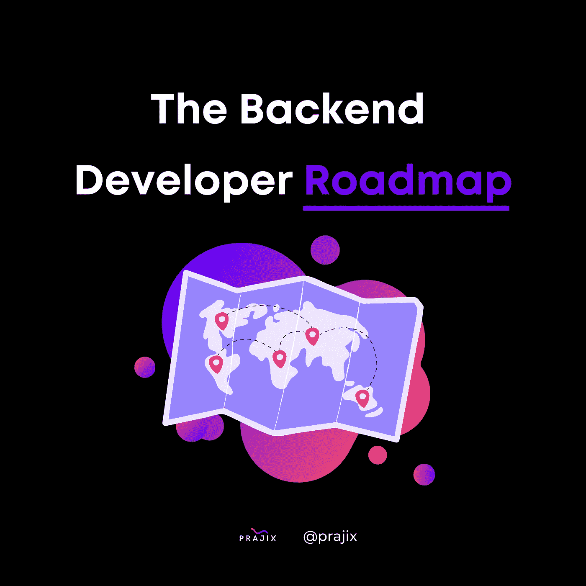

# 后端开发人员路线图

> 原文：<https://medium.com/codex/backend-developer-roadmap-e61ce30ab10d?source=collection_archive---------1----------------------->

如果你正在考虑成为一名 web 开发人员，现在是成为后端开发人员的有利时机，因为它的就业机会、可访问性和工资水平。根据 Stack Overflow 在 2018 年进行的一项调查，后端开发人员约占 web 开发人员的 57.9%，因为他们对维持高功能服务器的需求很高。有很多资源可以帮助你从事后端开发的职业，比如 freeCodeCamp、Udemy 和无数其他免费课程，但是你从那里去哪里呢？

我们列出了成为后端开发人员所需的要求和技能。如果你能熟悉这些概念，从初学者到专业人士，你应该在服务器端 web 开发方面有一个很有前途的职业生涯。

## 第一步:互联网

如果你正在认真考虑计算机科学的某个领域，那么你应该已经精通基本的互联网功能，如 HTTP、域名、托管等。

## 第二步:前端

如果不先了解客户端是如何操作的，就无法了解服务器端编程的复杂细节。这意味着交互式功能的 HTML、CSS 和 JavaScript 的基础。

## 第三步:操作系统

操作系统控制应用程序的执行，充当用户和硬件之间的接口，使计算机能够运行。熟悉内核、程序执行、中断、信号、直接内存访问、模式、内存功能等。

## 步骤 4:数据结构和算法

要成为后端开发人员，你不一定需要成为这些概念的专家，这就是为什么大多数人跳过这一步，但是了解基本的数据结构和算法堆栈、队列、链表、树、图、散列和排序&搜索算法总是对你有好处的。

## 第五步:选择编程语言

学习任何一种编码语言都需要大量的时间、努力和耐心。一些有助于后端开发的语言包括 Python、PHP、Ruby、C#和 JavaScript。

## 第六步:版本控制

也称为源代码管理。它是跟踪和管理软件代码变更的实践。版本控制系统是帮助程序员跟踪源代码随时间变化的软件工具。

对于那些感兴趣的人，我们实际上已经在之前的帖子中深入讨论了版本控制系统。特别是 Github，以及它与 Git 的主要区别。[点击这里](/codex/git-vs-github-whats-the-difference-c39c96a9909)查看全文。

## 步骤 7:框架

框架提供了预制的组件和定制的解决方案来加速开发过程。框架由控制反转(IoC)定义，它可以在需要时调用定制部分，而不是定制代码调用库来访问可重用代码。我们还创建了一系列必须处理 C++项目的框架，这些项目非常酷，可以试用。你可以在这里找到它们！

## 步骤 8:数据库

了解数据库总是有益的，因为今天大多数网站都在吹嘘它们的存储。从关系数据库和 NoSQL 数据库开始。

## 第九步:API

创建不同应用程序和程序之间的连接，以创建更流畅的用户体验。

## 步骤 10:数据库缓存

缓存是指存储数据和临时文件的子集，以便将来可以轻松访问它们，而不是通过其主存储位置访问数据。例如，CPU 缓存是处理器上用于存储基本和常用计算机功能的少量内存。

## 步骤 11:测试

了解单元测试、集成、功能测试，以及如何在代码中实现所有这些。

## 步骤 12:网络安全

在您的服务器上实施网络安全协议时，HTTPS、SSL、CORS、OWASP 和散列算法是需要学习的有用概念。

## 第十三步:CI/CD

持续集成和持续部署。它们允许快速、频繁、可靠地部署代码更改。这包括作为“撤销”按钮的回滚更改。其他优势包括生成大量日志、使用更少的手动工作以及更快地交付结果。

## 第十四步:集装箱化

容器化允许您将代码只与运行代码所需的操作系统库和依赖项捆绑在一起。

## 步骤 15: Web 服务器

学习 Apache 或 Nginx，轻松实现负载平衡、HTTP 缓存等等。

有关更多信息:

[https://hackr . io/blog/how-to-be-a-back-developer #:~:text = Learning % 20 back % 2 dend % 20 development % 20 helps，prove % 20 to % 20 be % 20 quite % 20 benefit](https://hackr.io/blog/how-to-become-a-backend-developer#:~:text=Learning%20back%2Dend%20development%20helps,prove%20to%20be%20quite%20beneficial)。

【https://arc.dev/freelance-developer-rates/back-end 

[https://www . atlassian . com/git/tutorials/what-is-version-control](https://www.atlassian.com/git/tutorials/what-is-version-control)

[https://AWS . Amazon . com/caching/#:~:text = In % 20 computing % 2C % 20a % 20 cache % 20 is，即%20data 的% 20 primary % 20 storage % 20 location](https://aws.amazon.com/caching/#:~:text=In%20computing%2C%20a%20cache%20is,the%20data's%20primary%20storage%20location)。

【https://www.techtarget.com/searchstorage/definition/cache 号

[https://www . net solutions . com/insights/what-is-a-framework-in-programming/](https://www.netsolutions.com/insights/what-is-a-framework-in-programming/)

[https://www.instagram.com/russcodes/](https://www.instagram.com/russcodes/)

[https://www.ranorex.com/blog/5-benefits-ci-cd-pipeline/](https://www.ranorex.com/blog/5-benefits-ci-cd-pipeline/)

[https://www . IBM . com/cloud/learn/containing #:~:text = containing % 20 is % 20 打包%20of，在% 20any %基础设施上% 20 持续% 20 运行](https://www.ibm.com/cloud/learn/containerization#:~:text=Containerization%20is%20the%20packaging%20of,runs%20consistently%20on%20any%20infrastructure)。

**什么是 Prajix？**

对你来说，掌握编码世界的最好方法是把这个世界放在你的指尖。我们的使命是让世界各地的开发者通过在线协作来彻底改变我们希望拥有的未来。

我们允许开发人员在我们的平台上创建或加入项目想法，他们可以在我们的协作室中找到志同道合的个人进行团队合作。

我们正努力将全世界最有价值的程序员、编码员和开发人员的网络集中到一个地方，创建一个技术发电站，帮助全球的个人和社区。

如果你对此感兴趣或者想了解更多，请访问我们的网站:[https://www.prajix.com](https://www.prajix.com/)