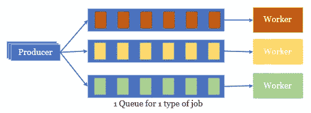
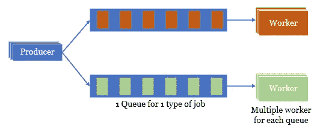
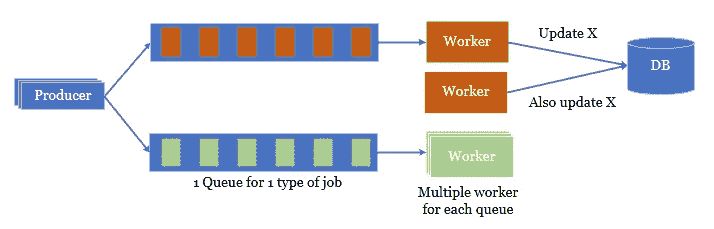

# 后台作业和队列—并发和排序

> 原文：<https://medium.com/codex/background-job-and-queue-concurrency-and-ordering-b892bcfc1761?source=collection_archive---------1----------------------->

塞萨尔·卡利瓦里诺·阿拉贡在 [Unsplash](https://unsplash.com?utm_source=medium&utm_medium=referral) 上拍照

## [抄本](http://medium.com/codex)

这篇文章旨在从系统设计的角度为你提供一个如何满足需求的概述。话虽如此，它的内容不是技术驱动的，这意味着所讨论的内容的实现对于 Kafka 或 RabitMQ 之类的消息队列是透明的。没有特定于某个系统、技术或框架的特性。

在我之前的文章([这里](/swlh/background-job-and-queue-conceptual-and-practical-8d075096ec86)和[这里](/swlh/background-job-and-queue-practical-application-use-cases-8cd1cc83afdf))中，我没有讨论作业之间的关系，假设它们是不相关的。通过这样做，我简化了事情，可以在 Worker 节点上进行任意的扩展/缩小/扩大，只要你想利用并发的优势。不幸的是，生活并不那么容易:)当您跳到一个真实的系统上时，您可能会面临许多不同的问题。其中之一是作业之间的依赖性，即如何在一定程度上确保作业以有序和并发的方式完成，这不是一项简单的任务。

请注意，作业依赖的特征在于两个阶段，设计和操作，这使得后台作业实现更具挑战性。

*   **设计阶段:**在设计阶段，预先确定了有限数量的作业类型的执行顺序
*   **运行阶段:**也可以根据作业的数据来决定作业的执行顺序，这些数据的值只有在运行时才知道。例如，作业“*创建帖子 A 的评论 X*”需要在作业“*创建帖子 A 的评论 Y*”之前完成。

# 现有方法

让我向您介绍一下可用的方法，并阐明它们的优点和局限性。

## 简单版本—所有作业 1 队列 1 工人

这是一种简单的方法，因为您不需要考虑并发性。使用 FIFO 队列，工人一次只处理一个作业，作业的执行顺序基于队列中的顺序。你很容易就能发现大问题——处理速度慢。想象一下，它以每小时 1000 个作业的速度出现，但是系统能够每小时处理 500 个作业。最终，您将需要一个无限长的队列来保存作业。

## 改进版本—每种作业类型一个队列一个工人

如果您试图实现版本 1 的玩具示例，您可以考虑用这种方法来改进它。您需要做的是根据作业的类型将它们分开，然后将它们送入不同的队列，每个队列又有自己的工人。

虽然这通过将负载平衡到多个队列和工作线程中减少了高工作负载问题。由于工作类型的数量通常是有限的，我们不需要担心资源。我们也不必担心执行顺序或并发性，因为在大多数系统中，不同类型的作业是相互独立的(如果不是，那么继续阅读其他解决方案)。但是，这个版本仍然局限于一个工作类型只有一个工人。

## 更好的版本—每种作业类型一个队列多个工作人员

这种模式被系统广泛采用。有流行的作业队列库，如 Resque (Ruby)、Celery (Python)、Bull (Nodejs)等。，或者后端依赖 Redis 的。

通过这种方式，我们可以提高多个工作线程处理一种并发作业的系统性能，从而实现水平扩展。剩下的就是与并发和作业执行顺序相关的问题了。例如，当许多作业同时被处理时，它们可能需要同时访问(和更新)共享资源，或者一些作业可能比其他发生在后面的作业更早完成(并且应该更晚完成)。

这不是一件可以轻易解决的事情。对于具有特定要求的不同系统，可以考虑不同的选项，即

*   使用**原子事务**更新数据。这适用于同一数据库中的关键事务和数据。但是，您可以用原子事务更新一个或几个记录，但对于准备数据、从服务 A 获取信息、计算等整个过程来说，这不是一个好主意。在存在大量作业的情况下，由于原子事务，作业在执行中失败的可能性非常高。有时候，那真的是你不愿想象的噩梦。
*   使用**锁定**来锁定需要更新的数据。如果锁定持续几十毫秒，并且在锁定同一资源时重叠的删除或重试作业的数量是可接受的，则这是适用的。但是由于作业需要处理更多的任务，因此需要更长的锁定期，所以丢弃的作业越来越多。
*   像卡夫卡一样使用**分区队列**。我不会深究这种方法的细节，因为你可能会问"*如果有那么复杂，你为什么不用卡夫卡呢，它是免费的。*”。
*   每个帖子使用 **1 个队列，并让 1 个工人监听该队列**。例如，我们不是为 job create comment(对于任何 post)使用一个队列，而是为 job create comment of post-A 创建多个队列，这样就不用担心所有的并发性、锁等问题。问题是它需要一个动态机制来创建(并监听)队列。在运行时，我们必须不断创建队列并处理它们自己的排队作业。你能理解吗？不，那么看看下面的代码:

下面是一个任务队列的代码:

但是，我们需要的是:

当采用任务队列库时，您可以看到这种方法的问题。它不仅需要专门的修改来管理队列的注册和注销，还会导致额外的(低效的)连接、资源碎片等。

# 再往前一点

现在是一个小的改进可以导致相当大的改进的时候了。

## 最佳版本(到目前为止)—每个作业类型 1 个队列多个工作线程，1 个锁+ 1 个数据源用于处理并发性

与上面的更好的版本一样，您为不同的帖子 A、B、c 创建不同的队列。与上面的更好的版本不同，您需要不同的方法来实现它(这是一个实用的观点 IMHO ),因为您需要将您的工作与现有的任务队列库(或框架)相集成。不是为具有**数据 X** 的**岗位 A** 创建作业，而是为没有数据的**岗位 A** **创建作业。然后，该作业(对于没有数据的 post-A)将从另一个数据源获取数据，即 Redis 列表、数据库和流程。完成后，它继续进行 post-A** 的下一个**作业(当然没有数据)。**

这种**重叠调度**方法的一个小问题是，如果 post-A 的作业失败，并且在 TIMEOUT_DURATION 之后，没有新的作业要为 post-A 处理，那么 post-A 的队列将永远等待。不清楚，看看下面的代码，它实际上是一个单独的过程，用于检查有问题的所有队列并重新调度作业

事实上，除了使用数据源和锁来推和拉作业数据的机制之外，您什么都不用更新代码。这样做的好处是便于您的工作和大多数数据库的集成。这是 Redis 的一个原型。

正如我前面所说的，这只是一个参考原型，您可以将它应用到您的具有作业并发性需求的案例中。这意味着在弹出数据、出错重试、工人崩溃等方面，仍然有很多事情可以提高可靠性。

让我总结一下我们迄今取得的成就:

*   避免连续监听库的队列。侦听器和处理程序的声明是在工作器启动时完成的。
*   使作业*为岗位 A* 创建注释 X 和*为岗位 B* 创建注释 X 同时执行
*   确保*为岗位 A* 创建备注 X*和*为岗位 A 创建备注 Y 的工作按顺序进行。
*   能够在不太担心的情况下扩展整个系统或工人。

# 承认

我想对光明(又名明孟门)的允许翻译他的[原文](https://kipalog.com/posts/Nghe-thuat-xu-ly-background-job-phan-2--Job-order-with-concurrent-worker)表示我的感谢。

*原载于*[*https://emerging-it-technologies.blogspot.com*](https://emerging-it-technologies.blogspot.com/2021/01/background-job-and-queue-job-parallel.html)*。*