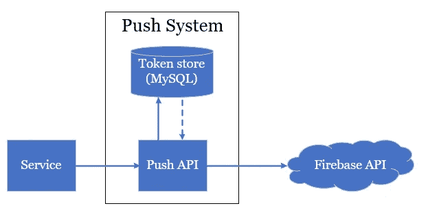
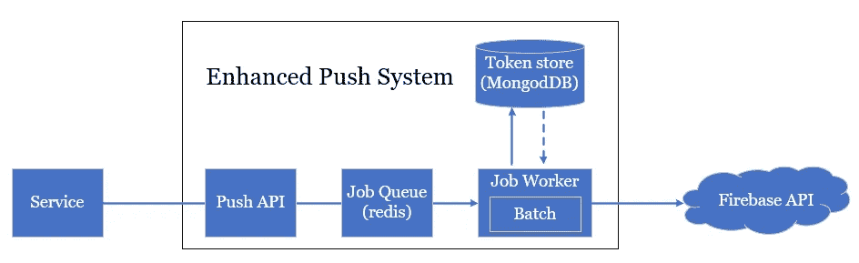

# 后台作业和队列—每小时推送数百万条通知

> 原文：<https://medium.com/codex/background-job-queue-pushing-millions-of-notifications-per-hour-d589a57060db?source=collection_archive---------2----------------------->

## [法典](http://medium.com/codex)

在本文中，我给出了一个将后台作业和队列模型应用到实际系统的案例研究。鉴于目前的系统架构，提出了一个改进版本，并将从不同方面提供设计这种系统的细节。如果整个内容没有多大意义，我强烈建议按照以下顺序阅读我的其他文章:

*   [概念性和实用性](/swlh/background-job-and-queue-conceptual-and-practical-8d075096ec86)
*   [实际应用用例](/swlh/background-job-and-queue-practical-application-use-cases-8cd1cc83afdf)
*   [并发和执行顺序问题](https://suhoangtuan.medium.com/background-job-and-queue-concurrency-and-ordering-b892bcfc1761)

# 投入

用 Python 和 MySQL 编写的通知系统有几个性能问题，即

*   降低服务速度的延迟
*   高峰时段的高服务需求，导致推送通知的丢失
*   由于大量的呼叫请求，与连接到 Firebase 相关的失败率很高。
*   令牌管理效率低下，重复和许多非活动令牌会减慢*推送*流程
*   数据库中的数据很难标准化，因此每个 *push* 请求都需要连接 3 个表。
*   就 CPU 和 RAM 而言，浪费了资源

此外，系统不跟踪*推送*请求的成功率，也不跟踪其他服务的成功率。下图显示了当前的架构。收到请求后，系统的 **Push API** 将从**令牌库**获取请求用户的令牌列表，并将 *push* 请求发送给 Firebase API。就是这样。

# 解决办法

下面是采用队列和后台作业的新设计:

## 数据库和 API 设计

基本上，数据库将存储 2 个主要数据:

*   用户的**推送令牌**:更新更少，列表读取更多，大量与设备或操作系统信息相关的额外数据。
*   **带日志信息的推送日志**和*推送*结果频繁插入和更新而读取较少。

根据对数据特征的观察，数据库从 MySQL 迁移到 MongoDB，这样我们就可以在记录的插入/更新操作中利用更好的 MongoDB 性能。

**Push API** 负责接收来自其他服务的请求流量。因此，为了加快流程并缩短服务等待时间，整个消息流简化如下:

*   插入*推*日志到数据库
*   从数据库查询用户的令牌
*   基于令牌列表构建一个*推送*请求
*   调用 Firebase API
*   更新对数据库的*推送*请求的响应

你可以看到，通过将一些功能移出**推送 API** ，并重新设计数据库，有 3 个问题与 **API 延迟**、**令牌管理、**和**为每个请求**获取令牌的性能相关。

## 工作人员

直截了当地说，工作工人的实施可以从以下简单的步骤开始:

*   插入*将*日志推送到数据库
*   从数据库查询用户的令牌
*   基于令牌列表构建一个*推送*请求
*   调用 Firebase API
*   更新*推*请求对数据库的响应

为了完成所有这些步骤，大约需要 300-400 毫秒。因此，系统需要在工作节点上横向扩展，以便从并行计算中获益。但是，有两个因素会对系统性能产生不利影响，它们是:

*   插入日志和更新*推送*结果会增加数据库的工作量
*   调用 API 到外部服务，即 Firebase 在网络连接和延迟方面受到一些限制。

为了克服这两个问题，每个 worker 实例都使用了**批处理**技术。特别是，共享一个公共事物的所有请求将被分组为一批，只包含一个对 DB，API 的调用。例如，在 Golang 中，Muster 是一个库，它通过以 buckets 的形式创建批处理来促进批处理的实现。传入的请求将一个接一个地填充这个桶，一旦请求的数量达到一个阈值或者只是超时，将对这个桶采取行动。

我列出了工人在处理工作时需要经历的所有步骤。我还将每一步的处理时间信息与系统接收的**n**push*请求的数量*相加。

*   步骤 1: *将日志插入数据库*作业(少于 1 毫秒 x n)

> 用请求*将日志插入数据库*填充桶

*   步骤 2:批处理(大约 10ms x n/1000)

> 触发一批作业*将日志插入数据库*
> 
> 调度*推动*工作

*   第三步:*推送*作业(大约 5ms x n)

> 从数据库中筛选与用户相关的令牌
> 
> 基于令牌列表构建一个*推送*请求
> 
> 用请求*调用 Firebase* 填充桶(不同于步骤 1)

*   步骤 4:批处理(大约 500 毫秒 x n/500)

> 触发一批作业*调用 Firebase*
> 
> 用请求*更新数据库*填充桶

*   步骤 5:批处理(大约 20 毫秒 x n/1000)

> 触发一批作业*更新数据库*

由于 MongoDB 和 Firebase API 的支持**批量写操作**也支持**批量请求**每个调用多达 500 条消息，这种方法明显减少了 API 调用的大量等待时间(由于减少了请求的数量)以及分配给 DB 的资源(减少了查询的数量)。这使得系统在只有一个工作人员和有限资源的情况下，每秒可以推送多达 1000 次通知，或者每小时可以推送 360 万次。

# 结论和确认

尽管**批处理**技术的原理很简单，但要实现它并不是一件简单的事情。考虑与**错误**、**重试**和**报告**相关的问题很重要。任何使一个步骤失败的问题都需要付出巨大的努力来解决。这种失败的步骤会对许多*推送*作业而不是 1 个作业产生不利影响。但只要你能处理好(没错，就是**如果**的事)，接受取舍也是值得的。

这是我的后台作业和队列概念系列的最后一部分。我想再一次衷心感谢 Quang Minh(又名 Minh Monmen)允许我翻译他的[原文](https://kipalog.com/posts/Nghe-thuat-xu-ly-background-job-phan-3--Push-hang-trieu-notification-moi-gio)。

*原载于 https://emerging-it-technologies.blogspot.com***。**