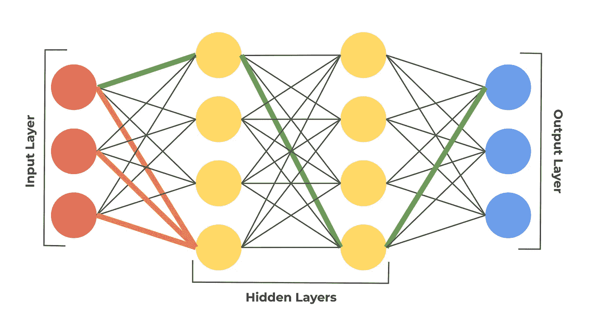
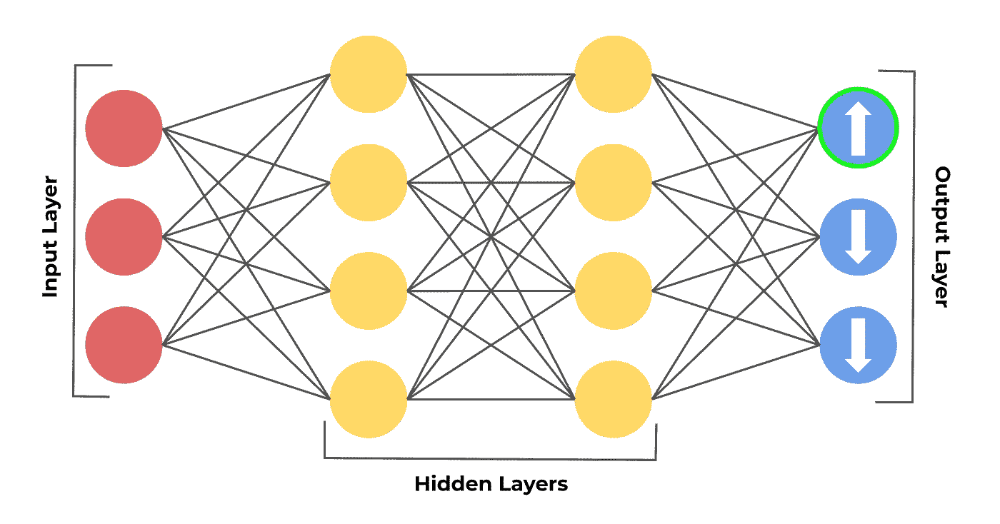
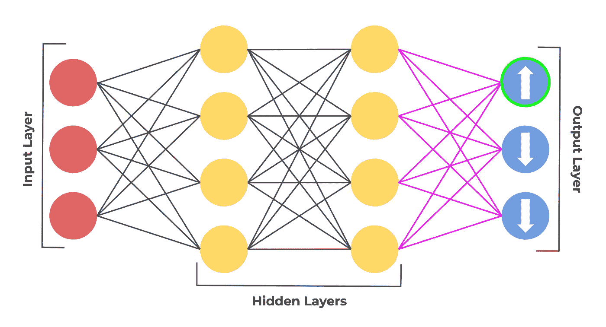
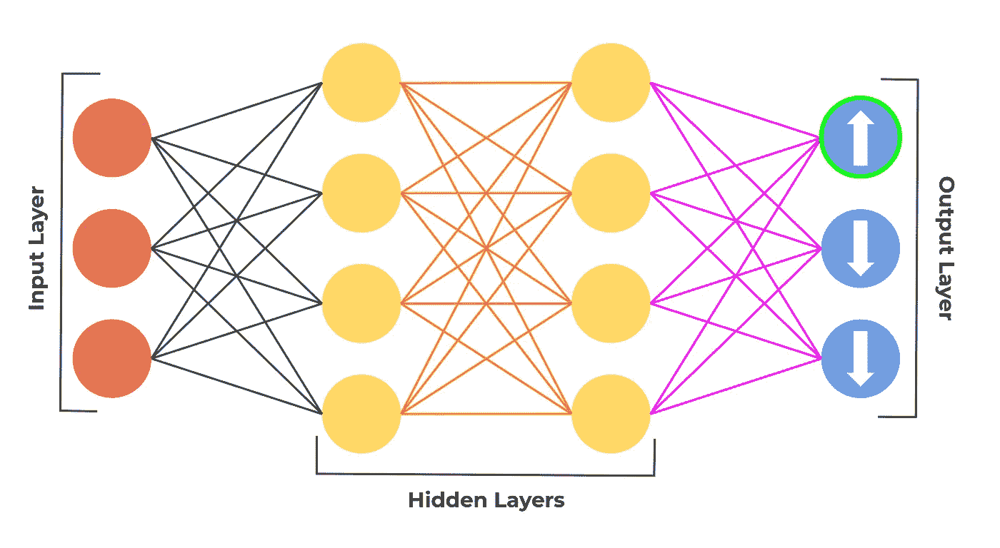
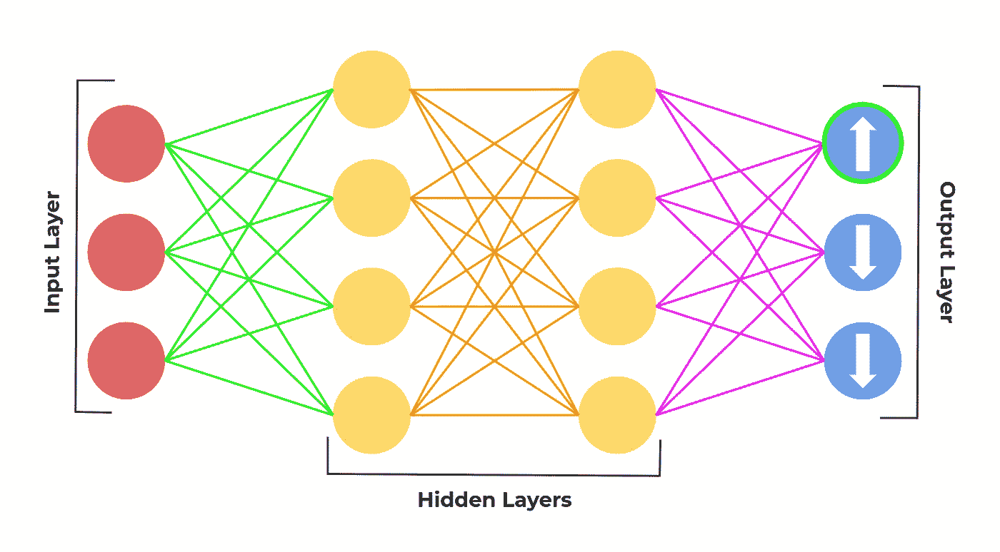

# 反向传播(1/2) —向后工作推动创新前进—直观的方法

> 原文：<https://medium.com/codex/backpropagation-1-2-working-backwards-to-push-innovation-forward-intuitive-approach-2ea00076b354?source=collection_archive---------17----------------------->

# 介绍

本文重点关注一个称为反向传播的新概念，因为正是在这个过程中，人工神经网络训练自己成为通常所说的“智能”。

反向传播是计算梯度的过程，最终导致我们的模型通过多次迭代将权重更新为与最低成本函数输出相对应的最优值。由于反向传播是一个令人生畏的话题，所以我将首先回顾反向传播背后的直觉，然后是未来文章中需要的必要计算。

# 背景

在我介绍神经网络的第[篇文章](https://rohjag18.medium.com/how-an-algorithm-was-made-to-think-like-the-brain-c424fc05f46e)中，我介绍了一个叫做前向传播的概念。该概念解释了输入值如何从输入层开始，通过隐藏层，最后从人工神经网络的输出层出来。

记住，在前向传播中，每个节点的值是一个[激活函数](https://rohjag18.medium.com/activation-functions-4130bbbb2e3e)的输出，该函数将所有输入乘以每个连接上各自的权重加上各自的偏置作为输入。对于每一层中的每个节点，该过程继续进行，直到到达输出层。当到达输出层时，模型输出具有最高概率的节点，表示对于一组输入的值，输出的节点是模型认为输入的值应该对应的类。

橙色连接表示第一个隐藏层中最后一个节点的所有连接，绿色连接显示输入层中第一个节点的值的可能路径。

一旦我们从一组给定的输入值中获得输出，我们就可以计算损耗。对于不同的情况，有许多损失函数，但是，本质上，损失函数基本上提供了关于模型与正确答案的“偏离”程度的量化值。为了简单起见，本文将假设损失函数是模型输出的值和数据集中的实际值之间的差值。

一旦我们获得损失值，我们就可以利用梯度下降，这是一个旨在最小化成本函数的过程，即更新模型的权重以减少输出值的误差。梯度下降是通过获取损失函数相对于权重参数的导数来完成的。这就是反向传播发挥作用的地方。反向传播是梯度下降用来计算损失函数的每个梯度的工具。

# 它是如何工作的？—直观的解释

在我们的示例中，假设输出层中的顶层节点是基于一组输入值的模型的正确输出。然后，模型将能够识别出顶层节点的值应该增加，而输出层中其余节点的值应该减少。

要根据图像中的箭头更改输出图层的值，我们需要首先回忆一下这些值是如何计算的。输出层中的这些值是通过将第二隐藏层的输出乘以到每个相应节点的每个连接的权重，加上各自的偏置值，并将该和通过激活函数来计算的。要根据计算方式更改输出值，我们可以做以下三件事之一:

*   更改偏差值
*   更改激活函数中的值
*   更改每个连接的权重

由于我们不能直接改变任何涉及给定值的选项，我们需要改变每个连接的权重，这将影响通过激活函数输出的值的变化。

紫色突出显示的连接是需要更改的权重。

现在，请记住，就像输出层一样，第二个隐藏层的值也是以类似的方式计算的。第二隐藏层值是通过将第一隐藏层输出的值乘以到第二层的相应连接，加上偏差值，并将该总和值通过激活函数来计算的。这意味着我们必须改变最后一层连接的权重，以改变当前以紫色突出显示的连接的权重。

我们正在改变先前层中的权重值，因为后续层中的权重值是基于先前层中的权重的。更改前一层中的权重将影响未来层中的权重值。

这种改变前一层的连接以改变后续层的连接的过程就是将“后”置于“反向传播”中的过程。我们继续这个反向传播的过程，直到到达输入层的连接。

一旦这个反向传播过程完成，模型中的权重值应该向正确的方向移动。具体地，对应于正确节点的权重值将增加，对应于不正确节点的权重值将减少。

另一个有趣的注意事项是，除了在正确的方向上轻推权重值之外，反向传播还致力于有效地更新值，使得更新的间隔将最有效地最小化成本函数值。这意味着某些权重相对于其他权重的更新比例可能会更高或更低，这取决于更新对神经网络模型其余部分的影响，以降低成本函数。

我们最终得到的每个权重的实际值实际上是成本函数相对于每个权重的导数。尽管我们针对单个节点(输出层中的顶层节点)完成了这个示例，但是这个确切的过程对于所有其他节点都是相同的。唯一的区别是每个不同计算中涉及的值。

对于每个不同的节点，由于前一层中的节点连接到下一层中的所有节点，所以可能会出现冲突的轻推。例如，一次轻推可以告诉特定的重量增加，而同一重量的另一次轻推可以告诉特定的重量减少。当对所有权重完成反向传播过程时，取一个平均值，并且正是这个平均值被应用于每个权重。

这些权重的平均微移是损失函数相对于每个权重的梯度。然后重复这些梯度，直到达到最小化的成本函数值。正是在这一点上，我们称一个神经网络为被“训练”。

对某人来说，这是相当多的直觉和理论知识。在下一篇文章中，我将介绍执行本文中提到的所有计算的基本演算。

关于我的更多信息——我的名字叫 Rohan，我是一名 16 岁的高中生，正在学习颠覆性技术，我选择从人工智能开始。要联系我，请通过我的[电子邮件](http://rohjag18@gmail.com/)或我的 [LinkedIn](https://www.linkedin.com/in/rohan-jagtap-1a07151b0/) 联系我。我非常乐意提供任何见解或了解你可能有的见解。另外，如果你能加入我的[月刊](https://rohanjagtap.substack.com/p/coming-soon?r=baakt&utm_campaign=post&utm_medium=web&utm_source=copy)，我将不胜感激。直到下一篇文章👋！