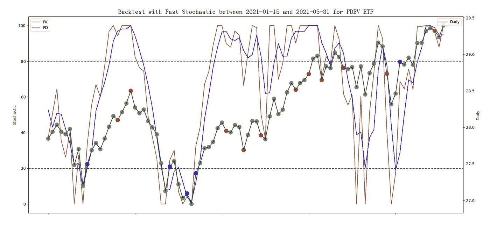
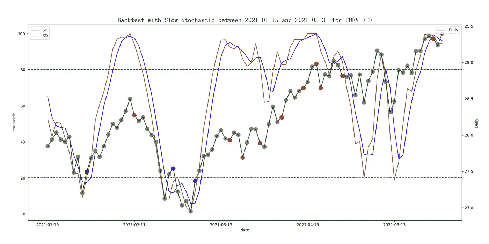
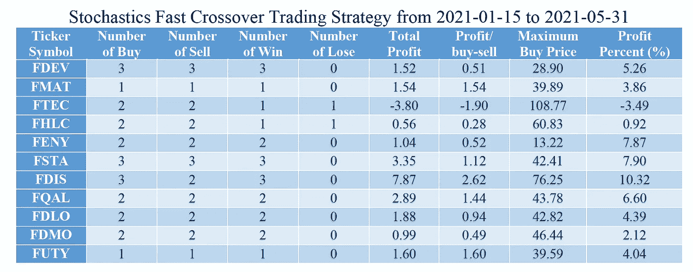
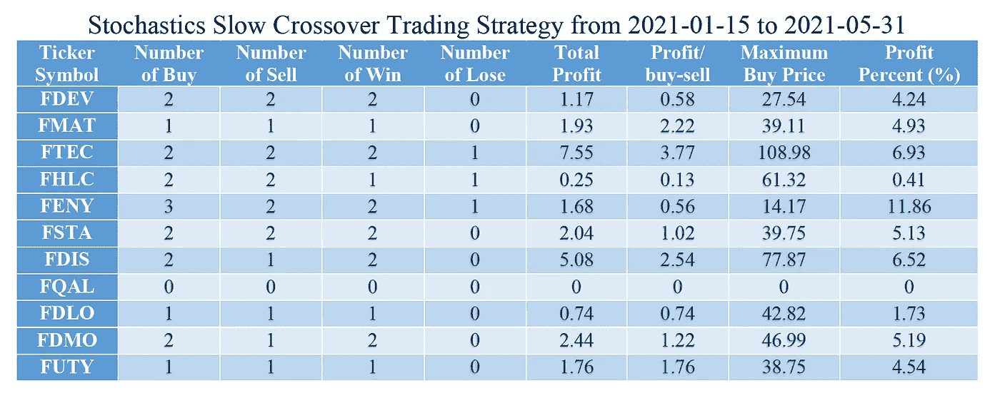
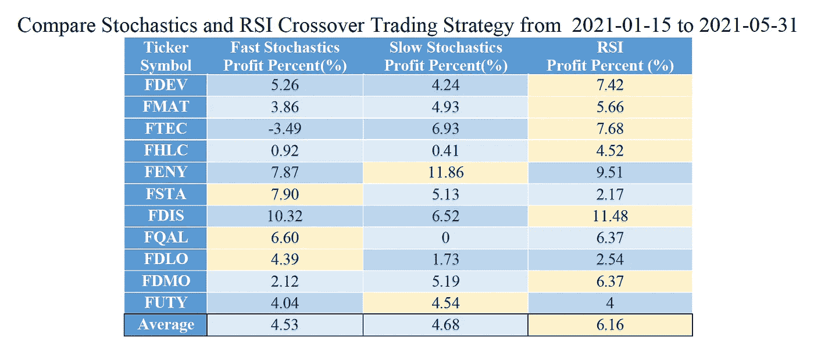
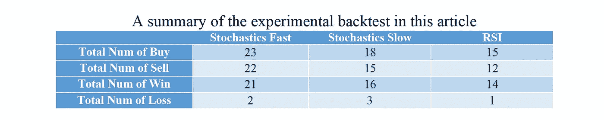

# 弹性搜索中的回测快慢随机交叉策略

> 原文：<https://medium.com/codex/backtest-fast-and-slow-stochastic-crossover-strategy-in-elasticsearch-221d889408e3?source=collection_archive---------8----------------------->

在我之前的文章中，“[哇！回测 RSI 交叉策略在 Elasticsearch](/geekculture/wow-backtest-rsi-crossover-strategy-in-elasticsearch-1cdf837a72a1) 中，介绍了如何回测 RSI 交叉策略。在本文中，我们将实现一个随机交叉策略，并将其性能与 RSI 进行比较。尽管随机指标是由乔治·c·莱恩在 20 世纪 50 年代末开发的，并且已经很老了，但它仍然很受欢迎。与 RSI 指标类似，随机指标也是价格在 0 到 100 之间波动的动力。因此，它们被称为振荡器。这两个指标都可以用来识别超买和超卖区域。与 RSI 类似，随机指标定义了 20 以下的超卖区和 80 以上的超买区。

随机中的价格变化转化为一种数据，即两个距离的比值。最近收盘价 C 与最近高价之间的距离，以及最近高价与最近低价之间的距离。等式可以改写如下:MMax *n，1* 和 MMin *n，1* 是移动最大值和移动最小值。对应于窗口为 *n* 的 Elasticsearch 移动函数，需要向右移动 1 个数据来包含当前数据。14 个周期通常用于窗口 *n* 。


快速随机指标%K 线

和 MACD 类似，随机也定义了一条名为%D 的信号线，是%K 的三周期 SMA


快速随机指标的信号线%D

有两种随机指标，快速和慢速。快的比慢的对价格变化更敏感。快的会比慢的产生更多的买入或卖出信号。慢速随机指标可定义如下:


慢速随机指标%K 线


慢速随机指标的信号线%D

随机交叉策略可以定义为当%K 线在超买区(> 80)穿越到%D 线下方时发出卖出信号，当%K 线在超卖区信号(< 20)穿越到%D 线上方时发出买入信号。对于其他值，耐心等待买入或卖出信号。

用图表来观察数值的变化要容易得多。在本文中，我们尝试将回溯测试应用于免佣金的交易所交易基金(ETF ),并将重点放在作为分析工具的弹性搜索上。下面的例子随机选择“富达国际多因子 ETF”。它的股票代码是 FDEV。将运行另外 10 只随机选择的 ETF，稍后将显示最终结果。数据选自投资者交易所 IEX 提供的 2021 年 1 月 15 日至 2021 年 5 月 31 日的时间范围。下图显示了随机指标(FK/SK)和信号线(FD/SD)以及每日收盘价。在每日价格曲线中，有卖出信号的价格用红色标出，有买入信号的价格用蓝色标出。如下图所示，慢速随机指标产生的信号数量少于快速随机指标。



在这里，我们提出了一个简单的随机交叉策略，并使用 Elasticsearch 来显示实现细节。

◆假设被限制一次买入并持有 1 股，在持有的股份卖出前不发生交易。
◆当 FK/SK 在超卖区穿越 FD/SD 上方时买入 1 股(< 20)。
◆当 FK/SK 在超买区穿越 FD/SD 下方时卖出 1 股(> 80)。
◆回测期末，持有股份以现价兑现。

根据随机交易策略，快速随机交易有 5 个蓝点和 11 个红点，但只允许 3 次买入和 3 次卖出交易。慢速随机指标有 3 个蓝点和 10 个红点，但只允许 2 次买入和 2 次卖出交易。让我们描述一下使用 Elasticsearch 的实现。假设有一个用数据填充的 Elasticsearch 索引，其使用的数据映射与上一篇论文中描述的相同。以下步骤演示了 REST API 请求体的代码。

> 通过搜索操作收集所有相关文件

使用带有“must”子句的“bool”查询来收集符号为 FDEV 且日期在 2021–01–15 和 2021–05–31 之间的文档。由于计算了 14 个周期的移动最大值/最小值和两个 3 个周期的 SMA，额外数据调整了 1 个月(从 2020 年 12 月 15 日到 2021 年 1 月 14 日)。

```
{
    "query": {
        "bool": {
            "must": [
                {"range": {"date": {"gte": "2020-12-15", "lte": "2021-05-31"}}},
                {"term": {"symbol": "FDEV"}}
            ]
        }
    },
```

> 提取基金的收盘价值

使用名为 Backtest_Stochastics 的“date_histogram”聚合，其中参数“field”为“date ”,参数“interval”为“1d ”,以提取每天的基金价格。然后是名为 Daily 的“平均”聚合，以检索收盘价，因为后续的管道聚合不能直接使用文档字段。

```
 "aggs": {
        "Backtest_Stochastics": {
            "date_histogram": {
                "field": "date",
                "interval": "1d",
                "format": "yyyy-MM-dd"
            },
            "aggs": {
                "Daily": {
                    "avg": {"field": "close"}
                },
```

> 提取桶的日期

由于存在额外的数据，后续操作需要稍后过滤掉超出范围的部分。一个名为“DateStr”的“min”聚合将获取存储桶的日期。在 Elasticsearch 服务器中，日期以纪元时间存储。时间单位是毫秒，时区是 UTC。

```
 "DateStr": {
                    "min": {"field": "date"}
                },
```

> 选择包含 1 个以上文档的存储桶

为了过滤掉空的时段(非交易日)，使用一个名为 SDaily 的“bucket_selector”聚合来选择文档计数大于 0 的时段。

```
 "SDaily": {
                    "bucket_selector": {
                        "buckets_path": {"count":"_count"},
                        "script": "params.count > 0"
                    }
                },
```

> 计算收盘价的每日简单移动最大值和最小值

使用两个名为 MMax 和 MMin 的“moving_fn”聚合，参数 window 为 14，参数“buckets_path”为 Daily。参数“shift”被设置为 1，以包括最近的数据。MMax 和 MMin 是使用函数 MovingFunctions.max()和 MovingFunctions.min()计算的。

```
 "MMax": {
                    "moving_fn": {
                        "script": "MovingFunctions.max(values)", "window": 14, "buckets_path": "Daily", "shift":1
                    }
                },
                "MMin": {
                    "moving_fn": {
                        "script": "MovingFunctions.min(values)", 
"window": 14, "buckets_path": "Daily", "shift":1
                    }
                },
```

> 计算快速随机和慢速随机的%K 和%D

使用三个“bucket_script”聚合，FK 用于 fast %K，FDSK 用于 fast %D 和 slow %K，SD 用于 slow %D。使用参数“buckets _ path”指定 Daily、MMin 和 MMax 的结果。然后，根据脚本中的等式计算 fast %K。FDSK 是%K 的 3 周期 SMA，SD 是 FDSK 的 3 周期 SMA。参数“shift”被设置为 1，以包括最近的数据。

```
 "FK": {
                    "bucket_script": {
                        "buckets_path": {"Daily": "Daily", "MMin": "MMin", "MMax": "MMax"}, 
                        "script": "100 * (params.Daily - params.MMin)/(params.MMax - params.MMin)"
                    }
                },           
                "FDSK": {
                    "moving_fn": {
                        "script": "MovingFunctions.unweightedAvg(values)", "window": 3,   
                        "buckets_path": "FK", "shift": 1
                    }
                },
                "SD": {
                    "moving_fn": {
                        "script": "MovingFunctions.unweightedAvg(values)", "window": 3, 
                        "buckets_path": "FDSK", "shift": 1
                    }
                },
```

> 识别%K 和%D 的交叉类型

a)使用名为 FKFD_Diff 的“bucket_script”聚合和参数“buckets_path”来指定 FK 和 FDSK 值，以确定距离是正还是负。如果 FK 高于 FDSK，将其设置为 1。如果 FK 低于 FDSK，将其设置为-1。如果它们相等，则设置为 0。SKSD _ 差异聚合可以用同样的方式定义。

```
 "FKFD_Diff": {
                  "bucket_script": {
                      "buckets_path": {"FK": "FK", "FDSK": "FDSK"}, 
                      "script": "(params.FK - params.FDSK) > 0 ? 1 : ((params.FK - params.FDSK) == 0 ? 0 : -1)"
                  }
              },
              "SKSD_Diff": {
                  "bucket_script": {
                      "buckets_path": {"FDSK": "FDSK", "SD": "SD"}, 
                      "script": "(params.FDSK - params.SD) > 0 ? 1 : ((params.FDSK - params.SD) == 0 ? 0 : -1)"
                  }
              },
```

b)使用名为 F_Diff 的导数聚合，使用参数“buckets_path”来指定 FKFD_Diff 的值，以找到与前面时间戳值的差异。对于快速随机指标，值-1 或-2 表示 FK 和 FD 交叉。值 1 或 2 表示 FK 和 FD 之间有交叉。S_Diff 聚合可以用同样的方式定义为慢速随机聚合。

```
 "F_Diff": {
                  "derivative": {
                      "buckets_path": "FKFD_Diff"
                  }
              }, 
              "S_Diff": {
                  "derivative": {
                      "buckets_path": "SKSD_Diff"
                  }
              },
```

c)穿越%K 和%D 可能需要一到两个交易日。因此，我们需要前一个交易日的数据。使用名为 PRE_FK 的“移动 _fn”聚合，参数 window 为 1，参数“buckets_path”为 FK，函数 MovingFunctions.sum()仅包括前一天的数据。PRE_FDSK 和 PRE_SD 聚合可以用相同的方式定义。

```
 "PRE_FK": {
                  "moving_fn": {
                      "script": "MovingFunctions.sum(values)",       
                      "window": 1, "buckets_path": "FK"
                  }
              },
              "PRE_FDSK": {
                  "moving_fn": {
                      "script": "MovingFunctions.sum(values)", 
                      "window": 1, "buckets_path": "FDSK"
                  }
              },
              "PRE_SD": {
                  "moving_fn": {
                      "script": "MovingFunctions.sum(values)", 
                      "window": 1, "buckets_path": "SD"
                  }
              },
```

D)当%K 和%D 的交叉涉及两个交易日时，其中一个交易日可能不在超买或超卖区域。为了确保交叉发生在正确的区域，交叉的第一个交易日必须在超买或超卖区域。从实验结果来看，把两个交易日都限制在超买或超卖区域，未必能产生好的效果。因此，我们将交叉点的第二个交易日视为无关紧要。要确定交叉是否有效，请检查聚合 F_Type 的以下标准。如果是卖出信号，将 F_Type 设置为 1。如果是买入信号，将 F_Type 设置为-1。否则，将 F_type 设置为 0。S_Type 聚合可以用同样的方式定义。

◆在超买区域内
参数。PRE _ FK>80&参数。80
◆Within 超卖区域
参数。前 _ FK<20&24】参数。◆Crossovers 需要关注超卖区域内的参数。F_Diff == -1 || params。F_Diff == -2
◆Crossovers 需要关注超买区域
参数。F_Diff == 1 || params。F_Diff == 2
◆FK 交叉低于 FDSK
参数。FK = params。FDSK
◆FK 在 FDSK
参数上方交叉。FK = params。FDSK

```
 "F_Type": {
                  "bucket_script": {
                      "buckets_path": {
                          "F_Diff": "F_Diff", "FK": "FK", "FDSK": "FDSK", "PRE_FK": "PRE_FK", "PRE_FDSK": "PRE_FDSK"
                      }, 
                      "script": "((params.F_Diff == -1 || params.F_Diff == -2) && params.PRE_FK > 80 && params.PRE_FDSK > 80 && params.FK <= params.FDSK) ? 1 : (((params.F_Diff == 1 || params.F_Diff == 2) && params.PRE_FK < 20 && params.PRE_FDSK < 20 && params.FK >= params.FDSK) ? -1 : 0)"
                 }
              },
              "S_Type": {
                  "bucket_script": {
                      "buckets_path": {
                          "S_Diff": "S_Diff", "FDSK": "FDSK", "SD": "SD", "PRE_FDSK": "PRE_FDSK", "PRE_SD": "PRE_SD"
                      }, 
                      "script": "((params.S_Diff == -1 || params.S_Diff == -2)  && params.FDSK > 80 && params.SD > 80 && params.FDSK <= params.SD) ? 1 : (((params.S_Diff == 1 || params.S_Diff == 2) && params.PRE_FDSK < 20 && params.PRE_SD < 20 && params.FDSK >= params.SD) ? -1 : 0)"
                 }
              },
```

> 筛选出要输出的附加文档

使用名为 S_Date 的“bucket_selector”聚合，通过参数“buckets_path”指定“DateStr”来选择正确的存储桶。选择标准是日期等于或晚于 2021 年 1 月 15 日(纪元时间 1612137600000 毫秒)的时段。

```
 "S_Date": {
                  "bucket_selector": {
                      "buckets_path": {"DateStr": "DateStr"}, 
                      "script": "params.DateStr >= 1612137600000L"
                  }
              }
           }
        }
    },
    "from": 0, "size": 0
}
```

> 收集结果后，我们可以画出如图所示的图形。

实现的结果将发出买入、卖出或持有信号；然而，那些信号只满足简单随机交叉策略交易策略的第二和第三种情况。对于第一种和第四种情况，我们需要使用 Python 编程语言来编写程序。该计划包括四个部分。

读取两个命令行参数。一个用于选择的股票代号，另一个用于包含使用 JSON 格式在 Elasticsearch REST API 请求体中编写的交易策略的文件名。

◆从 Elasticsearch 服务器获取数据。
◆解析响应数据，提炼买卖信号。
◆上报回测统计。

主要功能如下所示:

◆从 Elasticsearch 服务器获取数据。
◆解析响应数据，提炼买卖信号。
◆上报回测统计。

主要功能如下所示:

```
def main(argv):
    inputfile, symbol, type = get_opt(argv) 
    resp = get_data(inputfile, symbol)
    transactions = parse_data(resp, type)
    report(transactions, type)
```

在本文中，只显示了细化买卖信号的代码段。读者可以进一步参考 GitHub 上的开源项目( [Backtest_Stochastics](https://github.com/wtwong316/Backtest_Stochastics) )。为了确保一次买入并持有一股，并且在持有的股票卖出之前没有交易发生，我们使用布尔变量“hold”来确保交易满足以下条件。

◆当保持标志为假时，买入信号(值等于-1)生效
◆当保持标志为真时，卖出信号(值等于 1)生效

parse_data()函数如下所示。最后，事务数组将包含有效信号。

```
# parse the response data and refine the buy/sell signal
def parse_data(resp, type):
    result = json.loads(resp)
    aggregations = result['aggregations']
    if aggregations and 'Backtest_Stochastic' in aggregations:
        Backtest_Stochastics = aggregations['Backtest_Stochastic'] transactions = []
    hold = False
    if Backtest_Stochastics and 'buckets' in Backtest_Stochastics:
        for bucket in Backtest_Stochastics['buckets']:
            transaction = {}
            transaction['date'] = bucket['key_as_string']
            transaction['Daily'] = bucket['Daily']['value']
            # honor buy signal if there is no share hold
            if bucket[type]['value'] == -1:
                transaction['original'] = 'buy'
                if not hold:
                    transaction['buy_or_sell'] = 'buy'
                else:
                    transaction['buy_or_sell'] = 'hold'
                hold = True
            # honor sell signal if there is a share hold
            elif bucket[type]['value'] == 1:
                transaction['original'] = 'sell'
                if hold:
                    transaction['buy_or_sell'] = 'sell'
                else:
                    transaction['buy_or_sell'] = 'hold'
                hold = False
            # for other situations, just hold the action
            else:
                transaction['original'] = 'hold'
                transaction['buy_or_sell'] = 'hold'
            transactions.append(transaction) return transactions
```

python 程序提供了交易策略的统计数据，包括整个买卖交易的“赢”和“输”。以下是对 F_Type 信号运行 FDEV 后的结果。

```
number of buy:              3
number of sell:             3
number of win:              3
number of lose:             0
total profit:               1.52
profit/transaction:         0.51
maximum buy price:          28.90
profit percent:             5.26%
```

下表收集了从 2021 年 1 月 15 日到 2021 年 5 月 31 日，使用快速随机交叉交易策略随机挑选的 11 只 ETF 的所有统计数据。结果表明，这个时期是一个很好的交易时期，因为除了 FTEC 交易所交易基金，所有选择的符号都可以盈利。但是，不要根据大多数交易者的建议使用单一指标进行交易。



下表是从 2021 年 1 月 15 日到 2021 年 5 月 31 日使用慢速随机交叉交易策略的结果。它显示没有为 FQAL 进行交易。



下表是快速随机指标、慢速随机指标和 RSI 之间策略交易结果的比较。说明 RSI 比其他两个指标有更高的增益。



下表总结了买入、卖出、获胜和亏损的次数。RSI 交叉交易策略有更好的表现。



备注:
一、感谢 IEX(投资者交易所)提供 ETF 数据，GitHub 提供开源项目存储。
二。本文基于一种技术思路，不构成任何投资建议。读者在使用时必须承担自己的责任。
三世。文章可能还有错误，恳请读者指正。
四。感兴趣的读者可以参考作者撰写的《弹性搜索的基本技巧》一书。《高级弹性搜索 7.0》，2019 年 8 月，Packt，ISBN: 9781789957754。