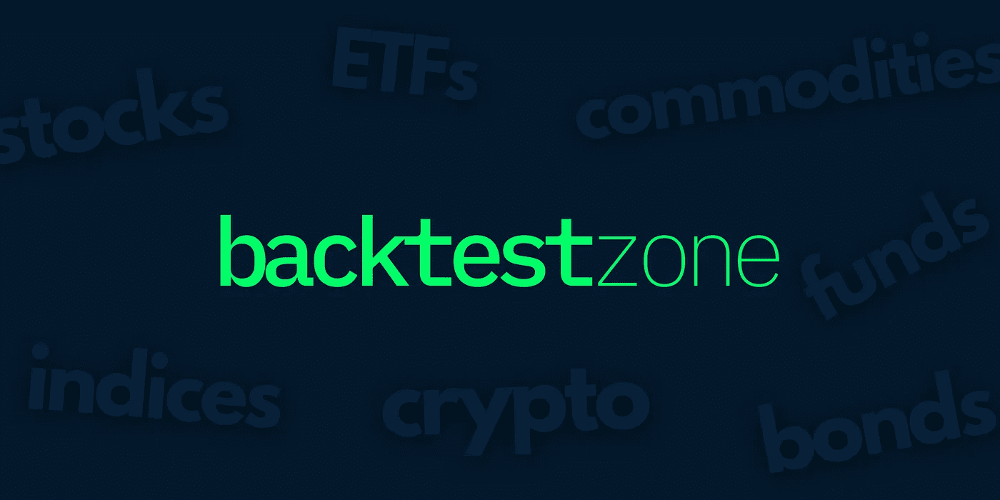
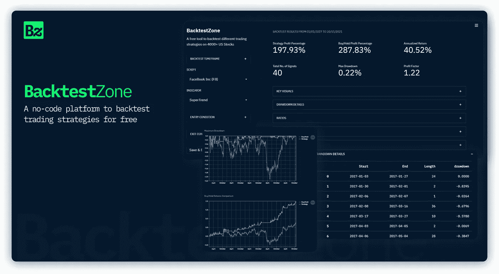

# 回溯测试交易策略，无需免费编码！

> 原文：<https://medium.com/codex/backtest-trading-strategies-without-coding-for-free-e8339393d8cb?source=collection_archive---------0----------------------->

## 一个易于使用的无代码平台，可以运行任意数量的回溯测试

[backtestzone.com](https://www.backtestzone.com/)

# 介绍

当我被介绍到算法交易领域时，我感到恐惧多于兴奋，因为从头开始构建和回测交易策略需要大量的编程。经过调查，看起来这是每个试图找出算法交易编码过程的人面临的共同问题。

虽然很难，但我致力于学习使用编程(尤其是 Python)来构建和优化交易策略的来龙去脉，并对它们进行回溯测试以可视化结果。但是我可以说，学习经历并不是那么愉快和耗时。

# 无代码

但是时代在变。如今，你不必真的知道如何编码，只要有编程概念就可以了。这正是无代码的含义。这个革命性的想法一直让我着迷，因为它在现实世界中能有多大的帮助。

当这个概念在 web 开发中得到主流关注时，我有不同的想法。为什么我不应该应用这个想法来创建一个 algo 平台，让人们不用免费编码就可以创建和回溯测试交易策略呢？那就是 [BacktestZone](https://www.backtestzone.com/) 最初诞生的时候。

# 回溯测试区

图片作者(【backtestzone.com】T4 预览)

BacktestZone 基本上是一个无代码平台，可以创建、定制和回测任意数量的交易策略，而无需零成本编码。该应用程序被设计成本质上是抽象的，这样就不会用模糊的词语来迷惑初学者。

它还附带了一个易于使用的界面来分解复杂的东西，更重要的是，只需几次点击就可以从头开始构建和回测交易策略。

# 目前的数字

现在我们来谈谈数字。目前，有超过 24K 的可交易美国资产(股票、密码、商品、外汇、交易所交易基金、基金、债券和指数)用于回测交易策略，随着印度、英国、斯德哥尔摩等不同交易所的引入，未来几天可能会增加。

说到技术指标，该平台拥有 30 多个指标，从移动平均线等基本指标到漩涡和随机等高级指标。最后，该平台有 25 个以上的评估指标，伴随着大量的数字、百分比、比率和视觉效果。

# 为什么使用 BacktestZone？

你可能一直有一个问题，为什么我要选择这个特定的平台，而不是像 MetaTrader 和 TradingView 的回溯测试服务这样的大公司。对我来说，有两个重要的原因。

首先，其他回溯测试平台要么完全需要编码，要么部分需要编码。更不用说，这些编码的文档对初学者来说相当复杂。然而，在 BacktestZone 的帮助下，你可以创建你自己想要的交易策略，而不需要花任何精力在编码上。不管这个策略是基础的还是高级的，你所要做的只是点击几下，剩下的就交给你了。

第二，尽管有一些提供无代码解决方案的回溯测试平台，他们收取你一大笔订阅费。如果不选择订阅计划，您可能无法在某个限制(如 3 或 5)内创建和回溯测试策略。但 BacktestZone 却不是这样。你可以创建任意数量的策略，并无限制地免费进行回溯测试。

# 结束语

总之，在我作为算法交易者和研究者的经历中，我发现了一个问题，并决定提出一个解决方案，我相信很多人都可以从中受益。最后，我确实想出了一个。

创建这个项目不是为了商业或利润动机，而是为了一个单一的原则，“帮助”，因为我不希望人们再为编码策略而受苦，因为这真的是一个很难走出的困境。

希望你会发现这个平台是一个有用的。您可以使用此处的链接[启动该应用程序，并使用此处](https://www.backtestzone.com/)的链接[获得该平台的完整可视文档。如果你喜欢这个平台，请与你认为可能受益的其他人分享。此外，我愿意听取您对平台改进的建议。](https://www.backtestzone.com/how-to-use)