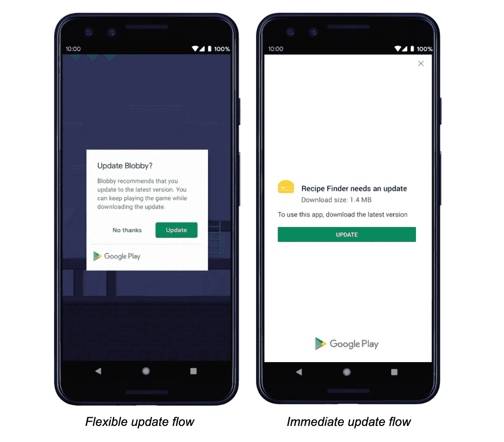

# 向后兼容性:如何在未来不破坏你的应用

> 原文：<https://medium.com/codex/backwards-compatibility-how-to-not-break-your-app-in-the-future-68ac69b503f2?source=collection_archive---------3----------------------->

用户不会更新他们的应用程序，所以你必须从第一行代码开始就做好准备。向后兼容是应用程序开发中最棘手的事情之一。它要求你考虑未来，考虑所有可能的功能开发。我想出了几条规则，应该能让整个过程不那么令人不知所措。

## 什么是向后兼容？

向后兼容性是指任何应用程序版本都可以在未来工作，即使数据响应被更新。假设您正在构建一个照片共享应用程序，在提要中显示图像。几个月后，您决定将视频添加到提要中。它在最新的 appstore 版本上运行得很好，但没有更新应用程序的用户怎么办？在最坏的情况下，提要会因为来自服务器的意外数据类型而崩溃。旧客户机上的新数据是确保向后兼容性的根本问题。

向后兼容性问题主要有两种:**崩溃**，和**数据不一致**。

对于崩溃，它们通常是由**改变预期数据类型**或者**删除预期数据类型**引起的。例如，在解析提要响应时，当改变预期的类型时，很容易意外地导致 JSON 解析崩溃。类似地，当从服务器有效负载中移除字段时，可能会违反旧客户端的可空性保证，从而导致空解引用崩溃。添加新的字段很少会导致崩溃，因为旧的客户端不会触及这些端点。

对于数据不一致，用户可能会错过关键功能，并且不知道他们错过了什么。回到图像/视频提要的例子，如果一个老的客户端不知道如何在提要中呈现视频，用户将会错过你的应用程序中一半的内容！其他问题包括隐私侵犯，当旧客户端不尊重新的应用程序隐私设置(如阻止的用户，私人内容)。如果你设计了一个 api，在照片上添加一个字段，上面写着`isPrivate`，老客户就不会知道不显示图片。添加新的服务器功能时，仔细考虑旧客户端上的行为是关键。

当然，当您遇到向后兼容性问题时，最大的痛苦就来了，因为到那时要修复它已经太晚了！

值得注意的是，向后兼容性只是需要服务器响应的应用程序的问题。如果你正在开发一个单机离线应用，那么你就不用担心了——应用版本之间不会有任何不一致。用户将在任何时候从 appstore 更新获得工作版本。

## 为什么向后兼容性很重要？

作为开发者，用户并没有像我们希望的那样更新他们的应用。所以旧版本的用户很有可能会有长尾效应。从代码的第一行开始考虑向后兼容性可以避免所有潜在的崩溃和数据不一致。

# 如何编写向后兼容的移动代码

幸运的是，为了将来的成功，我在我的应用程序中遵循了一些策略。这个建议适用于 iOS 和 Android，无论你如何构建你的后端都应该执行。

## 第一步:建造一个逃生出口

从最坏的情况开始，如果事情发生灾难性的错误，您需要一种方法来强迫用户更新。大多数情况下，你会创建一个全屏模式，在用户更新之前阻止与应用程序的交互。



确保从第一个应用程序版本开始就一直有一个强制更新流程

为了从应用程序生命周期的一开始就实现这一点，我建议创建一个“每日消息”查询，这是应用程序打开时做的第一件事。在那里，您可以添加一个标志，这将导致应用程序需要更新。您还应该有一个已定义的用户代理模式，在每个服务器负载中传递应用程序版本和其他有用的诊断信息。

注意:一定要谨慎使用这个选项。每次你为了更新而屏蔽应用程序的功能时，你可能会流失一批用户。相反，继续这些步骤，更优雅地处理错误，以允许旧版本应用程序的用户继续工作。

## 步骤 2:实现内容占位符

对于应用程序中的每一条内容，都应该有一种方法将其剔除，并提示用户更新他们的应用程序。这也迫使你考虑你可能正在做的任何服务器响应切换的`default`情况，以避免崩溃。

在带有提要的应用程序中，将服务器响应列表中的每条内容解析为可空的数据类型。然后，您可以设计一个简单的内容块，以应对数据以 null 结束的情况—可能是一个简单的不透明 UILabel:

```
let updateAppLabel: UILabel = {
  let label = UILabel()
  label.text = "Update your app to see this content!"
  label.backgroundColor = UIColor.black.withAlpha(0.8)
}()
```

与任何服务器响应一样，重要的是始终考虑空的情况——既包括真正的网络故障，也包括来自未来服务器的意外新数据。

## 步骤 3:编写认真的服务器代码

到目前为止，我一直专注于灭火:确保如果我们在服务器上发布新功能时意外出错，我们的客户端应用程序不会崩溃。但是对于数据不一致这一类别，由服务器编写新的 API 来识别旧的客户端版本。

以下是我发现自己做出的一些错误假设:

*   不要假设客户端会尊重标志。相反，应用服务器端内容过滤。
*   不要假设客户端会调用新的查询。这对于服务器端的处理尤其有害——例如，如果上传成功，那么让客户端从您新奇的照片过滤引擎中获取新图像。一旦服务器端处理完成，旧的客户端就不知道如何回调。
*   不要删除未使用的字段。不幸的是，为了向后兼容，您需要保留这些端点，以便遗留客户端连接调用。

# 结论

遵循这些步骤来避免未来的巨大麻烦——毕竟，你无法改变过去。