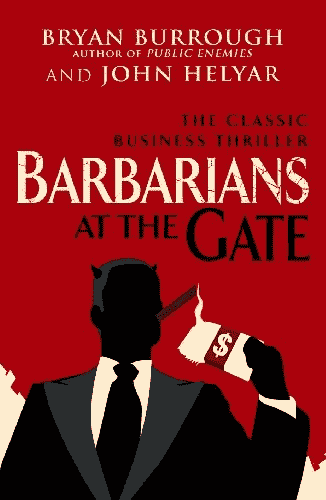

# 软件开发之门的蛮战

> 原文：<https://medium.com/codex/barbarians-at-the-gates-of-software-development-bf6a6fcbe0e2?source=collection_archive---------1----------------------->

## 当金钱战胜逻辑

[来自 Abebooks 的图片](https://www.abebooks.co.uk/Barbarians-Gate-Fall-RJR-Nabisco-Helyar/31246311879/bd?cm_mmc=ggl-_-UK_Shopp_Trademax-_-product_id=UK9780099545835USED-_-keyword=&gclid=Cj0KCQjwuO6WBhDLARIsAIdeyDKarPMq3buLk5nxiA_VmMILDKc9aSjSUly51fNUFnNKX8rqr2S0pDwaAkRHEALw_wcB#&gid=1&pid=1)

[门口的野蛮人:RJR·纳贝斯克的没落](https://amzn.to/3PBaN1d)这本书讲述了 1989 年 RJR·纳贝斯克历史上最大的杠杆收购(LBO)以及随后的贪婪和疯狂的故事。在维基上阅读相关内容— [蛮战在大门口](https://en.wikipedia.org/wiki/Barbarians_at_the_Gate)。

软件项目的投标也同样疯狂，通常会产生…