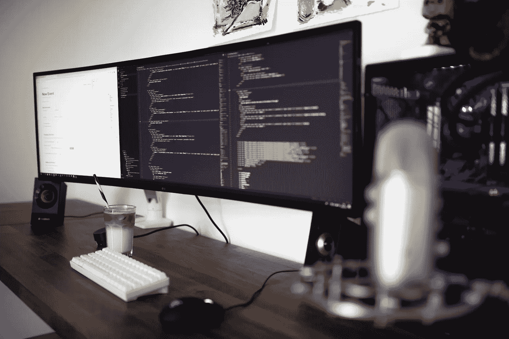

# 敲打头部

> 原文：<https://medium.com/codex/bashing-heads-f2fd0db7fb5c?source=collection_archive---------9----------------------->

卡斯帕·卡米尔·鲁宾在 [Unsplash](https://unsplash.com/s/photos/scripting?utm_source=unsplash&utm_medium=referral&utm_content=creditCopyText) 上的照片

## 为了乐趣和利益的 Shell 脚本。

好吧。也许这不是很酷，在人群中的那种事情。我听到了；它很旧了，几乎不是盒子里最强大的工具。尽管如此，我还是很想大声自豪地说:

**我喜欢 BASH 脚本！**

虽然在我平常的日子里不太需要脚本，但它时不时会出现，看到它如何…