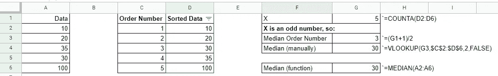

# 你必须了解的基本数据分析知识—集中趋势的测量(MCT)

> 原文：<https://medium.com/codex/basic-data-analysis-knowledge-you-have-to-understand-measures-of-central-tendencies-mct-4d4195a6859?source=collection_archive---------0----------------------->

归功于[谷歌](https://storage.googleapis.com/grow-with-goog-publish-prod-media/images/Data_Analytics_social.scale-100.png)

对于我们来说，在没有数据分析师的帮助下自己处理数据集并不罕见，我们唯一的工具是 Google Sheets。对于在非分析领域工作的人来说，这种情况下经常使用的常用术语是计算平均值、最小值和最大值、基本可视化、使用颜色渐变来指示哪些值较低或较高的着色表等等。在这种情况下，我想尝试分享一些简单的事情，这些事情不需要数据分析师的帮助就可以轻松完成，但如果使用得当，可以提供大量信息和见解。

> 最后，如果我们想在数据驱动的环境中工作，每个人都需要努力理解这些基本问题。

在我们进一步讨论这个问题之前，让我先给你介绍一下基础统计学中已知的三种 MCT。你可以说是 3M(均值，中值，众数)。我不会使用任何数学符号，所以你们这些不是数学或类似背景的人不用担心，哈哈。❤

**MEAN(平均值)**
通常用来知道一组数值的平均值是多少。我们使用均值来表示属于整数、数字和浮点类的变量。计算平均值很简单，你只需要得到“你的值的总和”(姑且称之为 X)，然后除以“你在使用多少数据”(姑且称之为 Y)。例如，如果我们有 X = 100，Y = 5，那么我们的平均值等于 20，这可以通过将 100 除以 5 得到。您可以通过使用函数`=AVERAGE()`在 Google Sheets 中轻松使用这种计算。

谷歌表上计算平均值的例子。

**中位数(百分位-50)**
通常用于从一组数值中知道中间值是什么。我们使用中位数作为属于整数、数字和浮点类的变量，类似于平均值。定义中值并不比平均值简单，但仍然足够容易让我们正确理解它。我们只需对我们的值集进行升序排序，然后取中间值。假设我们有一组随机排序的值，我们拥有的“数据总数”(姑且称之为 X)是 5。在对数据进行升序排序后，如果 X 是一个偶数，我们可以很容易地将 X 除以 2，然后我们将得到中位数的序号。如果 X 是奇数，我们必须将 X 加 1，然后将结果除以 2，然后我们将得到中位数的序号。我们可以使用函数`=MEDIAN()`轻松定义 Google Sheets 中的中位数。

计算 Google 工作表中值的示例

**MODE (Most Common)** 通常用于了解一组值中最常出现的值。我们对属于范畴、区间和类似的变量使用模式。定义模式值很简单，我们只需要计算“每个值出现的次数”(假设是 X)，然后降序排列，然后我们可以得到具有最高 X 值的模式值。我们可以使用函数`=MODE()`在 Google Sheets 中轻松定义模式。

Google Sheets 中计算模式的示例(附加:平均值和中值的比较)

我们知道，进行数据分析的步骤是:

1.  定义
2.  收集
3.  争论
4.  探索
5.  共享

**定义**

因此，我们必须定义这种数据分析的需求。在这种情况下，我们希望从 2022 年 1 月的交易数据记录中了解任何 MCT。这就是为什么我们决定用变量来获取数据:

1.  `transaction_id`:在我们网站上创建的交易的标识符。
2.  `created_date`:我们网站上创建的交易日期。
3.  `product_category_id`:在我们网站上购买的产品类别的标识符。“食物”1 个，“电子”4 个，“艺术&工艺”9 个，“书籍”17 个。
4.  `transaction_value_idr`:交易金额以印尼盾计

**收集**

通常，我们通过我们的数据库收集这样的数据，我们不会谈论那个，但是假设我们在工作表“sample_data”中的这里得到数据[。 ***这个数据是我自己创造的，没有使用任何一方的任何数据。*** 让我们来看看我们的数据:](https://docs.google.com/spreadsheets/d/1FGW26c3EPD_uReyjxEfEOGKkzdtabSI7wLbEyd6epjg/edit?usp=sharing)

**扯皮**

我们需要做的几个步骤是(这里不能一一提到):

1.  检查异常值
2.  检查空值
3.  检查不正确的数据输入
4.  依此类推。

假设我们已经完成了上述所有步骤，幸运的是我们在数据中没有发现任何问题，因此我们可以直接进入下一步，开始寻找我们的 MCT。

**探索**

最后，我们可以开始探索我们的数据。假设我们有一些问题需要使用这些数据来回答:

> `transaction_value_idr`、`product_category_id`、`created_date`的 MCT 是什么？对于每个变量，哪种测量方法是正确的，为什么？从这次数据探索中，我们能得到哪些启示？

让我们从第一个变量`transaction_value_idr`开始。这个变量类属于整数类。这意味着使用模式来定义 MCT 将是不合适的。您可以查看我们在工作表“transaction_value_idr”中使用的同一文件，以直接查看该工作表。

比较“transaction_value_idr”的平均值和中值

为什么会这样？因为平均值会受到异常值的影响，而中位数不会。在这种情况下，使用中位数作为独立`transaction_value_idr`的 MCT 是安全的。我们用`product_category_id`来分解这个怎么样？

按“产品类别标识”列出的“交易价值标识”的细分平均值和中值

正如我们现在看到的，最高的均值(7.8Mio)和中值(7.3Mio)发生在`product_category_id = 4`(电子)，最低的发生在`product_category_id = 17`(图书)。这就是为什么以前我们得到的平均值和中间值之间的差异很大，因为我们交易的价格范围太大了。现在让我们看看我们是否把`transaction_value_idr`和`created_date.`结合起来

比较“transaction_value_idr”与“created_date”的平均值和中值。

从上图中我们可以看到，2022 年 1 月`transaction_value_idr`的日形态有一条正向趋势线(保持增长)直到月末。最低的`transaction_value_idr`发生在 2022–01–02 RP 1.5 mio(黄圈)，最高的发生在 2022–01–20 RP 46.5 mio(红星)。

对于下一部分，我们想探索一下，如果我们把所有的变量结合起来，有`transaction_value_idr`、`created_date`和`product_category_id`。

比较每个 product_category_id 的 transaction_value_idr 的每日平均值和中值。

从上面的图表中我们可以看到，对于 product_category_id Food 和 Book，平均值和中值之间没有显著差异，但是对于 Electronic 和 Art & Craft，我们看到了平均值和中值之间的显著差异，即平均值大于中值，这意味着数据分布正偏态，与 MCT 相比，异常值数据过高。

好了，到目前为止我们一直在用均值和中值，但是什么时候要用众数呢？下一部分，我们将使用模式从`product_category_id`和`created_date`获得适当的 MCT，我们还将与均值和中值进行比较，这样我们就知道为什么我们必须使用模式，而不是其他模式。让我们转到工作表“产品类别标识创建日期”。

product_category_id 和 created_date 的 MCT 比较。

正如我们所看到的，每个 MCT 的结果是不同的，哪一个是正确的呢？我们先开始讨论 product_category_id。

`product_category_id`变量只是我们在现实世界中产品类别名称的一个标签，比如食品(1)、电子产品(4)、艺术&工艺品(9)、书籍(17)，这意味着“数字标签”不能用均值和中位数来聚合。显而易见的答案是模式是正确的。从上表中，我们可以看到`product_category_id = 1`是我们的客户在 2022 年 1 月购买的最常见的产品类别。

对于使用上述相同逻辑的`created_date`变量，Mode 将是测量 MCT 的明显选择。根据上表，我们可以看到大多数交易发生在 2022 年 1 月 25 日，啊，对了，发薪日，哇哦~！

让我们继续下一个我们想知道的探索，上面的公共日期对每个`product_category_id`都有效吗？

按每个产品类别标识比较 MCT 创建日期。

正如我们所看到的，每个`product_category_id`的模式是不同的。食品(1)主要是在 2022 年 1 月 21 日购买的。电子产品(4)主要在 2022 年 1 月 20 日购买。对于艺术&工艺(9)大多购买于 2022 年 1 月 24 日。最后一本书(17)主要是在 2022 年 1 月 25 日购买的。由此，我们可以假设一个很好的时间窗口，我们的大多数客户在 2022 年 1 月 20 日至 25 日期间进行了购买。很好的见解，对吧？:D

让我们添加更多与这个模式值相关的可视化。

根据我们掌握的数据，可视化模式间隔。

**分享**

最后，在最后一部分，我们必须分享我们的发现结果，基于我们上面计算的 MCT。让我们创建一个叙述，这样我们的读者可以更容易和更快地理解我们的发现！:D

分享我们的发现和见解的简单演示幻灯片。

> 好了，我想这就是这篇文章的全部内容。我希望它能让您清楚均值、中值和众数之间的区别，并知道何时以及如何在您的数据分析需求中使用它们。

> 如果你觉得这个帖子对你有用，请帮忙分享给你的同事。此外，作为一名新作家，我希望你能给我与我的帖子相关的意见和批评，这样我可以在未来写得更好，这将激励我继续与世界分享我的知识。最后但同样重要的是，感谢你一直看完我的帖子，这对我意义重大。回头见！