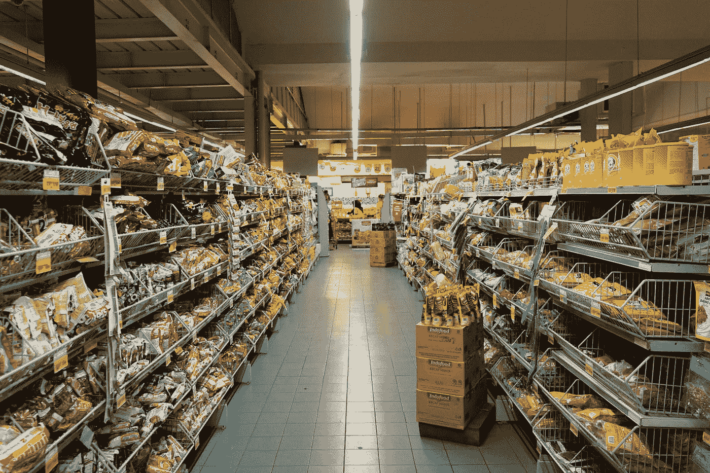
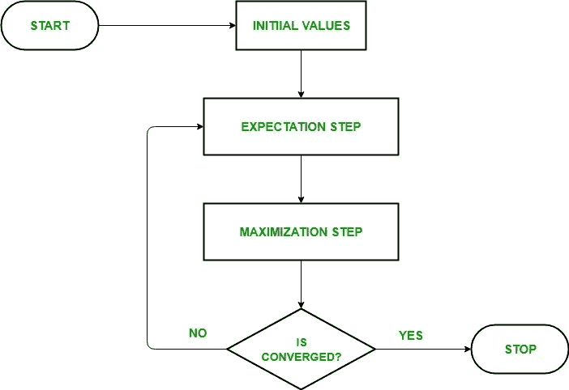
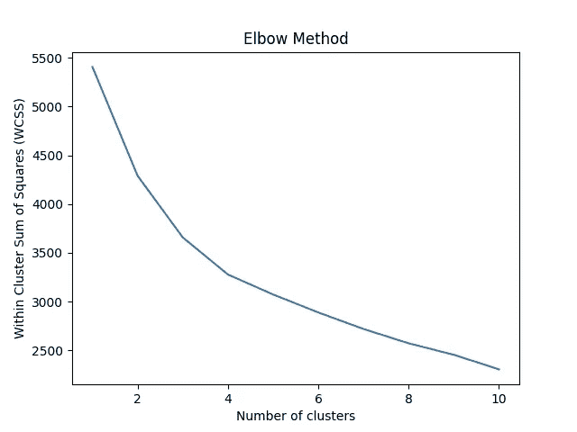

# 食品零售的基本 K-均值聚类

> 原文：<https://medium.com/codex/basic-k-means-clustering-for-food-retail-b3ef12507238?source=collection_archive---------8----------------------->

## 我们将对食品零售数据进行聚类，首先使用典型的 K-means 算法，然后使用平均价格指数

在 [Unsplash](https://unsplash.com?utm_source=medium&utm_medium=referral) 上由[菲克里·拉西德](https://unsplash.com/@fikrirasyid?utm_source=medium&utm_medium=referral)拍摄的照片

# 第 1 部分:一般聚类

聚类是一个非常好的工具，可以根据客户、商店或产品的相似程度进行分组。今天，我们将根据价格指数、产品数量和客户数量对商店进行分类

## 关于 K 均值

K-means 的工作原理很简单:

1.  它希望在您的数据集中找到预先确定的聚类。
2.  它通过寻找“聚类中心”来做到这一点，聚类中心是属于特定聚类的所有点的算术平均值
3.  然后它会计算出一个特定的点离哪个聚类中心最近

但是 K-Means 是如何如此快速地计算出这些聚类的呢？我听到你问了。K-Means 不使用穷举搜索方法，而是使用一种叫做*期望最大化的酷技术，*一种更直观的方法。它的工作方式如下:

*鸣谢:*[https://www . geeks forgeeks . org/ml-expectation-maximization-algorithm/](https://www.geeksforgeeks.org/ml-expectation-maximization-algorithm/)为了这张漂亮的流程图

## 准备数据

让我们连接到我们的数据库，我的数据存储在 Microsoft Server Management Studio 上，因此我将在这里连接到它:

如果您也来自 MSSQL，请记得用您的详细信息更新此代码

现在，我将使用 SQL 查询创建数据集:

请记住，我的数据集中有大约 1000 条记录，所以我可以使用' * '而不会浪费太多时间。如果你有更多的记录，使用*`SELECT element_1, element_2 … from database group by element_1, element_2`*会更有效**

**我们必须将数据标准化，使其标准差为 1，均值为 0。**

> *****重要*** *:使用* `*StandardScaler*` *功能进行分类。当你处理负数时，它也是有用的。不过不要在回归中使用它，* `*Normalizer*`会是你在那种情况下的首选武器。**

**缩放非常重要，因为它赋予数据的每个要素(基本上是数据集中的每个列)同等的重要性。如果没有它，范围最大的值将是最重要的。**

## **k-均值算法**

**第一步是导入我们将需要的所有库，它们如下:**

**执行预处理和 K-means 算法所需的库**

## ****最佳聚类数****

**为了找出将我们的数据分成多少组，我们将使用“肘形曲线”。“肘”点是曲线变平的地方，这是我们需要的集群数量。**

**以下是肘形曲线的代码:**

**我的肘部曲线看起来很奇怪——从视觉上看不清楚它在哪里变平**

****

**我的肘部曲线——不清楚平台从哪里开始**

**我们需要一些方法来计算出这条曲线的拐点。“膝盖”图书馆来拯救我们了。该函数使用 Kneedle 算法计算出肘部:**

**在我的例子中，输出是 **5 个集群，**这就是我们正在做的。**

## **执行 K 均值**

**现在我们已经有了所有的细节，让我们执行实际的 K-Means 算法:**

**太好了！现在我们有了所有的分类标签，是时候将它们添加回我们的数据集了:**

**现在，您的数据集中应该有一个额外的“集群列”。你完了！**

**下面是完整的代码:**

**从头到尾的基本 K-Means 算法**