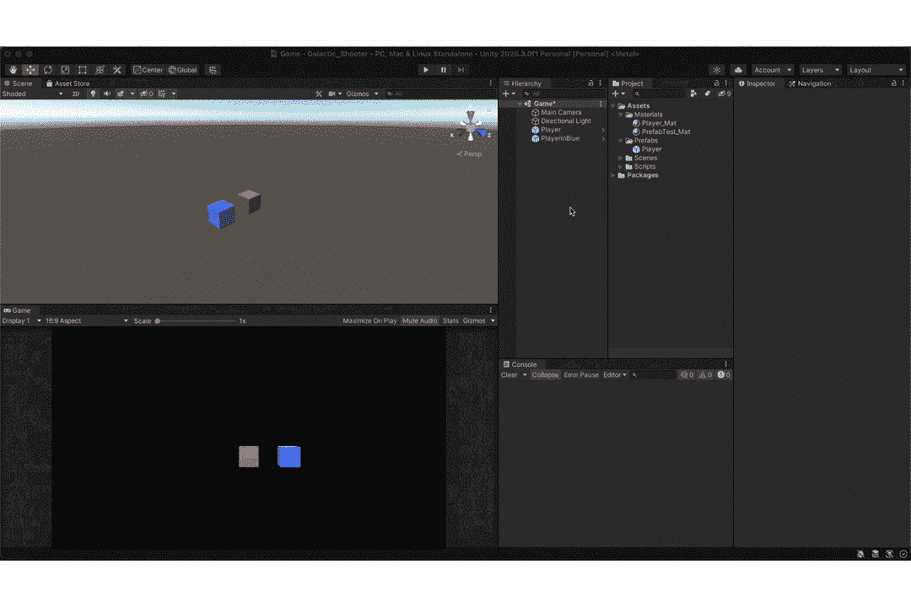

# 预设的基本概述

> 原文：<https://medium.com/codex/basic-overview-of-prefabs-c938a7088792?source=collection_archive---------15----------------------->

# ***什么是，为什么需要预制？***

预制的或预制的是指预先建造的物体/资产。在 unity 中，预置更像是特殊的组件，允许保存游戏对象以供重用。这意味着，如果有需要，你需要一个刚刚在另一个场景中构建和配置的资产，你可以通过使用它的预置来实现，而不是重新配置整个东西。

例如，你在一个 2D 平台上工作，并且在多个场景中有一组固定的敌人。如果你想改变他们的健康，你不需要去每个敌人那里改变它。你可以改变预置，并在整个游戏中改变它的价值，而不需要付出任何努力。

# ***如何创建预置？***

要创建一个预置，你所要做的就是把你配置好的游戏对象放到你的**项目面板中，**将会为那个游戏对象创建一个预置。虽然通常你会创建一个**预置**文件夹来包含你所有的预置。

预置，在创建时，变成蓝色，以区别于其他游戏对象。现在，这个新创建的预设充当所有其他预设实例的模板，所以对预设所做的任何更改都会反映到它的实例上。如下图所示。

或者，你可以改变预设的实例，并通过覆盖更改来使更改反映在原始预设上。您可以通过执行以下操作来实现这一点，

您也可以点击 *Revert All 来回滚您的更改*

也有一个选择，储存同一预制的变化。您可以通过执行以下操作来实现这一点，

你也可以选择原始预设来创建一个新的预设名称。

这是预制的基本概述。