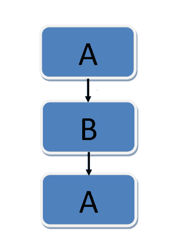

# 基本程序设计——结构化控制定理

> 原文：<https://medium.com/codex/basic-programming-structured-control-theorem-7b5504604615?source=collection_archive---------14----------------------->


*结构化控制定理*是成为程序员必须学习的编程基础部分。*结构化控制定理*是结构化编程的一个概念。控制结构是程序员经常使用的程序流结构。这次我们将讨论三种类型的控制结构，包括:

1.  **序列**
2.  **选择**
3.  **重复**

# 序列

Sequence 是根据指令流顺序执行的指令。该图分为两个维度，即显示对象的垂直和水平维度。该图分为两个维度，即显示对象的垂直和水平维度。

序列图的目的是确定产生所需输出的事件顺序。以及更详细地描述活动的工作流程和数据流。

序列有几个常用的组成部分。

*   **演员**

chord 组件用于将用户描述为系统外部的与系统交互的用户。

*   **生命线**

生命线组件用于描述虚线的形状。这个组件有一个盒子，里面有描述对象活动的对象。

*   **激活框**

激活盒组件用于表示对象完成对象所花费的时间。

*   **对象**

对象组件用于描述具有包含带下划线的对象名称的方框形状。

*   **消息**

消息组件用于描述对象之间的通信。

序列图流程的基本示例:



在流上执行的指令将根据指令从上到下排序。

自动柜员机上的序列图示例。


# 选择

选择是一个指令流，其中在满足某些条件后将执行一条指令。

有两种选择模式:

*   如果—否则
*   情况

**If-else &案例**

是一个在处理一个数据时创建分支条件的模型，在下一个数据执行前将首先检查它。

在编程的世界里，它可以被称为分支，通常用来控制输入和输出过程。编程世界中的分支意味着一个决策过程。

if-else 的示例如下:

```
if (kondisi) {
 ….
}
else {
 ….
```

这种情况的一个例子如下:

```
switch (var) {
case nilai1: ….;
break;
default : ….;
}
```

下面是图表格式。


# 重复

重复是一个指令流，其功能是重复执行，直到达到条件。

在编程中，这可以通过循环来完成。循环的功能是以一定的次数重复运行代码，直到达到预定的次数。

我们可以使用两种重复模型，即:

*   为
*   在…期间

用于重复

我们可以使用这个集合作为格式开头的重复。在你使用重复之前，你必须先确定这个重复会发生多少次。

使用 for 的示例:

```
for (initialValue; valueFinalLimit; multiplication) {
 ….
}let text = "";
for (x=0; x<3; x++) {
   text += "The number is " + i +;
} output:
The number is 0
The number is 1
The number is 2
The number is 3
The number is 4
```

示例图:


为了对编程有一个基本的了解，我们可以学习一些结构化的控制。

***谢了。***