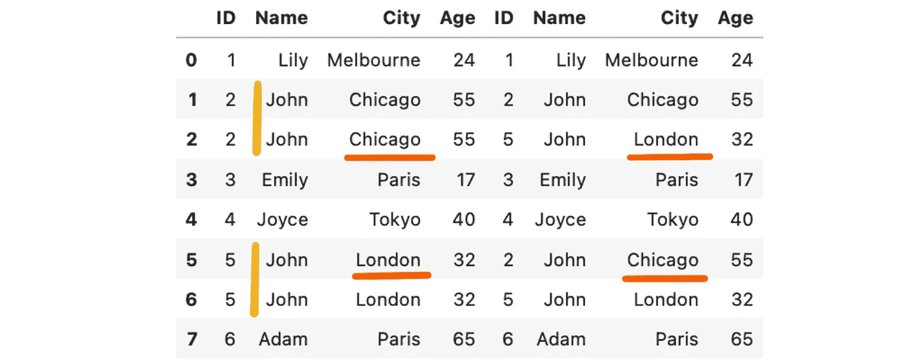
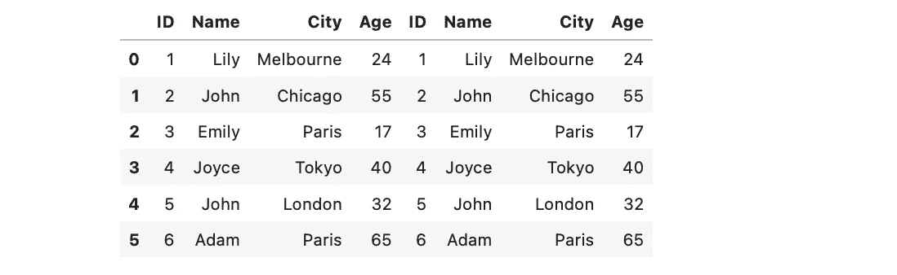

# 您需要了解的基本 SQL 语句(GROUP BY/HAVING/INNER JOIN)

> 原文：<https://medium.com/codex/basic-sql-statements-you-need-to-know-group-by-having-inner-join-6081d270de58?source=collection_archive---------8----------------------->

> 介绍

在[上一篇文章](/@24littledino/basic-sql-statements-you-need-to-know-select-distinct-order-by-limit-where-26b703df8aa1)中，我们讨论了非常基本的 SQL 语句。在本文中，我们将关注稍微复杂一点的— `GROUP BY`、`HAVING`和`INNER JOIN`，然而它们非常强大。

> *SQL 语句*

在下面的演示中，我们将使用同一个表作为示例。这个表叫做**客户**，记录了客户的信息。它有 4 个特征——`ID`**`Name`**`City`**`Age`，这个表中有 6 个客户。此外，**主键是** `**ID**`，因为您只能使用`ID`来唯一地标识每一行。******

****如果你对关系数据库不熟悉，去看看我的[上一篇文章](/@24littledino/basic-sql-statements-you-need-to-know-select-distinct-order-by-limit-where-26b703df8aa1)！****

********

******1。分组依据******

****第一个用于将具有相同值**的行分组为汇总行**，您可以决定**想要哪种类型的汇总**(即`MAX` / `MIN` / `AVG` / `SUM` / `COUNT`)。****

****比方说，我们想知道每个城市客户的平均年龄。我们如何对客户进行分组？****

****是的，**按城市**。然后，我们可以使用`AVG`函数得到每个城市的平均年龄。更具体地说，查询类似于`SELECT City, **AVG(Age)** FROM customers **GROUP BY City**;`，它返回—****

********

****如果我们现在想知道**每个城市的客户总数**该怎么办？****

****我们将功能更改为`COUNT`。需要注意的一点是`COUNT(*)`将**包括重复值和空值**，它只是计算行数。如果您想计算**唯一**行的数量，您有两个选项。****

*   ****在列名前添加`**DISTINCT**`关键字。它将删除重复项(参见[如何使用](/codex/basic-sql-statements-you-need-to-know-select-distinct-order-by-limit-where-26b703df8aa1)`[DISTINCT](/codex/basic-sql-statements-you-need-to-know-select-distinct-order-by-limit-where-26b703df8aa1)`)——`SELECT City, COUNT(**DISTINCT** Name) Customers FROM customers GROUP BY City;`。****
*   ****统计**主键**中的行数。正如我们在之前讨论过的[，主键是用来唯一标识行的。其中不会有任何重复的值，所以我们可以使用该属性来查找唯一行的数量— `SELECT City, COUNT(**ID**) Customers FROM customers GROUP BY City;`。](/codex/basic-sql-statements-you-need-to-know-select-distinct-order-by-limit-where-26b703df8aa1)****

****这两种方法产生相同的结果，即使`Name`不是主键。****

****⚡第二个列名是`Customers`，因为我们**重命名**该列，方法是在原始列名后给新名称分配一个空格。****

********

****这就是我们使用`GROUP BY`的方式！下一个问题是，如果我们想找到至少有两个顾客的城市怎么办？****

****你可能会想到`WHERE`子句(见[如何使用](/codex/basic-sql-statements-you-need-to-know-select-distinct-order-by-limit-where-26b703df8aa1) `[WHERE](/codex/basic-sql-statements-you-need-to-know-select-distinct-order-by-limit-where-26b703df8aa1)`)。不幸的是，`WHERE` **不能和**一起使用聚集函数，比如`COUNT`、`SUM`、`AVG`。因此，我们需要另一个条款— `HAVING`。****

******2。拥有******

****简单地说，`HAVING`的行为与`WHERE`完全相同，除了它是为聚合函数设计的。如果我们想找到至少有两个客户的城市，我们只需写下返回****

********

****如果你检查前面的结果，你会发现巴黎确实是唯一一个至少有两个顾客的城市。类似地，如果你想找到哪个城市的客户平均年龄高于 30 岁，你就写 T0。****

******3。内部连接******

****知道如何从一个表中提取信息是有用且关键的，但是很多时候我们想要合并来自多个表的信息。特别是，`INNER JOIN`允许我们选择在 **2 表**中具有**匹配值**的记录。****

****语法是这样的`SELECT * FROM table1 **INNER JOIN** table2 **ON** table1.column1 = table2.column2`。您可能会注意到，`ON`用于选择您想要匹配的列。例如，数据库中有两个表。一个存储客户的**个人信息**，另一个存储客户的**订单信息**。我们可能希望匹配两个表，以查看特定年龄范围的客户**的**订单偏好**，因此我们需要连接两个表。我们应该选择哪一列？******

**我知道我没有给你两张表的详细信息，但是我们会使用**客户 id**。ID 是合适的，因为它可以用来唯一地标识每个客户。假设我们使用**名称**作为匹配属性。几乎可以肯定的是，一定有不止一个同名的客户，我们如何确切地知道谁订购了哪些产品？是芝加哥的约翰还是伦敦的约翰？**

**让我们做一个有趣的实验。假设我们在`Name`属性— `SELECT * FROM customers c1 **INNER JOIN** customers c2 **ON** c1.Name = c2.Name`上将客户表与其自身进行内部连接。是的，我们可以这么做(我知道这看起来有点疯狂)。结果会是怎样的？**

**理想情况下，每个顾客都应该与自己相匹配。然而，事实并非如此，结果实际上是—**

****

**大多数客户如我们所料被合并，但是约翰出现了 4 次。为什么会这样？**

**是的，你是对的，我们没有使用主键(`ID`)来合并表。因此，芝加哥的约翰不得不与自己和伦敦的约翰合并。同样的事情也发生在另一个约翰身上。伦敦的约翰不得不与自己和芝加哥的约翰合并。现在你看到问题了。我们更喜欢使用**主键**作为匹配属性来避免这个问题(即匹配的客户实际上是不同的人)。**

**但是，如果您坚持，我们仍然可以使用`Name`来合并 2 个表，只是我们需要一个额外的列— `City`。因为我们的桌子很小，你可以看到唯一的问题是有两个约翰住在不同的城市。如果我们同时使用`Name`和`City`来合并表格，他们将被视为不同的人。换句话说，我们使用**多列条件**。查询是这样的— `SELECT * FROM customers c1 INNER JOIN customers c2 ON c1.Name = c2.Name AND **c1.City = c2.City**;`，它返回—**

****

**问题已解决！芝加哥的约翰只配自己，伦敦的约翰也配自己。然而，我们的数据库很小，我们可以手动找到问题。如果我们的数据库足够大，我们应该找到两个住在同一个城市的同名同岁的人。在这种情况下，我们仍然需要`ID`来合并表(这实际上是最好的选择)。**

**有时候你也许可以使用`INNER JOIN`而不会产生任何错误，但是**结果是有问题的或者没有反映现实**。基于不正确信息检索的分析会有偏差，基于有偏差分析的决策会有后果。因此，我们要尽可能地小心，这里有一些可以帮助我们减少错误的注意事项。**

*   ****通过重命名表格和指定表格名称来避免歧义****

**从上面的查询中，您可能会注意到我将第一个`customers`表重命名为`c1`，将第二个`customers`表重命名为`c2`。然后，当我引用一个列时，我是针对表的，即`c1.Name`(从第一个`customers`开始的`Name`列)、`c2.Name`(从第二个`customers`开始的`Name`列)。**在这种情况下，重命名是强制性的**，因为两个表的名称完全相同。此外，**由于`Name`列出现在两个表中，所以在这里**表名的说明也是强制性的。如果我们不指定我们指的是哪个`Name`，SQL 将会被混淆并返回错误。**

**但是，如果您有不同的表名和不同的列名，**重命名和指定都不是强制性的**。说到这里，为了方便起见，我们倾向于将表重命名为**一个更短的名称**(指定时不需要键入完整的名称)。为了清晰和调试，我们还在列**前指定了表名(当您知道列来自哪里时，调试会更容易)。因此，重命名和指定绝对是需要保持的好习惯。****

*   ****无匹配值—返回空表****

**当列中没有匹配值时，SQL 只返回一个空表。这通常是查询失败的标志。您可能使用了错误的表，引用了错误的列，或者数据库本身有问题。**

*   ****检查表分区的结果****

**现实世界中的一个表可能有数万行(甚至更多)。考虑到数据量，很难判断连接结果是否正确。我经常做的是首先对表进行分区，然后在小表上验证连接结果。例如，我们可以从每个表中随机抽取 20 行，对它们进行内部连接，并检查结果是否符合预期。然后，我们重复验证过程几次，因为这些行是随机选择的。我们可能会遇到这样的情况，查询只适用于部分数据(例如，验证数据集中没有选择不同城市的约翰)，而不是整个数据集。**

*   ****选择我们需要的列****

**如您所见，即使两个表中的列具有完全相同的名称和匹配的值，它们也会显示出来。我们应该选择我们需要的列**以避免冗余**。例如，我们在`Name`和`City`属性上连接两个表`c1`、`c2`，那么这两列中的结果值在两个表中是相同的(这实质上就是连接的含义)。因此，我们可以选择`c1.Name, c1.City`或`c2.Name, c2.City`。结果表将比原始表更整洁(显示相同的属性两次)。**

*   ****连接两个以上的表****

**其实我们可以加入**多个表**！例如，我们在数据库中有 3 个表。第一个存储客户的**个人信息**；第二个存储客户的**订单信息**；最后一个存储产品的**细节。我们可能想要匹配 3 个表来查看特定年龄范围**的客户**的**产品偏好**，因此我们需要**匹配 3 个表**。举例来说，匹配第一个和第二个表是不够的，因为第二个表不包含产品细节；匹配第二个和第三个表是不够的，因为第二个表不包含客户详细信息(即年龄)。匹配第一个和第三个表是不可行的，因为没有共同的属性。****

**你可能想知道为什么我们不把所有的数据存储在一个表中。实际上，这样做可能会导致**冗余和异常**，所以我们需要规范化表格(不过这是另一天的主题)。这里的关键点是我们可以连接任意多的表，语法类似于`SELECT * FROM table1 **INNER JOIN** (table2 **INNER JOIN** table3 **ON** table2.column1 = table3.column2) **ON** table1.column1 = table2.column2;`。**

**恭喜你，你已经走了这么远！在[上一篇](/codex/basic-sql-statements-you-need-to-know-select-distinct-order-by-limit-where-26b703df8aa1)和本文中，我们经历了`SELECT`、`ORDER BY`、`LIMIT`、`DISTINCT`、`WHERE`、`GROUP BY`、`HAVING`、`INNER JOIN`，这些关键词/从句应该足够你从数据库中提取信息了。然而，熟能生巧。你可以在网上找到大量的 SQL 练习，去练习吧，这样你就可以流利地组合从句了。祝你好运！**

**💛如果你喜欢这篇文章，一定要关注我！这真的鼓励了我，激励我继续分享。非常感谢。**

> **参考**

1.  **[https://www.w3schools.com/sql/sql_groupby.asp](https://www.w3schools.com/sql/sql_groupby.asp)**
2.  **[https://www.w3schools.com/sql/sql_having.asp](https://www.w3schools.com/sql/sql_having.asp)**
3.  **[https://www.w3schools.com/sql/sql_join_inner.asp](https://www.w3schools.com/sql/sql_join_inner.asp)**