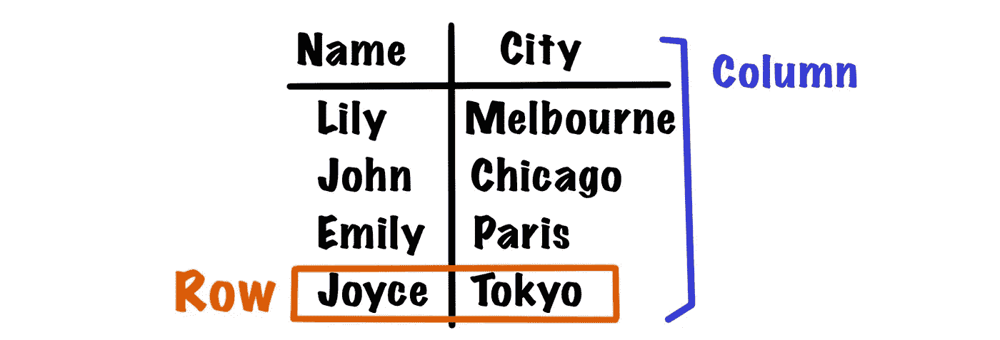
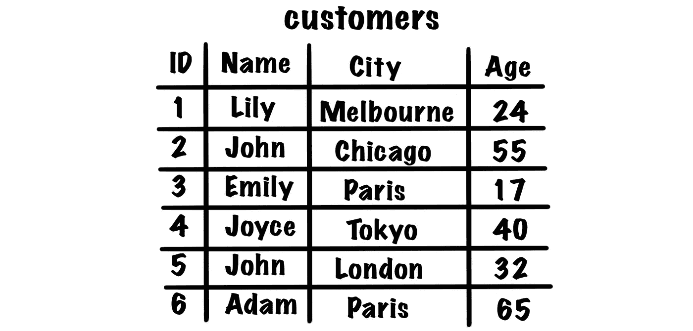
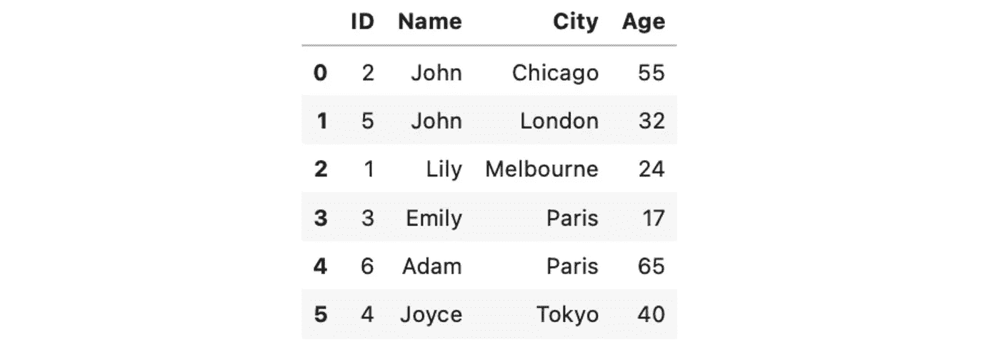

# 您需要了解的基本 SQL 语句(SELECT/DISTINCT/ORDER BY/LIMIT/WHERE)

> 原文：<https://medium.com/codex/basic-sql-statements-you-need-to-know-select-distinct-order-by-limit-where-26b703df8aa1?source=collection_archive---------13----------------------->

> 介绍

在本文中，我们将介绍常用的基本 SQL 语句(和技巧)，包括`SELECT`、`ORDER BY`、`LIMIT`、`DISTINCT`和`WHERE`。在下一篇文章中，我们将讨论`GROUP BY`、`HAVING`和`INNER JOIN`。一旦理解了这些语句，就可以形成自己的查询，并使用它们从关系数据库中提取所需的信息。

> 关系数据库

我们不会太深入理论部分，但是你需要知道关系数据库是基于**关系模型**。关系模型表示**表/关系**中的数据，每一列是一个**特征**；每行是一个**记录/对象。特别是，关系数据库不允许重复，所以你不会在一个表中看到两个完全相同的记录。因此，总是有一个或多个列可以用来唯一地标识记录，我们称之为属性的最小集合**可以用来唯一地标识记录**主键**。****

对于下面的例子，姓名和城市是**列**，因为它们表示一个人的特征；每个**排**都是一个人，是我们观察的对象。

然后，主键可以是**名称或**城市。举例来说，如果你知道一个人的名字，你就知道这个人住在哪里，因为在这个数据库中没有两个人同名。同样的逻辑适用，如果你知道这个城市，你就知道谁住在那个城市，因为这个数据库中的每个人都住在不同的城市。

然而，在现实世界中，情况往往不是这样。几乎可以肯定有两个同名同姓的人住在不同的城市。在这种情况下，姓名不能作为关键字，因为即使你知道这个人的名字，你也不能确定他/她住在哪里(不止一种可能性)。

同样，应该有 1 个以上的人住在一个城市，哪个城市不能是关键。为什么？是因为即使你知道这个城市，你**也无法确定**谁住在那个城市。

数据库到此为止！我们现在可以转到 SQL 部分了。

> 笔记

在开始编写查询之前，我们应该了解 SQL 的符号、重命名和功能。

1.  ***** :星号代表**所有**。如果要选择表中的所有列，不需要键入所有列名，请键入*。
2.  **重命名**:当你想缩写表名或者重命名列名时，你**在一个空格后加上新名字**。
3.  **功能**:有时候我们不想要原始数据，我们想对它进行简单的运算。常用功能有`MAX` / `MIN` / `AVG` / `SUM` / `COUNT`。别担心，我们稍后会谈到它们。

> SQL 语句

在下面的演示中，我们将以此表为例。这个表叫做**客户**，记录了客户的信息。它有 4 个特征— `ID` **、** `Name` **、** `City` **、** `Age`，这个表中有 6 个客户。此外，**主键是** `**ID**`，因为您只能使用`ID`来唯一地标识每一行。

⚡**`**Name**`**和** `**City**`都不是客户表中的主键！如果你不明白为什么，再读一遍上面的例子，你就会明白原因了。**

****

****1。从…中选择…****

**第一个是 SQL 中最基本的语句。具体来说，语法是`SELECT columns FROM table;`。您可以一次选择一列或多列。**

*   **`SELECT Age FROM customers;`**

**这将返回列`Age`**

****

**如果我们要计算`Age`列的**平均值(mean)** 怎么办？我们使用**功能** — `SELECT **AVG(Age)** FROM customers;`。**

**这将返回一个数字— 38.833。有时我们不想要原始数据，我们想要**聚合值**，它返回**一个单一数字**。基本上，名字就说明了一切。`AVG`计算一列的平均值；`SUM`计算一列中所有值的总和；`MIN`求最小值；`MAX`求最大值；`COUNT`数 t **他一列中的行数**。**

**⚡ `COUNT`简单地计算行数，**即使数值重复**。换句话说，如果我们写`SELECT **COUNT(City)** FROM customers;`，它返回 6，而不是 5(城市的唯一数量)。**

*   **`SELECT City, Age FROM customers;`**

**这将返回两列，`City`和`Age` —**

****

*   **`SELECT City FROM customers;`**

**如果你只选择`City`会发生什么，它返回—**

****

**看起来很好，对吧？但是，如果你仔细看，**巴黎出现两次**是因为有 2 个人住在巴黎。嗯，你可能认为这不是一个大问题。假设您的客户表存储了 10，000 名客户的数据，其中有 1，000 人居住在巴黎。当您使用相同的查询时，您将看到 Paris 1000，000，这肯定不是我们想要的。我们希望看到**独特的价值**(即，哪些城市至少拥有我们的一个客户)，这将我们带到下一个关键词。**

****2。独特的****

**为了避免重复，我们只需在列名前添加`DISTINCT`关键字。对于上面的例子，查询变成了`SELECT **DISTINCT** City FROM customers;`，它删除重复的值并返回—**

****

**暂时回到前面的例子，`COUNT(City)`将返回 6，因为它计算行数。但是，在添加了`DISTINCT`关键字后，我们可以找到城市的唯一数目— `SELECT **COUNT**(**DISTINCT** City) FROM customers;`返回 5。**

****3。排序依据****

**接下来，我们可以根据**一列或多列**对数据帧进行排序。假设我们使用 2 列来排序表格，即`SELECT * FROM customers ORDER BY City, Age;`。该表将按**第一列**排序；如果多行在第一列中有相同的值，则按第二列 `Age`的**排序。因此，如果第一列中的值是唯一的，则第二列是**而不是根本没有使用的**。****

**我们可以通过添加`ASC`或`DESC`来进一步决定数据**是升序**还是降序**。默认情况下，表格按升序排列**。但是，我们总是可以指定关键字来更清楚地表达我们的目的，例如`SELECT * FROM customers ORDER BY City ASC, Age ASC;`，它返回—******

********

****特别是，列`City`按字母顺序**列出**，因为该列中的值是字符串/字符。对于`City`中具有相同值的数据(即第 3 行和第 4 行都居住在巴黎)，由于这些值是整数，因此按照**数字顺序**中的第二列`Age`进行排序。****

****如果我们想根据`Age`对表进行降序排序，该怎么办？****

****是的，你是正确的。查询只是简单的`SELECT * FROM customers ORDER BY Age DESC;`。现在，如果我们只想提取**最老的人**的信息呢？****

****当然，您可以手动查看结果，并且只考虑第一行(因为我们已经基于`Age`对表进行了降序排序)。但是，如果结果**只有**包含第一条记录的信息，那就真的很好了，这样我们就可以节省时间，专注于分析部分。这个问题把我们带到了下一个关键词——`LIMIT`。****

******4。极限值******

****当我们只想查看前 n 行数据时，我们添加`LIMIT n`。按照前面的例子，我们想要找到最老的人，所以查询变成了`SELECT * FROM customers ORDER BY Age DESC **LIMIT 1**;`(因为我们只想要第一个 **1** 行)并且它返回—****

********

****事实上，亚当是我们桌子上最老的人👴🏼！现在，如果我们想找到第二年长的 T42 人呢？****

****我们应该使用`LIMIT 2`并手动查找第二条记录吗？事实上，不。我们可以使用关键字`OFFSET`。举例来说，当我们键入`LIMIT n OFFSET m`时，结果将包含从第 m 行开始的前 n 行**。******

****回到问题，我们要找的是**第二老的人**。换句话说，我们希望从第 2 行中找到第 1 行**(我们已经对数据帧进行了排序)。因为 SQL 的索引是 0，所以第二行的索引实际上是 1。因此，查询变成了`SELECT * FROM customers ORDER BY Age DESC LIMIT 1 **OFFSET 1**;`，它返回—******

****

**如果你查一下我们的表格，你会发现约翰确实是🧓第二长寿的人🏼。**

**⚡:在某些情况下，你可以使用`MAX/MIN`功能来代替`LIMIT`。例如，如果我们想找到表中最年长的人的名字和年龄，我们可以使用`MAX`。这个查询类似于`SELECT Name, **MAX(Age)** FROM customers;`，它返回【Adam，65】，因为我们只取了 *Age = MAX(Age)* 的记录。**

****5。其中****

**如果前面的查询让您感到厌烦，下面是更有趣的部分— `WHERE`子句！我们可以使用`WHERE`来指定列上的**条件，而**只选择满足这些条件的行**。在开始查询之前，我们需要知道一些重要的关键字。****

*   **`AND/OR`**

**首先要知道的是，我们可以在一个查询中分配多个条件。特别是，`Condition1 **AND** Condition2`表示一行**必须同时满足**和**两个条件**；`Condition1 **OR** Condition2`表示一行只需满足**至少一个条件**即可被选中。**

*   **`=`；`>`；`<`；`>=`；`<=`**

**这些是基本的算术符号——等于；大于；小于；大于或等于；小于或等于。我们通常在**数字**列上使用这些操作符。虽然它们也可以用在字符串/字符类型的列中，但是我们按照字母顺序来看事情并不直观。**

*   **`BETWEEN`**

**`BETWEEN`允许我们在范围之间选择数值**。因此，它更适合于**数字列和时间值**，因为在分类列中没有排序概念(即亚当不比莉莉大/小)。****

**例如，我们想找到年龄在 20 到 40 岁之间的客户，我们可以使用`WHERE Age **BETWEEN 20 AND 40**`。记住范围是**含**，20 或 40 岁的顾客也会被选中。**

**⚡:我们可以使用**算术运算符**实现同样的事情，但是使用`BETWEEN`可以让其他人更有效地理解我们的查询。举例来说，上面的查询也可以是`WHERE Age >= 20 **AND** Age <= 40`(客户必须满足两个条件才能返回)。**

*   **`IN`**

**`IN`允许我们指定多个值，并且只选择具有这些值的行**。假设我们想找到住在巴黎或东京的客户，我们可以使用`WHERE City **IN** ('Paris', 'Tokyo')`。****

**此外，如果我们想找到住在巴黎或东京的客户，我们只需在`IN` — `WHERE City **NOT** IN ('Paris', 'Tokyo')`前添加一个`NOT`关键字。**

*   **`LIKE`**

**`LIKE`允许我们在类型为**字符**的列中搜索**特定模式**。虽然`LIKE`也可以在数字列中使用，但是由于数字的性质，我们倾向于使用算术运算符。**

**为了描述模式，我们使用`%`或`_`。在 SQL 中，`%`代表 **0、1 或多个字符**，而`_`代表 **1 个字符**。**

**假设我们要查找姓名中包含 *i* 的客户，我们不关心姓名是以 *i* 开头，还是以 *i* 结尾，或者只是中间有 *i* 。我们可以用`WHERE Name **LIKE** '%i%'`。更明确的说，`%`可以是 0 字符，所以`Name`可以以 *i* 开头，也可以以 *i* 结尾。或者，`%`可以是 1 个或多个字符，所以 *i* 可以在`Name`中间。**

**如果我们要指定`Name`以 *i* 开头，并且在 *i* 之后有**至少 2 个字符**怎么办？**

**我们用`WHERE Name **LIKE** 'i__%'`。 *i* 前没有符号，所以`Name`必须以 *i* 开头， *i* 后的 **2** `**_**` **符号**规定了**I 后必须有 2 个字符**(一个`**_**`代表 1 个字符)。最后，我们添加一个`**%**` 符号，因为我们**不在乎** **名字有多长，只要在 *i* 之后有 2 个字符。在这种情况下，名字 *Ivy* 、 *Iris* 、 *Isabelle* 都会被选中，因为它们符合条件。****

**恭喜，你成功了👏🏻！这些是最基本和最常用的 SQL 语句。然而，还有几个更有力的陈述我们没有讨论— `GROUP BY`、`HAVING`、`INNER JOIN`。在下一篇文章中，我们将详细介绍它们，再见！**

**💛如果你喜欢这篇文章，一定要关注我！这真的鼓励了我，激励我继续分享。非常感谢。**

> **参考**

1.  **[https://www.w3schools.com/sql/sql_like.asp](https://www.w3schools.com/sql/sql_like.asp)**