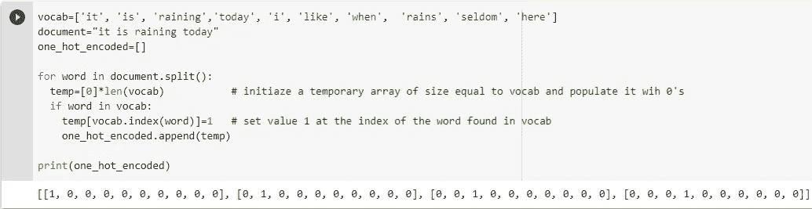
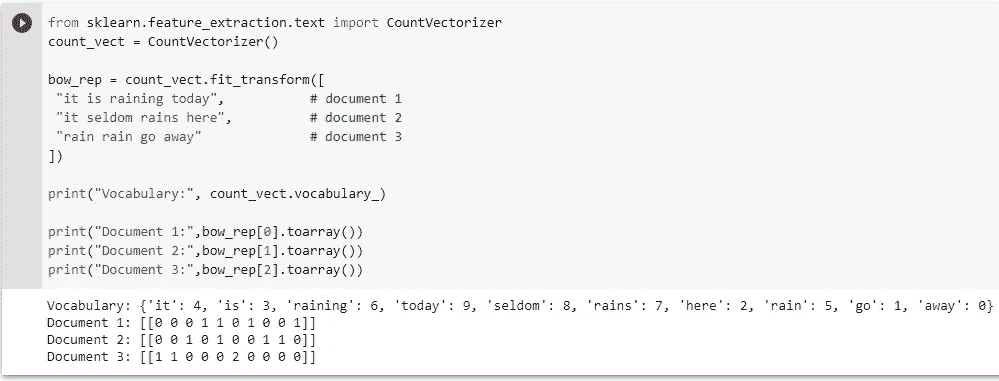
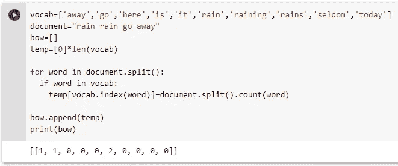
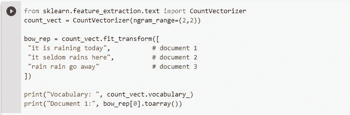
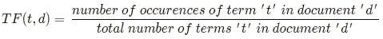
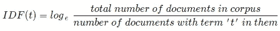
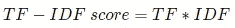
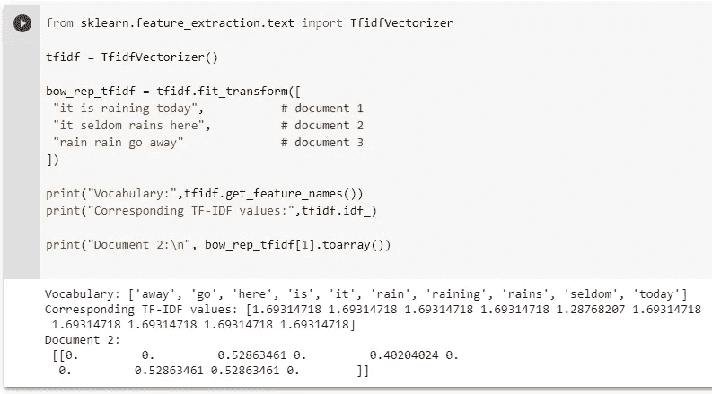
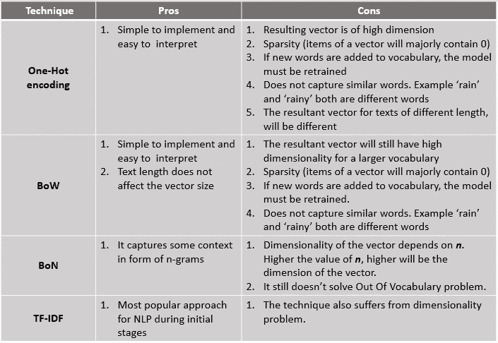

# 自然语言处理的基本文本处理技术

> 原文：<https://medium.com/codex/basic-text-processing-techniques-for-nlp-3b9e0f84b024?source=collection_archive---------12----------------------->


图片来自 [Pixabay](https://pixabay.com/?utm_source=link-attribution&utm_medium=referral&utm_campaign=image&utm_content=1867195) 的[像素](https://pixabay.com/users/pexels-2286921/?utm_source=link-attribution&utm_medium=referral&utm_campaign=image&utm_content=1867195)

*这是一篇关于基本文本处理技术的短文:一键编码、单词袋、N-Gram 和 TF-IDF。*

在 NLP 中，一旦收集了原始数据，就必须将其转换成 ML 算法可以理解的数字形式。这被称为**文本表示**，是执行特征提取之前的重要步骤。

有很多技术可以应用在文本上，并以矢量的形式表现出来。在本帖中，我们将通过示例代码尝试理解几个基本问题。

# 样本数据集

我们将在一个玩具数据集上工作，它有如下三个文档。文档的集合被称为**文集**。

```
Document 1:
"It is raining today."Document 2:
"I like when it rains."Document 3:
"It seldom rains here."
```

忽略文档的小写，如果我们从所有这些文档中提取唯一的单词，我们将得到下面的数组。来自语料库的独特单词的集合被称为**词汇**。

```
['it', 'is', 'raining',' today', 'i', 'like', 'when',  'rains', 'seldom', 'here']
```

让我们为每个单词提供一个唯一的 id，如下所示:

```
it      = 1
is      = 2
raining = 3
today   = 4
i       = 5
like    = 6
when    = 7
rains   = 8
seldom  = 9 
here    = 10
```

# 一键编码

这是最简单的技术。在一键编码中，一个单词将被表示为一个向量，其大小等于词汇表的大小。该向量的元素或项目将由 0 组成，除了在词汇表中该单词的索引处将被设置为 1。

例如，对于我们由 10 个单词组成的样本数据集，单词 **'it'** 将被表示为[ **1** ，0，0，0，0，0，0，0，0，0，0，0]，**将被表示为[0， **1** ，0，0，0，0，0，0，0，0， **'rains'** 将被表示为[0，0，0，0，0，0，0，0**

如果我们在文档 1 中替换这些值，我们现在可以将文档 1 表示为:

[ [1,0,0,0,0,0,0,0,0,0] , [0,1,0,0,0,0,0,0,0,0] , [0,0,1,0,0,0,0,0,0,0] , [0,0,0,1,0,0,0,0,0,0] ]

用于一键编码的简单 python 脚本可能如下所示。当然这不是优化，只是为了学习。



# 单词袋(蝴蝶结)

这种技术主要用于文本分类问题。Bag 只不过是一个类，属于这个类的文本包含数据集中唯一的一组单词。如果两个文本包含相似的单词，则认为这两个文本属于同一类别(包)。

词汇表中的每个单词都根据它在文本中出现的次数来评分。例如，文档 d1 将是[1，1，1，1，0，0，0，0，0]，因为‘it’，‘is’，‘raining’，‘today’在句子中仅出现一次，而词汇中的其他单词不存在，因此得分为 0。你会注意到，与一键编码相比，这种方法减少了向量的维数。

下面的例子基于来自 **sklearn** 的**计数矢量器**类。



这里使用的文档与我们的原始文档略有不同，并且条目的索引也有所更改。如果您仔细观察文档 3，单词“rain”重复了两次，因此向量在索引 5 处包含计数 2(单词“rain”的索引由 CountVectorizer 设置为 5)，而“go”(索引=1)和“away”(索引=0)出现了一次，因此这两个单词的索引处的值都设置为 1。

文档 3 的 BoW 实现如下所示，并提供相同的输出。



# 一袋 N 克(BoN)

在这种方法中，我们不是将文本分解成多个单词，而是将文本分解成由 ***n*** 单词组成的组块(克)，因此得名 **n-gram** 。例如，如果我们在数据集上应用 2-gram，那么我们的词汇将是 10 个组块，每个组块由 2 个单词组成。

```
['it is' , 'is raining' , 'raining today' , 'i like' , 'like when'  , 'when it' , 'it rains' , 'it seldom' , 'seldom rains' , 'rains here']
```

这种方法保留了前两种方法中没有的一些文本上下文。此外，我们可以说 BoW 是 n-gram 的一个特例，其中 ***n*** 的值等于 **1。**



```
*Output:*
Vocabulary:  {'it is': 2, 'is raining': 1, 'raining today': 6, 'it seldom': 3, 'seldom rains': 8, 'rains here': 7, 'rain rain': 5, 'rain go': 4, 'go away': 0} 
Document 1: [[0 1 1 0 0 0 1 0 0]]
```

# 术语频率-逆文档频率(TF-IDF)

这种技术通常用于信息检索系统。以前的方法给予所有单词同等的重要性。根据这种方法，如果一个单词 ***w*** 在文档 ***d*** 中出现的次数较多，但是在语料库的其他文档中出现的次数较少，那么可以假设单词*对文档*更重要。为了确定这一点，我们必须计算 2 个因素:**

## **术语频率**

**它测量一个单词在文档中的出现频率，计算方法如下:**

****

## **反向文档频率**

**TF 赋予文档中所有单词同等的重要性，而 IDF 用于确定单词在整个语料库中的重要性。文档可能包含停用词或类似“it”、“is”、“of”等经常出现但不太重要的词。IDF 降低了文档中常用术语的重要性，提高了罕见术语的重要性。其计算如下:**

****

**最后用 TF 乘以 IDF 就可以得到一个词的 TF-IDF 值。**

********

# **比较**

****

**我希望这篇文章对你有所帮助，感谢你花时间阅读它！**

# **参考**

1.  **实用自然语言处理:*第三章***