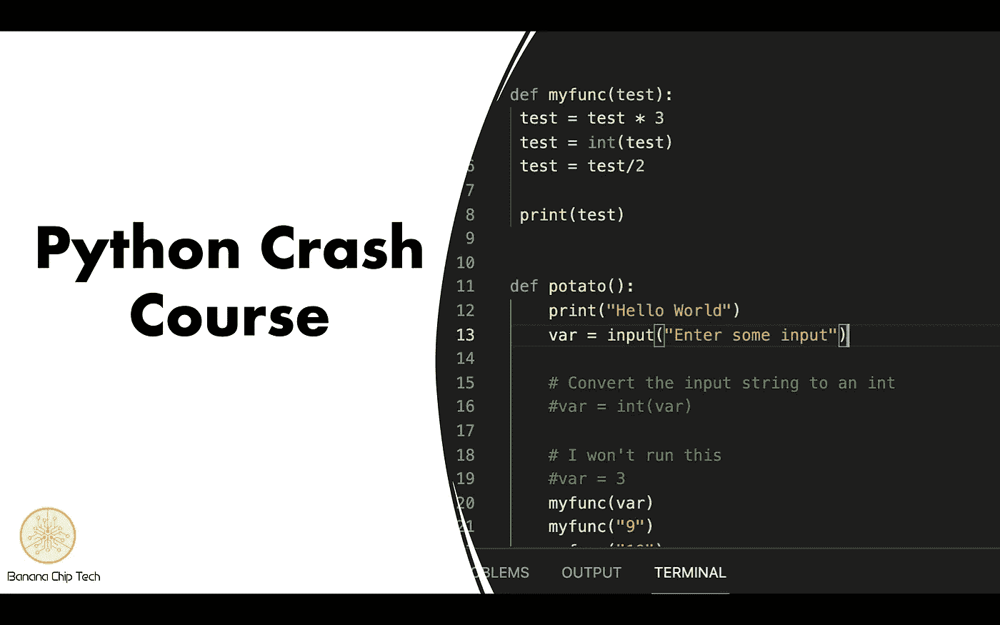

# Python 中的基本变量类型

> 原文：<https://medium.com/codex/basic-variable-types-in-python-4a121326cfe4?source=collection_archive---------10----------------------->

本书面课程是香蕉芯片技术公司 Python 速成班的一部分。视频讲座、编程作业作业等内容请访问我们的 [*网站*](https://www.bananachiptech.com/products/codingcourses/python/) *。*

变量是我们存储信息的方式，以便以后在程序中使用。因此，它们在编程时非常有用。我认为变量就像罐子，我们可以往里面装信息，然后…