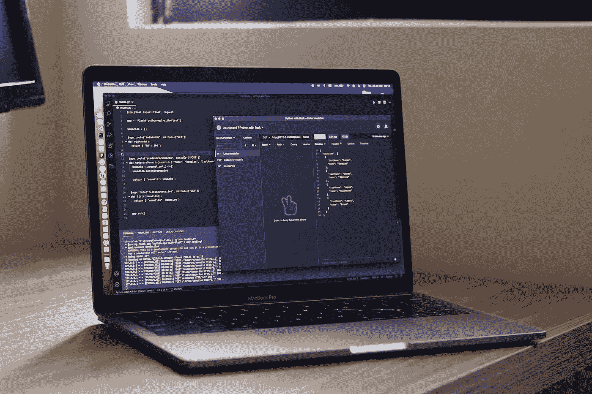

# 开发者门户的基础:让我们看看后台

> 原文：<https://medium.com/codex/basics-of-developer-portals-lets-look-at-backstage-29707a9e1e0f?source=collection_archive---------4----------------------->

## 定义和最佳实践

道格拉斯·洛佩斯在 [Unsplash](https://unsplash.com/s/photos/api?utm_source=unsplash&utm_medium=referral&utm_content=creditCopyText) 拍摄的照片

一个[开发者门户](https://docs.microsoft.com/en-gb/azure/api-management/api-management-howto-developer-portal)是一个包含你的 API、工具或服务文档的网站。例如，在这样的门户中，消费者可以发现 API，学习如何使用它们，请求访问和试用 API。

开发人员门户或应用程序编程接口(API)门户是一个重要的工具…