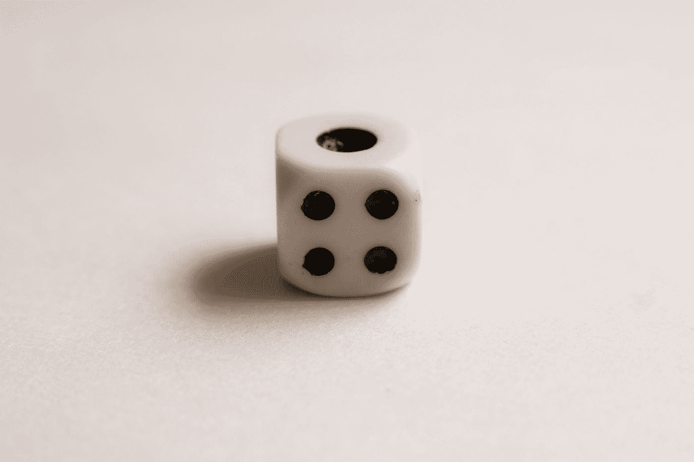
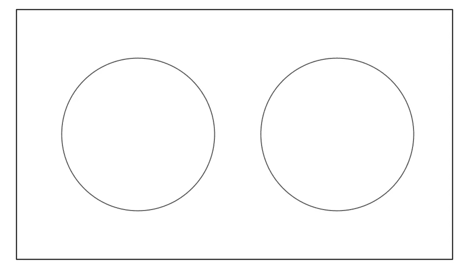
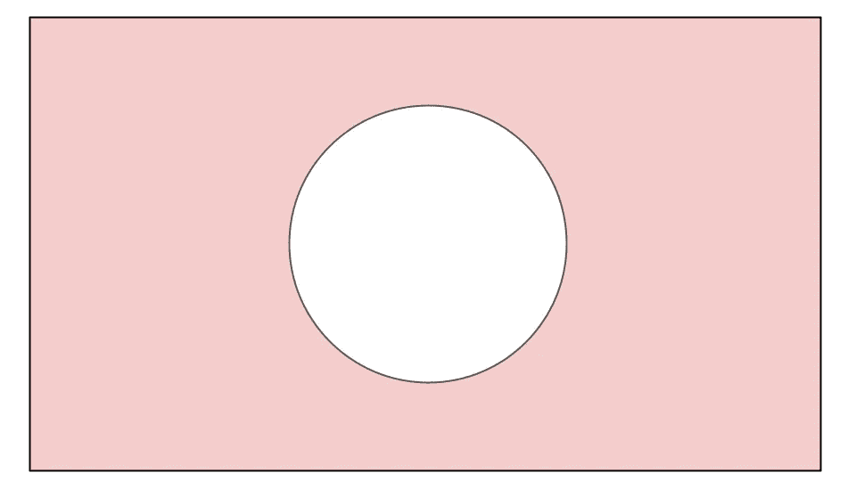
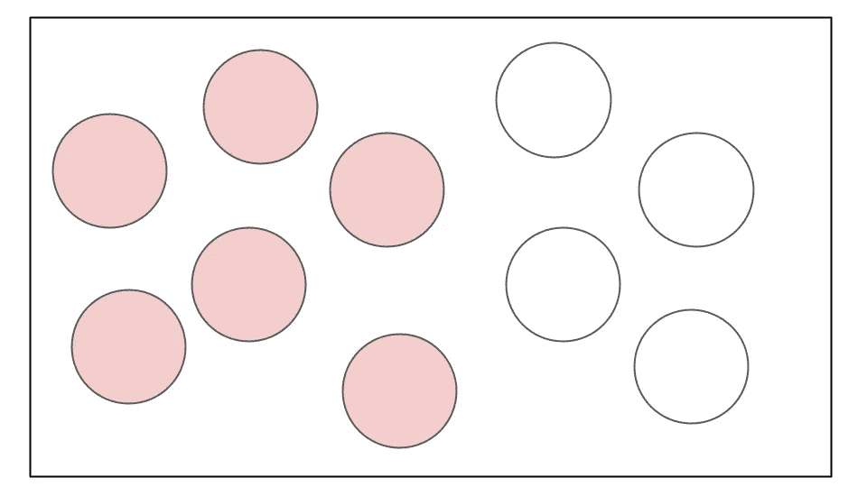
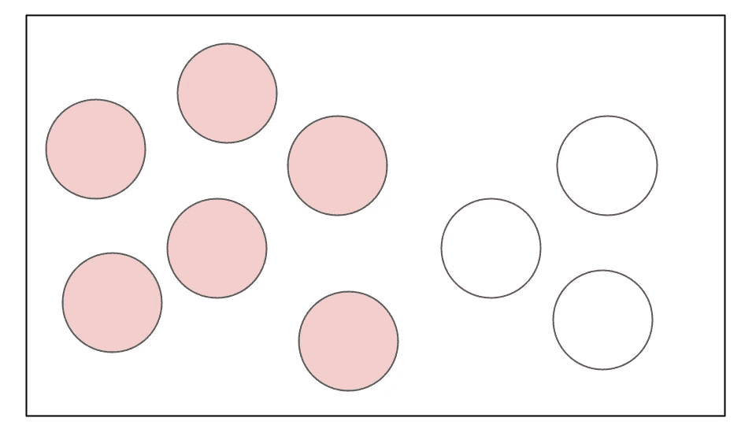

# 数据科学的概率基础(第一部分)

> 原文：<https://medium.com/codex/basics-of-probability-for-data-science-part-1-a5b5392bff7e?source=collection_archive---------8----------------------->

## 基本术语，集合运算，贝叶斯定理，独立性

数据科学主要是关于预测和推理。从这个意义上说，帮助我们理解数据的统计学在数据科学中起着至关重要的作用。而且由于概率是统计学中的基础之一，所以学习统计学首先要了解它。因此，在这篇文章中，我将从术语开始，带你了解它的基础知识。

格伦·卡丽在 [Unsplash](https://unsplash.com?utm_source=medium&utm_medium=referral) 拍摄的照片

# 有哪些基本术语？

关于概率，你应该知道的四个关键术语是实验、样本结果、样本空间和事件。如果你知道所有这些术语，请随意跳到下一部分。

首先，实验是一个可以重复无限次的动作，你可以定义它可能的结果。例如，“掷骰子”是一个实验。

当你掷骰子时，你可以得到 1 到 6 之间的任何数字。所以从 1 到 6 的每个数字都是实验的可能结果。在统计学中，我们称之为样本结果。在我们的例子中，所有样本结果的集合{1，2，3，4，5，6}被称为样本空间。

根据具体情况，您可能会收集不同的样本结果组合，而不是样本空间。我们称这样的组合为事件。通常，我们在统计学中用大写字母表示一个事件。因此，例如，仅来自骰子的奇数可以是一个事件，其样本结果集是{1，3，5}。

然而，不可能总是列出所有的结果。例如，你如何写出 6 位数的所有组合？所以人们一般会用其他的方式来形容。其中一种方法是表征样本空间，使其显示一种模式。另一种方法是陈述一个数学公式。

事件 X 的样本空间显示了一个模式，事件 Y 的样本空间用一个公式表示

使用这些方法，你可以计算一个事件的概率。例如，当我们称掷骰子为奇数事件 A 时，其概率为 P(A) = {1，3，5}/{1，2，3，4，5，6} = 3/6。

# 概率是如何相互作用的

但是在现实世界中，你很少单独使用一个概率。更常见的是，您会计算两个或更多不同事件如何相互作用的概率。这些被称为集合运算，两个主要的交互是并集和交集。

从它们的名字可以看出，并集指的是 A 或 B 或两者都是的事件，交集指的是 A 和 B 的事件。要直观地理解这一点，请查看下面的维恩图。左边和右边的每一个都显示了一个并集和交集。

并集的维恩图/交集的维恩图

数学上，并集写成 P(A∪B)，交集写成 P(A∪B)。对我来说，通过从并集连接∪与 u，从交集连接∩与 n，更容易记住它们。而且因为并集中有相交部分，所以计算 P(A∪B)不是简单的 P(A) + P(B)。你需要从 P(A) + P(B)中减去 P(A∪B)才能得到 P(A∪B)的正确值。但是我们如何计算 P(A ∩ B)？这个问题的答案需要关于概率的进一步解释，所以我将在后面的章节中解决它。

然而，在某些情况下，两个事件之间可能没有交集。例如，如果每个 P(A)和 P(B)从骰子中得到一个偶数和一个奇数，你不可能让这两个事件同时发生。在这种情况下，我们说 P(A)和 P(B)是互斥的。而且因为 P(A)和 P(B)之间没有共同的结局，所以 P(A**∩**B)简单来说就是 P(A) + P(B)。

两个互斥事件的维恩图

最后，还有一个补语，意思是除了所选择的以外的一切。所以当我们说样本空间是 s，想找事件 a 的补时，它的概率是 1 - P(A)，我们写成 Aᶜ.

事件补集的维恩图

# 一个事件如何改变另一个事件的概率

两个或多个概率相互影响的另一个例子是条件概率。数学上我们写为 P(A|B)，读作给定 B 的概率，通俗点说就是 A 知道 B 已经发生的概率。如果您仍然不确定这是什么意思，请遵循下面的示例。

假设一个袋子里有 6 个红球和 4 个白球，事件 A 指的是从袋子里拿出一个红球。默认情况下，P(A) = 6/(6+4) = 6/10。

一个图表的 6 个红色和 4 个白色球在一个坏的

但是如果我们知道一个白色的球已经从袋子里抽出来了，我们称之为事件 B 呢？那么，由于 B 事件后袋中的球总数发生变化，抽中红球的概率也变为 6/(6+3) = 6/9。

抽出 1 个白球后的示意图

因此，由于知道事件 B 已经发生，P(A) = 6/10，但是在这种情况下 P(A|B) = 6/9。这就是条件概率的工作原理。

# 条件概率公式及其应用

现实生活中，一切都是相互关联的。因此，条件概率主要用于各种应用中。但是，你不能总是像上面的例子那样通过计数来计算条件概率。谢天谢地，托马斯·贝叶斯很久以前就建立了贝叶斯定理来解释一个事件的因果关系，如下图所示。

贝叶斯定理公式

用上面的例子，P(B) = P(得到一个白球)= 4/10，P(A ∩ B) = P(从袋子里抽出一个红白球)= (6/10) × (4/9) = 4/15。所以 P(A ∩ B) / P(B)就变成了(4/15) / (4/10) = 6/9，和上面的数一样。

在应用方面，贝叶斯定理广泛应用于从拟合模型到优化的机器学习中[1]。它也常用于金融风险评估，因为它可以在新信息给出后重新计算概率。

但仔细想想，并不是每个概率都依赖于其他概率。例如，不管你掷多少次硬币，一枚公平的硬币总有 50%的机会让你正面朝上。我们如何称呼这样的事件？

# 概率不变的事件

像那样的事件叫做独立，顾名思义，它的概率不依赖于先前的事件。因此，如果事件 a 和 b 是独立的，P(A) = P(A|B) = P(A|Bᶜ).所以贝叶斯定理的等式改变了。最初，贝叶斯定理是

贝叶斯定理公式

根据上式，P(A|B)变成 P(A)。因此，对于相依事件，P(A ∩ B) = P(A|B)×P(B)或 P(B|A)×P(A)。对于独立事件，P(A ∩ B) = P(A)×P(B)。如果您需要一个示例来更好地理解独立事件的交集是如何工作的，请遵循下面的示例。

独立事件的交集方程

假设你扔两个硬币，想得到一个{H，T}。如果我们列出所有的可能性，有{H，H}，{H，T}，{T，H}，{T，T}。所以第一次投出正面，第二次投出反面的概率= 0.25。

如果用上面的修正方程来解决这个问题，P(getting {H，T}) = P(A ∩ B) = P(A)×P(B) = P(从第一次投掷得到头部)×P(从第二次投掷得到尾部)= 0.5 × 0.5 = 0.25。从计算结果可以看出，两种方法产生的数字相同。

但是我们怎么知道事件是独立的呢？

在简单的情况下，如抛硬币，很明显可以看出它们是否独立。但如果不是，问问你自己事件是否能以任何顺序发生，因为当事件是独立的时，顺序不应该是问题。此外，您可以考虑一个事件是否会以任何方式影响其他事件的结果。更正式的方式是证明 P(A|B) = P(A)或 P(B|A) = P(B)。

> 下一个故事:[数据科学的概率基础(第二部分)|排列&组合](/codex/basics-of-probability-for-data-science-part-2-a640288262a1)

# 参考

[1]詹森·布朗利。"机器学习的贝叶斯定理的简明介绍."*机器学习大师【2019 年 12 月 3 日[https://machineellingmastery . com/Bayes-theory-for-Machine-Learning/。](https://machinelearningmastery.com/bayes-theorem-for-machine-learning/.)*

[2]拉森、理查德 j .和莫里斯 l .马克思。*数理统计及其应用简介*。第六版。