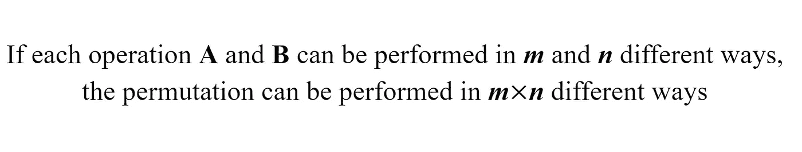

# 数据科学的概率基础(第二部分)

> 原文：<https://medium.com/codex/basics-of-probability-for-data-science-part-2-a640288262a1?source=collection_archive---------10----------------------->

## 排列组合

在我之前的[帖子](/codex/basics-of-probability-for-data-science-part-1-a5b5392bff7e)中，我提到了 3 种计算结果的方法。回想一下，这三种方法都是手动计数，表征显示模式的样本空间，并陈述数学公式。因为现实世界中的情况可能很复杂，所以我们主要使用数学公式。因此，我将在这篇文章中更多地谈论公式部分。在我们开始之前，我们需要先解决条款问题。

由[马库斯·斯皮斯克](https://unsplash.com/@markusspiske?utm_source=medium&utm_medium=referral)在 [Unsplash](https://unsplash.com?utm_source=medium&utm_medium=referral) 上拍摄的照片

我要讲的两个主要概念是排列组合。它们听起来可能很相似，但它们之间有明显的区别。排列，也可以称为排列或顺序，关心的是顺序。然而，一个组合不会。记住这一点，让我们先来看一个排列。

# 排列

打开一个 3 位数的挂锁，解决一个单词的争夺，以及猜测哪个队将赢得第一，第二和第三名都涉及到排列。对于每一种情况，都有一个数学公式来找出每一种可能的排列。

## 乘法法则

还记得我上一篇文章中关于计算两个事件交集的部分吗？回想一下，这个等式取决于你处理的是独立事件还是非独立事件。

独立事件和相关事件的交集方程

乘法法则使用类似的概念。基本的想法是计算两个数的乘积来得到排列的数目，当你看它的名字时，这是很明显的。但是有一件事你应该小心，当事件相互依赖时，数字可能不是你想的那样。

乘法法则的基本思想

例如，如果我们想打开一个 3 位数的挂锁，每个数字都是独立的。因此，每个数字不会影响其他数字的执行方式。所以排列的数目就是 10×10×10 = 1000，因为你可以为每个数字选择从 0 到 9 的任意数字。

1000 个序列可以用一个 3 位数的挂锁制作

再举一个例子，假设你要从一副 1 到 10 的牌中抽取两张没有替换的牌。与前面的例子不同，抽两张牌是相关的，因为第一次抽会影响第二次抽。所以不是 10×10 因为有 10 张牌，所以排列数是 10×(10 - 1)。

抽两张牌就能做出 90 个序列

## 置换方程

然而，当事情变得复杂时，把它们都列出来可能会很麻烦，或者你可能会在列出它们时犯一些错误。所以你可以用一个简单的等式。

一个计算没有置换的排列的方程

当您从 n 个不同的元素中排列一个 k 长度的序列而没有替换时，可以使用这个等式。当您将这个等式应用到上面的卡示例时，

等式如何工作的演示

你可以检查你得到相同的数字。

## 无区别排列

然而，元素并不总是不同的。例如，Word scramble 可以多次包含同一个字符。在这种情况下，你应该使用不同的公式。

一个计算无区别元素排列的公式

从上面的公式来看， **N** 代表你要排列的对象数量，每个 n₁到 nₘ代表对象的类型。例如，如果“aciisssttt”是一个单词 scramble，您可以应用下面的公式。

公式如何工作的演示

# 结合

不过，有时顺序并不重要。例如，在购买 8 件衬衫中的 3 件时，或者在世界杯决赛抽签时，你不需要考虑顺序。在这种情况下，当你使用与上面相同的等式时，你会不必要地得到比你实际得到的更多的组合。因此，你可以使用下面的等式。

计算一个组合的方程式

就像排列部分的等式一样，每个 n 和 k 代表不同对象的数量和组合的大小。所以当我们回到衬衫的例子时，

方程式的演示

这个方程的另一个术语是二项式系数，其中一个广泛使用的属性是

计算每种组合的方程式

正如你所期望的，等式中包含了 sigma，它可以让你计算 n 个不同对象的每种组合。例如，当有三个不同的物体时，

上面等式的一个例子

除了计算你可以用二项式系数做出多少种组合，你还可以将它应用到二项式分布中，以计算重复 n 次实验可以获得多少次成功。更多关于二项分布的内容将在我的下一篇文章中介绍。

> 下一个故事:[简单解释随机变量和分布的基本原理](/codex/easy-explanation-of-a-random-variable-and-fundamentals-of-a-distribution-4fd197bb7303)

# 参考

[1] Larsen，Richard J .，和 Morris L. Marx。*数理统计及其应用概论*。第六版。

[2]马尔科·塔博加。*二项式系数*，[https://www.statlect.com/glossary/binomial-coefficient.](https://www.statlect.com/glossary/binomial-coefficient.)