# 以 Azure Functions + Hands on 为例，介绍无服务器功能的基础知识

> 原文：<https://medium.com/codex/basics-of-serverless-functions-by-the-example-of-azure-functions-hands-on-2de0e9a13d03?source=collection_archive---------8----------------------->

用 Azure 函数演示无服务器函数

云计算的最大优势之一是能够根据您的需求开启和关闭您的计算资源。这有不同的种类。IaaS 服务，如虚拟机，在不使用时会自动关闭(例如，30 分钟不使用后会关闭)。此外，还有 PaaS 服务数据库(例如 Azure SQL ),它们只在有查询传入时才启动计算资源。

*请记住，无服务器并不意味着云服务不托管在任何服务器上。没有服务器运行代码是不行的。无服务器只是一个抽象层，由云提供商提供给你。这使得您不必考虑底层的服务器基础设施。你只需要交付你的代码，云供应商管理底层基础设施。*

# 无服务器功能

这些无服务器的云资源还伴随着无服务器的功能，这是一种非常轻量级的托管代码的方式。有时它们不被称为 PaaS，而是被称为 FaaS(功能即服务)。这些服务不同于之前命名的两种类型的服务，它们是从头开始构建的，旨在尽可能高效地满足您的计算需求。它们可以在几秒钟内启动，也可以在几秒钟内终止其计算资源，并且几乎可以无限扩展。在 AWS 中，它们被称为 Lambdas，在 GCP 云函数中，但为了获得这些函数的更详细的概述，我们将 Azure 函数作为重点。

## Azure 函数

Azure 函数允许你在短时间内运行代码，就像其他无服务器的函数一样。在最常见的托管(我们稍后会详细讨论这个话题)计划的情况下，消费计划的最大运行时间是 10 分钟，而默认是 5 分钟。如前所述，使用这些功能的好处是，如果真的使用了这些功能，你只需要向你的云提供商(在我们的例子中是 Azure)付费。此外，底层服务正在管理您的所有扩展需求，因此您不必担心。

## 支持的语言

没有用特定语言实际编写代码，就没有代码执行。幸运的是，Azure functions 提供了[多种不同的语言](https://docs.microsoft.com/en-us/azure/azure-functions/supported-languages)来支持你喜欢的工作方式。支持的语言列表包括:

*   C#
*   计算机编程语言
*   java 描述语言
*   以打字打的文件
*   Java 语言(一种计算机语言，尤用于创建网站)

## 托管计划

此外，你需要确定一个适当的方式来托管你的功能。你可以在以下不同的 Azure 功能托管计划中进行选择，以获得最大收益。

**消费** **计划:**这个计划最纯粹的形式是无服务器的。您无法控制函数的扩展方式，它会自己做所有的事情。你也可能会遇到所谓的“冷启动”问题。因为您的函数需要在执行代码之前启动，所以不可能立即执行。此外，这个计划中的函数不能运行超过 10 分钟，而默认的最大运行时间是 5 分钟。

**高级计划:**与消费计划非常相似，但具有提供预警功能的特点。这些解决了冷启动问题。但是请记住，这意味着您的函数的一些实例总是在运行，因此会产生成本。此外，这些函数使您能够在不同的计算配置之间进行选择，以尽可能好地满足代码的要求。此外，您还可以获得虚拟网络的支持，您的功能几乎可以不间断地运行(默认值设置为 30 分钟)

**专用计划:**专用计划与 Azure WebApp 中的 App 服务计划相同。您可以精确控制底层计算基础架构以及扩展设置。这个托管计划最适合长时间运行的应用程序。

## **触发器**

[触发器](https://docs.microsoft.com/en-us/azure/azure-functions/functions-triggers-bindings?tabs=csharp)使功能运行，每个功能都有一个触发器。以下是 Azure Functions 提供的触发器的非详尽列表:

*   Http 触发器
*   卡夫卡
*   活动中心
*   宇宙数据库
*   存储帐户
*   网钩

还有绑定的概念，我会在另一个故事中详细解释。

# 演示

关于如何部署 Azure 函数的小教程无疑是对它们最好的理解。我将向您展示如何使用 Azure 门户创建一个可以由 HTTP 调用触发的 Azure 函数，如何在 Azure 门户内部更改代码以及如何调用该函数。我会选择 C#作为我的编程语言，但是代码会非常简单，每个人都能理解。唯一的先决条件是 Azure 订阅。你也可以在本地开发功能，但这将是以后另一个故事的主题。现在来看看这个小演示:

首先，你必须登录 Azure 门户网站，然后搜索功能。在那里你选择功能应用。

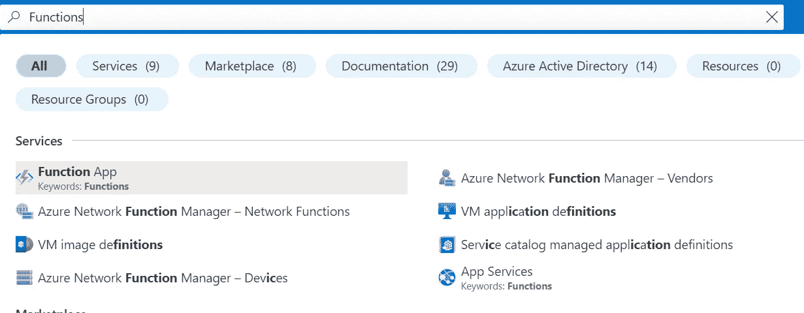

搜索功能

然后你必须创建一个函数。

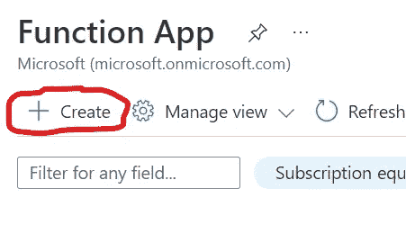

在这里，您可以选择功能的配置。选择您的首选订阅，获取一个资源组或创建一个新的资源组，并为您的功能选择一个唯一的名称。(对所有 Azure 函数名称全局唯一)

之后，你可以选择是使用代码还是 docker 容器，你的运行时栈(语言)，版本以及函数应该存放的区域。对于操作系统，你可以在 Linux 和 Windows 之间选择，但只有 Windows 支持在 Azure 门户内编辑你的代码。之后，你可以选择一个消费计划，这就是你开始所需要的。现在只需按下 review + create。在其他选项卡中，您可以控制功能的存储位置(存储帐户)、虚拟网络设置和用于监控的应用洞察(强烈建议用于生产工作负载)。虽然这些都是值得考虑的，但对于这个简单的演示来说并不需要。

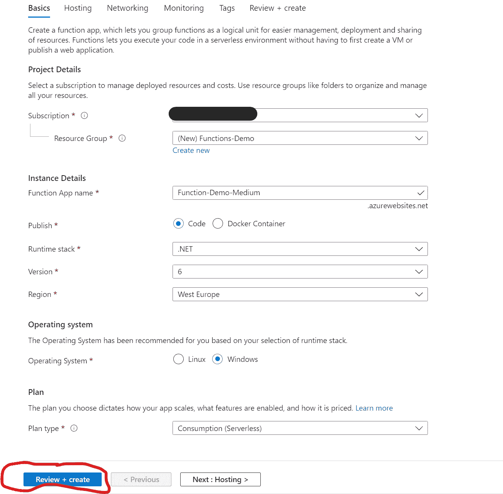

并再次按创建。

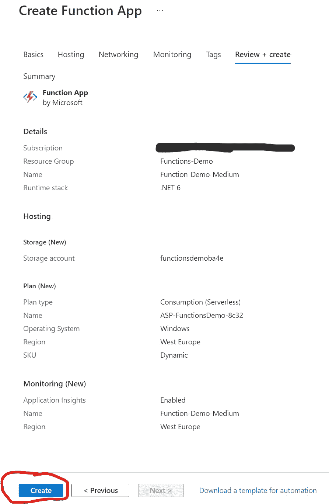

现在你应该看到类似这样的东西，你可以看到 Azure 创建你的服务的进度。

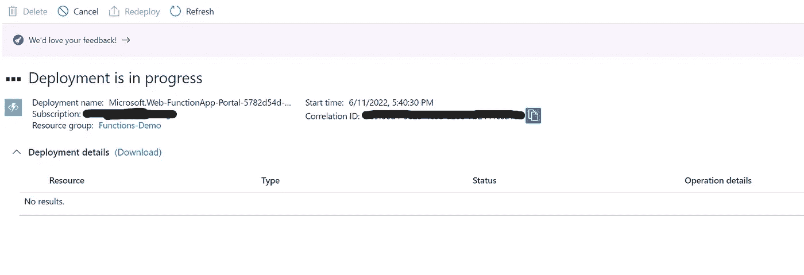

在您得到资源已部署的通知后，您可以转到您选择的资源组，并单击您新创建的 Azure 函数。

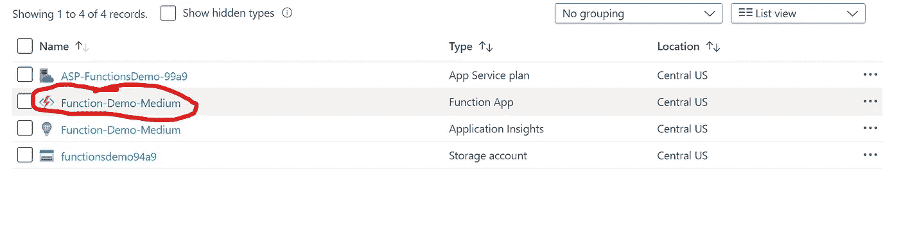

在您的资源中，您需要转到 Functions 并单击 Create。

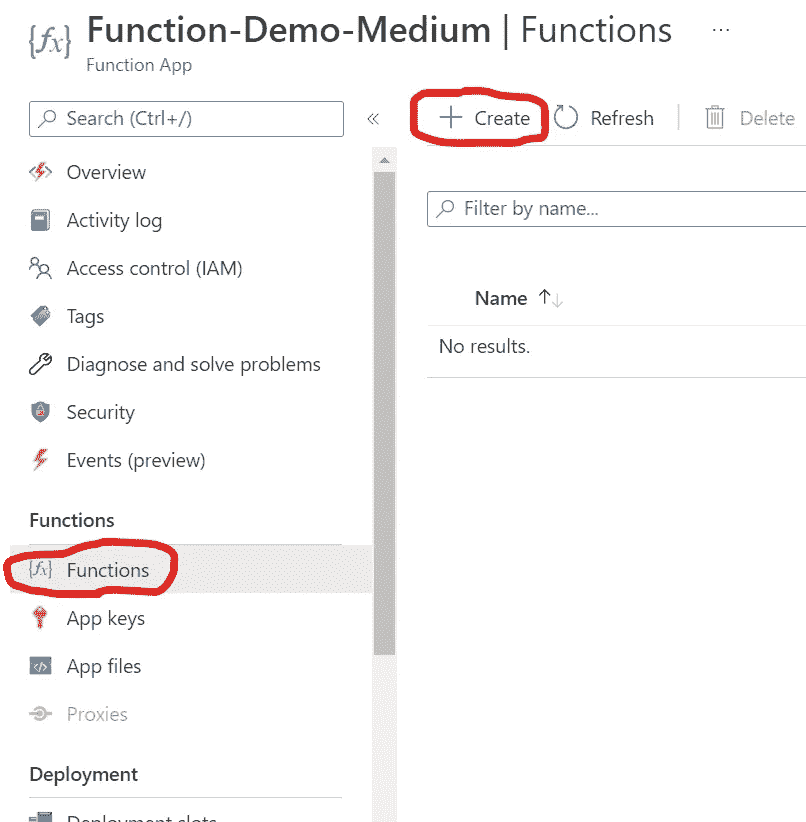

这里需要设置以下内容:在门户中开发(默认)，HTTP 触发器作为模板，您的函数的名称和授权级别。为了简单起见，我们采用匿名方式，这是通常不推荐的 it 生产工作流。现在你点击 Create，你的第一个函数就生成了。

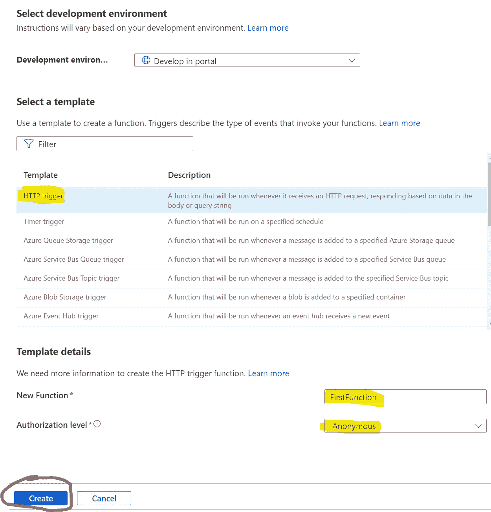

在这里你可以点击 Code + Test，我们可以看到 Azure 提供的样板代码。当您的函数被调用时，它记录一些内容，将来自 HTTP 请求的数据存储到 names 变量中，并返回一个 OkObjectResult 和一个包含名称的响应消息(如果提供的话)。要测试您的函数，您可以单击获取函数 URL 按钮并复制 URL。

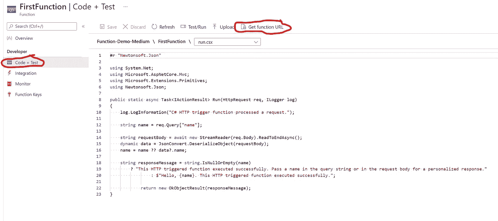

将此 URL 粘贴到您的浏览器中，您会看到以下内容:

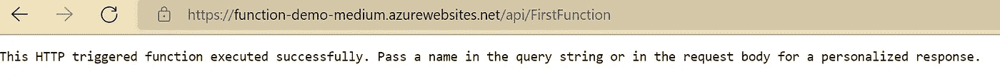

我们也可以像这样在 URL 的末尾添加名称，然后得到另一个响应。

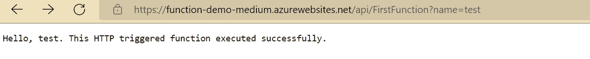

**重要！**演示结束后删除您的资源。我们没有正确保护我们的环境，如果您的功能保持活动状态，有人可能会调用它们并导致您的订阅费用。要做到这一点，只需选择资源组中的所有相关资源，然后单击 delete 按钮并确认删除。

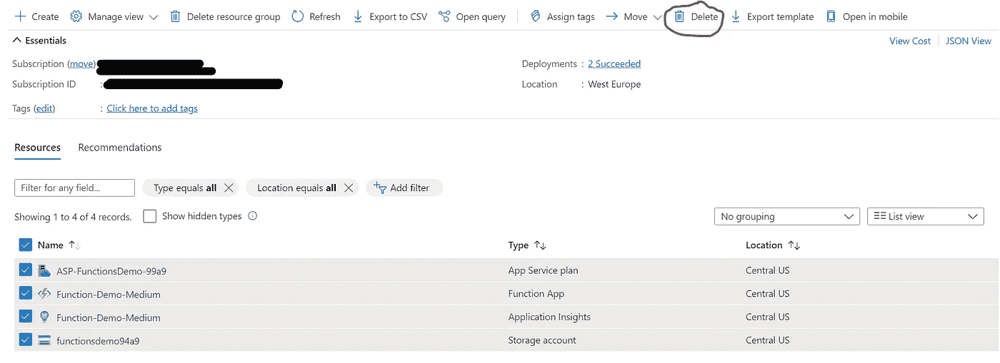

# 结论

我希望这能帮助你从整体上理解函数，尤其是 Azure 函数。在接下来的几周/几个月里，我会写更多关于 Azure 函数的主题，并在本文中链接它们。我想谈谈以下几个话题:

 [## Azure 函数——通过一个使用 C#的例子解释绑定和触发器

### 与其他服务/应用程序的自动化交互是使用 Azure 功能的主要好处之一。这是…

medium.com](/codex/azure-functions-bindings-and-triggers-explained-by-an-example-using-c-229c18295f02) 

*   用 VS 代码在本地开发 Azure 函数
*   在 Azure DevOps 中使用 CI/CD 部署 Azure 功能
*   在 Azure 函数中处理来自 Azure key vault 的秘密
*   认证和授权
*   在容器中运行 Azure 函数

所以如果你对这个话题感兴趣，敬请关注！