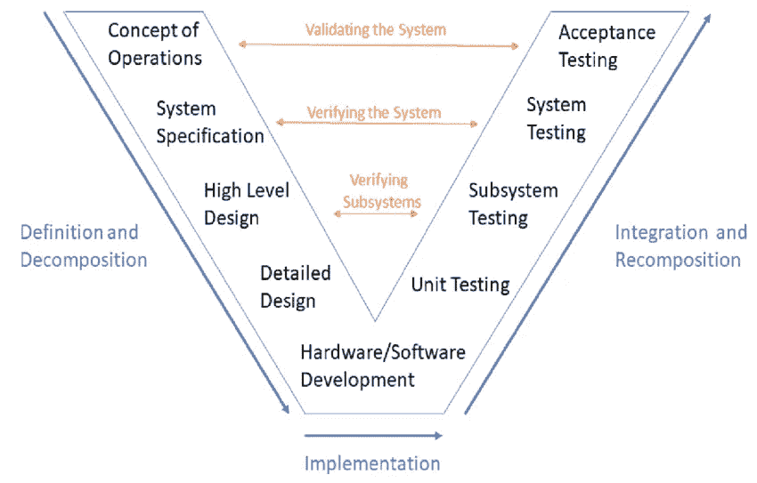
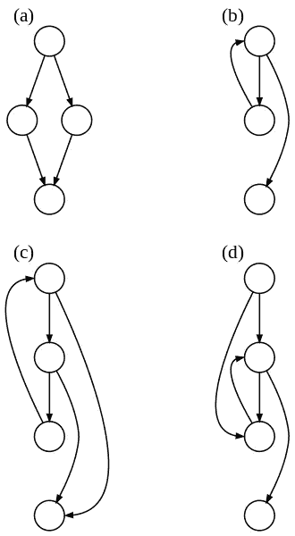

# 软件测试基础

> 原文：<https://medium.com/codex/basics-of-software-testing-ad79746044b0?source=collection_archive---------2----------------------->

软件缺陷是计算机程序中的一个故障，它会导致程序完全崩溃，以意想不到的方式运行，或者产生错误的结果。软件错误是软件开发的固有组成部分，会对关键系统造成灾难性的破坏。根据剑桥大学 2013 年做的一项研究，每年全球软件错误的成本为**3120 亿美元**，2013 年软件产业的规模约为**4070 亿美元**；**bug 的成本约为整个行业的 **75%** 。软件测试、调试和验证对于生产干净的、几乎没有错误的软件是至关重要的。在本文中，我们将深入软件测试的世界。**

# **什么是软件测试？**

## **一些著名的软件错误**

**在理解软件测试之前，让我们看一些导致重大损失的软件错误的例子。**

*   *****阿丽亚娜 5 型火箭:*** 阿丽亚娜 5 型火箭刚发射(起飞后 5 秒左右)就爆炸了。它使用了与阿丽亚娜 4 号相同的制导系统。阿丽亚娜 5 号的飞行轨迹不同，由于缺乏适当的**系统测试**，它坠毁了。有一个与将 64 位浮点数转换为 16 位整数相关的问题，该问题导致了导致崩溃的异常。欧洲航天局花了 10 年时间和 70 亿美元生产阿丽亚娜 5 号。**
*   *****奔腾浮点 Bug:*** 有一个 Bug 通过浮点除法导致了一个不正确的结果。这种错误很少发生(90 亿分之一)，但它确实存在。英特尔花了 4 . 75 亿美元来纠正它。**
*   *****火星气候轨道器:***1999 年与火星气候轨道器失去联系，着陆时坠毁。这是由于软件系统中的单位(英制和公制)不匹配，导致了崩溃。这是因为缺乏彻底的集成测试。**
*   *****Therac-25 放疗机:*** 软件中的软件缺陷导致辐射水平输入被忽略，由此导致患者剂量过大，导致 3 名患者死亡。**
*   *****丰田意外加速:*** 电子油门控制系统的 bug 导致汽车自行加速。这可能导致约 89 人因事故死亡。800 万辆汽车因此被召回。**

## **那么，什么是软件测试呢？**

**几个来源可以导致软件中的缺陷:不完整的需求、设计缺陷、编程错误、第三方工具中的缺陷等等。为了确保一个程序做我们想要它做的事情，它需要被彻底地测试；代码需要被审查和正式验证。**

**这个过程的第一部分是软件测试——通过观察软件的执行来评估软件，执行一个程序，通过试验输入，检查相应的输出是否正确来发现故障，从而改进软件。**

## **bug 是如何导致失败的？**

**一个 bug 导致程序状态在执行过程中被感染。随着受感染状态的传播，它可能会导致失败。因此，bug 导致感染，感染传播并导致系统故障。有些故障是显而易见的，例如错误输出、非终止、崩溃、冻结等。然而，在大多数情况下，失败并不明显。什么构成了失败有时可能是模糊的，这就是为什么我们总是需要一个规范。只有当程序有规范时，才能定义失败。一个程序的规格说明必须是一个程序应该做什么的详细描述，一个 bug 就是不符合规格说明。**

**例如，对于一个将整数数组作为输入并返回一个排序数组的函数，正确的规范应该是—**

**函数**需要(input):** 一个非空的整数数组作为输入。**

**函数**确保(返回):**对排序后的输入数组进行排列。**

## **契约隐喻:契约设计**

**Bertrand Meyer 创造了这个术语——契约编程，这是一种设计软件的方法。“契约”是过程化和面向对象编程语言的首选规范隐喻。合同编程的原则类似于现实生活中客户和供应商之间的法律合同。提供者(方法/函数的实现者)保证它将向客户(调用方法的实现者，通常是 main()函数)提供，前提是遵循合同(一对或多对定义提供者和客户相互义务的确保/要求条款)。**

**契约可以这样定义:设 F()是一个函数。函数 F()的规范需要一些前置条件并确保一些后置条件。如果 F()的调用者(客户端)满足所需的前置条件，那么 F()的被调用者(提供者)确保后置条件在 F()完成后成立。**

**因此，我们可以说，当方法/函数**在满足其契约的所需前置条件的状态下被调用时，它失败**，并且它不在满足待确保的后置条件的状态下终止，并且方法/函数是**正确的**，无论何时它在满足所需前置条件的状态下被启动，然后它在满足待确保的后置条件的状态下终止。**

## **测试只是一堆测试用例吗？**

**本质上，测试**是**所有关于测试用例。找到好的和足够多的测试用例是复杂的，我们通常有**覆盖标准**来查看我们是否有足够的测试用例。即使一个好的测试用例集也不能排除所有的失败。测试包括设计测试输入、运行测试、分析结果以及向开发人员报告结果。**

# **基于软件活动的测试级别:V 模型**

**对于消费者使用的软件，有不同级别的测试:**

*   *****验收测试:*** 根据用户需求评估软件。**
*   *****系统测试:*** 根据系统级规范评估软件。**
*   *****集成测试:*** 从高层设计的角度评估软件。**
*   *****单元测试:*** 针对底层设计评估软件。**

****

**v 型车([来源](https://www.researchgate.net/figure/The-V-model-for-the-systems-engineering-process-Cathleen-Shamieh-Systems-Engineering_fig4_325364332))**

**除了上面的测试级别，**回归测试**也是必不可少的。回归测试是在软件发生变化后进行的测试，它是软件开发维护阶段的一个标准部分。回归测试的目的是确保变更不会导致失败。**

**更高级别的故障很难调试，因为从错误到故障的传播很难追溯到源头。因此，单元测试构成了软件测试的基础，在开发任何软件时，全面的单元测试是至关重要的。**

# **测试用例、测试集和测试套件**

**一个**测试用例**是一个元组(Method，Input，Output)，其中 Method 是被测方法，Input 是调用参数及其初始状态的元组(Parameters，Initial State)，Output 是关于返回值和最终状态的函数，告诉它们是否符合正确的行为。简而言之，一个测试用例由初始化、对被测方法的调用和测试成功或失败的决定组成。**

**一个**测试集**由几个测试用例组成，一个**测试集**由不同方法对应的测试集组成。**

# **自动化测试工具**

**一些工具提供了自动化和可重复的测试(Jasmine for JavaScript，JUnit for Java，PyTest for Python 就是一些例子)。使用这样的工具，可以自动运行大量的测试，并且测试代码可以集成到源代码中，从而以一种有组织的方式实现单元测试。调试完成后，可以重新运行测试来检查故障是否已经消除，也可以进行回归测试。**

**这种工具通常支持**极限编程**范例，它包括在编写实际代码之前首先为代码创建测试用例，并在每次增量更改后进行回归测试。极限编程严重依赖于单元测试和验收测试。极限编程有几个好处:开发人员获得了代码将满足规范的信心，并且更好地理解了规范和需求。**

# **使用自动化测试工具的增量测试**

**使用这些工具测试一个单元可能经常需要**存根**和**驱动器**。存根模拟尚未开发的组件的行为，驱动程序模拟调用过程的环境。需要存根来替换被调用的过程，需要驱动来替换调用过程。**

## **自顶向下的增量测试**

**在自顶向下测试中，我们测试主过程，然后沿着调用层次结构往下。我们可以看到，这种测试将需要存根，但没有驱动程序。如果主要的错误发生在顶层，自顶向下的测试是有利的。然而，这种类型的测试可能会诱使开发人员推迟对特定模块的测试，尤其是那些存根很难生成的模块。**

## **自底向上的增量测试**

**在自底向上测试中，测试离开调用层次结构，向上移动到根。直到所有的子进程都被测试了，这个过程才被测试(就像树叶一样)。我们可以看到，这种测试将需要驱动程序，但没有存根。如果主要的错误发生在底层，自底向上的测试是有利的。然而，这种类型的测试可能是复杂的，因为直到所有的单元被添加，整个程序才存在。**

# **覆盖标准**

**我们如何知道我们是否有足够的测试？全面的测试通常是不可能的。覆盖标准帮助我们确定测试集覆盖了多少代码。大多数用作测试套件质量标准的度量标准描述了某些覆盖的程度，这些度量标准被称为覆盖标准。覆盖标准对于测试安全关键软件至关重要。让我们看看不同类别的覆盖标准:**

## **控制流图覆盖**

**在控制流图覆盖中，程序在测试时被表示为一个图。节点代表每个语句，边描述语句之间的控制流。边可以受条件约束。**

****

**控制流图示例([来源](https://en.wikipedia.org/wiki/Control-flow_graph))**

****执行路径**是通过控制流图的路径，从入口点开始，或者是无限的，或者在一个出口点结束。**

**我们可以用三种方式来描述控制流图中的覆盖范围:**

*   ****当且仅当控制流图中的每个节点 *n* 在测试套件中至少有一个测试导致经由 *n* 的执行路径时，测试套件才满足语句覆盖**。**
*   ****当且仅当对于控制流图中的每条边 *e* 而言，测试套件中至少有一个测试导致经由 *e* 的执行路径时，测试套件才满足分支覆盖**。分支覆盖包含语句覆盖。**
*   ****当且仅当对于控制流图的每条执行路径 *ep* ，测试用例集中至少有一个测试导致 *ep* 时，测试用例集满足路径覆盖**。路径覆盖包含分支覆盖。请注意，实际上无法实现路径覆盖。**

## **逻辑覆盖**

**逻辑表达式在程序中有很多来源——if 语句、while 语句等。逻辑覆盖可以分为三种类型的覆盖标准——决策覆盖、条件覆盖和修改的条件决策覆盖。**

**如果一个给定决策 *d* 包含至少两个集合，其中一个集合 *d* 评估为假，另一个集合 *d* 评估为真，则该决策覆盖被测试套件满足。对于给定的程序，如果测试套件满足程序中所有决策的决策覆盖，则该测试套件满足决策覆盖。**

****对于给定的条件 *c* ，条件覆盖**被包含至少两组的测试套件满足，一组是 *c* 评估为假，另一组是 *c* 评估为真。条件是决策中存在的布尔子表达式。对于一个给定的程序，如果一个测试套件满足程序中所有条件的条件覆盖，那么它就满足了条件覆盖。注意，条件覆盖并不意味着决策覆盖，反之亦然；上面的例子没有决策覆盖。**

****修改的条件判定覆盖(MCDC)** 对于判定 *d* 中的给定条件 *c* ，如果测试套件包含至少两个测试，其中一个 *c* 评估为假，另一个 *c* 评估为真，则满足该条件。决策 *d* 在两者中的评估应该不同，并且 *d* 中的其他条件在两者中的评估相同。对于给定的程序，如果修改的条件判定覆盖满足程序中所有条件的修改的条件判定覆盖，则测试套件满足修改的条件判定覆盖。MCDC 是一个工业认证标准。**

## **输入空间划分**

**最终，所有的测试都是关于从输入空间中选择元素。输入空间分区从字面上考虑这个问题；输入空间被划分为假定包含“同等有用的值”的区域，测试用例包含来自每个区域的值。**

**域的划分定义了一组块，使得这些块是成对不相交的(它们之间没有重叠)，并且这些块一起覆盖整个域。通常，不同的分区是组合在一起的。**

**分区后，有几种策略可以从块中选择值。一些策略包括子分区块、探索边界条件以及包含有效、无效和唯一的值。通常，输入空间划分的过程从查看规范开始，然后将输入空间划分为程序执行类似操作的区域。然后，一些输入来自区域，主要是边界。**

# **独立路径覆盖**

**独立路径覆盖包括设计测试用例，使得程序中所有线性独立的路径只执行一次。通过程序的任何执行路径，如果有一条边在其他路径中不存在，则称为线性独立路径。**

**对于简单的程序，识别线性独立的路径是相当容易的。然而，对于复杂的程序，确定独立路径的数量并不那么容易。 **McCabe 的圈复杂度**帮助我们找到一个程序的线性独立路径数的上界。**

**给定一个控制流图 *G* ，McCabe 的圈复杂度 *V(G)* 定义为:**

***V(G) = E — N + 2***

**其中 N 是 G 中的节点数，E 是 G 中的边数。**

# **黑盒测试和白盒测试**

****黑盒测试**包括从软件的外部描述中导出测试套件，不需要了解源代码。**

**白盒测试包括从软件的源代码中导出测试套件。**

# **突变测试**

**突变测试是发现我们是否有足够测试用例的另一种方法。变异测试包括对测试中的函数/方法进行一点随机变异。获得的新突变体大多数时候是不正确的，如果一个测试失败(“杀死”突变体)，那么它是好的；否则，如果没有测试可以杀死突变体，我们有一个缺失的测试案例。**

# **结论**

**软件测试是一个广阔的领域，自动化测试已经取得了许多进步。由于测试在任何商业软件的性能中起着至关重要的作用，尤其是对安全性要求很高的软件，所以严格的测试程序是非常重要的。在这篇文章中，我们深入到了软件测试的世界，并且理解了基础知识。在下一部分，我们将看看软件调试。**

*****参考文献:*****

*   **剑桥学习:【http://www.prweb.com/releases/2013/1/prweb10298185.htm **
*   **阿丽亚娜 5 火箭:[https://www-users . CSE . umn . edu/~ Arnold/disasters/ARIANE 5 rep . html](https://www-users.cse.umn.edu/~arnold/disasters/ariane5rep.html)**
*   **奔腾 Bug:[https://en.wikipedia.org/wiki/Pentium_FDIV_bug](https://en.wikipedia.org/wiki/Pentium_FDIV_bug)**
*   **火星气候轨道器 Bug:[https://www . sim scale . com/blog/2017/12/NASA-mars-Climate-Orbiter-metric/](https://www.simscale.com/blog/2017/12/nasa-mars-climate-orbiter-metric/)**
*   **Therac-25 放疗机 Bug:[http://users . CSC . cal poly . edu/~ JD albey/SWE/Papers/therac 25 . html](http://users.csc.calpoly.edu/~jdalbey/SWE/Papers/THERAC25.html)**
*   **丰田意外加速 Bug:[https://users . ECE . CMU . edu/~ koopman/pubs/koopman 14 _ Toyota _ ua _ slides . pdf](https://users.ece.cmu.edu/~koopman/pubs/koopman14_toyota_ua_slides.pdf)**