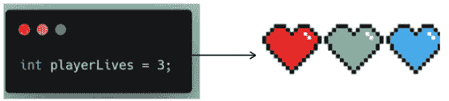
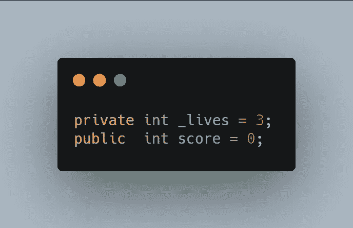
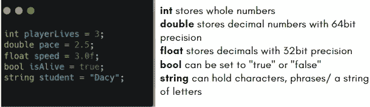
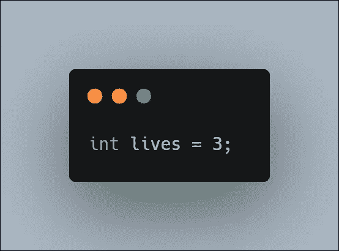
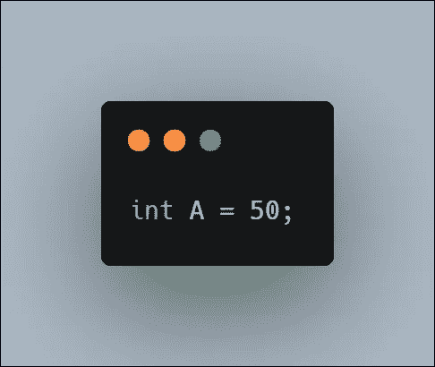

# 变量！—编程的组成部分

> 原文：<https://medium.com/codex/basics-on-variables-e8518113e4f2?source=collection_archive---------17----------------------->


## 什么是变量？

变量是用来存储一个或多个值和数据的标签。它们被赋予一个描述性的名称，这样程序员就更容易读懂代码；在团队中工作时，这一点尤为重要，因为在团队中，您的代码可能会被多个成员访问，在这种情况下，代码必须尽可能具有可读性。

简单来说:你可以把它们想象成收纳盒，外面的标签让你知道它们的内容。

数据可以来自用户，比如某个游戏让你选择难度。


最终幻想 7 重制难度菜单

数据也可以由程序员设置，如生命值(HP)或玩家的生命值。



不管存储的是哪种数据，变量都会被赋予一个名称、一个值和一个类型。内容可能会发生变化，*有所不同，*因此得名*。*

## 私人或公共

变量有一个**私有**或**公共**引用。私有变量名通常以下划线开头，以便在整个代码中容易识别，并与其他变量区分开来。



非指定变量**总是私有的**，这意味着只有相关的脚本可以访问它。一个**公共**变量允许与其他脚本通信。

当变量被放在脚本类中任何方法之前的代码顶部**时，它也可以是全局变量**。**全局意味着它们可以与脚本中的所有方法进行通信。**

## 一些最常见的变量包括:



# 分配变量

这里我们指定一个生命变量:



上面一行是一个**语句**。程序是由语句组成的——指令告诉我们的系统做什么和怎么做。

## 重新分配变量

声明变量的值可以在整个代码中改变。举个例子:如果我们的玩家受到伤害，生命变量会相应减少。

## 变量的 Psudocode

变量倾向于足够简单和描述性，不会给程序员带来在伪代码约定中如何表示的压力，然而，有一个。[在伪代码中给变量赋值的约定](https://sites.google.com/a/iharrow.org.uk/compsci/2-1-algorithm-design-and-problem-solving/2-1-2-2-pseudocode)是用一个指向变量的箭头来完成的，相反一端的值就是存储在变量中的值。

```
A←50
```

就像声明一个变量



但是，请记住，伪代码可以用您自己的自然语言编写，而不必担心表示它的特定方式。我将在我的下一篇[文章](https://dennisse-pd.medium.com/why-you-should-be-writing-pseudocode-e58971c2ab49)中更多地谈论伪代码。