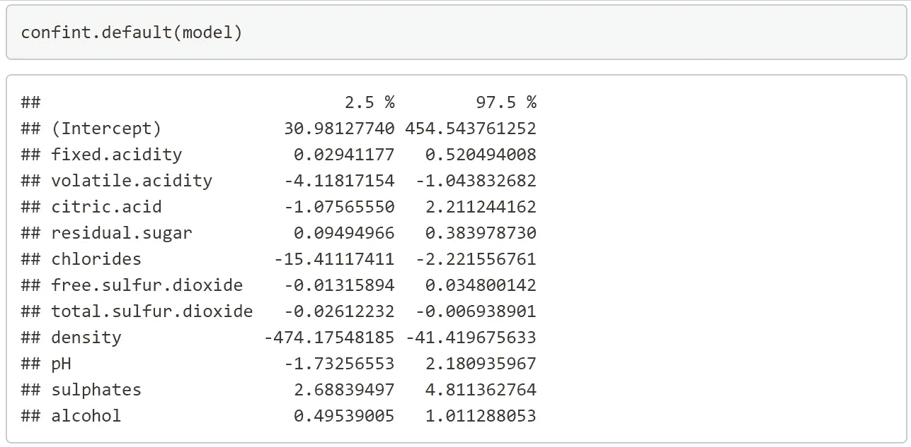
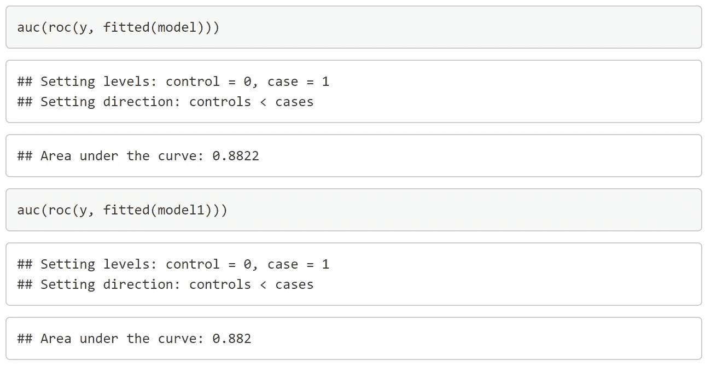

# 逻辑回归中的贝叶斯方法

> 原文：<https://medium.com/codex/bayesian-approach-in-logistic-regression-981f1387505b?source=collection_archive---------8----------------------->

## 随着数据科学领域的发展，机器学习和深度学习正在受到人们的关注。我们是否忘记了隐藏在这些复杂方法背后的基本知识？我们倾向于将复杂但强大的模型称为“黑盒模型”，因为它在获得给出最终期望输出的能力时正在失去可解释性，但我们正在失去对发展的跟踪和超越这些数据的一些洞察力。所以，让我们回到关于统计学的基本问题上来，它的重要性不应该减弱。

自从我上次做贝叶斯分析已经很久了。直到最近，我才接触到它在逻辑回归中的应用。值得一提的是，巧合的是，我看到了一篇研究无监督自然语言案例的论文，同时将贝叶斯概念应用于生成分布。让我们来看看经典分析和贝叶斯分析之间的区别。

如果你是统计学出身，不管是纯统计学、分析学还是像我一样的精算，相信你对‘经典统计学’和‘贝叶斯统计学’这两个名词都不会陌生。高中第一堂统计学课，有人问我们，“什么是概率？”。而且，今天我们会被以稍微有点棘手的方式提问，“概率在频率统计和贝叶斯统计中意味着什么？”?'。频率主义者将概率解释为一个事件在大量可重复实验中出现的频率。然而，贝叶斯概率是一种表达我们对一个事件的信任程度的方式。

当时，在我攻读学位期间，我们接触了将分布参数视为随机变量的理论应用，使用提供的数据更新参数的先验信念，并因此得出关于具有参数更新后验分布的预测模型的结论。本主题的概述仅限于众所周知的正式定义的发行版。直到我偶然发现贝叶斯机器学习这个术语，我一直很好奇它在机器学习中的应用。然后，我的旅程从这里开始，一个简单的关于逻辑回归的例子，使用贝叶斯统计和马尔可夫链蒙特卡罗(MCMC)方法，而不需要经过详细和更正式的管道，包括重复数据删除和异常值检查。假设数据集没有这些数据质量问题。

**数据加载和检查:**

给定数据集中的目标变量是数字数据，但我们的目标是在这里执行逻辑回归，其中目标变量应该只取值 0/1。我们假设，6 分以上是好酒(y=1)。数据集中没有缺失值。

R1:数据加载和 NA 检查。

**数据汇总和经典分析(广义线性模型，GLM):**

统计摘要:

表 1:统计摘要。

变量的标准偏差:

表 2:变量的标准偏差。

葡萄酒等级频率表:

表 3:频率表。

图 1:葡萄酒等级直方图。

R2:统计摘要。

R3:标准差。

**广义线性模型(逻辑回归模型):**

R4: GLM 模式。

R5:置信区间。

变量值的范围变化很大，从最小值 0.0136 到最大值 283。总二氧化硫报告的标准偏差为 32.895，密度的标准偏差为 0.002，这是所有变量中的最大值和最小值。有 217 种好酒(质量分数> = 6.5)，1382 种酒没有被归类为好酒。

假设变量 k 的零假设陈述系数为零，在 5%的显著性水平下，变量 pH、游离二氧化硫和柠檬酸的 p 值分别为 0.822、0.376 和 0.498。因此，对于这三个系数，没有显著的统计证据来拒绝零假设。它可能会从模型中删除。除此之外，与假设除截距之外所有系数为零的零偏差相比，残差偏差明显下降，这意味着训练的饱和模型更适合。

**无显著变量的广义线性模型(Logistic 回归模型):**

R6:删除了无关紧要变量的 GLM 模型。

R7:去除了不重要变量的置信区间。

图 2:R4 模型的 ROC 曲线

R8:位于 R4 的 AUC 之下的地区。

在去除无关紧要的变量后，剩余的变量在该模型中仍然具有统计显著性。该模型报告了 890.08 的较低 AIC，它没有提供最佳模型的信息，但它表明了所有实验中更适合的模型。但是剩余偏差有很小的增量 2，这意味着与第一个模型相比，第二个模型有很少量的无法解释的变化。两种模型的 ROC 曲线几乎重叠，曲线下的面积量相似，表明分类性能相同。尽管如此，第一个逻辑回归模型系数将用于贝叶斯分析。

R9:在其他变量保持不变的情况下，总二氧化硫含量不同的优质葡萄酒的概率。

**贝叶斯分析**

考虑下面的逻辑回归方程:

我们将为线性模型的系数生成样本。假设独立的分布系数，取系数的先验分布为:

用β表示对数似然方程:

根据β和 X 找出 p，然后代入似然函数。然后，我们使用上面的公式生成β向量的后验分布。这里省略推导过程。为了像往常一样简化计算，我们将把它转换成对数似然函数。一种多元正态分布，它不可能通过推导微分方程找到最大值点来解析地导出。因此，后验样本是由 MCMC 采样过程产生的，因此我们相信，如果运行足够长的时间，链将收敛到一个点，而不管初始化状态如何。测试了多次初始化，以观察它如何影响 MCMC 采样过程(MH 采样)。

表 4:MH 算法的初始化。

R10: MH 算法和类别预测(步骤 5:预测)

R11:不同初始化的模拟。

R12:模拟的链图。

图 3:模拟的马尔可夫链。

通过调整代码中的参数 **c** ，专家建议的理想接受水平约为 20–30 %,我们使用该参数来调整 MCMC 过程中使用的多元正态分布的方差。

用不同初始化生成的所有四个链在 10000 次模拟内收敛，但是在链的开始处有一些波动。用 frequentist 分析的系数初始化的链收敛最快，第三个初始化选项在所有四个选项中波动最大。然而，不管 te 初始化如何应用，从贝叶斯分析中获得的一些系数并不收敛到 MLE 估计。截距、固定酸度、挥发酸度、残糖、密度、pH 和酒精的系数不会收敛到传统的估计值。如果我们设置一个非常奇怪的初始向量，链将需要更长的运行时间来达到收敛，不管它是否收敛到频率分析获得的估计。

图 4:用不同初始化为模型预测的目标变量的柱状图。

好酒的概率:

表 5:好酒的概率。

R13:柱状图和概率计算。

对于用不同初始化形成的贝叶斯模型，在预测为好的样本数量上观察到差异。第三次初始化给出了与原始数据(0.1570)最不同概率(0.0885)。其余三个相互接近，但仍略微远离 0.1570。

**带库 metrop 的 MH 算法:**

R14:用 r 中的库 metrop()生成样本。

r15:metrop()的接受概率。

运行上面的代码，在达到稳定状态或收敛后，您将获得与上面的图 3 相同的图。与前者相比，在链的起点有一些波动。这种方法简单易用，只需一行代码就能实现，但挑战在于为每个系数调整最佳比例参数，尤其是当我们有一组变化程度差异很大的变量时。这个项目的数据集是最好的例子，变化范围从 0.00005 到 0.1。当我们将初始化设置为一个奇怪值的向量，与可能的系数相差很大时，情况变得更加复杂。如果参数调整不当，我们甚至可能面临收敛的问题。这种情况的一个例子如下所示。不是反转自定义 M-H 算法中 c*omega 给出的多元正态分布的方差计算来获得 metrop()函数的参数标度，而是将标度参数设置为不同的矩阵。大多数链即使在长时间运行后也不会收敛。下面的例子说明了在函数中设置正确参数的重要性。

图 5:为缩放设置了不适当参数的失败案例。

有时，现成的 MCMC 函数可以简化编写冗长代码的工作，但它并不总是能给出好的结果，如果在发布之前不仔细分析结果，还会带来负面影响。最佳或最合适的方法取决于我们可获得的数据。我们可以通过对数据进行标准化或缩放来简化定义函数，而不是冒险定义过程中可能会出现错误的函数。但是，请注意，所构建的模型是基于转换后的数据的。因此，当我们试图对新数据进行任何预测时，需要在代入模型之前进行转换。

**结论**

由于这项工作的目的是获得贝叶斯和 MCMC 的实践经验，因此可以通过将样本分成训练和测试数据集来改进实验，以便进行更有说服力的性能评估。通过检查频率统计中的 p 值，进一步的统计推断起到与假设检验相似的作用，是通过计算最高密度区间。搜索给出指定置信水平的最短区间，然后检查您测试的值是否超出该区间以得出结论。

除了 frequentist 和 Bayesian 之间的争论，我相信每一个新想法的创新和发表都是为了克服现有方法的缺点，或者提供一个看待问题的不同视角。现有的不应该被完全取代和消灭。为每种情况选择正确的方法来提高性能，您可能会发现数字背后的宝石。