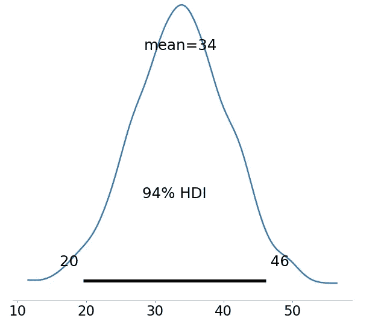

# 贝叶斯 vs 频率主义者:NFL TDs

> 原文：<https://medium.com/codex/bayesian-inference-of-nfl-tds-6d4b1251eeda?source=collection_archive---------11----------------------->


约翰尼斯·格罗尔在 [Unsplash](https://unsplash.com?utm_source=medium&utm_medium=referral) 上的照片

在这篇文章中，我想比较两种不同的方式来预测新主持人 Aaron Rodgers 明年的触地得分总数。如果你简化这个例子，就像如果我抛三次硬币，我想知道接下来会发生什么。有两种观点:贝叶斯观点和频率主义观点。一个不一定比另一个更好，但他们都会给我们不同的答案。查看这篇帖子，了解我用 R: [用贝叶斯统计做的一些工作 https://ECA van . medium . com/predicting-NFL-first-downs-453 a683 a827 d](https://ecavan.medium.com/predicting-nfl-first-downs-453a683a827d)(这次我将使用 python 库 PYMC3)。我将使用 2008-2012 赛季，罗杰斯的总得分是:[28，30，28，45，39]。

我就不说那些深奥的数学了，只告诉你如何把它们应用到这个问题上。对于频率主义者的观点，如果我们假设数据遵循正态分布，那么预测真实值的均值和方差的估计量就是样本均值和样本方差(基本上是陈述大数定律的一种奇特方式)。在这种情况下，样本平均值为 34。因此，如果我想建立一个 95%的置信区间，我会估计 Aaron Rodgers 在任何给定年份抛出的 TD 数量在[28，40]之间(请参见此链接获取计算器)。所以基本上，我们假设在下一个健康的一年里，亚伦罗杰斯将投出 34 +/- 6 个三分球。在接下来健康的一年里(他在 2013 年受伤)，他投出了 31。

让我们看看贝叶斯观点。从贝叶斯的角度来看，我们将从我们的先验(基本上，我们对正确分布的猜测)开始，它将在我们运行模拟时得到更新。使用 pym3 这很容易，我们可以运行一系列模拟来预测 Rodgers 在任何给定的一年里会投多少 TDs。

```
import pymc3 as pmwith pm.Model() as model:
    obs = pm.Normal('obs', mu, sig)with model:
    trace = pm.sample(900, return_inferencedata=False)ax = pm.plot_posterior(trace,  figsize = (8, 8))
```

在这里，我找到了平均值和标准差(这是 frequentist 案例所需要的),并进行了 900 次模拟。你可以看看那些模拟来找出罗杰斯当年投了多少个三分球。这个图(代码的最后一行)很好地展示了这一点:



(图片由作者提供)

所以我们的 94% HDI(置信区间的贝叶斯版本)在[20，46]之间。但是等等，你会说，“这不是一个更差的置信区间吗——因为它更大了？”。我会说不一定，它所做的是捕捉数据中更多的不确定性。例如，在他受伤的赛季，罗杰斯投了 17 个罚球，2020 年他投了 48 个罚球。贝叶斯模型可以更好地捕捉这些值。如果你感兴趣，你可以在这里查看全部代码:[https://www.kaggle.com/sportsstatseli/nfl-plays-bayesian?FB clid = iwar 0 blrn 5 F2 jovtfd 6 akrfdi 6 fkmfiq 18 clhalbs 5 VSS poojvv 55-bsb4gs 8](https://www.kaggle.com/sportsstatseli/nfl-plays-bayesian?fbclid=IwAR0bLRn5F2jOVTfd6AKRFDi6FKmFiQ18CLHaLbs5VSsPooJVv55-bSB4Gs8)

这就是你所知道的，频率主义者 v.s bayesian 在两分钟内的观点；我们要谈谈有史以来最伟大的 QBs/Jeopardy 主持人之一。

感谢阅读，如果你想从我这里听到更多:

【https://elicavan.wixsite.com/site 号

【https://www.linkedin.com/in/elijah-cavan-msc-14b0bab1/ 