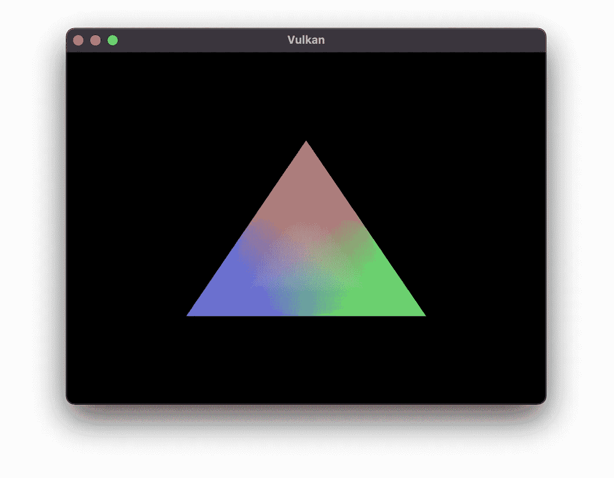

# Vulkan 项目中的 Bazel。第 2 部分—着色器

> 原文：<https://medium.com/codex/bazel-in-vulkan-projects-part-2-shaders-35cdeb0f4c67?source=collection_archive---------9----------------------->

## 用 Bazel 构建三角形 Vulkan 应用程序


图片由[哈维尔·米兰达](https://unsplash.com/photos/OiiVv1iiB0A)在 [Unsplash](https://unsplash.com/) 上拍摄

这是关于使用 Vulkan graphics API 和 Bazel 构建系统构建项目的系列博客文章的第二部分。在第 1 部分中，我们为一个简单的 Vulkan 项目执行了一个环境设置，该项目使用了 GLM 和 GLFW 库。在这篇博文中，我们将扩展我们的知识，看看如何用 Bazel 构建 GLSL 着色器，并运行一个绘制三角形的项目。

在继续这篇博文之前，请务必查看第 1 部分。

您可以在 GitHub 上找到一个示例项目的完整源代码。

[](https://github.com/Morfly/vulkan-bazel-samples) [## GitHub-Morfly/vulkan-bazel-samples:为 Vulkan 建立环境的示例项目…

### 这是一个样例库，展示了如何设置一个开发 Vulkan 应用程序的环境

github.com](https://github.com/Morfly/vulkan-bazel-samples) 

# 构建着色器

**OpenGL 着色语言**(**GLSL**)——是一种高级着色语言，其语法基于 C 编程语言。它也得到 Vulkan 的支持。

我们将开始创建简单的[向量](https://vulkan-tutorial.com/code/09_shader_base.vert)和[片段](https://vulkan-tutorial.com/code/09_shader_base.frag)着色器来构建一个三角形。源代码取自[官方 Vulkan 教程](https://vulkan-tutorial.com/Drawing_a_triangle/Graphics_pipeline_basics/Shader_modules)，所以可以随意查看关于着色器代码本身的更多细节。

创建一个`shader.vert`文件，并将其放在我们在本系列第 1 部分的[中使用的项目的`triangle/shaders`目录中。](/codex/vulkan-in-bazel-projects-part-1-environment-setup-e9fc2ec51b)

**三角形/着色器/着色器.垂直**文件内容

类似地，在`triangle/shaders`目录下为名为`shader.frag`的片段着色器创建一个文件。在那里添加下面的代码。

**三角形/着色器/shader.frag** 文件内容

现在，我们准备创建一个 Bazel 目标来构建我们的着色器。我们将使用之前包含在项目中的`rules_vulkan`中的`glsl_shader`规则。在同一个目录下创建一个`BUILD`文件，并用下面的代码填充它。

**三角形/着色器/构建**文件内容

要验证所有操作是否正确，请在终端中运行以下命令，并确保着色器构建成功。

```
bazel build //triangle/shaders:vert_shader

bazel build //triangle/shaders:frag_shader
```

这是我们到目前为止的目录结构。

```
vulkan-bazel-samples
├── **triangle**
│   └── **shaders**
│       ├── **shader.frag**
│       ├── **shader.frag**
│       └── **BUILD**
│
├── env_setup
├── third_party
└── WORKSPACE
```

最后，我们准备构建将使用这些着色器并绘制三角形的应用程序。

# 画三角形

为了构建绘制三角形的应用程序，我们将使用来自官方 Vulkan 教程的源代码。创建一个`main.cpp`文件，并将其放在`triangle`目录中。用从 Vulkan 教程复制的[源代码](https://vulkan-tutorial.com/code/17_swap_chain_recreation.cpp)填充。

我们不会关注代码本身，因为一切都与 Vulkan 教程相同。然而，我们需要对我们项目的代码做一点小小的修改。打开`main.cpp`文件，找到一个`createGraphicsPipeline`函数声明。在这里，我们需要编辑它的前两行，在那里我们改变路径到我们编译的着色器，如下所示。

**triangle/main.cpp** 文件内容修改

现在，剩下的唯一一件事就是定义一个 Bazel 目标来构建和运行我们的程序。为此，在`triangle`目录中创建一个`BUILD`文件。我们将使用标准的`cc_binary`规则。

在`deps`参数中，我们需要包含我们在之前的博文中定义的`glfw`和`glm`库。此外，我们需要添加一个 Vulkan 库本身。

在`data`参数中，我们引用了刚刚创建的着色器目标。

**三角形/构建**文件内容

最终，我们示例项目的最终文件夹结构如下所示。

```
vulkan-bazel-samples
├── triangle
│   ├── shaders
│.  │
│   ├── **main.cpp**
│   └── **BUILD**
│
├── env_setup
├── third_party
└── WORKSPACE
```

## 运行应用程序

这就是我们用 Bazel 运行三角形 Vulkan 应用程序所需的全部内容。

现在，使用下面的命令来构建和启动我们的应用程序。

```
bazel run //triangle
```

如果一切都做得正确，它将运行一个应用程序，在屏幕上画一个三角形，如下所示。



# 结论

就是这个！在这一系列简短的博客文章中，我们看到了如何执行一个基本的设置，以便能够在带有 Vulkan graphics API 的项目中使用 Bazel。

在[第 1 部分](/codex/vulkan-in-bazel-projects-part-1-environment-setup-e9fc2ec51b)中，我们为项目进行了环境设置，现在我们运行一个用 Bazel 构建的基本三角形应用程序。

这篇博文的所有源代码都可以在 GitHub 上找到。

[](https://github.com/Morfly/vulkan-bazel-samples) [## GitHub-Morfly/vulkan-bazel-samples:为应用程序设置环境的示例报告…

### 为使用 Vulkan graphics API 的应用程序设置环境的示例报告，该 API 是用 Bazel - GitHub 构建的…

github.com](https://github.com/Morfly/vulkan-bazel-samples) 

## 参考

*   [**rules _ vulkan**](https://github.com/jadarve/rules_vulkan)**—一个使 Bazel 能够支持 Vulkan 项目的存储库，由 Juan David Adarve 创建。**