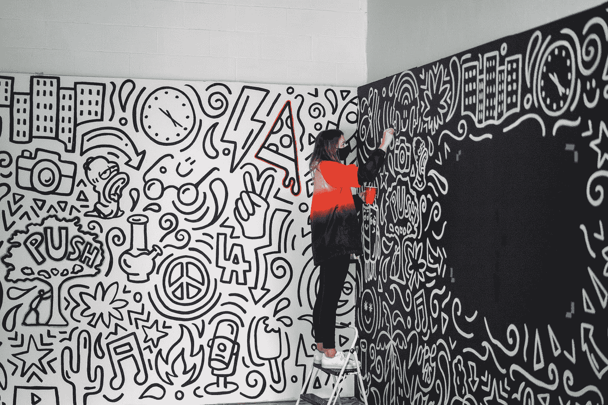

# 做一名代码艺术家

> 原文：<https://medium.com/codex/be-a-code-artist-dfa047fbdd5b?source=collection_archive---------3----------------------->

马蒂·奥尼尔在 [Unsplash](https://unsplash.com?utm_source=medium&utm_medium=referral) 上的照片

# 灵感

前段时间偶然看到这篇博文:

> [除了计算机科学家，其他人都写马虎代码的四个原因](https://towardsdatascience.com/four-reasons-why-everyone-except-for-computer-scientists-writes-sloppy-code-b8505254e251)

这真的是一篇很好的文章，除了标题一开始就侮辱了很多开发者。Joury 没有定义谁是计算机科学家。只有像我这样拥有“计算机科学学士”学位的人，或者像计算机科学家一样思考的人？我相信是后者:某人如何思考。然而，在这种情况下，这个标签没有任何意义。Joury 的第一个理由就是一个例子，它一针见血:

> "理由 1:对计算机科学家来说，编码是一门艺术，对其他人来说，它是一种工具."
> -阿里·朱瑞

我读到这一行，我的头砰的一声。🤯我以前见过这种情绪，但从未如此简洁。但是有一个问题。如果你学习物理、化学、生物……你会学习科学。你会追求*是*的知识。作为软件开发人员，我们可能会研究我们试图用我们的解决方案解决的问题空间，但是然后我们会去*创造一些新的东西*。

所以我来修改一下这个理由:

> “理由 1:对于热情的软件开发人员来说，编码是一门艺术。对于其他人来说，编码是一种工具”
> -我

# 激情=艺术！

一个充满激情的软件开发人员和其他人有什么不同？

其他人会看需求，也许是用户故事，然后埋头写代码。调整一下。堆栈溢出它。最终，输出是“有效的”这就是这些“工具使用者”的末日。

> "它适用于那个用户故事，所以它被完成了."
> -那些人

这段代码通常很容易被发现，因为它将是一团混乱的意大利面条。这就是进化。有用吗？是的，至少对于那个用例是这样的。能维持下去吗？大概不会。

一个充满激情的软件开发人员会为此感到尴尬。你怎么能对工作充满激情，却交付一塌糊涂？一个代码艺术家可能会经历同样的进化，但之后它会被重构为一个可测试的简洁的艺术作品。

然而，更常见的是，代码艺术家不会盲目地开始输入代码。写作是一种艺术形式，和任何小说家一样，艺术家会先勾勒出整体的情节。在写出一个句子，一行代码之前，人物和互动被识别，故事获得一些结构。

如果你有一个代码艺术家做一段时间的代码审查，你会体验到这种对编程艺术的热情。我希望你能从这次经历中成长为一名成熟的艺术家。我们会挑战你。要么我们让你相信我们的艺术风格是最好的，要么你接受挑战，坚持自己的艺术方法。或者，你仍然是一个“有用所以好”的工具使用者，并且憎恨所有的艺术家。

> “你会一天比一天好。这是一门艺术，不是科学。它是你的创造力、你的个性、你的心、你的头脑、你的道德和你的价值观的混合物。就是你。”詹姆斯·斯坦尼尔

斯坦尼尔谈到了成为一名经理，但这是你所关心的任何事情的真实情况。

# 观众

> “原因 2:开发者并不总是把读者放在心上”

这又回到了代码艺术家是作家这一点，我们正在给同一份手稿的两个完全不同的读者写信:计算机和我们的开发伙伴。电脑一点也不在乎英语，对这个程序非常满意:

> 静态 int e，n，j，o，y；int main(){ for(++o；(n =-~ getchar())；e+=11==n,y++)o=n>0xe⁰>n&&'`'^n⁶⁵？！n:！o？++ j:o；printf("%8d%8d%8d\n",e^n,j+=！o&&y，y)；}

来源:[国际混淆 C 代码大赛](https://www.ioccc.org/2019/burton/prog.clean.c)

我们的开发伙伴对编程语言的语法不太关心；实际上我们读的是英语。在这里，我们给事物命名是最重要的，我们如何组织事物也是最重要的。这使得代码可读，而不仅仅是功能性的。

# 结论

那么我的观点是什么？热爱你的工作！勇往直前，创造艺术！