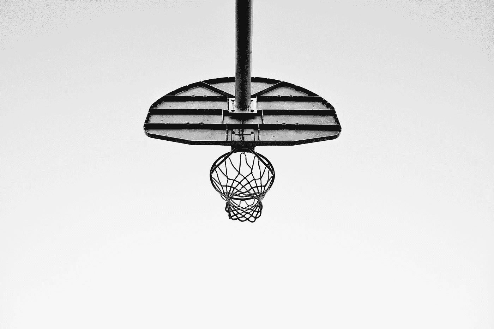
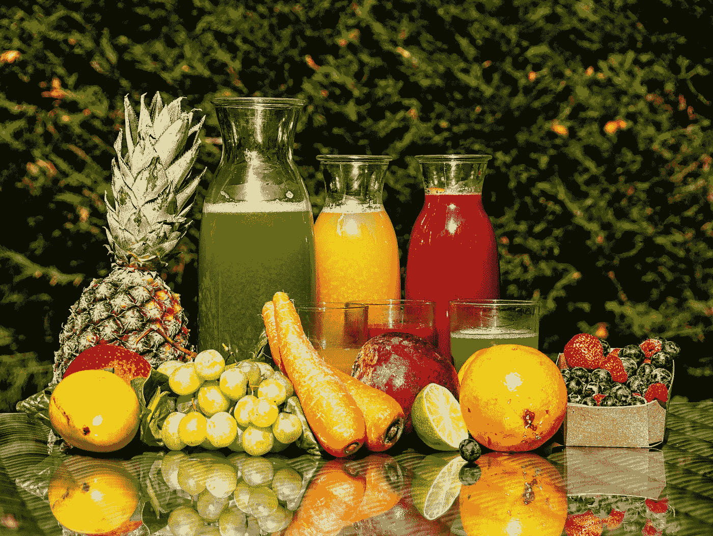
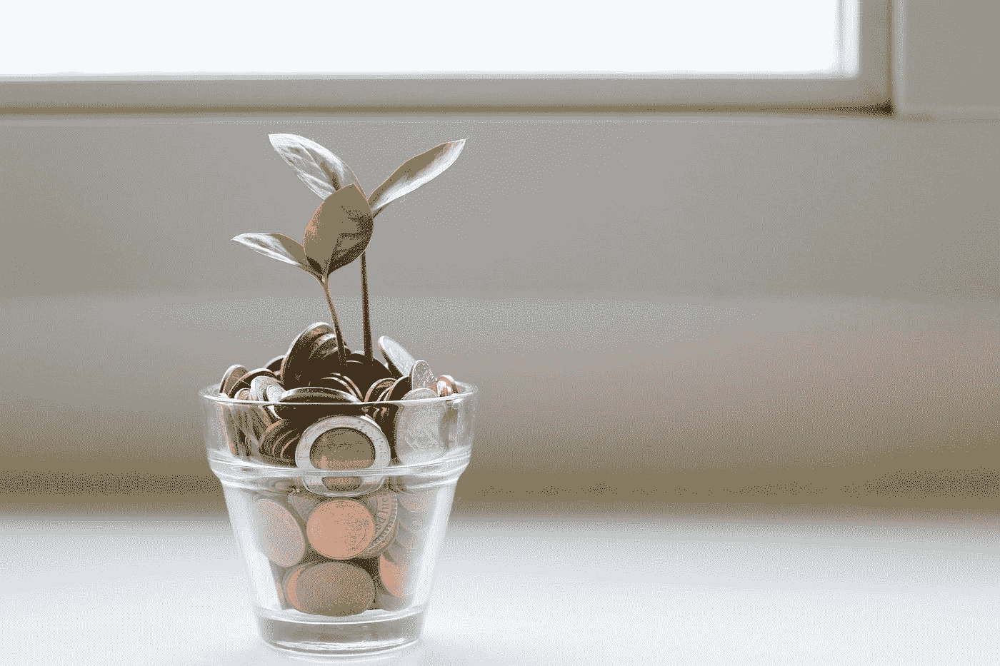

# 击败书本:利用机器学习赚钱体育博彩

> 原文：<https://medium.com/codex/beating-the-books-using-machine-learning-to-make-money-sports-betting-7b5195b405d2?source=collection_archive---------0----------------------->

> 下面是我的“只是为了好玩”的数据科学项目如何让我赚到一点外快…

蒙蒂洛夫在 [Unsplash](https://unsplash.com?utm_source=medium&utm_medium=referral) 上的照片

如果你想深入研究代码，我在 GitHub 上的 Jupyter 笔记本中记录了这个过程:

 [## NBA _ Betting _ Model/2022 NBA _ over under . ipynb at main Jensen Benjamin/NBA _ Betting _ Model

### 使用梯度推进回归预测 NBA 总得分-NBA _ Betting _ Model/2022 NBA _ over under . ipynb at main…

github.com](https://github.com/jensenbenjamin/NBA_Betting_Model/blob/main/2022NBA_OverUnder.ipynb) 

最初发表于 2022 年 3 月

在这篇文章中，我将介绍我如何构建一个基本的机器学习模型来押注 NBA。快速版:我基于 sklearn 的 GradientBoostingRegressor 建立了一个模型，在 140 场 NBA 比赛中以 58%的成功率下注 over/under。长版:

我是亚利桑那州立大学 MSBA 项目(T4)的研究生，也是贝洛伊特学院(T7)前三级学生运动员。我于 2021 年春天从贝洛伊特学院毕业，获得数量经济学学士学位，希望成为一名专业的数据科学家。我决定，对我来说，实现这一目标的最佳方式是来到亚利桑那州的坦佩，攻读商业分析硕士学位。2021 年 8 月，当我从威斯康星州搬到亚利桑那州时，神奇的事情发生了；在线体育博彩在亚利桑那州上线。

在这么长的介绍中，我的目标不仅仅是吹嘘自己，还想证明自己对体育和数据科学的交叉领域有一点了解和兴趣。当在线体育博彩在亚利桑那州开放时，我立即开始在几乎每场 NFL 比赛上下各种各样的小额赌注(大学生预算)。我很快就谦卑下来，并意识到仅凭我的体育知识是无法打败拉斯维加斯的。

# *入门*

到 2022 年 2 月，我已经有了足够的课程，可以开始在我的体育知识中加入一些科学知识。在使用 python 的 sklearn 库进行了一些构建基本机器学习模型的练习后，我准备在现实世界中试用它们。

我转向 NBA，因为洛杉矶公羊队刚刚在超级碗比赛中击败了乔·伯罗和孟加拉队，我不想等到足球赛季回来再来测试我的技能。

既然我已经把目光投向了 NBA，我需要做几个重要的决定；从哪里得到我的数据，下什么样的赌注。

为了我的数据，我求助于 NBA 官方网站。我没有做聪明的事情，没有建立一个漂亮的刮汤器，而是不耐烦地手动将 349 场比赛的团队统计数据和盒子得分数据转移到 excel 工作簿中。

我选择了超额/超额下注，因为它们是基于两个队的得分之和，而不是像价差那样的差异和方向。这两个决定都不准确。可以在数据收集过程和选择下注类型的意图/理论方面进行改进。也就是说，我渴望出发，这个起步对我来说已经足够好了。

## *下注过多/过少*

在数据科学项目中，在尝试解决问题之前，彻底了解问题是非常重要的。我选择的问题是我能否预测一场 NBA 比赛的总得分是否会超过某个预先定义的总得分。这个特定的总积分是由每场比赛之前的每本体彩产生的，并且对于该场比赛是唯一的。

例如，DraftKings Sportsbook 可以为密尔沃基雄鹿队和菲尼克斯太阳队之间的常规赛提供 230.5 分的线。作为下注者，如果我觉得雄鹿和太阳的总得分会超过 230.5 分，那么我会下注。

我会赢的一个例子是，太阳队的最终比分是 120-116(120+116 = 236 > 230.5)。

归结起来，下注过多/过少是一个简单的二进制分类问题。

## *你要赢多少钱才能赚钱？*

超过 53%的赌注赔率为-110。大多数超额/欠额赌注的赔率是-110，但我偶尔看到赔率从-105 到-120。

## 为什么我需要赢得 53%的赌注，而不仅仅是 50%？

因为体育博彩是对赚钱感兴趣的行业。他们做到这一点的方式不是比你聪明，也不是比你更准确地预测体育比赛的结果。如果他们想的话，他们可以。他们有资源。相反，他们想出了一个更好、更安全的方法来赚大钱。

体彩博彩(过于简单)的商业模式是将公众的赌注平分，并从赢家的奖金中提成。他们拿的提成包含在他们提供的赌注中。这就是为什么-110 是一个如此重要的数字。

在美国赌博系统中-110 的赔率意味着你需要赌 110 美元才能赢 100 美元。这相当于以-110 的赔率在 100 美元的赌注上赢得了 90.90 美元。

让我们想象一个体育博彩有 500 人，他们都想在某个游戏上每人下注 100 美元。体彩选了一条线，将人们平均分成两组。250 人以-110 的赔率在结果 1 上下了 100 美元的赌注。剩下的 250 人在结果 2 上下注 100 美元，赔率为-110。现在，无论比赛中发生什么，体育博彩都保证了盈利。

如果结果 1 发生，他们从下注结果 2 的人那里拿走 25，000 美元，只向下注结果 1 的赢家支付 22，725 美元(90.90 x 250 美元)。如果结果 2 而不是 1 发生，数学是相同的。在这两种情况下，sportsbook 仅举办赌局就赚了 2，275 美元。如果他们可以平均分配每个结果的赌注(注意:他们不必平均分配每个赌注的人数，只需分配钱，这种利润是真正无风险的。我这样做是为了简化说明)。

在体育博彩社区中，赌场作为赌注经纪人收取的佣金有许多名称。我最喜欢的是“juice”和[“vig”](https://en.wikipedia.org/wiki/Vigorish)。

果汁是体育博彩者需要赢得 53%的赌注才能盈利的原因。这可能很烦人，但并不总是坏事。

## 果汁有利的一面

[兹拉特科·尤里](https://unsplash.com/@zladuric?utm_source=medium&utm_medium=referral)在 [Unsplash](https://unsplash.com?utm_source=medium&utm_medium=referral) 上的照片

有好消息。体育博彩专注于分钱，而不是不惜一切代价打败你。你不是在与一个数十亿美元的行业中的几个数百万美元的大企业打赌，而是在与公众打赌。

大众就是拉里。拉里是牛仔队的球迷。无论如何，拉里都要赌牛仔队赢，因为他希望他们赢。也有一堆其他拉里有谁打赌牛仔队覆盖和压力体育书籍移动他们的路线。他们会移动线，这样钱可以继续分成两半，他们可以把他们宝贵的果汁带回家。

当这条线因为非理性的原因被公众移动到一边时，它在另一边留下了价值。这个价值窗口是理性体育博彩者有机会的地方。我们没有打败体坛，我们打败了拉里。

现在，不要担心拉里。你没有偷他的钱。他不知道你的存在，无论如何他都要赌牛仔队赢。希望，这是一个负责任的数额。关键是有很多 Larrys 在做同样的事情。

另一方面，聪明的体育投注者(有时称为“夏普斯”)公布他们的赌注，大量的人“跟踪”或复制他们的赌注，这也造成了线的转移。然而，这种转变使这条线更接近现实情况，并关闭了拉里打开的一些价值窗口。

最后，在体育运动中，结果的差异仍然会带来一些随机性。这就是运动有趣的原因。我们不可能总是在比赛开始前就知道谁赢了，不管数字怎么说。在任何一天，拉里都有可能赢得对牛仔队的赌注。

作为理性的体育博彩者，我们只是希望从长远来看更多的时候站在胜利的一方。如果从长远来看，我们赢了 53%的赌注，那么我们就在赚钱。

# 通过机器学习获得超过 53%的收益

我将把我的模型的大部分细节留在 GitHub 上的 Jupyter 笔记本中，我在本文开始时链接了这个笔记本。在这里，我将描述 1)它是什么 2)它为什么工作。

由 [Edge2Edge 媒体](https://unsplash.com/@edge2edgemedia?utm_source=medium&utm_medium=referral)在 [Unsplash](https://unsplash.com?utm_source=medium&utm_medium=referral) 上拍摄

## 型号是什么？

该模型是一个梯度推进回归器。这意味着它使用一种奇特的算法(梯度下降)来根据你认为重要的因素(回归)进行数字预测。数字预测是一场 NBA 篮球赛的最终总比分，因素是我从 NBA 网站上获得的球队统计数据。

该模型使用已经发生的游戏中的数据进行训练。这使得模型可以查看重要的因素，并将它们与该游戏的实际最终得分进行比较，并确定每个因素对最终得分的影响程度。这个过程就是机器学习的地方。

如果你对机器如何学习感到好奇，我会鼓励你在这个话题上做一些探索，因为这很酷。我已经对这个主题做了一些研究，对于这个问题，我只需要决定我希望这台机器使用哪种学习方法以及教它什么。

选择我想要机器使用的学习方法需要反复试验。我尝试了几种模型，包括随机森林回归器、多层感知器回归器和梯度推进回归器。梯度推进回归器在我的模型评估指标均方根误差方面表现最好，所以这是我采用的学习方法。

决定你想教你的模型什么叫做特征选择。这是一种实践，包括你认为对决定你的结果重要的因素，而忽略不重要的因素。对我来说幸运的是，体育迷和分析师花了数年时间争论哪些数据是重要的，所以 NBA 官方网站上记录的那些数据是相当精选的特征。它们包括但不限于:

*   拍摄的照片和类型
*   镜头转换百分比
*   犯规次数
*   犯规了
*   篮板球
*   失误
*   阻碍

在我想预测最终得分的比赛之前，我使用这些特征作为本赛季每场比赛的平均值。

在训练和测试之后，模型就可以使用了。我现在要做的就是使用最新的团队统计数据，并让训练好的模型预测游戏的总得分。

提醒:我下注过高/过低，并不试图比体彩预测更准确的比分。我的模型是回归模型，但我的任务是二元分类。这只是意味着我需要在每场比赛中预测正确的一方。当预测分数大于我下注的线时。当它不到线时，我就下赌注。通过大约 140 场比赛，这种方法有 58%的成功率。抛硬币会有 50%的几率。请记住，在赔率为-110 的情况下，只需要 53%的成功率就可以盈利。这种模式是盈利的，成功率 58%。

照片由 [Unsplash](https://unsplash.com?utm_source=medium&utm_medium=referral) 上的[雅弗桅杆](https://unsplash.com/@japhethmast?utm_source=medium&utm_medium=referral)拍摄

## 为什么有效

这个模型有效是因为它打败了拉里。基于篮球运动中自然发生的变化，试图高度确定地预测比赛中会发生什么是不合理的。合理的做法是期望达到公众基于他们的感觉/其他比我们的统计方法更缺乏事实依据的原因下注而留下的价值窗口。

如果大多数投注者改变他们的策略，做出更明智的/数据驱动的决策，这个系统就不会那么成功。

## 结束语

我马上开始用这个模型下注，因为我信任它，用很小的单位下注(钱不多)，并且没有历史下注线数据来匹配我训练的游戏。更好的做法是在部署它之前，根据你在*使用的任务来评估模型的性能。在这种情况下，在部署之前，应该对模型的胜率进行测试，而不仅仅是回归变量的 RMSE。*

最后，我鼓励你合法地、负责任地进行任何个人赌博。这对我来说是一个有趣的练习。它把我的学习和个人兴趣结合了起来。我感谢迄今为止我所看到的成功。也就是说，这个系统依赖于我的模型、博彩市场和 NBA 比赛性质之间的互动。虽然我可能不会改变我的模式，但我无法控制博彩市场或篮球的未来。如果你想用你的钱赚钱，创建一个投资于股票市场的多元化投资组合。事实证明回报更高。

米歇尔的照片。com 开启 [Unsplash](https://unsplash.com?utm_source=medium&utm_medium=referral)

# 谢谢大家！

这是我在这里发表的第一篇文章。如果你喜欢它，并希望在阅读时学到一些东西，那么请喜欢并与朋友分享。如果你知道有人想雇佣一名刚从研究生院毕业的积极的数据科学家，一定要和他们分享。

如果你想招聘一名刚从研究生院毕业的积极主动的数据科学家，我很乐意在 LinkedIn 上联系你:

 [## 本詹森-亚利桑那州立大学- W. P .凯瑞商学院-亚利桑那州坦佩，美国…

### 我是一名分析型思考者，致力于利用数据推动明智的决策。我喜欢创造性地解决问题…

www.linkedin.com](https://www.linkedin.com/in/ben-jensen6/)