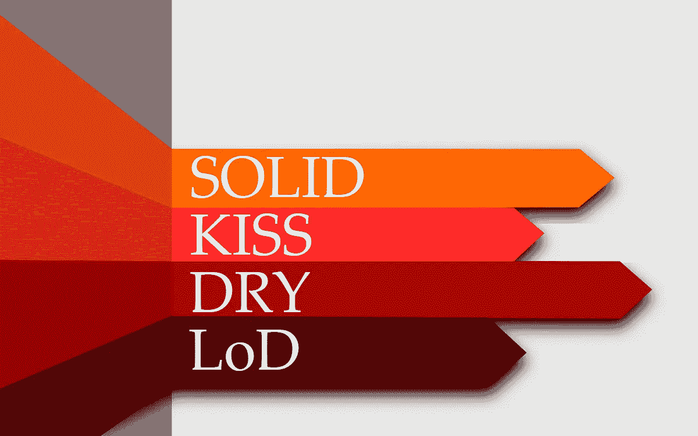

# 用这些软件工程原则成为更好的程序员

> 原文：<https://medium.com/codex/become-a-better-programmer-with-these-software-engineering-principles-204fa93e8094?source=collection_archive---------5----------------------->

## 干，吻，YAGNI 解释道

[https://www . devdiaries . net/images/Object-Oriented-Design-principles . jpg](https://www.devdiaries.net/images/Object-Oriented-Design-Principles.jpg)

继[的文章之后，我写了关于坚实的原则](/me/stats/post/df43187697f4)，很多人觉得很有趣，对此我非常感激，我已经决定写另一篇文章，但这次是关于干、吻、YAGNI 原则。这三个来自极限编程的方法论，将有助于…