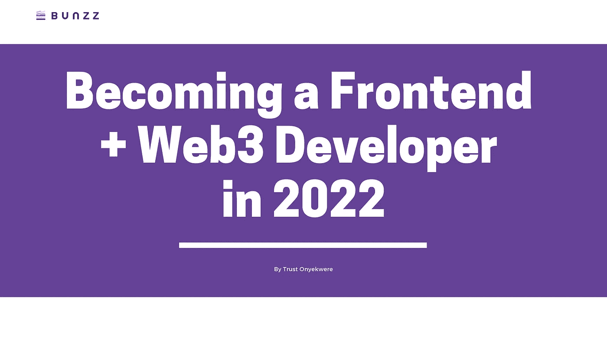

# 2022 年成为前端+ Web3 开发者

> 原文：<https://medium.com/codex/becoming-a-frontend-web3-developer-in-2022-3379988a9bd3?source=collection_archive---------2----------------------->

如果你不是生活在岩石下，你可能听说过 Web3，区块链，以及围绕它的嗡嗡声。

来自技术社区的反应是惊人的，许多 web 开发人员都加入了 web3 的行列，尤其是前端开发人员。

你想在区块链快速起步还是成为 web3 领域的前沿开发者？那么这篇文章就送给你了。

现在是成为 web3 前端开发者的好时机吗？

看看就业市场和预计的就业增长，我们认为答案很明显。现在是开始 web3 前端开发者职业生涯的大好时机！

# 以下是我们将要介绍的内容:

1.  如何成为一名现代前端开发人员
2.  一个前端开发人员需要哪些技术技能？
3.  编程语言、库和框架
4.  成为一名 web3 前端开发者需要什么？
5.  让 web3 开发对前端开发者来说更容易的工具和平台？
6.  无需代码即可部署智能合约和 DApps。

# 这篇文章是写给谁的？

*   想要成为 web3 开发者的前端开发者
*   希望在 web3 领域开始职业生涯的技术爱好者
*   对 DApps 和 web3 感兴趣的后端开发人员
*   任何对 web3 和区块链感兴趣的人。

让我们开始吧。

嗯，首先，在我们进入 web3 应用的前端开发之前，我们必须从一般的前端开发开始。

让我给你一个路线图，它一定会引导你走向你的目标。

# 成为前端开发人员

前端开发人员使用他们的编码技能来创建网站面向用户的元素。

前端开发人员的工作是对用户看到并与之交互的网站或应用程序部分进行编码。他们获取后端数据，并将其转换成普通用户容易理解、视觉上吸引人、功能齐全的东西。

处在艺术和编码的十字路口，需要软硬两方面的技能。前端开发人员必须能够用几种关键的编程语言进行编码，并在快节奏的工作环境中发挥他们的创造力。

前端开发人员通常熟悉 JavaScript、HTML 和 CSS。这些语言是任何网站的基础。网站的结构由 HTML 提供，样式由 CSS 提供，交互或动态元素由 JavaScript 提供。

在学习了网站设计的三个编程语言支柱后，前端开发人员可能需要学习其他语言、技术、库或框架，例如:

*   反应
*   Redux。
*   vue . j
*   有角的

除了前端开发人员所需的编码技能之外，还有一些所有开发人员成功所需的关键技能:

*   了解应用程序接口(API)
*   编程模式的知识
*   熟悉命令行
*   使用 Git

一旦你在传统的 Web2 领域积累了丰富的开发前端应用的经验，是时候进一步进军 Web3 了。

# 作为前端开发人员开始使用 Web3

开发者栈是开发者拥有的技术的集合。例如，MEAN (MongoDB、Express.js、AngularJS/Angular 和 Node.js)和 MERN (MongoDB、Express.js、React 和 Node.js)是常见的 web 开发人员堆栈。类似地，web3 开发也有一个堆栈——web 3 开发者堆栈。让我们看看其中包含的许多内容。

我们可以将 web3 想象成一辆汽车，web3 库/dapp 是汽车的底盘，智能合约/区块链是内部硬件组件，钱包充当驾照，节点是汽车运行所需的燃料。让我们一个一个地分解它们。

1.  **Web3 库/dapp:**

Web3 库简化了与区块链的交互、进行交易以及与智能合约的交互。我们可以在区块链上创建分散的应用程序，或者使用 web3 库与之交互。，比如 [web3.js](https://web3js.readthedocs.io/) 、 [ethers.js](https://docs.ethers.io/) 、 [web3.py](https://web3py.readthedocs.io/en/stable/) 。

**2。智能合约:**

智能合约是生活在区块链上的代码片段。它们在区块链内运行，不可更改。 [Solidity](https://blog.bunzz.dev/what-beginners-of-dapps-development-need-to-know-about-the-basics-of-solidity/) 是智能合约最常用的编程语言。大多数开发人员使用 Remix IDE 编写、编译和部署合同。然而，像 [Bunzz](https://www.bunzz.dev/) 这样的工具使得无需编写任何代码就可以更容易地部署智能合约。没有可靠性的麻烦，你可以快速[部署智能合同](https://blog.bunzz.dev/how-to-generate-erc20-smart-contract-using-bunzz-in-no-code/)并构建 DApps。

**3。钱包**:

区块链钱包的地址可以作为个人的身份，同时还可以存储所有者的各种加密货币。每当我们想要在区块链上执行写操作时，我们必须首先验证事务并向网络支付费用；通过使用钱包，例如 MetaMask，这变得更容易。您可以通过遵循此指南[此处](https://blog.bunzz.dev/how-to-generate-erc721-tokens-nfts-using-bunzz-in-no-code/)将 [Bunzz](https://www.bunzz.dev/) ( [Bunzz](https://medium.com/u/8f6de2073614?source=post_page-----3379988a9bd3--------------------------------) )与 MetaMask 整合。

**4。Web3 提供商:**

要从区块链获取数据，需要节点或 Web3 提供者；节点运行区块链的副本。节点是 web3 开发人员堆栈的基本组件，因为没有节点，web3 库无法与智能合约交互。他们是进入区块链世界的门户。

您可以在 Udemy 或 YouTube 上学习课程，熟悉这些技术，并立即开始构建 web3 解决方案。

# 结论

恭喜你！通过了解如何开始，你已经向成为 Web3 开发者迈出了第一步。我们了解了一个现代前端开发人员需要知道什么，以及他们如何开始深入 web3 成为 web3 前端开发人员。我们还研究了钱包、智能合约、web3 库和节点。

在 Bunzz，我们正在构建一个区块链开发者梦寐以求的最全面的 Dapp 开发平台，而我们才刚刚开始。

[这里的](https://blog.bunzz.dev/how-to-generate-erc20-smart-contract-using-bunzz-in-no-code/)是一个快速指南，用 Bunzz 构建 DApps 和智能合约，无需代码，并使用 Bunzz SDK 将其连接到您的 React、Vue 或 JavaScript 前端应用。

看看我们的[博客](https://blog.bunzz.dev/)，了解更多关于 Web3 和智能合约的文章和指南。如果您有任何反馈，请随时通过 [Twitter](https://twitter.com/bunzzdev) 联系我们。

您可以随时在我们的 [Discord](https://discord.gg/wCFUV6rNd7) 社区服务器上与我们聊天，这里有一些您见过的最酷的 web3 开发人员，如果您喜欢本教程，请与更多的开发人员分享和传播您的爱！"

*原创发布于* [*信任 onyekware*](https://twitter.com/iamtjah)*【我】上*[*dev . to*](https://dev.to/bunzzdev/becoming-a-frontend-web3-developer-in-2022-oe5) *关注我上*[*Twitter*](https://twitter.com/iamtjah)*。*