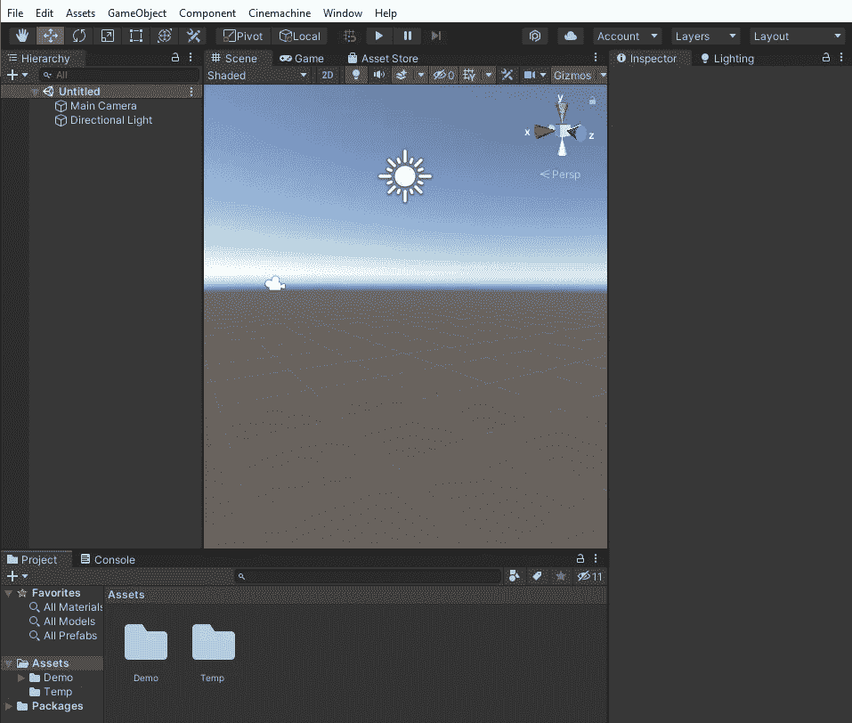
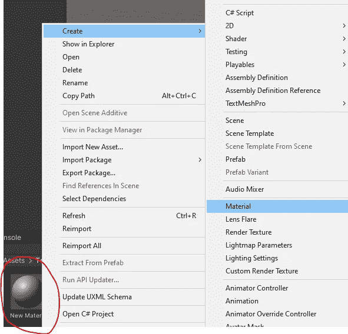
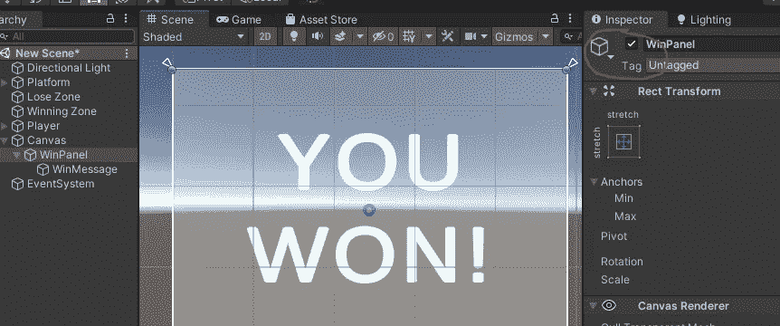

# 成为元宇宙开发者

> 原文：<https://medium.com/codex/becoming-a-metaverse-developer-de398a4702cb?source=collection_archive---------9----------------------->

## 使用 Unity 学习 3D(游戏)开发的基础知识

来源:[https://Asia . Nikkei . com/Business/Media-Entertainment/Bandai-Namco-to-spend-130m-creating-Gundam-元宇宙](https://asia.nikkei.com/Business/Media-Entertainment/Bandai-Namco-to-spend-130m-creating-Gundam-metaverse)

在上个月的#CrystalizeMyLearning 文章[中，我在一篇教程风格的文章中分享了我对 Python Flask](/@lyejiajun/python-flask-a-powerful-and-flexible-web-app-framework-crystalizemylearning-mar-2022-6890e39e6c1e) 的了解，这是一个强大的微型 web 框架。

在本月的#CrystalizeMyLearning 文章中，我希望通过一个简单的项目来探索 ***【元宇宙】*** 和 ***【元宇宙】****的基本构建模块，该项目记录了我在 3D(游戏)开发方面的经验。*

*要了解 3D(游戏)发展与元宇宙的关系，请继续阅读！*

## *介绍 3D 平台游戏“旅行者”*

***Traveller 是我创建的一个简单的平台游戏，玩家需要穿过浮动瓷砖到达终点区域(黄色平面)。***

**

*GitHub 来源:[https://github.com/cyberjj999/traveller](https://github.com/cyberjj999/traveller)*

*我开发了两个版本的**旅行者***

1.  *游戏的基本版本，有有限的相机控制和一个简单的平台*
2.  *一个高级版本的游戏，有一个 freelook 相机，摩擦，和一个更具挑战性的平台*

***旅行者(基础版)视频演示***

***旅行者(高级版)视频演示***

*在这篇文章中，我将重点放在游戏的基本版本——旅行者。*

> *采取不同的方法，我希望以“开发博客”的风格写这篇文章。*

*事实上,“DevLog”在许多游戏开发者中变得越来越受欢迎。通过一篇“开发博客”式的文章，我将分享我对 [Unity 游戏引擎](https://unity.com/)的 ***提炼的见解和学习*** ，这是一个由 Unity Technologies、**开发的游戏创作平台，也是元宇宙世界首选游戏引擎的有力竞争者。***

**

*来源:[https://beaconvc.fund/2022/01/10/metaverse/](https://beaconvc.fund/2022/01/10/metaverse/)*

*一开始，它有助于我们理解什么是 ***元宇宙。****

# *什么是元宇宙？*

*也许许多人第一次与元宇宙擦肩而过是来自脸书，它最近将自己更名为 Meta。脸书将品牌更名为 Meta 的举动是该公司迈向*的一次明显的战略推进。**

> **用最简单的术语来说，元宇宙就是虚拟世界(通常由虚拟现实和增强现实等一系列技术组成)**

**当然，元宇宙比 AR/VR 技术 要大得多。它涉及许多其他技术，如**区块链、物联网和脑机接口。****

****

*****然而，AR/VR 才是构成元宇宙的核心基本面。就像前端软件工程师如何通过理解后端的基础知识成为一名更好的工程师一样，如果你理解 3D(游戏)开发，你也可以成为一名更精通的元宇宙开发者，这是 AR/VR 技术的基础*****

## **增强现实/虚拟现实技术**

**要成为一名元宇宙开发者，学习 3D(游戏)开发是非常有益的。虽然开发一个普通的 3D 游戏和一个虚拟现实应用程序之间有一些细微的差别，但组成这个程序的基本部分仍然是基本相同的。**

**你仍然需要使用 3D 模型、动画、物理引擎，以及处理效果和粒子。**

****

# **输入 Unity DevLog**

**在我过去的几个项目中，我有机会学到一些与游戏开发相关的技能，这些技能适用于 AR/VR 技术的开发。**

**在这里，我将介绍一个非常简单的平台游戏——Traveller——并分享我创建游戏关键组件的工作流程。**

*****注意*本文并不是一个循序渐进的教程，而是我在 Unity Game Engine 中游戏开发核心概念的主要学习成果的文档。我将通过提供示例图像来尽可能清楚地说明问题。*****

## ****一款 3D 平台游戏——《旅行者》****

****Traveller 是一款简单的平台游戏，玩家需要穿过漂浮的瓷砖到达终点区域(黄色平面)****

****

****游戏逻辑****

**作为游戏开发者，在我们开始编写游戏代码之前，确定游戏的逻辑是非常必要的。**

**在这个游戏中，逻辑是不言自明的——你需要通过小心地跳到不同的方块上，将你的角色(红色胶囊)移动到获胜区域(黄色地面)。**

**当你从任何一个街区掉下来的时候你就输了。当你到达黄色获胜区域时，你就赢了。简单！**

****下载 Unity****

**首先，让我们在电脑上下载 Unity Hub。下载链接:【https://unity3d.com/get-unity/download **

**安装过程完成后，我们可以创建我们的第一个 3D 项目。**

****

**创建 3D 项目后，您将看到这个视图。**

****

**首次创建项目时 Unity 中的默认视图(左侧为“层次”面板，右侧为“检查器”面板，底部为“项目”面板)**

**现在，我们将开始在 Unity 上创建我们的第一个 3D 平台游戏。**

****让我们从浮动块**开始吧**

****

**从上图可以看出，浮动方块构成了游戏的大部分。**

**制作方块很简单——您只需在层级窗格> 3D 对象>立方体中右键单击即可在 Unity 中创建一个立方体。**

****

**在层次窗格中**

**不幸的是，默认的立方体看起来有点单调。**

****添加材料****

**为了让我们的浮动块看起来更有趣，我们可以创建一个材质。**

> **材质用于改变游戏对象的外观。通过调整一些参数，您可以使用材质创建一个闪亮(或暗淡)、黑色(或白色)的对象。**

**就像我们如何创建块，我们只需要点击几下(在项目窗格)来创建一个材料。**

****

**在工程窗格中**

**接下来，我们可以在检查器窗格中编辑材质的颜色。深棕色似乎是地面/土壤的最佳颜色——让我们坚持这种颜色吧！**

****

**在检查器面板中**

**调整材质颜色后，我们可以通过将材质(在项目窗格中)拖动到场景视图(中间窗格)中的立方体对象上，将材质附加到立方体对象上。**

****

**瞧啊。你暗淡的白色立方体现在变成了棕色。立方体现在看起来很好，但它可以使用一点光泽和活力。让我们在它上面加一个草块！**

****润色我们的浮动块****

**类似地，创建另一个立方体，现在添加一个绿色材质来模拟草地。**

****

**太好了！现在你有一个棕色的立方体和一个绿色的立方体。**

**现在的诀窍是让你的绿色立方体变短，这样它看起来就像一块草地。为此，我们需要降低立方体 Y 轴上的比例，即降低其高度。**

*****注意*一个 3D 立方体有 3 个维度，可通过 X 轴(红色)、Y 轴(绿色)和 Z 轴(蓝色)访问。*****

**要降低绿色立方体的比例，请转到检查器并降低比例参数上的 Y 值。y 值为 0.2 看起来差不多。**

****

**x 轴(红色)、Y 轴(绿色)和 Z 轴(蓝色)。**

**现在你有了一个扁平的长方体！**

****创建地块(通过结合土壤和草)****

**要“组合”土壤和草地，请在场景视图中使用指向箭头(X、Y 和 Z 轴相应移动)拖动并定位草地对象，并将其移动到棕色立方体的正上方。**

****

**在场景视图中**

**太好了！我们现在有我们的浮动块，我们将在整个游戏中使用！**

****内务处理——在父对象下嵌套对象****

**在 Hierarchy 窗格中，您会注意到我们有两个立方体(我相应地重命名了它们，以便更容易识别它们——您可以右键单击对象来重命名它们)**

****

**将相关对象放在同一个父对象下始终是一个好习惯。你可以通过创建一个空的游戏对象(只需在层次窗格中右键单击>创建空的)并将你的空游戏对象命名为浮动块(或任何你喜欢的东西),并将土壤立方体和草立方体拖入浮动块中。**

****

**现在你的土壤立方体和草立方体有浮动块作为它们的父体。你现在可以简单地移动父对象，你的两个子对象将跟随父对象的位置！**

****介绍预制屋****

**我们可以很容易地复制我们的浮动块，方法是在层次窗格中选择它们，然后按热键 Ctrl + D 来复制它。我们还可以在场景中拖动它们来构建我们的游戏平台。**

****

**在项目窗格中选择浮动块，然后按 Ctrl+D——您将拥有多个立方体，您可以移动它们来构建平台**

**然而，这样做的缺点是，如果我们决定改变我们的游戏外观和逻辑，我们无法控制方块。如果你想把所有的草块都变成火红的块呢？**

**然后，您必须手动将材质拖动到嵌套在每个浮动块下的每个草立方体中。如果你有 3 个街区就可以了。但是如果你有 100 个街区呢？1000 块呢？**

**解决这个问题的理想方法是使用预制构件。**

> **预设是游戏对象的模板，你可以在场景中重复使用。例如，您可以拥有一个土壤立方体的预设，并使用该预设来复制多个土壤立方体对象。**
> 
> **使用预设(与简单复制没有预设的土壤立方体对象相比)，你可以同步预设实例的所有副本。这允许你编辑一个单独的预设，并把修改应用到预设的所有实例中。**

**要创建一个预置，拖动你的浮动块对象到你的项目窗格。你会看到一个预设正在被创建，正如你的预设在项目窗格中的预览所示。在层级窗格中，你的游戏对象也会变成蓝色，表示这个游戏对象是一个预置。**

****

****使用预制构件****

**预置就像一个普通的游戏对象一样工作——当你以后需要编辑它们时，好处就来了。在这里，我们可以删除我们的非预设游戏对象，并继续复制我们的浮动块。**

****

**你复制的每个预设实例都应该是蓝色的——如果我们需要的话，这允许我们大量编辑它们。**

****平台搭建****

**现在，你应该知道了**

*   **如何创建简单的对象？**
*   **如何缩放你的对象(例如，使它变得更短，等等。)**
*   **如何在场景中移动对象**
*   **如何复制对象**

**你可以疯狂地创造一堆浮动块，做一个令人惊叹的平台！(只要确保将它们嵌套在同一个空对象父对象下，以整理您的工作空间！)**

****

**在复制了许多块之后，我创建了一个简单的平台。**

**注意，如果你想知道我是如何建造绿色飞机的，这个过程和创建一个立方体是一样的。在 Unity 中，您可以创建许多不同的 3D 对象，包括一个平面(即一个平面)——只需记住在 X 和 Z 轴上缩放该平面，使其非常宽！**

****创造我们的黄色胜利区****

**我们的平台几乎完成，我们需要的最后一件事是创建一个黄色的胜利区。这个区域只是一个黄色的平面，玩家必须触摸它才能赢得游戏。**

**与我们对浮动块所做的类似，我们需要做的就是创建一个 3D 平面对象，一个黄色的材质，然后将黄色平面移动到我们想要的位置。**

****

**简单…对吧？创建对象和材质的过程是 100%相同的！**

****创建我们的玩家****

**现在我们有了某种平台，我们需要创建我们的播放器。大多数专业游戏开发者会建议你从一个简单的物体作为你的角色开始，而不是担心动画和花哨的设计。我肯定有同样的想法。**

**在这里，我们可以有一个简单的 3D 胶囊对象作为我们的主要角色。我还用材料把它涂成红色，并加了一个小鼻子，这样我们就能知道玩家的正面在哪里。**

*****注意*在旅行者的基本版本中，鼻子可能不是特别重要，因为我们没有旋转我们的角色——所以没有必要知道我们角色的正面在哪里。*****

*****然而，在 Traveller 的高级版本中，有一个 freelook 摄像头，允许用户使用鼠标位置旋转他们的播放器，因此让鼻子允许用户识别播放器的正面。*****

****

**让我们的玩家行动起来——终于到了编码的时候了！**

**对于所有初露头角的开发人员和软件工程师来说，这里是你最终获得代码的地方！**

**我们的玩家应该能够做两件事**

1.  **向各个方向移动(使用 WASD 或箭头键)**
2.  **跳跃**

**为此，我们需要创建一些脚本。**

**在工程窗格中，右键单击创建> C#脚本以创建脚本。我把我的**命名为 MyPlayer.cs****

****

****默认 MyPlayer.cs 脚本****

****MyPlayer.cs(经过一些编码)****

****关于 MyPlayer.cs****

**上面的脚本可能看起来令人生畏，但是逻辑相当简单。我已经为每个关键组件添加了注释。在这里，我将**简要地**解释每个代码块做什么。**

****定义游戏变量****

**这个代码块用于指定我们的游戏变量。我们有几个值，比如`verticalInput`和`toJump`，用来控制我们的游戏逻辑。线条`public GameObject winPanel;`代表一个游戏对象，我们可以选择使用我们的脚本来操纵它。这里，我们想要包含 winPanel game object——这是一个简单的 UI，显示我们已经赢得了游戏。**

****

**您需要右键单击层次窗格> UI > Panel 来创建一个面板 UI 对象。对内部文本重复相同的步骤来创建 winPanel**

**这里，我们想要**禁用/设置 winPanel 为非活动状态**。我们将只在用户触摸我们的获胜区域时激活它，这样我们就可以在正确的时间向用户显示获胜消息。要做到这一点，只需**取消选中**检查器窗格左上角的框。**

****Start()方法****

**顾名思义，`Start()`方法将在我们开始游戏时运行。在这里，我们仅仅是定义我们的组件和组件值，这样我们就可以在代码中为我们的游戏逻辑操作它们。**

**刚体允许 Unity 在我们的游戏对象上使用它的物理系统。因为我们希望我们的角色受到物理(即重力)的影响，所以我们也应该给玩家增加一个刚体组件。在这样做的时候，我们也应该冻结物体的旋转(在所有的轴上),因为我们不希望我们的玩家在移动的时候倒下。**

****

****更新()方法****

**每帧调用一次`Update()`方法。用这种方法捕获所有用户输入是 ***所希望的。*** 这里，我们捕捉用户输入——从空格键到 WASD/箭头键。**

**此外，我们仅在用户按下空格键时并且仅在用户接地(即，在地面上)时将`toJump`设置为真——这是为了防止双重跳跃。**

****FixedUpdate()方法****

**对于开发人员来说,`FixedUpdate()`方法经常令人困惑，因为它看起来与`Update()`方法非常相似。`Update()`和`FixedUpdate()`方法的区别在于它们在任何持续时间内被调用的次数。**

**由于`Update()`方法每帧运行一次，所以在一台每秒运行 200 帧的快速计算机上，它将每秒运行 200 次。然而，`FixedUpdate()`方法，顾名思义，每秒只会运行固定的次数。默认值设置为每秒 50 次调用。**

**我们需要知道的是，用`FixedUpdate()`方法运行我们的物理相关行为是可取的。因此，这里的代码给玩家的刚体增加了一个力(因此允许它跳跃),也修改了玩家的位置。**

****其他方法****

**在这里，`RestartGame()`和`IsGrounded()`方法非常简单。当我们需要重启游戏时，我们简单地调用`RestartGame()`方法，而`IsGrounded()`方法检查用户是否在地面上(因此我们可以允许他们跳跃)**

**`OnCollisionEnter()`方法是 Unity 脚本中非常重要的方法。这个方法会在玩家每次碰撞到什么东西(那个也有碰撞器)的时候被调用。**

**如果玩家与获胜区域发生冲突，我们将激活 winPanel(因此显示获胜消息)。如果玩家撞上了输区，我们会重新开始游戏。**

**在我们的 collide 方法中，您可能会注意到我们有一行检查碰撞对象的标签(`collision.gameObject.tag == "Lose")`)。这是必要的，因为我们的玩家会不断地与地面碰撞，所以我们需要一种方法来识别我们的玩家具体在碰撞什么物体。**

**为了让我们识别我们的玩家是否与输/赢区域冲突，我们需要标签。回到 Unity(在我们的 Visual Studio 脚本环境之外)，我们可以为我们的游戏对象设置标签。**

****

**在检查器面板中创建标签！相应地用“赢”/“输”标签标记您的赢/输区域。**

****我们已经完成了脚本编写！****

**最后要做的事情是把你的脚本拖到你的游戏对象上，把它作为一个组件附加上去。为此，您可以将项目窗格中的`MyPlayer.cs`脚本拖到层级窗格中的玩家游戏对象中。
*(你也需要将你玩家的刚体拖入脚本变量中)***

**与典型的 web 开发或 python 脚本编程相比，您可能会注意到游戏编程非常独特的地方。当在 Unity 中编写脚本时，您经常需要在 Visual Studio 和 Unity 之间切换，这样您就可以添加各种组件/标签，以便在您的脚本中使用它们。**

**我希望了解这一点能为你的编程带来一些新的视角！**

****完成我们的游戏——将游戏摄像头安装到玩家身上的最后一步****

**我们需要做的最后一件事是移动我们的摄像机，让它随着我们的球员移动。您可以在脚本中这样做，但是在 Unity 中更容易做到**

**首先，你应该移动场景中的摄像机，使其靠近我们的玩家。你也可以转动相机来创造一个理想的视角。(您可以在场景视图的右下角看到您的相机预览)**

****

**这个设置看起来还不错。现在，我们的摄像机已按要求摆好位置。然而，如果你现在玩游戏，你会意识到相机不会随着玩家的移动而移动。**

**我们可以使用一个巧妙的方法让我们的游戏摄像机跟随我们的玩家，就是让摄像机成为我们的玩家对象的子对象。**

****

**然后…我们结束了！**

**哦，等等，我们需要在测试后做一些最后的润色！**

**正如我们创建的每个项目一样，测试非常重要。在这里，我在测试游戏后对场景做了一些小的编辑。**

****

**在意识到原来的绿色地面让我们很难区分浮动块和地面后，我已经将地面颜色改为红色！**

**我还把胜利区移到了红色的平面上，这样我们的玩家就可以更容易地拿到它。**

**编程毕竟是一个通过迭代提高的过程！**

****就是这样！如果你能一路走到这一步，恭喜你！****

**这篇文章比我想象的要长。我确信我可能在这篇文章中错过了编程**旅行者**的一些细微差别。如果你碰巧关注了这个开发博客，并且遇到了任何问题，请随时联系我！我非常乐意帮忙:)**

**如果你想下载并玩这个游戏，请按照 Github 上的说明:[https://github.com/cyberjj999/traveller](https://github.com/cyberjj999/traveller)**

****

**[https://github.com/cyberjj999/traveller](https://github.com/cyberjj999/traveller)**

**我希望你在这篇文章中学到了一些新的东西，并彻底享受它。**

**下一次我会赶上你的。干杯！**