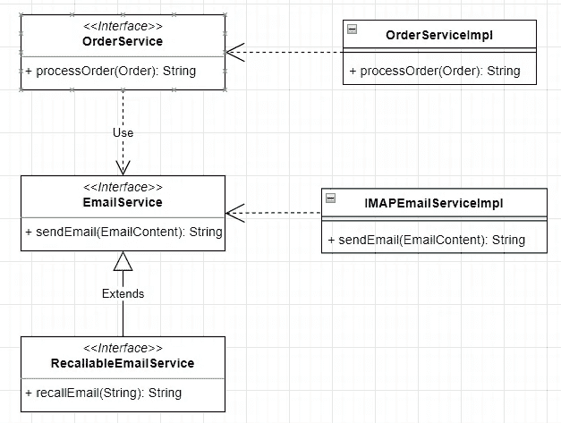
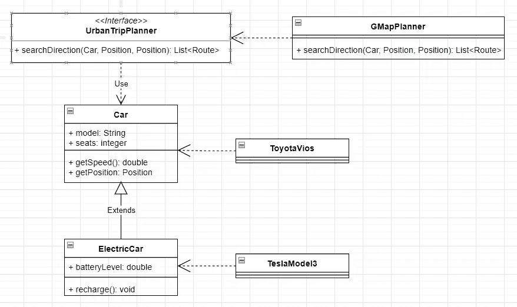
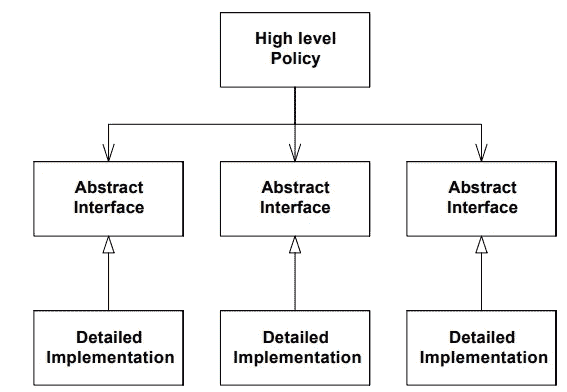

# 成为一名优秀的开发者

> 原文：<https://medium.com/codex/becoming-a-solid-developer-7f0e0ab359f6?source=collection_archive---------7----------------------->

## [软件开发](https://geraldnguyen.medium.com/list/software-development-f70ae37efe1c)

## 通过遵循可靠的软件工程原则

被人叫*实*是一种恭维。这个词带有可靠和体面的积极意义。我们所有人都应该努力成为其中一员。

[https://www.collinsdictionary.com/dictionary/english/solid](https://www.collinsdictionary.com/dictionary/english/solid)(截图)

如果你是一名软件工程师或者想成为一名软件工程师，你很幸运，因为有一套坚实的原则来指引你的道路。

SOLID 是软件工程专业的缩写。它代表:

*   单一责任原则
*   **O** 关笔原理
*   **L** 伊斯科夫替代原理
*   **I** 界面偏析原理
*   **维**依赖反转原理

这个术语是由迈克尔·费瑟在 2004 年左右创造的，最初是由鲍勃叔叔在他 2000 年的论文《设计原则和设计模式》和他的其他文章《T29》和书籍《T31》中收集的

让我们更详细地看看这些原则。

# 单一责任

> 每个类应该有一个单一的责任。

An `EmailService`应该只关心发送电子邮件，而不是发送电子邮件*和*更新订单状态。

一个`Car`类应该是关于汽车，而不是其他类型的机动车辆。如果我们需要描述一辆电动汽车，那么用`ElectricCar`这样的子类比用电动和汽油车特征的`Car`重载更合适。

# 开闭原理

> 模块应该对扩展开放，但对修改关闭

这个`EmailService`可以通过一个`RecallableEmailService`来扩展，为刚发送的邮件增加召回功能。

电子邮件服务及其关联

`ElectricCar`在不修改`Car`内部的情况下增加了电气特性。

# 利斯科夫替代

> 子类应该可以替代它们的基类

在面向对象设计的上下文中，接受基类实例的类或方法应该能够接受其子类的任何实例。

一个`OrderService`应该可以使用任何符合`EmailService`接口的实例，而不用关心该实例的实际类是`EmailService`本身还是`RecallableEmailService`

一个`UrbanTripPlanner`应该能够使用`Car`的任何实例来确定一条路线，而不知道它是代表一辆电动车还是汽油车。

# 界面分离

> 许多客户端专用接口比一个通用接口更好

一个`OrderService`不需要`recallEmail(...)`。因此，它只依靠`EmailService`发送电子邮件，而不是`RecallableEmailService`

类似地，`UrbanTripPlanner`不需要来自`EletricCar`的`recharge(...)`方法。这仅取决于`Car`提供的接口

汽车及其协会

# 依赖性倒置

> 依赖于抽象。不要依赖具体事物。

程序性的依赖机制从顶层开始，逐渐扩展，并依赖于具体的实现细节。

在面向对象编程中，依赖关系是*倒过来的*。大多数依赖应该是基于抽象的。在实现存在的地方，它与抽象的关系*颠倒*。现在，实现依赖于抽象，而不是直接依赖于抽象。

来源:鲍勃大叔的设计原则和
设计模式

一个`OrderService`依赖于`EmailService`提供的接口，而不是它的 IMAP 或 POP 实现。

一个`UrbanTripPlanner`依赖于`Car`提供的接口，而不是它的特斯拉或丰田实现

# 结论

我们已经研究了 SOLID 缩写词的来源，并且通过两个面向对象的设计用例详细地研究了它们。

你可能在过去不知道的情况下遵循了这些原则，因为它们是好的实践。封装，在我看来，是遵循**开闭原则**的。

你可能也应用了其中的一些，因为事情就是这样。从语法上来说，`ElectricCar`对象总是可以传入一个`Car`参数，从而遵循**利斯科夫替换原则**。如果你使用过依赖注入，你已经遵循了**依赖倒置原则**。

其他原则需要一点思考。**单一责任原则**需要一个好的 OO 模型来保持方法/类/模块的干净和精简。在遵循**界面分离原则**时，您可能需要良好的判断力来确定分离的深度。

# 参考

*   [设计原则和设计模式](https://web.archive.org/web/20150906155800/http://www.objectmentor.com/resources/articles/Principles_and_Patterns.pdf)论文
*   [OOD 原理](http://www.butunclebob.com/ArticleS.UncleBob.PrinciplesOfOod)篇
*   [干净的架构:软件结构和设计的工匠指南](https://www.oreilly.com/library/view/clean-architecture-a/9780134494272/)
*   [https://en.wikipedia.org/wiki/SOLID](https://en.wikipedia.org/wiki/SOLID)

如果你喜欢这篇文章，请[关注我](https://geraldnguyen.medium.com/subscribe)获取更多优质内容。

本系列的其他文章:

*   [成为一名优秀的开发者](/codex/becoming-a-solid-developer-7f0e0ab359f6)
*   [扎实行动——单一责任原则](/codex/solid-in-action-the-single-responsibility-principle-7cb70c32cc03)
*   [固体在行动——开合原理](/codex/solid-in-action-the-open-closed-principle-5b8d09a60a5a)
*   [实际行动——利斯科夫替代原理](/geekculture/solid-in-action-the-liskov-substitution-principle-4b1868ad81fd)
*   [固体在作用——界面分离原理](/geekculture/solid-in-action-the-interface-segregation-principle-6c8f92d2133a)
*   [实操——依赖倒置原则](/geekculture/solid-in-action-the-dependency-inversion-principle-5567bddd6cfc)

谢谢你。