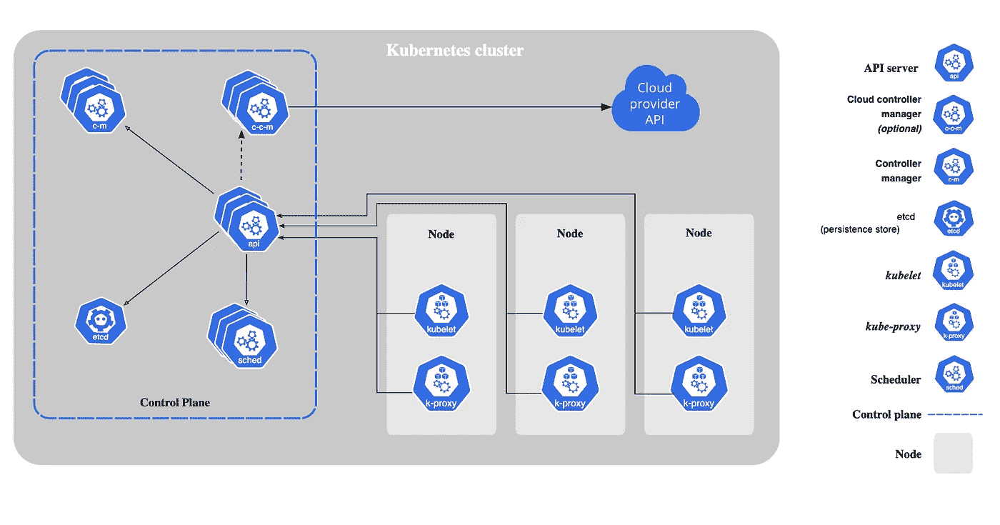
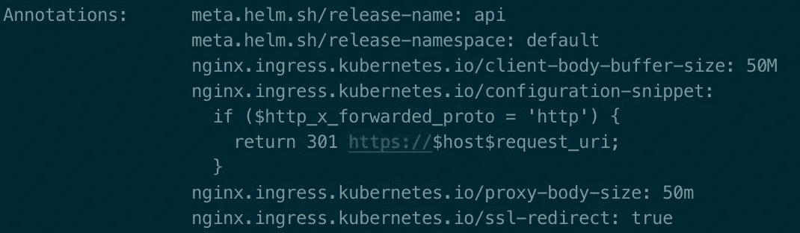

# 10 步成为全面的 K8s 云工程师

> 原文：<https://medium.com/codex/becoming-a-well-rounded-k8s-cloud-engineer-in-10-steps-6f21d93b2b96?source=collection_archive---------13----------------------->

如果您在这里，很可能您已经理解了使用 Kubernettes 来管理您的多服务架构的好处。本文不会讨论为什么要使用 Kubernettes，而是关注一旦你确定 Kubernettes 是适合你的解决方案，如何使用它。

本文将解释如何使用 Kubernettes，而不是为什么以及何时使用它

网上有许多 Kubernettes 学习资源，这使得人们很难知道从哪里以及如何开始学习这项庞大的技术。本文将提供一个高级课程，涵盖在 K8s 集群上运行应用程序的微服务的不同方面。

我将介绍概念，并为实际学习提供外部资源。让这成为你成为一个全面的 K8s 工程师的一站式指南。

# 第一步:在本地安装 M **inikube，熟悉控制平面组件**

Minikube 将为我们模拟一个多服务集群环境。安装快速简单，可以在[这里](https://minikube.sigs.k8s.io/docs/start/)找到。Minikube 会醉心于你的机器资源(这是非常 RAM 密集型的),所以请记住这一点。

确保你的机器可以处理 Minikube

理解 k8s 集群组件的角色非常重要。在进行第 2 步之前，请访问这个简短的[教程](https://www.youtube.com/watch?v=8C_SCDbUJTg&ab_channel=KodeKloud)。关注位于控制平面(主节点)上的组件。

1.  Kube-apiserver:为 k8s api 对象(比如 pods)配置数据
2.  Kubelet:向 api 服务器注册一个节点
3.  Kube-controller-manager:嵌入 k8s 核心控制循环的守护程序
4.  Kube-scheduler:确定每个 pod 的有效位置
5.  Kube-proxy:将去往服务的流量定向到正确的后端 pods

# 第 2 步:安装并熟悉 Kubectl

Kubernettes 命令行接口或 Kubectl 用于从主节点(稍后讨论)或本地机器向 K8s 环境中的工作节点发出调度命令。要安装命令行工具，请单击此处的。您可以在这里学习基本命令[，但是我强烈建议您在深入 Kubectl 之前，先完成第 3 步，了解不同类型的 k8s yaml 配置对象。](https://www.youtube.com/watch?v=azuwXALfyRg&ab_channel=TechWorldwithNana)

在深入研究 Kubectl 及其用途之前，请继续执行第 3 步

# 步骤 3:了解不同的 yaml k8s api 对象

我认为最省时的方法是从高层次了解核心 K8s config yaml api 对象的用途。

重点理解每个 k8s yaml 对象的用途

不要记住文件结构或语言，因为 Helm(在下一步中详述)会自动创建 yaml 配置结构。重点了解以下各项的作用:

1.  [部署](https://www.youtube.com/watch?v=y_vy9NVeCzo&ab_channel=AgentofChange)
2.  [服务](https://www.youtube.com/watch?v=T4Z7visMM4E&ab_channel=TechWorldwithNana)
3.  [服务账户](https://www.youtube.com/watch?v=keoYFZhtg0U&ab_channel=GeertBaeke)
4.  [入口](https://www.youtube.com/watch?v=80Ew_fsV4rM&ab_channel=TechWorldwithNana)(不要与稍后讨论的 nginx-入口控制器混淆)
5.  [hpa](https://www.youtube.com/watch?v=nRKKYtPWYGs&ab_channel=GoogleOpenSource) (水平 pod 自动缩放器)
6.  [配置图和秘密](https://www.youtube.com/watch?v=FAnQTgr04mU&ab_channel=TechWorldwithNana)

# 步骤 4:使用 Helm 为您的各种微服务编写 yaml 定义文件

Helm auto 为您创建的每个“图表”创建默认的 yaml 配置文件。每个“图表”代表您的架构中的一个单独的微服务。“chart”目录包含在集群上部署这个微服务所需的所有配置文件。因为微服务是使用定义文件部署的，所以可以灵活方便地修改和重新部署。最佳实践是将所有的 helm 目录放入一个(私有的)git 存储库，这样以后就可以用一个命令在不同的集群上重新安装所有的服务。这种可重用性不是“动态”kubectl 命令所能提供的。

在大多数情况下，每个舵图中唯一需要编辑的文件是 values.yaml 文件。这个文件为每个微服务创建了一个“真实的单一来源”。点击[此处](https://www.youtube.com/watch?v=3GPpm2nZb2s&ab_channel=JustmeandOpensource)查看如何创建舵图的完整指南。

# 步骤 5:使用 KOPS 构建一个带有工作节点自动伸缩的高可用性云设置

一旦您看到您的舵图表服务在 Minikube 中成功地相互通信，您就正式准备好设置云环境了。高可用性云设置被定义为在不同的区域中至少有两个工作节点，每个工作节点托管您的应用入口控制器和服务。如果一个数据中心因暴风雨着火，另一个节点将驻留在一个完全不同的“计算机群”中，并将继续不间断地为传入的请求提供服务。你的最终客户不会受到干扰。不用担心，K8s 将在几分钟内自动创建在火灾中丢失的节点工作器。

作为第一步，从你的云提供商那里购买一台便宜、低 CPU/RAM 的机器。在这台便宜的机器上安装库贝克特尔(再次)，KOPS 和赫尔姆。这台机器将被称为主节点，它将负责连接、交互和设置集群以及位于其中的 pod。如需详细说明，请点击[此处](https://www.youtube.com/watch?v=6NymWMtcByg&ab_channel=JustmeandOpensource)。

确保将所有 KOPS 命令记录在一个 sh 脚本文件中，这样您的基础架构构建过程将被记录为代码，并且在出现错误时可以轻松复制，这可能需要重新设置集群。KOPS 和赫尔姆的使用很好地诠释了“基础设施即代码”的概念。

头盔和 kops 允许在必要的时候更快的“重做”

# 步骤 6:设置 Nginx 入口控制器和微服务入口 yaml 以满足您的需求

Nginx 入口控制器将管理到集群的流量。它可以被配置为向服务提供外部可到达的 URL，负载平衡流量，终止 SSL / TLS，并提供基于名称的虚拟主机。[本指南](https://www.youtube.com/watch?v=dxQdcCYDZx8&ab_channel=DevOpsHint)将带你一步一步地了解如何在 Nginx 入口控制器上部署 aws 负载平衡器。

Helm 自动创建的入口 yaml 定义文件不同。它提供特定于服务的入口配置。在“注释”字段中，您可以定义 https 转发规则、任何请求大小限制和超时，或者与传入请求处理相关的其他重要配置。在您的集群中，这些规则通常因服务而异，这就是为什么每个微服务都有自己的入口。

# 步骤 7:理解水平 pod 自动缩放和集群自动缩放之间的关系

您的一些服务可能需要定义 hpa(水平 pod 自动缩放器)yaml 文件，以便允许自动缩放。调度程序将根据您在部署 yaml 文件中定义的 cpu/ram 阈值自动生成更多的 pods。一旦节点用 pod 填满了它的资源限制，它将自动创建一个额外的节点，并在其上恢复 pod 的调度。类似地，如果微服务上的工作负载下降，k8s 将神奇地“释放”或终止它产生的 pod 以及它在变得不必要时自动创建的新节点。

# 步骤 8:使用污点、容忍、亲和和反亲和来自动将您的 pod 调度到适当的节点上

“污染”一个节点，包括给它贴上一个标签，表明部署可以“容忍”(或者换句话说，允许在受污染的节点上调度)或不允许(不允许调度)。容忍是在部署 yaml 文件的 pod spec 部分指定的，而污点是在节点上使用 Kubectl 命令标记的。官方文件可以在这里找到。

一个类似的 yaml 配置调度特性是节点选择器 pod 规范。它赋予 pod 对特定节点污点的亲和力(或喜欢度)，或对节点污点的反亲和力(不喜欢度)。当尝试在具有特殊功能(高 CPU、GPU、高内存)的节点上调度特定的 pod 时，节点关联性是非常强大的。它最常用于防止 pods 在主节点上被调度(为控制平面 pods 保留)。

有时希望确保两个 pod 不会自动部署到同一台机器上。为此我们有[荚间亲缘规则](https://www.youtube.com/watch?v=R9YzBzCr7c8&ab_channel=NEXTLEVELNOWroyal)。例如，假设我们有两个单元(相同的部署/副本集)，每个单元都需要 70%的节点 CPU。在这种情况下，我们每个节点只能运行一个 pod，两个 pod 会导致 CPU 过载。一个不需要资源跟踪的简单解决方案是在部署中放置一个 pod 反亲缘关系。这将实现每个工作者节点一个 pod 的关系。

现在他可以在节点上预定受污染的“乳糖”

# 步骤 9:用普罗米修斯和格拉夫纳进行监控

最基本的性能监控工具是度量服务器。这是使用水平 pod 自动缩放器的基本先决条件，通过它，您可以执行“Kubectl top”命令来检索 pod 或节点的 CPU 使用情况。这很重要，因为在 K8s 中，每个设置为水平自动缩放的部署都必须在 yaml 配置中定义 CPU/RAM 需求(和限制)。请参考此[视频](https://www.youtube.com/watch?v=WVxK1k_blPQ&ab_channel=JustmeandOpensource)了解 metrics server 的分步 Helm 安装指南。

请注意，您可能会发现 metrics server 本身并不能提供足够的洞察力。如果您的服务是 RAM/CPU 密集型的，您将需要一个可视化工具来精确测量每个 pod 的资源使用情况。更好的监控意味着更少的意外和更少的由于限制过度使用而导致的吊舱崩溃，或者用技术术语来说，OOM kill。

通过控制 pod 和节点资源消耗来避免失败

这里的是关于如何使用舵图安装 Grafana 和 Prometheus 的详细指南。Prometheus 将测量资源使用情况，而 Grafana 提供了一个可视化界面来查看 x 时间轴上的不同资源指标。

# **步骤 10:使用弹性搜索和 Kibana 集中日志记录**

可以使用以下命令查看每个 pod 的实时标准输出:

> kubectl logs -f<insert-pod-name></insert-pod-name>

这本身是不够的。

日志查看器显示 pod 写入 STDOUT 的最新打印结果的一部分。我们需要检查日志的一个常见原因是错误导致了 pod 崩溃。在 pod 崩溃的情况下，日志将被删除，并且没有办法恢复它们或调查错误的来源。

弹性搜索救援！

弹性搜索跨集群收集日志

它很容易[安装舵图](https://www.youtube.com/watch?v=zTapW1_ZlNw&ab_channel=Elastic)，并将集中和记录集群中所有吊舱的所有日志。Kibana 将为我们提供一个界面，我们可以通过这个界面搜索日志，或者缩小属于特定 pod 或时间段的日志范围。

# 告别之类的

作为结束语，我将提供一个付费课程的链接(我不赞助，也不收钱)。它涵盖了我上面讨论的所有内容，甚至更多。对于那些喜欢“猴子看-猴子做”式教学的人来说，这是我见过的最全面的课程。